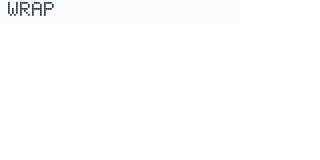

<!-- BEGIN GENERATED: catalog-docs/wrap -->
# Wrap

- **Category:** layout
- **Purpose:** Wrapping child layout.
- **API reference:** [FS.Skia.UI.Controls.Wrap](../reference/fs-skia-ui-controls-wrap.html)

[← Back to the controls catalog](catalog.html)
<!-- END GENERATED: catalog-docs/wrap -->

## Overview

The **Wrap** control is a `layout`-category control in the FS.Skia.UI control suite.
Wrapping child layout. It requires the `children` attribute. It raises no events (it is a non-interactive, display-only control). Its accessibility role is `StaticText`.

Build it through the `FS.Skia.UI.Controls.Wrap` module — the typed Props/MVU front door is the
preferred authoring surface (see
[Typed control front door](../controls-design/typed-front-door.html)). Every
attribute is owned by the model; the control renders against the active `Theme`,
so its colours, sizing, and density follow the design tokens (see
[Controls in the Spec Kit workflow](spec-kit-workflow.html)).

## Usage example

A runnable example that exercises this control lives in the controls gallery
sample, `samples/ControlsGallery/Program.fs`. It is compiled as part of the build,
so the example stays in lock-step with the public API.

## Preview

A deterministic **render-only** preview of **Wrap** (320×160), produced through the
render-only evidence path (`Widget.render` → `SkiaViewer.captureScreenshotEvidence`,
`ViewerRenderTargetPng`) and validated decodable / non-1×1 / non-trivial via
`Testing.readPngArtifact`. It shows the control rendered against the default
`DesignTokens.Light` theme.

[← Back to the controls catalog](catalog.html)
