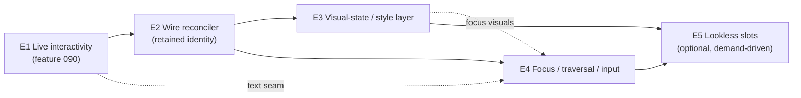

# Controls Architecture Evolution Roadmap

- Date: 2026-06-10
- Status: Planning report. No product code changed by this document. Records a
  maintainer-confirmed strategic decision and a multi-feature development plan
  for the controls subsystem.
- Scope: Whether the current design of FS.Skia.UI controls and their event model
  is fit to reach parity with a retained-mode XAML framework (Avalonia), whether a
  redesign is needed, and — given the decision *not* to redesign — the concrete
  E1–E5 evolution roadmap that takes the controls subsystem from immediate-mode
  toward declarative-retained (SwiftUI / Jetpack-Compose-class) capability parity.
- Origin: ControlsShowcase2 dogfooding feedback (severity **major** — a generated
  gallery that rendered green on every gate but did not respond to input in the
  live window), the architecture discussion that followed, and the maintainer
  decision recorded in `specs/090-interactive-host-event-dispatch/spec.md`
  (`## Clarifications`, Session 2026-06-10).
- Related: feature **090** (E1, the first rung — already specified and clarified);
  feature **067** (the parked keyed VDOM reconciler that E2 wires); features
  **086/089** (interactive consumer fitness + the run-and-use implement discipline);
  `docs/reports/2026-06-05-1802-typed-controls-front-door-implementation-plan.md`
  (the typed `Props` front door); `docs/reports/2026-06-09-1538-ant-design-ui-story-adoption-analysis.md`
  (token/design-system direction).

## Executive Summary

**The verdict: no redesign.** The controls subsystem keeps its immutable
`Control<'msg>` + MVU core and **evolves** toward declarative-retained capability
parity. It does **not** adopt retained-mode XAML/data-binding architecture parity.
The two are different goals, and conflating them is the trap.

The ControlsShowcase2 "renders-but-dead-window" failure is not a one-off bug — it
is the first visible symptom of a single underlying truth: **the framework today is
an immediate-mode renderer with no retained per-control identity, and a handful of
capabilities that consumers expect from a "UI framework" (live event dispatch,
stable focus, visual states, per-control animation, efficient updates) all depend on
that missing identity.** A keyed reconciler that supplies exactly this identity was
already designed and built (feature 067) and then deliberately parked. Wiring it is
the linchpin of everything downstream.

The plan is a five-step evolution, each step an independently shippable Spec Kit
feature routed through the existing governance gates:

| Step | Theme | Status | Unlocks |
|------|-------|--------|---------|
| **E1** | Live interactivity — authored-binding dispatch, keyed-ancestor recovery, focus-aware text seam, responds-proof | **Specified** (feature 090) | A clicked/typed control actually does something in the live window |
| **E2** | Wire the parked feature-067 reconciler into the render path → stable cross-frame identity | Planned | Focus stability, per-control animation, visual states, partial-update performance |
| **E3** | Visual-state / style layer over design tokens (style classes + state→style resolution) | Planned | Declarative styling without a CSS-selector engine |
| **E4** | Focus / keyboard-traversal / input-routing system (generalizes E1's text seam) | Planned | Tab order, traversal, focused-control key delivery for all controls |
| **E5** | Lookless template / slot composition | Optional, demand-driven | Consumer re-skinning of control shape |

**Permanent non-goals** (the rejected redesign — *not* "deferred"): XAML; a
data-binding / observable property graph; attached/dependency properties with
coercion and inheritance; a lookless `ControlTemplate` engine of the WPF/Avalonia
kind; CSS-selector styling. Adopting these would mean discarding the
F#/MVU/determinism core (pure reducers, identity-at-rest, golden-diff evidence) to
chase a model Avalonia already owns and owns well.

This roadmap reaches ~SwiftUI/Compose-class capability parity while preserving the
project's defining strengths and its evidence/governance constitution.

---

## 1. The Question and the Verdict

The originating question: *is the current design and architecture of controls and
their events fit to achieve parity with something like Avalonia, and would a
redesign help or be necessary?*

"Parity with Avalonia" decomposes into two very different questions:

1. **Capability parity** — can a consumer build the same *apps*: the same controls,
   the same behaviors, the same look and feel?
2. **Architecture parity** — does it work the *Avalonia way*: a retained visual
   tree, styles and selectors, lookless `ControlTemplate`s, data binding, routed
   events, dependency properties?

FS.Skia.UI is **immediate-mode + MVU**; Avalonia is **retained-mode + XAML +
data-binding**. These are two legitimate philosophies, not points on a
"complete vs incomplete" axis. The most relevant comparison is therefore *not*
Avalonia at all but **SwiftUI / React / Jetpack Compose**: declarative authoring
surfaces (like this one) over a **reconciled, identity-bearing retained tree**
underneath. That underneath is what powers stable focus, per-control animation,
visual states, and efficient partial updates — several of the "XAML" capabilities —
*without* XAML, data binding, or mutable view-models.

**Verdict (maintainer-confirmed 2026-06-10):**

- Architecture parity with Avalonia → would be a near-total rewrite, and is
  **rejected**. It would discard the F#/MVU/determinism core for a model a mature
  incumbent already owns.
- Capability parity (SwiftUI/Compose-class) → reachable as an **evolution**, no
  redesign, building on the existing foundation. **Adopted.**

The single most important enabling fact: the keyed reconciler (feature 067) that
supplies retained identity **already exists** in the codebase, written pure and
total to fit the determinism constitution, and is currently parked/unwired. The
evolution path the project's own constitution welcomes is to wire it; the redesign
path would fight that constitution.

---

## 2. Current Architecture Assessment

This section is the grounded baseline the roadmap builds on. Citations are to
current source.

### 2.1 Control model / IR

`Control<'msg>` (`src/Controls/Types.fsi:242`) is an **immutable, immediate-mode
description**, not a retained tree: a record of `Kind` (string), optional `Key`
(`ControlId`), `Attributes`, `Children`, optional `Content`, and `Accessibility`.
It is **re-evaluated from the consumer's model every frame**. There are **no
persistent control instances** and no per-control state that survives a frame.

`Control.renderTree` (`src/Controls/Control.fs:1014`–`1170`) produces a
`ControlRenderResult`:

- **Scene** — Skia paint commands (faithful per-control geometry for the "rich"
  families, box+label otherwise; `Control.fs:218` `richFamilies`).
- **Layout** — a Yoga-style `LayoutNode` tree.
- **Bounds** — `(ControlId * Rect)` list, one per laid-out control; id is the
  explicit `Key` or the structural path (`Control.fs:1052`).
- **EventBindings** — `ControlEventBinding<'msg> list`, keyed by `ControlId`
  (`Control.fs:1169`; type at `Types.fsi:294`).
- **Diagnostics**.

Everything is rebuilt each render; there is no incremental/retained control state.

### 2.2 Event model

`ControlEventBinding<'msg>` (`Types.fsi:279`) = `ControlId` + `EventKind` (string)
+ a `Dispatch: ControlEvent -> 'msg`. `ControlEvent` (`Types.fsi:222`) carries
`Kind`, optional `ControlId`, `Origin` (Pointer | Keyboard | Text | Focus |
Selection | Clipboard), and `Payload`.

There is **no routed-event system** (no bubbling/tunneling), **no command system**,
and **no framework-level focus traversal**. Events are **flat per-`ControlId`
bindings**. The interactive host (`src/Controls.Elmish/ControlsElmish.fs`) hit-tests
`Bounds` against pointer samples and routes **only** through
`host.MapPointer : PointerInteraction -> 'msg option` (`:183`).

`ControlRuntime` (`src/Controls/ControlRuntime.fsi:41`) *does* keep durable UI
state — `FocusedControl`, `HoveredControl`, `PressedControls`, `Caret`, `Selection`,
`Composition`, `ActiveDrag` — updated by `ControlRuntimeMsg` produced by
`Pointer.update` (`src/Controls/Pointer.fsi`). `Pointer` is a pure reducer
(`PointerMsg → PointerState × PointerInteraction list × ControlRuntimeMsg list`)
hit-testing via `Layout.hitTestComputed`, deterministic and replayable.

**The defect class behind ControlsShowcase2:** `rendered.EventBindings` is computed
but **never consumed** by the interactive host — routing is `MapPointer`-only — so a
consumer who authors `Button.onClick`/`CheckBox.onChanged` gets a dead window. (The
`.fsi` doc even *claims* the host joins `EventBindings`, which the code does not do.)
This is E1 / feature 090.

### 2.3 Layout system

`src/Layout/**` — the genuinely **parity-grade** piece. `LayoutNode`
(`Types.fsi:146`) + `LayoutIntent` (`Types.fsi:113`) implement a Yoga-like flexbox:
`Direction`, `Wrap`, `AlignItems`/`JustifyContent`/`AlignSelf`
(Auto/Start/Center/End/Stretch/SpaceBetween/SpaceAround/SpaceEvenly),
`Padding`/`Margin`/`Gap`, `Size`/`MinSize`/`MaxSize`,
`FlexGrow`/`FlexShrink`/`FlexBasis`. `Layout.evaluate` is a real two-pass
measure/arrange producing computed `Bounds`; `Layout.hitTestComputed` does
deterministic pointer hit-testing. **No redesign needed here.**

### 2.4 Theming / styling / templating

Theming is **design-token based** (`Theme` at `Types.fsi:198`: Foreground,
Background, Accent, Danger, Muted, FontFamily, FontSize, Density, CornerRadius,
ContrastRequiredRatio). A `VisualState` enum exists (`Types.fsi:187`: Normal,
Disabled, Hover, Pressed, Focused, Selected, Loading, Validation) but is applied
**procedurally per kind** at render (`Control.fs:1096`–`1158`).

There is **no styling engine** (no selectors, no style classes, no visual-state
machine driving styles) and **no templating** (no `ControlTemplate`, no lookless
controls). The token/design-system direction is being developed separately (see the
Ant Design adoption report); E3 builds the state→style layer on top of it.

### 2.5 State / reactivity

**MVU/Elmish** (`ControlsElmish.fsi:33`): `Init`, `Update`, `View : 'model ->
Control<'msg>`, `Subscriptions`. All consumer state lives in `'model`. There is **no
data-binding, observable, or dependency-property system**. `ControlRuntime` and the
`TextInput` model (`TextInput.fsi:14`) hold UI-owned durable state (caret, selection,
focus, composition) separate from the consumer model.

### 2.6 Reconciliation (the parked linchpin)

Feature 067's `Reconcile` module (`src/Controls/Reconcile.fsi`) is a **pure keyed
VDOM diff**, currently **internal-only and not wired into the render path**:
`diff : prev -> next -> ReconcileResult<'msg>` producing `NodePatch`
(Keep | Replace | Update), `UpdatePatch` (attr set/remove, content, accessibility,
`ChildOp` list), and `ChildOp` (Keep | Move | Insert | Remove) matched **key-first,
then positional**. It is deterministic, total, never throws, and today is used for
property tests only — `Control.render`/`renderTree` never call it. **This is the
single most strategically important asset for the roadmap.**

### 2.7 Accessibility, animation, text input, virtualization

- **Accessibility** (`Accessibility.fsi`, `Types.fsi:140`): `AccessibilityMetadata`
  (Role, NameSource, State, FocusOrder, Keyboard, Contrast evidence); a real role
  taxonomy; `Accessibility.validate`. Metadata is strong; it is not yet driven by a
  live focus/traversal engine (E4).
- **Animation** (feature 073, Scene-level): `Tween`/`Animation`/`AnimationState`
  with `applyAt` sampling and identity-at-rest. Applied **post-render at the Scene
  layer**, *not* part of the control IR — so there are no control-level, data-bound
  animation targets yet (E2 + E3 enable these).
- **Text input** (`TextInput.fsi:14`): a full `TextInputModel`
  (CommittedText/DraftText/Caret/Selection/Composition/Validation/Focused) +
  `TextInputMsg`/`TextInputEffect` pipeline, integrated with `ControlRuntime`. It
  exists but is **not wired to live keystrokes** in the host (E1/FR-008 wires it).
- **Virtualization**: collection controls support a bounded visible range; there is
  no general virtual-list engine.

### 2.8 Catalog scope

52 demonstrable controls across 10 categories (display 7, input 10, selection 7,
navigation 4, layout 8, feedback 3, data 3, chart 4, graph 1, custom 1), each with a
typed `Props` front door under `src/Controls/Widgets/*.fs` lowering to
`Control<'msg>`. Coverage is broad; the gap is *behavior in a live host*, not
catalog breadth.

### 2.9 Strengths and gaps at a glance

**Parity-grade today:** the Yoga layout core; the design-token theme model; the
accessibility *metadata* framework; the typed `Props` authoring surface; the
52-control catalog; a pure, deterministic event reducer; **and a pure keyed
reconciler already built but unwired.**

**Gaps vs Avalonia (and which step closes each):**

| Gap | Today | Closed by |
|-----|-------|-----------|
| Live event dispatch | `MapPointer`-only; `EventBindings` dead | **E1** |
| Container-keyed routing | opaque positional hit ids | **E1** |
| Live text input | `TextInput` pipeline unwired to keystrokes | **E1** (seam) → **E4** (general) |
| Renders-vs-responds proof | screenshots can pass on an inert app | **E1** |
| Stable per-control identity | rebuilt every frame; reconciler parked | **E2** |
| Efficient partial updates | redraw-the-world | **E2** |
| Visual-state-driven styling | procedural per kind | **E3** |
| Style classes / variants | none | **E3** |
| Focus & keyboard traversal | focus tracked, not delivered/traversable | **E4** |
| Per-control animation targets | Scene-level only | **E2 + E3** |
| Lookless re-skinning | fixed shape per kind | **E5** (optional) |
| Data binding / dependency props | MVU only | **non-goal (rejected)** |

---

## 3. Strategic Direction

**Adopt declarative-retained capability parity. Reject XAML architecture parity.**

The destination is a framework where the consumer still writes a pure
`view : 'model -> Control<'msg>` (declarative, immutable, MVU), but underneath a
**reconciled retained tree** gives every control a stable identity across frames.
That identity is the substrate for:

- focus that survives re-renders (E4),
- visual-state transitions and per-control animation (E2 → E3),
- styling resolved from declarative state, not procedural per-kind code (E3),
- and partial updates that touch only changed subtrees (E2).

This is precisely the SwiftUI/Compose model, and it is reachable additively from
where the code is today.

**Why not the redesign.** The four XAML pillars — styling selectors, lookless
templates, data binding, dependency properties — all presuppose a retained tree of
*stateful control instances with a property system*. They cannot be bolted onto an
anonymous tree rebuilt each frame; they require the rewrite. More importantly, data
binding + mutable view-models + reflection are in direct tension with the project's
constitution: pure reducers, identity-at-rest, golden-diff evidence, deterministic
governance gates. The reconciler was written pure/total precisely so the
*declarative-retained* path stays inside that constitution. The redesign would
abandon it.

**Explicit, permanent non-goals (not "deferred"):** XAML; observable/data-binding
property graph; attached/dependency properties with coercion/inheritance; a lookless
`ControlTemplate` engine; CSS-selector styling.

---

## 4. The Evolution Roadmap

Each step is an independently shippable feature routed through the standard gates.
Steps are ordered by dependency: **E2 is the linchpin** that E3 and E4 build on, and
E1 is table stakes that must precede everything because nothing else matters while
the live window is inert.

### E1 — Live interactivity *(feature 090 — specified & clarified)*

**Goal.** A control authored the documented way (`Button.onClick`,
`CheckBox.onChanged`, a focused `TextBox`) actually responds in the running window.

**Why first.** It is the major, severity-flagged root cause; it is table stakes —
no downstream capability is observable while clicks and keystrokes do nothing.

**Scope & key deliverables** (from `specs/090-interactive-host-event-dispatch/`):

- **Authored-binding dispatch (LIVE-DISPATCH-1).** The interactive host
  (`runInteractiveApp` via `routeInteractivePointer`) dispatches a hit control's
  `EventBindings`. Correct the `.fsi` host contract, which currently *claims*
  dispatch it does not perform.
- **Precedence (clarified).** Authored binding **wins**; `MapPointer` is a fallback
  for interactions no binding consumed — never double-dispatch.
- **Keyed-ancestor recovery (KEYED-ANCESTOR-1).** A public, **option-returning**
  helper that resolves a deep positional hit (`"0.1"`) to the nearest ancestor
  carrying a `withKey`/binding; returns **None** when nothing in the path is keyed or
  bound (host then falls back to `MapPointer`). Non-regressive for directly-keyed
  leaves.
- **Focus-aware text seam (TEXT-INPUT-1, clarified to build the seam).** Deliver
  keystrokes/committed/composed text to the focused text control by wiring the
  existing `ControlRuntime.FocusedControl` + `TextInput` pipeline; pointer click sets
  focus. A complete editor (selection gestures, IME UX, undo/redo) and general
  traversal are **not** here — they are E4.
- **Responds-vs-renders proof (RESPONDS-EVIDENCE-1).** A capturable runtime artifact
  proving input→visible-change on the running host, distinct from a render-only
  screenshot and an offscreen route probe; an inert app cannot produce it.
- **Scope bound (clarified).** Host **mechanism + representative verification** (a
  leaf-keyed, a container-keyed, and a text control). **No** catalog-wide retrofit of
  all 52 typed views' binding surfaces — that is a separate fitness pass.

**Touchpoints.** `src/Controls.Elmish/**` (dispatch, text seam, contract doc),
`src/Controls/**` (keyed-ancestor helper), published api-surface + per-package
baselines, the evidence spine for the responds-proof.

**Risks & mitigations.** *Double-dispatch / behavior change* → mitigated by the
binding-wins precedence and additive design (no binding ⇒ unchanged). *Surface
churn* → recapture baselines; escalated Tier-1 route already expected.

**Exit criteria.** SC-001…SC-006 in the 090 spec: bound controls respond; contract
is honest; container-keyed controls route; a responds-proof exists that an inert app
fails; text controls are typeable; the six-target order is green.

### E2 — Wire the parked reconciler *(the linchpin)*

**Goal.** Give every control a **stable identity across frames** by wiring feature
067's `Reconcile` into the render path, moving the framework from rebuild-every-frame
immediate-mode to declarative-retained.

**Why it is the linchpin.** Identity is the precondition for *everything* that makes
a UI feel like a UI: focus that survives a re-render, animations that continue across
frames, visual-state transitions, and partial updates that don't redraw the world.
E3 and E4 are not buildable in a principled way without it.

**Scope & key deliverables.**

- Introduce a **retained tree** that persists between frames, produced by diffing the
  new `Control<'msg>` against the previous via `Reconcile.diff`, applying
  `NodePatch`/`ChildOp` to a mutable-but-internal retained structure (mutation stays
  *inside* the framework; the consumer surface stays pure MVU).
- Carry **stable identity** (key-first, then positional) so a control that "is the
  same" across frames keeps its identity — and thus its focus, animation clock, and
  visual-state.
- Drive **partial re-render/re-layout**: only changed subtrees re-paint/re-measure;
  unchanged subtrees are reused. This is the performance unlock past the current
  redraw-the-world loop.
- Preserve the existing determinism invariants the 067 module already guarantees
  (totality, determinism, identity-at-rest, round-trip) now *on the live path*, with
  golden/property evidence.

**Touchpoints.** `src/Controls/Reconcile.*` (un-park, promote to render path),
`src/Controls/Control.fs` (`render`/`renderTree` integration), the
`Controls.Elmish` host loop, `src/SkiaViewer/SkiaViewer.fs` (repaint integration at
the `dispatchHostMsg` seam), animation sampling (so an animation clock attaches to a
retained identity).

**Dependencies.** E1 (a live host worth optimizing). The 067 reconciler itself is
already built and property-tested — this is wiring + invariant preservation, not new
algorithm design.

**Risks & mitigations.** *Determinism regressions on the live path* → the module is
already pure/total; gate with golden diffs + the existing property tests promoted to
cover the wired path; keep mutation framework-internal. *Identity churn from unkeyed
siblings* → reuse the established key-first-then-positional rule and the 086
same-kind-sibling bounds learnings. *Scope creep into E3/E4* → E2 ships identity +
partial updates only; it does **not** add styling or focus semantics.

**Exit criteria.** The live render path diffs and reuses; focus and an in-flight
animation survive an unrelated state change; a measured reduction in
per-frame paint/layout work for a localized update; all determinism invariants hold
on the wired path under golden + property evidence.

### E3 — Visual-state / style layer

**Goal.** Make styling **declarative and state-driven** instead of procedural
per-kind, layered on the existing design tokens — without a CSS-selector engine.

**Scope & key deliverables.**

- **Style classes / variants** a consumer can attach to a control (e.g. "primary",
  "danger", "ghost") that resolve to token-derived paint/typography.
- A **state→style resolution** keyed off the existing `VisualState`
  (Normal/Hover/Pressed/Focused/Selected/Disabled/Validation) and the E2 identity, so
  a control transitions styles as its retained state changes (and, with E2's animation
  identity, can *animate* the transition).
- Replace the procedural per-kind styling in `Control.fs:1096`–`1158` with a
  declarative resolver fed by tokens + class + state.
- Integrate with the design-system policy direction (WCAG/Ant/other) from the token
  work so styles remain contrast-validated.

**Touchpoints.** `Control.fs` styling path, `Theme`/token modules,
`fs-skia-design-tokens` surface, the contrast gate.

**Dependencies.** E2 (state transitions need retained identity to be meaningful).

**Risks & mitigations.** *Re-implementing CSS* → explicitly out; scope is
class + state resolution, a closed and ordered model, not arbitrary selectors.
*Token/contrast drift* → reuse the existing `DesignTokenDrift` and contrast gates.

**Exit criteria.** A control's appearance is determined by tokens + class + state
through one declarative resolver; hover/press/focus/selected/disabled render
distinctly and (optionally) animate; no procedural per-kind styling remains for the
migrated controls; contrast gates stay green.

### E4 — Focus / keyboard-traversal / input-routing

**Goal.** Generalize E1's focus-aware *text* seam into a **full focus model** for all
controls: tab order, traversal, and focused-control key delivery.

**Scope & key deliverables.**

- A **focus model** over the retained tree (E2) with deterministic tab order derived
  from `AccessibilityMetadata.FocusOrder` + layout order.
- **Keyboard traversal** (Tab/Shift-Tab/arrows per role) updating
  `ControlRuntime.FocusedControl`.
- **Focused-control key delivery** for all interactive kinds (not just text): a
  focused button activates on Space/Enter, a slider moves on arrows, etc., via the
  existing keyboard accessibility metadata (`KeyboardOperation`).
- Tie focus visuals into the E3 `Focused` visual-state.

**Touchpoints.** `Controls.Elmish` host (key routing), `ControlRuntime`, `Pointer`
(focus-on-click already emits `FocusMovedByPointer`), `Accessibility` metadata,
`SkiaViewer` key delivery.

**Dependencies.** E2 (retained identity for stable focus) and E1 (the text seam this
generalizes). Benefits from E3 (focus visuals).

**Risks & mitigations.** *Focus/repaint interaction (the ControlsShowcase2
"shortcuts blocked after clicks" symptom)* → E2's stable identity removes the
focus-reset-on-rebuild class of bug; verify with a responds-proof that survives
multiple interactions. *Accessibility correctness* → drive traversal from the
existing role/keyboard metadata and validate with `Accessibility.validate`.

**Exit criteria.** Tab/Shift-Tab traverse in a deterministic, accessible order;
a focused non-text control responds to its activation/navigation keys; focus is
visibly indicated and survives unrelated re-renders.

### E5 — Lookless template / slot composition *(optional, demand-driven)*

**Goal.** Let a consumer re-skin a control's *shape* (not just its tokens) via a
composition/slot mechanism — the one genuinely "XAML-flavored" capability worth
considering, but **only if real consumers need it.**

**Scope (if pursued).** A slot/composition API where a control kind exposes named
regions a consumer can supply, lowering to the same `Control<'msg>` IR — *not* a
data-bound `ControlTemplate` engine. Kept declarative and within the IR.

**Dependencies.** E2/E3 (identity + style layer). **Not committed**; revisit after
E2–E4 land and only with concrete consumer demand.

**Risks.** Easy to over-build into the rejected templating engine — gate hard on
"declarative, lowers to IR, no binding."

---

## 5. Parity Matrix vs Avalonia

| Capability | Avalonia | FS.Skia.UI today | After roadmap | Step |
|------------|----------|------------------|---------------|------|
| Flexbox/measure-arrange layout | ✔ | ✔ (Yoga, parity-grade) | ✔ | — |
| Design-token theming | ✔ (Fluent/Simple) | ✔ (tokens) | ✔ | — |
| Accessibility metadata | ✔ (automation peers) | ✔ (metadata) | ✔ + live focus | E4 |
| Live pointer event dispatch | ✔ (routed) | ⚠ dead bindings | ✔ (flat dispatch) | E1 |
| Live text input | ✔ | ✗ (pipeline unwired) | ✔ (seam → general) | E1 → E4 |
| Stable control identity | ✔ (retained) | ✗ (rebuilt) | ✔ (reconciled) | E2 |
| Efficient partial updates | ✔ | ✗ (redraw-world) | ✔ | E2 |
| Visual-state styling | ✔ | ✲ (procedural) | ✔ (declarative) | E3 |
| Style classes / variants | ✔ (selectors) | ✗ | ✔ (classes, no selectors) | E3 |
| Focus & keyboard traversal | ✔ | ✲ (tracked, not delivered) | ✔ | E4 |
| Per-control animation | ✔ | ✲ (Scene-level) | ✔ | E2 + E3 |
| Lookless re-skinning | ✔ (ControlTemplate) | ✗ | ◐ (slots, optional) | E5 |
| Data binding | ✔ | ✗ | ✗ **(rejected non-goal)** | — |
| Dependency/attached properties | ✔ | ✗ | ✗ **(rejected non-goal)** | — |
| CSS-selector styling | ✔ | ✗ | ✗ **(rejected non-goal)** | — |

Legend: ✔ present · ✗ absent · ✲ partial/procedural · ◐ optional · ⚠ present-but-broken.

The matrix makes the thesis concrete: **capability parity is reached on the rows that
matter to building apps; architecture-only rows (data binding, dependency properties,
CSS selectors) are deliberately not pursued.**

---

## 6. Cross-Cutting Concerns

### 6.1 Determinism & governance

Every step must preserve the constitution: pure reducers, identity-at-rest,
golden-diff parity, deterministic gates. E2 is the sensitive one — it wires a module
that *can* mutate — and is the reason 067 was written pure/total: mutation stays
framework-internal, the consumer surface stays pure MVU, and the existing 067
property tests + golden diffs are promoted to cover the wired path. The
renders-vs-responds proof from E1 becomes a durable, reusable evidence primitive for
all later interactive features.

### 6.2 Performance trajectory

Today: O(whole-tree) paint + layout per frame. E2 turns this into
O(changed-subtree), which is the precondition for non-trivial apps (large
collections, frequent updates) to stay smooth. Collection virtualization can layer on
later once identity + partial updates exist.

### 6.3 Testing & evidence

- **E1**: representative end-to-end responds-proofs (leaf, container, text) +
  unit/property tests for precedence and the option-returning recovery.
- **E2**: 067 property tests promoted to the live path; golden diffs proving
  identity-at-rest and round-trip on real renders; a focus/animation-survives-update
  test.
- **E3**: golden style-resolution tests per visual-state; contrast gates retained.
- **E4**: accessible-traversal-order tests driven by metadata; key-activation tests
  per role.

### 6.4 Migration & compatibility

Every step is **additive** and preserves the MVU consumer surface. E1 doesn't break
`MapPointer`-only consumers (binding-wins is additive). E2 changes the *internal*
render path, not the `view` contract. E3 replaces procedural styling behind the same
control kinds. No consumer rewrite is required to adopt any step; new capabilities are
opt-in.

---

## 7. Sequencing & Dependencies

Critical path: **E1 → E2 → {E3, E4}**. E3 and E4 can proceed in parallel once E2
lands (they share the retained tree but touch different seams: styling vs input/
focus). E5 is gated on concrete demand and should not be scheduled speculatively.

---

## 8. Risks & Open Questions

- **E2 is the highest-risk, highest-value step.** Wiring a reconciler onto the live
  path while preserving determinism is where a subtle regression could hide. Mitigate
  with the existing pure/total module, promoted property tests, and golden diffs; do
  E2 as its own feature with a heavy evidence budget.
- **Animation ↔ identity coupling.** Per-control animation (today Scene-level) needs
  to attach an animation clock to a retained identity; sequence the animation
  integration *after* E2 establishes identity, not before.
- **E3 styling scope discipline.** The line between "class + state resolution" and
  "re-implementing CSS selectors" must be held; keep the model closed and ordered.
- **E4 accessibility correctness.** Traversal order and key activation must be driven
  by the existing accessibility metadata and validated, not hand-rolled per control.
- **Open question — responds-proof artifact format (E1 plan-level).** The exact
  capturable artifact (before/after frame pair + decodable diff vs hash compare) is
  deferred to the 090 plan; it should become the reusable evidence primitive for E2–E4.
- **Open question — per-`EventKind` interaction matching (E1 plan-level).** Which
  `PointerInteraction` maps to which binding `EventKind` (Click→activation, etc.) is a
  plan detail; the spec already pins the press+release→activation case via the US1
  test.

---

## 9. Recommendation & Immediate Next Steps

1. **Land E1 (feature 090).** It is specified and clarified; proceed to
   `/speckit-plan` → tasks → implement. It unblocks observable progress and produces
   the responds-proof evidence primitive the rest of the roadmap reuses.
2. **Spec E2 next**, as its own feature, with an explicit evidence budget for
   determinism on the wired path. Frame it as "promote the parked 067 reconciler to
   the render path; preserve all invariants; deliver partial updates + cross-frame
   identity." This is the linchpin — prioritize it immediately after E1.
3. **Parallelize E3 and E4** once E2 lands; they are independent given the retained
   tree.
4. **Defer E5** until a real consumer needs lookless re-skinning.
5. **Hold the non-goals.** Treat any pull toward data binding, dependency properties,
   lookless `ControlTemplate` engines, or CSS selectors as out-of-scope by decision,
   not by omission — they are the rejected redesign.

The foundation here was clearly built by someone who saw this coming: a parity-grade
layout core, a clean immutable IR, a pure event reducer, design tokens, accessibility
metadata, and — decisively — a finished keyed reconciler waiting to be wired. The gap
to Avalonia is real but it is a *retained-identity + styling* problem, and the
cheapest credible path is to wire the reconciler and grow a visual-state layer on top
— not to rewrite toward XAML.
