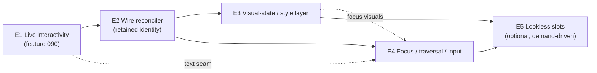
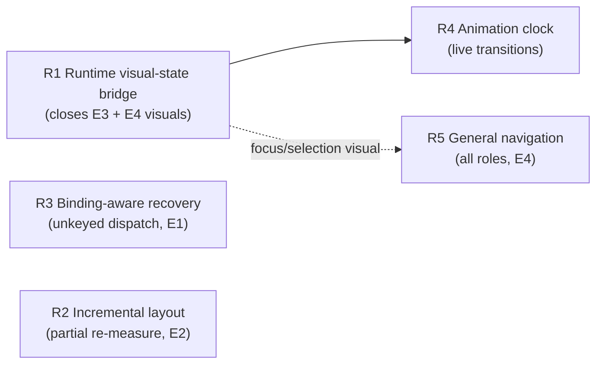
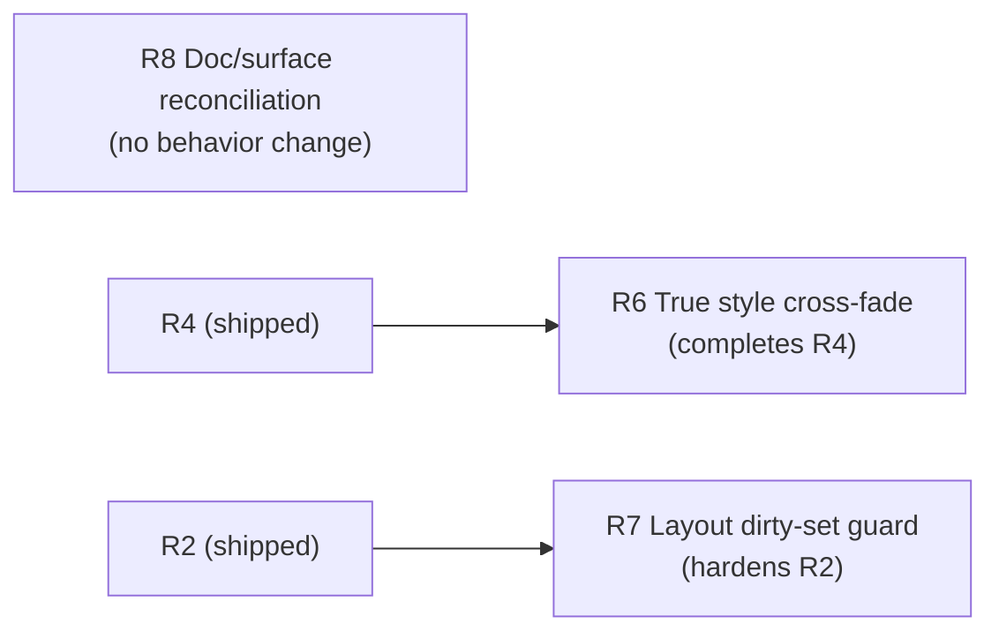

# Controls Architecture Evolution Roadmap

- Date: 2026-06-10
- Status: Planning report. No product code changed by this document. Records a
  maintainer-confirmed strategic decision and a multi-feature development plan
  for the controls subsystem.
- Scope: Whether the current design of FS.Skia.UI controls and their event model
  is fit to reach parity with a retained-mode XAML framework (Avalonia), whether a
  redesign is needed, and — given the decision *not* to redesign — the concrete
  E1–E5 evolution roadmap that takes the controls subsystem from immediate-mode
  toward declarative-retained (SwiftUI / Jetpack-Compose-class) capability parity.
- Origin: ControlsShowcase2 dogfooding feedback (severity **major** — a generated
  gallery that rendered green on every gate but did not respond to input in the
  live window), the architecture discussion that followed, and the maintainer
  decision recorded in `specs/090-interactive-host-event-dispatch/spec.md`
  (`## Clarifications`, Session 2026-06-10).
- Related: feature **090** (E1, the first rung — already specified and clarified);
  feature **067** (the parked keyed VDOM reconciler that E2 wires); features
  **086/089** (interactive consumer fitness + the run-and-use implement discipline);
  `docs/reports/2026-06-05-1802-typed-controls-front-door-implementation-plan.md`
  (the typed `Props` front door); `docs/reports/2026-06-09-1538-ant-design-ui-story-adoption-analysis.md`
  (token/design-system direction).

## Executive Summary

**The verdict: no redesign.** The controls subsystem keeps its immutable
`Control<'msg>` + MVU core and **evolves** toward declarative-retained capability
parity. It does **not** adopt retained-mode XAML/data-binding architecture parity.
The two are different goals, and conflating them is the trap.

The ControlsShowcase2 "renders-but-dead-window" failure is not a one-off bug — it
is the first visible symptom of a single underlying truth: **the framework today is
an immediate-mode renderer with no retained per-control identity, and a handful of
capabilities that consumers expect from a "UI framework" (live event dispatch,
stable focus, visual states, per-control animation, efficient updates) all depend on
that missing identity.** A keyed reconciler that supplies exactly this identity was
already designed and built (feature 067) and then deliberately parked. Wiring it is
the linchpin of everything downstream.

The plan is a five-step evolution, each step an independently shippable Spec Kit
feature routed through the existing governance gates:

| Step | Theme | Status | Unlocks |
|------|-------|--------|---------|
| **E1** | Live interactivity — authored-binding dispatch, keyed-ancestor recovery, focus-aware text seam, responds-proof | **Implemented** (feature 090) — ⚠ live-path gap: see [§10.5 R3](#105-r3--binding-aware-ancestor-recovery-completes-e1) | A clicked/typed control actually does something in the live window |
| **E2** | Wire the parked feature-067 reconciler into the render path → stable cross-frame identity | **Implemented** (features 091 + 092) — ⚠ live-path gaps: see [§10.4 R2](#104-r2--incremental-measure--partial-re-layout-completes-e2), [§10.6 R4](#106-r4--animation-clock-on-retained-identity-completes-e2) | Focus stability, per-control animation, visual states, partial-update performance |
| **E3** | Visual-state / style layer over design tokens (style classes + state→style resolution) | **Implemented** (feature 093) — ⚠ live-path gap: see [§10.3 R1](#103-r1--runtime-visual-state-bridge-completes-e3--e4) | Declarative styling without a CSS-selector engine |
| **E4** | Focus / keyboard-traversal / input-routing system (generalizes E1's text seam) | **Implemented** (feature 094) — ⚠ live-path gaps: see [§10.3 R1](#103-r1--runtime-visual-state-bridge-completes-e3--e4), [§10.7 R5](#107-r5--general-navigation-key-delivery-completes-e4) | Tab order, traversal, focused-control key delivery for all controls |
| **E5** | Lookless template / slot composition | **Implemented** (feature 095) — faithful, no gaps | Consumer re-skinning of control shape |

**Permanent non-goals** (the rejected redesign — *not* "deferred"): XAML; a
data-binding / observable property graph; attached/dependency properties with
coercion and inheritance; a lookless `ControlTemplate` engine of the WPF/Avalonia
kind; CSS-selector styling. Adopting these would mean discarding the
F#/MVU/determinism core (pure reducers, identity-at-rest, golden-diff evidence) to
chase a model Avalonia already owns and owns well.

This roadmap reaches ~SwiftUI/Compose-class capability parity while preserving the
project's defining strengths and its evidence/governance constitution.

**Update (2026-06-10, post-implementation):** all five steps E1–E5 have shipped and
landed on `main` as features 090, 091+092, 093, 094, and 095 respectively — each
through the standard gates with `EvidenceAudit` green and no synthetic shortcuts. A
follow-up implementation audit (recorded in **§10**) confirms the *architecture* was
realized faithfully and the permanent non-goals were respected throughout, but found
a **recurring class of live-path shortfall**: several capabilities (visual-state
styling, focus indication, animation, navigation, unkeyed dispatch, incremental
layout) were delivered as *mechanisms that are property-tested* but are **not wired
end-to-end into the running host**, so a consumer's live app gets less "for free"
than the capability prose implies. **§10** records the audit and adds five detailed,
independently shippable remediation features (**R1–R5**) that close those gaps
without touching the architecture or the non-goals.

**Update (2026-06-11, second-pass audit):** R1–R5 have now also shipped and landed on
`main` as features 096–100. A source-level faithfulness audit of those five
remediations (recorded in **§11**) confirms each was implemented and wired onto the
live path with its determinism budget intact, and that the permanent non-goals were
held throughout. It found **no feature-level omissions** — every roadmap rung,
including the optional E5, is built — but surfaced a smaller residual class where the
*deliverable prose overstates the shipped behavior*: most materially, R4's "animated
transition" is a uniform opacity fade-in rather than a true per-state style cross-fade,
and R2's incremental-layout dirty classifier keys on a hand-maintained 3-attribute set
that is correct today but unguarded against future drift. **§11** records that audit and
adds three architecture- and non-goal-preserving follow-ups (**R6–R8**) that close the
behavior gap (R6), harden the latent drift risk (R7), and reconcile the remaining
documented narrowings (R8).

---

## 1. The Question and the Verdict

The originating question: *is the current design and architecture of controls and
their events fit to achieve parity with something like Avalonia, and would a
redesign help or be necessary?*

"Parity with Avalonia" decomposes into two very different questions:

1. **Capability parity** — can a consumer build the same *apps*: the same controls,
   the same behaviors, the same look and feel?
2. **Architecture parity** — does it work the *Avalonia way*: a retained visual
   tree, styles and selectors, lookless `ControlTemplate`s, data binding, routed
   events, dependency properties?

FS.Skia.UI is **immediate-mode + MVU**; Avalonia is **retained-mode + XAML +
data-binding**. These are two legitimate philosophies, not points on a
"complete vs incomplete" axis. The most relevant comparison is therefore *not*
Avalonia at all but **SwiftUI / React / Jetpack Compose**: declarative authoring
surfaces (like this one) over a **reconciled, identity-bearing retained tree**
underneath. That underneath is what powers stable focus, per-control animation,
visual states, and efficient partial updates — several of the "XAML" capabilities —
*without* XAML, data binding, or mutable view-models.

**Verdict (maintainer-confirmed 2026-06-10):**

- Architecture parity with Avalonia → would be a near-total rewrite, and is
  **rejected**. It would discard the F#/MVU/determinism core for a model a mature
  incumbent already owns.
- Capability parity (SwiftUI/Compose-class) → reachable as an **evolution**, no
  redesign, building on the existing foundation. **Adopted.**

The single most important enabling fact: the keyed reconciler (feature 067) that
supplies retained identity **already exists** in the codebase, written pure and
total to fit the determinism constitution, and is currently parked/unwired. The
evolution path the project's own constitution welcomes is to wire it; the redesign
path would fight that constitution.

---

## 2. Current Architecture Assessment

This section is the grounded baseline the roadmap builds on. Citations are to
current source.

### 2.1 Control model / IR

`Control<'msg>` (`src/Controls/Types.fsi:242`) is an **immutable, immediate-mode
description**, not a retained tree: a record of `Kind` (string), optional `Key`
(`ControlId`), `Attributes`, `Children`, optional `Content`, and `Accessibility`.
It is **re-evaluated from the consumer's model every frame**. There are **no
persistent control instances** and no per-control state that survives a frame.

`Control.renderTree` (`src/Controls/Control.fs:1014`–`1170`) produces a
`ControlRenderResult`:

- **Scene** — Skia paint commands (faithful per-control geometry for the "rich"
  families, box+label otherwise; `Control.fs:218` `richFamilies`).
- **Layout** — a Yoga-style `LayoutNode` tree.
- **Bounds** — `(ControlId * Rect)` list, one per laid-out control; id is the
  explicit `Key` or the structural path (`Control.fs:1052`).
- **EventBindings** — `ControlEventBinding<'msg> list`, keyed by `ControlId`
  (`Control.fs:1169`; type at `Types.fsi:294`).
- **Diagnostics**.

Everything is rebuilt each render; there is no incremental/retained control state.

### 2.2 Event model

`ControlEventBinding<'msg>` (`Types.fsi:279`) = `ControlId` + `EventKind` (string)
+ a `Dispatch: ControlEvent -> 'msg`. `ControlEvent` (`Types.fsi:222`) carries
`Kind`, optional `ControlId`, `Origin` (Pointer | Keyboard | Text | Focus |
Selection | Clipboard), and `Payload`.

There is **no routed-event system** (no bubbling/tunneling), **no command system**,
and **no framework-level focus traversal**. Events are **flat per-`ControlId`
bindings**. The interactive host (`src/Controls.Elmish/ControlsElmish.fs`) hit-tests
`Bounds` against pointer samples and routes **only** through
`host.MapPointer : PointerInteraction -> 'msg option` (`:183`).

`ControlRuntime` (`src/Controls/ControlRuntime.fsi:41`) *does* keep durable UI
state — `FocusedControl`, `HoveredControl`, `PressedControls`, `Caret`, `Selection`,
`Composition`, `ActiveDrag` — updated by `ControlRuntimeMsg` produced by
`Pointer.update` (`src/Controls/Pointer.fsi`). `Pointer` is a pure reducer
(`PointerMsg → PointerState × PointerInteraction list × ControlRuntimeMsg list`)
hit-testing via `Layout.hitTestComputed`, deterministic and replayable.

**The defect class behind ControlsShowcase2:** `rendered.EventBindings` is computed
but **never consumed** by the interactive host — routing is `MapPointer`-only — so a
consumer who authors `Button.onClick`/`CheckBox.onChanged` gets a dead window. (The
`.fsi` doc even *claims* the host joins `EventBindings`, which the code does not do.)
This is E1 / feature 090.

### 2.3 Layout system

`src/Layout/**` — the genuinely **parity-grade** piece. `LayoutNode`
(`Types.fsi:146`) + `LayoutIntent` (`Types.fsi:113`) implement a Yoga-like flexbox:
`Direction`, `Wrap`, `AlignItems`/`JustifyContent`/`AlignSelf`
(Auto/Start/Center/End/Stretch/SpaceBetween/SpaceAround/SpaceEvenly),
`Padding`/`Margin`/`Gap`, `Size`/`MinSize`/`MaxSize`,
`FlexGrow`/`FlexShrink`/`FlexBasis`. `Layout.evaluate` is a real two-pass
measure/arrange producing computed `Bounds`; `Layout.hitTestComputed` does
deterministic pointer hit-testing. **No redesign needed here.**

### 2.4 Theming / styling / templating

Theming is **design-token based** (`Theme` at `Types.fsi:198`: Foreground,
Background, Accent, Danger, Muted, FontFamily, FontSize, Density, CornerRadius,
ContrastRequiredRatio). A `VisualState` enum exists (`Types.fsi:187`: Normal,
Disabled, Hover, Pressed, Focused, Selected, Loading, Validation) but is applied
**procedurally per kind** at render (`Control.fs:1096`–`1158`).

There is **no styling engine** (no selectors, no style classes, no visual-state
machine driving styles) and **no templating** (no `ControlTemplate`, no lookless
controls). The token/design-system direction is being developed separately (see the
Ant Design adoption report); E3 builds the state→style layer on top of it.

### 2.5 State / reactivity

**MVU/Elmish** (`ControlsElmish.fsi:33`): `Init`, `Update`, `View : 'model ->
Control<'msg>`, `Subscriptions`. All consumer state lives in `'model`. There is **no
data-binding, observable, or dependency-property system**. `ControlRuntime` and the
`TextInput` model (`TextInput.fsi:14`) hold UI-owned durable state (caret, selection,
focus, composition) separate from the consumer model.

### 2.6 Reconciliation (the parked linchpin)

Feature 067's `Reconcile` module (`src/Controls/Reconcile.fsi`) is a **pure keyed
VDOM diff**, currently **internal-only and not wired into the render path**:
`diff : prev -> next -> ReconcileResult<'msg>` producing `NodePatch`
(Keep | Replace | Update), `UpdatePatch` (attr set/remove, content, accessibility,
`ChildOp` list), and `ChildOp` (Keep | Move | Insert | Remove) matched **key-first,
then positional**. It is deterministic, total, never throws, and today is used for
property tests only — `Control.render`/`renderTree` never call it. **This is the
single most strategically important asset for the roadmap.**

### 2.7 Accessibility, animation, text input, virtualization

- **Accessibility** (`Accessibility.fsi`, `Types.fsi:140`): `AccessibilityMetadata`
  (Role, NameSource, State, FocusOrder, Keyboard, Contrast evidence); a real role
  taxonomy; `Accessibility.validate`. Metadata is strong; it is not yet driven by a
  live focus/traversal engine (E4).
- **Animation** (feature 073, Scene-level): `Tween`/`Animation`/`AnimationState`
  with `applyAt` sampling and identity-at-rest. Applied **post-render at the Scene
  layer**, *not* part of the control IR — so there are no control-level, data-bound
  animation targets yet (E2 + E3 enable these).
- **Text input** (`TextInput.fsi:14`): a full `TextInputModel`
  (CommittedText/DraftText/Caret/Selection/Composition/Validation/Focused) +
  `TextInputMsg`/`TextInputEffect` pipeline, integrated with `ControlRuntime`. It
  exists but is **not wired to live keystrokes** in the host (E1/FR-008 wires it).
- **Virtualization**: collection controls support a bounded visible range; there is
  no general virtual-list engine.

### 2.8 Catalog scope

52 demonstrable controls across 10 categories (display 7, input 10, selection 7,
navigation 4, layout 8, feedback 3, data 3, chart 4, graph 1, custom 1), each with a
typed `Props` front door under `src/Controls/Widgets/*.fs` lowering to
`Control<'msg>`. Coverage is broad; the gap is *behavior in a live host*, not
catalog breadth.

### 2.9 Strengths and gaps at a glance

**Parity-grade today:** the Yoga layout core; the design-token theme model; the
accessibility *metadata* framework; the typed `Props` authoring surface; the
52-control catalog; a pure, deterministic event reducer; **and a pure keyed
reconciler already built but unwired.**

**Gaps vs Avalonia (and which step closes each):**

| Gap | Today | Closed by |
|-----|-------|-----------|
| Live event dispatch | `MapPointer`-only; `EventBindings` dead | **E1** |
| Container-keyed routing | opaque positional hit ids | **E1** |
| Live text input | `TextInput` pipeline unwired to keystrokes | **E1** (seam) → **E4** (general) |
| Renders-vs-responds proof | screenshots can pass on an inert app | **E1** |
| Stable per-control identity | rebuilt every frame; reconciler parked | **E2** |
| Efficient partial updates | redraw-the-world | **E2** |
| Visual-state-driven styling | procedural per kind | **E3** |
| Style classes / variants | none | **E3** |
| Focus & keyboard traversal | focus tracked, not delivered/traversable | **E4** |
| Per-control animation targets | Scene-level only | **E2 + E3** |
| Lookless re-skinning | fixed shape per kind | **E5** (optional) |
| Data binding / dependency props | MVU only | **non-goal (rejected)** |

---

## 3. Strategic Direction

**Adopt declarative-retained capability parity. Reject XAML architecture parity.**

The destination is a framework where the consumer still writes a pure
`view : 'model -> Control<'msg>` (declarative, immutable, MVU), but underneath a
**reconciled retained tree** gives every control a stable identity across frames.
That identity is the substrate for:

- focus that survives re-renders (E4),
- visual-state transitions and per-control animation (E2 → E3),
- styling resolved from declarative state, not procedural per-kind code (E3),
- and partial updates that touch only changed subtrees (E2).

This is precisely the SwiftUI/Compose model, and it is reachable additively from
where the code is today.

**Why not the redesign.** The four XAML pillars — styling selectors, lookless
templates, data binding, dependency properties — all presuppose a retained tree of
*stateful control instances with a property system*. They cannot be bolted onto an
anonymous tree rebuilt each frame; they require the rewrite. More importantly, data
binding + mutable view-models + reflection are in direct tension with the project's
constitution: pure reducers, identity-at-rest, golden-diff evidence, deterministic
governance gates. The reconciler was written pure/total precisely so the
*declarative-retained* path stays inside that constitution. The redesign would
abandon it.

**Explicit, permanent non-goals (not "deferred"):** XAML; observable/data-binding
property graph; attached/dependency properties with coercion/inheritance; a lookless
`ControlTemplate` engine; CSS-selector styling.

---

## 4. The Evolution Roadmap

Each step is an independently shippable feature routed through the standard gates.
Steps are ordered by dependency: **E2 is the linchpin** that E3 and E4 build on, and
E1 is table stakes that must precede everything because nothing else matters while
the live window is inert.

### E1 — Live interactivity *(feature 090 — specified & clarified)*

**Goal.** A control authored the documented way (`Button.onClick`,
`CheckBox.onChanged`, a focused `TextBox`) actually responds in the running window.

**Why first.** It is the major, severity-flagged root cause; it is table stakes —
no downstream capability is observable while clicks and keystrokes do nothing.

**Scope & key deliverables** (from `specs/090-interactive-host-event-dispatch/`):

- **Authored-binding dispatch (LIVE-DISPATCH-1).** The interactive host
  (`runInteractiveApp` via `routeInteractivePointer`) dispatches a hit control's
  `EventBindings`. Correct the `.fsi` host contract, which currently *claims*
  dispatch it does not perform.
- **Precedence (clarified).** Authored binding **wins**; `MapPointer` is a fallback
  for interactions no binding consumed — never double-dispatch.
- **Keyed-ancestor recovery (KEYED-ANCESTOR-1).** A public, **option-returning**
  helper that resolves a deep positional hit (`"0.1"`) to the nearest ancestor
  carrying a `withKey`/binding; returns **None** when nothing in the path is keyed or
  bound (host then falls back to `MapPointer`). Non-regressive for directly-keyed
  leaves.
- **Focus-aware text seam (TEXT-INPUT-1, clarified to build the seam).** Deliver
  keystrokes/committed/composed text to the focused text control by wiring the
  existing `ControlRuntime.FocusedControl` + `TextInput` pipeline; pointer click sets
  focus. A complete editor (selection gestures, IME UX, undo/redo) and general
  traversal are **not** here — they are E4.
- **Responds-vs-renders proof (RESPONDS-EVIDENCE-1).** A capturable runtime artifact
  proving input→visible-change on the running host, distinct from a render-only
  screenshot and an offscreen route probe; an inert app cannot produce it.
- **Scope bound (clarified).** Host **mechanism + representative verification** (a
  leaf-keyed, a container-keyed, and a text control). **No** catalog-wide retrofit of
  all 52 typed views' binding surfaces — that is a separate fitness pass.

**Touchpoints.** `src/Controls.Elmish/**` (dispatch, text seam, contract doc),
`src/Controls/**` (keyed-ancestor helper), published api-surface + per-package
baselines, the evidence spine for the responds-proof.

**Risks & mitigations.** *Double-dispatch / behavior change* → mitigated by the
binding-wins precedence and additive design (no binding ⇒ unchanged). *Surface
churn* → recapture baselines; escalated Tier-1 route already expected.

**Exit criteria.** SC-001…SC-006 in the 090 spec: bound controls respond; contract
is honest; container-keyed controls route; a responds-proof exists that an inert app
fails; text controls are typeable; the six-target order is green.

### E2 — Wire the parked reconciler *(the linchpin)*

**Goal.** Give every control a **stable identity across frames** by wiring feature
067's `Reconcile` into the render path, moving the framework from rebuild-every-frame
immediate-mode to declarative-retained.

**Why it is the linchpin.** Identity is the precondition for *everything* that makes
a UI feel like a UI: focus that survives a re-render, animations that continue across
frames, visual-state transitions, and partial updates that don't redraw the world.
E3 and E4 are not buildable in a principled way without it.

**Scope & key deliverables.**

- Introduce a **retained tree** that persists between frames, produced by diffing the
  new `Control<'msg>` against the previous via `Reconcile.diff`, applying
  `NodePatch`/`ChildOp` to a mutable-but-internal retained structure (mutation stays
  *inside* the framework; the consumer surface stays pure MVU).
- Carry **stable identity** (key-first, then positional) so a control that "is the
  same" across frames keeps its identity — and thus its focus, animation clock, and
  visual-state.
- Drive **partial re-render/re-layout**: only changed subtrees re-paint/re-measure;
  unchanged subtrees are reused. This is the performance unlock past the current
  redraw-the-world loop.
- Preserve the existing determinism invariants the 067 module already guarantees
  (totality, determinism, identity-at-rest, round-trip) now *on the live path*, with
  golden/property evidence.

**Touchpoints.** `src/Controls/Reconcile.*` (un-park, promote to render path),
`src/Controls/Control.fs` (`render`/`renderTree` integration), the
`Controls.Elmish` host loop, `src/SkiaViewer/SkiaViewer.fs` (repaint integration at
the `dispatchHostMsg` seam), animation sampling (so an animation clock attaches to a
retained identity).

**Dependencies.** E1 (a live host worth optimizing). The 067 reconciler itself is
already built and property-tested — this is wiring + invariant preservation, not new
algorithm design.

**Risks & mitigations.** *Determinism regressions on the live path* → the module is
already pure/total; gate with golden diffs + the existing property tests promoted to
cover the wired path; keep mutation framework-internal. *Identity churn from unkeyed
siblings* → reuse the established key-first-then-positional rule and the 086
same-kind-sibling bounds learnings. *Scope creep into E3/E4* → E2 ships identity +
partial updates only; it does **not** add styling or focus semantics.

**Exit criteria.** The live render path diffs and reuses; focus and an in-flight
animation survive an unrelated state change; a measured reduction in
per-frame paint/layout work for a localized update; all determinism invariants hold
on the wired path under golden + property evidence.

### E3 — Visual-state / style layer

**Goal.** Make styling **declarative and state-driven** instead of procedural
per-kind, layered on the existing design tokens — without a CSS-selector engine.

**Scope & key deliverables.**

- **Style classes / variants** a consumer can attach to a control (e.g. "primary",
  "danger", "ghost") that resolve to token-derived paint/typography.
- A **state→style resolution** keyed off the existing `VisualState`
  (Normal/Hover/Pressed/Focused/Selected/Disabled/Validation) and the E2 identity, so
  a control transitions styles as its retained state changes (and, with E2's animation
  identity, can *animate* the transition).
- Replace the procedural per-kind styling in `Control.fs:1096`–`1158` with a
  declarative resolver fed by tokens + class + state.
- Integrate with the design-system policy direction (WCAG/Ant/other) from the token
  work so styles remain contrast-validated.

**Touchpoints.** `Control.fs` styling path, `Theme`/token modules,
`fs-skia-design-tokens` surface, the contrast gate.

**Dependencies.** E2 (state transitions need retained identity to be meaningful).

**Risks & mitigations.** *Re-implementing CSS* → explicitly out; scope is
class + state resolution, a closed and ordered model, not arbitrary selectors.
*Token/contrast drift* → reuse the existing `DesignTokenDrift` and contrast gates.

**Exit criteria.** A control's appearance is determined by tokens + class + state
through one declarative resolver; hover/press/focus/selected/disabled render
distinctly and (optionally) animate; no procedural per-kind styling remains for the
migrated controls; contrast gates stay green.

### E4 — Focus / keyboard-traversal / input-routing

**Goal.** Generalize E1's focus-aware *text* seam into a **full focus model** for all
controls: tab order, traversal, and focused-control key delivery.

**Scope & key deliverables.**

- A **focus model** over the retained tree (E2) with deterministic tab order derived
  from `AccessibilityMetadata.FocusOrder` + layout order.
- **Keyboard traversal** (Tab/Shift-Tab/arrows per role) updating
  `ControlRuntime.FocusedControl`.
- **Focused-control key delivery** for all interactive kinds (not just text): a
  focused button activates on Space/Enter, a slider moves on arrows, etc., via the
  existing keyboard accessibility metadata (`KeyboardOperation`).
- Tie focus visuals into the E3 `Focused` visual-state.

**Touchpoints.** `Controls.Elmish` host (key routing), `ControlRuntime`, `Pointer`
(focus-on-click already emits `FocusMovedByPointer`), `Accessibility` metadata,
`SkiaViewer` key delivery.

**Dependencies.** E2 (retained identity for stable focus) and E1 (the text seam this
generalizes). Benefits from E3 (focus visuals).

**Risks & mitigations.** *Focus/repaint interaction (the ControlsShowcase2
"shortcuts blocked after clicks" symptom)* → E2's stable identity removes the
focus-reset-on-rebuild class of bug; verify with a responds-proof that survives
multiple interactions. *Accessibility correctness* → drive traversal from the
existing role/keyboard metadata and validate with `Accessibility.validate`.

**Exit criteria.** Tab/Shift-Tab traverse in a deterministic, accessible order;
a focused non-text control responds to its activation/navigation keys; focus is
visibly indicated and survives unrelated re-renders.

### E5 — Lookless template / slot composition *(optional, demand-driven)*

**Goal.** Let a consumer re-skin a control's *shape* (not just its tokens) via a
composition/slot mechanism — the one genuinely "XAML-flavored" capability worth
considering, but **only if real consumers need it.**

**Scope (if pursued).** A slot/composition API where a control kind exposes named
regions a consumer can supply, lowering to the same `Control<'msg>` IR — *not* a
data-bound `ControlTemplate` engine. Kept declarative and within the IR.

**Dependencies.** E2/E3 (identity + style layer). **Not committed**; revisit after
E2–E4 land and only with concrete consumer demand.

**Risks.** Easy to over-build into the rejected templating engine — gate hard on
"declarative, lowers to IR, no binding."

---

## 5. Parity Matrix vs Avalonia

| Capability | Avalonia | FS.Skia.UI today | After roadmap | Step |
|------------|----------|------------------|---------------|------|
| Flexbox/measure-arrange layout | ✔ | ✔ (Yoga, parity-grade) | ✔ | — |
| Design-token theming | ✔ (Fluent/Simple) | ✔ (tokens) | ✔ | — |
| Accessibility metadata | ✔ (automation peers) | ✔ (metadata) | ✔ + live focus | E4 |
| Live pointer event dispatch | ✔ (routed) | ⚠ dead bindings | ✔ (flat dispatch) | E1 |
| Live text input | ✔ | ✗ (pipeline unwired) | ✔ (seam → general) | E1 → E4 |
| Stable control identity | ✔ (retained) | ✗ (rebuilt) | ✔ (reconciled) | E2 |
| Efficient partial updates | ✔ | ✗ (redraw-world) | ✔ | E2 |
| Visual-state styling | ✔ | ✲ (procedural) | ✔ (declarative) | E3 |
| Style classes / variants | ✔ (selectors) | ✗ | ✔ (classes, no selectors) | E3 |
| Focus & keyboard traversal | ✔ | ✲ (tracked, not delivered) | ✔ | E4 |
| Per-control animation | ✔ | ✲ (Scene-level) | ✔ | E2 + E3 |
| Lookless re-skinning | ✔ (ControlTemplate) | ✗ | ◐ (slots, optional) | E5 |
| Data binding | ✔ | ✗ | ✗ **(rejected non-goal)** | — |
| Dependency/attached properties | ✔ | ✗ | ✗ **(rejected non-goal)** | — |
| CSS-selector styling | ✔ | ✗ | ✗ **(rejected non-goal)** | — |

Legend: ✔ present · ✗ absent · ✲ partial/procedural · ◐ optional · ⚠ present-but-broken.

The matrix makes the thesis concrete: **capability parity is reached on the rows that
matter to building apps; architecture-only rows (data binding, dependency properties,
CSS selectors) are deliberately not pursued.**

---

## 6. Cross-Cutting Concerns

### 6.1 Determinism & governance

Every step must preserve the constitution: pure reducers, identity-at-rest,
golden-diff parity, deterministic gates. E2 is the sensitive one — it wires a module
that *can* mutate — and is the reason 067 was written pure/total: mutation stays
framework-internal, the consumer surface stays pure MVU, and the existing 067
property tests + golden diffs are promoted to cover the wired path. The
renders-vs-responds proof from E1 becomes a durable, reusable evidence primitive for
all later interactive features.

### 6.2 Performance trajectory

Today: O(whole-tree) paint + layout per frame. E2 turns this into
O(changed-subtree), which is the precondition for non-trivial apps (large
collections, frequent updates) to stay smooth. Collection virtualization can layer on
later once identity + partial updates exist.

### 6.3 Testing & evidence

- **E1**: representative end-to-end responds-proofs (leaf, container, text) +
  unit/property tests for precedence and the option-returning recovery.
- **E2**: 067 property tests promoted to the live path; golden diffs proving
  identity-at-rest and round-trip on real renders; a focus/animation-survives-update
  test.
- **E3**: golden style-resolution tests per visual-state; contrast gates retained.
- **E4**: accessible-traversal-order tests driven by metadata; key-activation tests
  per role.

### 6.4 Migration & compatibility

Every step is **additive** and preserves the MVU consumer surface. E1 doesn't break
`MapPointer`-only consumers (binding-wins is additive). E2 changes the *internal*
render path, not the `view` contract. E3 replaces procedural styling behind the same
control kinds. No consumer rewrite is required to adopt any step; new capabilities are
opt-in.

---

## 7. Sequencing & Dependencies

Critical path: **E1 → E2 → {E3, E4}**. E3 and E4 can proceed in parallel once E2
lands (they share the retained tree but touch different seams: styling vs input/
focus). E5 is gated on concrete demand and should not be scheduled speculatively.

---

## 8. Risks & Open Questions

- **E2 is the highest-risk, highest-value step.** Wiring a reconciler onto the live
  path while preserving determinism is where a subtle regression could hide. Mitigate
  with the existing pure/total module, promoted property tests, and golden diffs; do
  E2 as its own feature with a heavy evidence budget.
- **Animation ↔ identity coupling.** Per-control animation (today Scene-level) needs
  to attach an animation clock to a retained identity; sequence the animation
  integration *after* E2 establishes identity, not before.
- **E3 styling scope discipline.** The line between "class + state resolution" and
  "re-implementing CSS selectors" must be held; keep the model closed and ordered.
- **E4 accessibility correctness.** Traversal order and key activation must be driven
  by the existing accessibility metadata and validated, not hand-rolled per control.
- **Open question — responds-proof artifact format (E1 plan-level).** The exact
  capturable artifact (before/after frame pair + decodable diff vs hash compare) is
  deferred to the 090 plan; it should become the reusable evidence primitive for E2–E4.
- **Open question — per-`EventKind` interaction matching (E1 plan-level).** Which
  `PointerInteraction` maps to which binding `EventKind` (Click→activation, etc.) is a
  plan detail; the spec already pins the press+release→activation case via the US1
  test.

---

## 9. Recommendation & Immediate Next Steps

1. **Land E1 (feature 090).** It is specified and clarified; proceed to
   `/speckit-plan` → tasks → implement. It unblocks observable progress and produces
   the responds-proof evidence primitive the rest of the roadmap reuses.
2. **Spec E2 next**, as its own feature, with an explicit evidence budget for
   determinism on the wired path. Frame it as "promote the parked 067 reconciler to
   the render path; preserve all invariants; deliver partial updates + cross-frame
   identity." This is the linchpin — prioritize it immediately after E1.
3. **Parallelize E3 and E4** once E2 lands; they are independent given the retained
   tree.
4. **Defer E5** until a real consumer needs lookless re-skinning.
5. **Hold the non-goals.** Treat any pull toward data binding, dependency properties,
   lookless `ControlTemplate` engines, or CSS selectors as out-of-scope by decision,
   not by omission — they are the rejected redesign.

The foundation here was clearly built by someone who saw this coming: a parity-grade
layout core, a clean immutable IR, a pure event reducer, design tokens, accessibility
metadata, and — decisively — a finished keyed reconciler waiting to be wired. The gap
to Avalonia is real but it is a *retained-identity + styling* problem, and the
cheapest credible path is to wire the reconciler and grow a visual-state layer on top
— not to rewrite toward XAML.

---

## 10. Post-Implementation Audit & Live-Path Remediation

> Added 2026-06-10 after E1–E5 landed. This section records a faithfulness audit of
> the shipped features against the E1–E5 deliverables and exit criteria above, then
> specifies five follow-up remediation features (**R1–R5**) that close the gaps the
> audit found. R1–R5 are **architecture-preserving and non-goal-preserving**: they
> finish wiring capabilities the existing features already built, without introducing
> data binding, dependency properties, CSS selectors, or a template engine.

### 10.1 Audit summary

All five steps shipped as independently gated Spec Kit features, all tasks `[X]`, no
synthetic/stub work, `EvidenceAudit` green. The *mechanisms* the roadmap specified
genuinely exist and are property-tested. The audit nevertheless found that **three of
the headline live-window promises are met only at the mechanism boundary** — the
running host does not drive them automatically — plus two narrower deviations.

| Step | Feature(s) | Mechanism | Live-path verdict | Gap → fix |
|------|-----------|-----------|-------------------|-----------|
| E1 | 090 | dispatch, precedence, recovery, text seam, responds-proof — all real | Authored dispatch works **only for keyed controls** | An *unkeyed* `Button.onClick` is still a dead button → **R3** |
| E2 | 091 + 092 | retained tree, key-first identity, focus/text survive shift — real on the live seam | Focus + text survive re-render genuinely; **but** layout is full-tree every frame and the animation slot is never filled | Partial **layout** unmet (paint-only) → **R2**; animation clock carried-but-unpopulated → **R4** |
| E3 | 093 | single pure `Style.resolve` (base < classes < state), typed + free-form classes, byte-identical parity — real | Resolver consumes `VisualState`, reconciler carries it; **but** nothing converts live hover/press/focus into that attribute | No runtime→`VisualState` bridge → **R1** |
| E4 | 094 | pure focus model, live Tab/Shift-Tab, activation keys, focus *stability* via E2 — real | Traversal + activation work; **but** navigation keys are Slider-only and focus is never *visibly* indicated on the live path | Navigation not general → **R5**; focus visual not auto-applied → **R1** |
| E5 | 095 | typed-closed slots lowering to IR, unfilled = byte-identical, non-goals held — fully faithful | Complete | none |

### 10.2 The recurring root cause: the missing runtime→attribute bridge

Three of the five gaps (E3 styling, E4 focus indication, and — transitively — E4/E2
animation triggers) are the **same defect wearing three hats**: the framework tracks
live interaction state in `ControlRuntime` (`HoveredControl`, `FocusedControl`,
`PressedControls`, `Selection`; `src/Controls/ControlRuntime.fs:36`–`38`) and the
render path faithfully *consumes* a `VisualState` attribute when one is present —
but **no code converts the former into the latter**. The only producers of
`Attr.visualState` in the entire codebase are tests. The E4 responds-proof makes this
explicit: the *consumer's* view mirrors focus by hand
(`if focusedKey = "btn" then [ Attr.visualState Focused ] else []`,
`tests/Elmish.Tests/Feature094FocusRoutingTests.fs:257`).

The consequence is that "hover/press/focus/selected/disabled render distinctly" and
"focus is visibly indicated" are delivered as *capabilities a consumer can opt into
by hand*, not as *working live behavior*. **R1 builds the missing bridge once and
closes both the E3 and E4 visual gaps**; it is also the prerequisite for animated
transitions (R4). It is the single highest-value remediation.

The remaining two gaps are independent: **R2** (incremental layout) finishes E2's
partial-update promise, **R3** (binding-aware recovery) finishes E1's dispatch
promise, and **R5** (general navigation) finishes E4's key-delivery promise.

Each remediation below follows the same template as E1–E5 (Goal · Root cause · Scope
& deliverables · Touchpoints · Dependencies · Risks & mitigations · Exit criteria)
and is independently shippable through the standard gates.

### 10.3 R1 — Runtime visual-state bridge *(completes E3 + E4)*

**Goal.** Make a running app restyle and indicate focus **automatically** on
hover/press/focus/selection, with zero consumer code, by deriving a per-control
`VisualState` from `ControlRuntime` and injecting it before the style resolver runs.

**Root cause.** `Style.resolve` reads `VisualState` (`src/Controls/Style.fs:71`–`81`)
and the keyed reconciler carries the `VisualStateValue` attribute across frames
(proven by `Feature093RetainedStateTests.fs:34`–`61`), but the runtime→attribute
conversion does not exist. `ControlRuntime` has the interaction state; the `view`
output never receives it.

**Why first.** It closes two roadmap exit criteria at once (E3 "states render
distinctly", E4 "focus is visibly indicated") and is the precondition for R4
(an animated transition must be triggered by a live state change).

**Scope & key deliverables.**

- **Pure projection.** `ControlRuntime.deriveVisualState : ControlRuntime ->
  ControlId -> VisualState`, a total pure function selecting a control's interaction
  state from `Hovered`/`Pressed`/`Focused`/`Selection`. Precedence is a **closed,
  ordered model** (highest wins): `Disabled` > `Validation` > `Loading` > `Pressed` >
  `Selected` > `Focused` > `Hover` > `Normal`. Consumer-supplied semantic states
  (`Disabled`/`Validation`/`Loading`/`Selected` set from `'model`) are preserved and
  out-rank derived interaction states per that order; derived interaction states only
  fill the slot the consumer left at `Normal`.
- **Host bridge.** `applyRuntimeVisualState : ControlRuntime -> Control<'msg> ->
  Control<'msg>`, applied in `renderRetained` (`src/Controls.Elmish/ControlsElmish.fs:555`)
  **before** `RetainedRender.step`, in the **`ControlId` domain** (pre-reconcile,
  matching the domain `ControlRuntime` already keys on). Because the stamp happens on
  the `Control<'msg>` *before* the diff, a hover change becomes an attribute change
  that the reconciler turns into an `Update` patch on exactly that subtree — so
  restyling composes with E2's partial-repaint for free.
- **Identity-fast-path preservation.** The bridge emits **no attribute** when the
  derived state is `Normal` (and the consumer set none), so non-interacted controls
  stay byte-identical and E3's `[] → control` and E2's `Keep → reuse` fast paths are
  untouched.
- **Migration coupling.** The bridge restyles a control only if its kind reads
  `VisualState` in its geometry (today: Button, CheckBox — the E3-migrated set). R1
  ships the bridge plus **widens the migrated set to the focusable interactive kinds**
  that most need a focus ring (Button, CheckBox, Slider, TextBox, the selection
  controls), so focus indication is visible on a representative interactive surface
  rather than two kinds. Full-52 restyle remains out of scope (tracked with E3).

**Touchpoints.** `src/Controls/ControlRuntime.fs`/`.fsi` (projection),
`src/Controls.Elmish/ControlsElmish.fs` (`renderRetained` bridge call),
`src/Controls/Control.fs` (extend the `classes`/`state`-threaded geometry to the
widened kind set, `:939`–`970`), `src/Controls/Style.fs` (no change — already
consumes), surface baselines for the new public projection.

**Dependencies.** E2 (the reconciler turns the injected attribute into a scoped
repaint) and E3 (the resolver). No dependency on R2–R5.

**Risks & mitigations.** *Byte-identity regression* → gate that `Normal`-state
controls emit no attribute and stay golden-identical. *Over-repaint on hover* →
acceptable and bounded: the reconciler scopes the repaint to the hovered subtree;
verify via the WorkReduction metric that a hover touches O(hovered-subtree), not the
world. *Consumer state conflicts* → the closed precedence order is the single
arbiter, property-tested for totality/determinism. *Domain mismatch* → stamp in the
`ControlId` domain before reconcile, never in the `RetainedId` domain.

**Exit criteria.** On the live host, hovering/pressing/focusing a migrated control
**visibly changes its rendering with zero consumer code**; a focused control shows
its `Focused` indicator automatically and the indicator **survives an unrelated
re-render** (via E2 identity); non-interacted controls remain byte-identical; the
precedence order is a tested closed model; contrast gates stay green; a responds-proof
captures input→visible-restyle that an inert/unbridged build fails.

### 10.4 R2 — Incremental measure / partial re-layout *(completes E2)*

**Goal.** Make per-frame **layout** work proportional to what changed, not O(whole
tree), finishing E2's partial-update promise (today only *paint* is partial).

**Root cause.** `RetainedRender.step` calls full-tree `evaluateLayout size next` on
**every** frame (`src/Controls/RetainedRender.fs:141`), and the paint-reuse decision
(`box = pr.Fragment.Box`, `:210`) *depends* on that full re-measure. So measure stays
O(whole-tree); `WorkReductionRecord` counts paint-node recomputes only. E2's FR-004
"only the changed subtree is re-measured" is unmet.

**Scope & key deliverables.**

- **Layout cache on the retained node.** Extend the retained fragment to memoize each
  node's computed `Bounds` and measured intrinsic size, keyed by retained identity.
- **Dirty-tracking from the reconcile patch.** Derive a `dirtyRoots` set directly from
  `ReconcileResult.Patch`: a node is layout-dirty if its `UpdatePatch` touches a
  **layout-affecting attribute** (size/min/max, padding/margin/gap, flex grow/shrink/
  basis, direction/wrap/align/justify) or if it has any `ChildOp` (Insert/Remove/Move).
  A `Keep`/content-only `Update` with no dirty descendant **reuses cached bounds**
  (translated if an ancestor moved).
- **Conservative flex-line propagation.** Because flexbox redistributes space across a
  line, dirtying one child must dirty its **whole flex container/line**, not just the
  node — the re-arrange unit is the nearest flex container that absorbs the change.
  Dirt propagates up to the first ancestor whose layout fully absorbs it.
- **`Layout.evaluateIncremental prevLayout dirtyRoots size next`** in `src/Layout/**`,
  replacing the unconditional `evaluateLayout` at `RetainedRender.fs:141`.
- **Metric + invariant.** Extend `WorkReductionRecord` to count **re-measured** nodes
  alongside re-painted nodes, so the exit criterion is measurable. Add the strongest
  possible determinism gate: a property test asserting `evaluateIncremental` is
  **byte-identical to a full `Layout.evaluate`** over random edit sequences.

**Touchpoints.** `src/Layout/**` (incremental evaluate + memoized measure),
`src/Controls/RetainedRender.fs` (`:141` swap; extend `WorkReductionRecord`),
`src/Controls/Control.fs` (`evaluateLayout` incremental variant, `:1156`–`1172`).

**Dependencies.** E2 (the retained tree and patch are the dirty-source). Independent
of R1/R3/R4/R5.

**Risks & mitigations.** *Incremental flexbox is the classic subtle-bug source* →
the incremental-≡-full equivalence property test is a **hard invariant**, run over
randomized edit sequences; any divergence fails the gate. *Flex sibling effects* →
conservative whole-line dirtying (above) rather than per-node. *Determinism* → pure
cache keyed by content/intrinsic-input hash; no wall-clock, no mutation escaping the
step closure. *Scope creep* → R2 ships incremental measure only; virtualization stays
a later layer (per §6.2).

**Exit criteria.** A localized leaf edit **re-measures only its flex container
subtree** (measured and reported via the extended metric), not the whole tree;
`evaluateIncremental` is byte-identical to full `evaluate` under a property test over
random edit sequences; `WorkReductionRecord` reports both re-measure and re-paint
reductions for a localized update; all E2 determinism invariants still hold on the
wired path.

### 10.5 R3 — Binding-aware ancestor recovery *(completes E1)*

**Goal.** Make an **unkeyed** authored control respond in the live host, closing the
last instance of the original dead-window class. Authoring `Button.onClick` the
documented, obvious way — *without* `withKey` — must dispatch.

**Root cause.** `Control.nearestAuthored` (`src/Controls/Control.fs:1372`) detects
only **keyed** nodes, via the heuristic `if node.Id <> path then Some node.Id`
(`:1374`) over a `LayoutNode`, which carries no binding data. An unkeyed-but-bound
node is invisible to it, so its hit resolves to `None` and falls through to
`MapPointer` (unmapped → nothing). The deeper cause is an **id-scheme divergence**:
`EventBindings` key by `Key ?? Kind` (`Control.fs:194`) while bounds/recovery key by
`Key ?? path` (`:1130`) — the two only agree when a `Key` is present.

**Scope & key deliverables.**

- **One canonical `ControlId` per node.** Unify the per-node id derivation in
  `renderTree` so **bounds, `EventBindings`, and recovery share a single scheme**
  (`Key ?? structural-path`). This removes the `Kind`-keyed binding path that
  collides for same-kind siblings and is the root of the divergence.
- **Binding-aware recovery.** Emit a `boundIds : Set<ControlId>` (bound nodes in the
  unified path scheme) from `renderTree`; `nearestAuthored` walks the hit path and
  treats an ancestor as authored when it carries a `Key` **or** is in `boundIds` —
  returning `Some pathId` for unkeyed-bound nodes. Dispatch (`bindingMessagesFor`,
  `src/Controls.Elmish/ControlsElmish.fs:155`) looks the binding up in the same
  unified scheme, so the recovered id matches.
- **Representative verification.** A live-adapter test where an **unkeyed**
  `Button.onClick` dispatches; a nested unkeyed bound control dispatches via recovery;
  keyed leaves and container-keyed recovery remain non-regressive; the
  same-kind-unkeyed-siblings case disambiguates by path (reusing the 087/092 sibling
  learnings).

**Touchpoints.** `src/Controls/Control.fs` (unify id derivation `:194`/`:1130`,
`nearestAuthored` `:1372`, `renderTree` `boundIds`), `src/Controls/Control.fsi`,
`src/Controls.Elmish/ControlsElmish.fs` (`bindingMessagesFor` lookup), published
api-surface + per-package baselines.

**Dependencies.** E1 (the dispatch seam this corrects). Independent of R1/R2/R4/R5.

**Risks & mitigations.** *Behavior change for consumers relying on `Kind`-keyed
dispatch* → audit `ControlEvent.ControlId` payload consumers; keep the **reported**
payload id stable where it is observed, and document the canonicalization; the change
is additive for keyed authoring (unchanged) and only *adds* dispatch for the
previously-dead unkeyed case. *Surface churn* → recapture baselines; the escalated
Tier-1 route is already expected for a `Control.fsi` change. *Collision* → the path
scheme disambiguates unkeyed same-kind siblings that the old `Kind` scheme conflated —
a net correctness gain, property-tested.

**Exit criteria.** An unkeyed authored `Button.onClick` (and a nested unkeyed bound
control) responds in the live host; keyed leaves and container recovery remain
non-regressive; a **single canonical `ControlId` scheme** spans bounds, bindings, and
recovery, property-tested for determinism and same-kind-sibling disambiguation; the
six-target order is green.

### 10.6 R4 — Animation clock on retained identity *(completes E2)*

**Goal.** Attach a live, advancing animation clock to retained identity so per-control
animation actually runs on the host — making E2's "an in-flight animation survives an
unrelated state change" exit criterion true behavior rather than a carried slot.

**Root cause.** `RetainedUiState.Animation` (`src/Controls/RetainedRender.fs:27`) is
*carried* across frames by the `liveIds` filter, but **nothing in the live host ever
writes it** — the survival test hand-seeds the clock and labels it
`PRECONDITION (no animation seam exists yet — E-series)`
(`Feature092LiveSurvivalTests.fs:54`,`:98`–`105`). No host animation seam exists.

**Scope & key deliverables.**

- **Host animation seam.** Give the host loop an accumulated clock advanced by the
  existing per-frame delta (`InteractiveAppHost.Tick`). Each frame, advance every live
  per-identity `AnimationState`, sample via feature-073's `applyAt`, and feed the
  sampled values into the paint pass. The clock is driven by **injected frame deltas,
  never `Date.now`** (matches the determinism constitution and the environment's
  no-wall-clock constraint).
- **Transition trigger (R1-coupled).** When R1's bridge flips a control's
  `VisualState` (e.g. `Normal → Hover`), start a tween on that retained identity so
  the style transition *animates* rather than snapping — realizing E3's optional
  "animate the transition" and E4's focus-ring fade.
- **Carry + GC.** Reuse the existing `StateByIdentity` `RetainedId` keying for
  carry-across-frames and the `liveIds` filter to drop clocks for removed identities.
- **Identity-at-rest.** A control with no active tween emits no animation attribute and
  is byte-identical — preserving E2's `RecomputedNodeCount = 0` at-rest invariant.

**Touchpoints.** `src/Controls.Elmish/ControlsElmish.fs` (tick → clock advance, write
`RetainedUiState.Animation`), `src/Controls/RetainedRender.fs` (sample on paint — the
carry slot already exists), feature-073 Scene animation modules (reuse
`Tween`/`Animation`/`AnimationState`/`applyAt`), `src/Controls/Style.fs` (R1 state
change as transition trigger).

**Dependencies.** **R1** (a live state change is the transition trigger) and E2
(retained identity to attach the clock to). **Sequence R4 after R1.**

**Risks & mitigations.** *Nondeterminism from wall-clock* → drive the clock from
accumulated, injected frame deltas; property-test determinism with a fixed delta
sequence. *Identity-at-rest golden regression* → gate that at-rest frames are
byte-identical (no animation attr when no tween is active). *Clock leakage on removed
identities* → reuse the `liveIds` filter that already GCs dead state.

**Exit criteria.** A visual-state transition **animates on the live host** with zero
consumer code; an in-flight tween **survives an unrelated sibling-shifting re-render
and completes deterministically through the real seam** (not hand-seeded);
identity-at-rest byte-identity holds; the clock is deterministic under property tests
with injected frame deltas.

### 10.7 R5 — General navigation-key delivery *(completes E4)*

**Goal.** Generalize focused-control navigation beyond Slider, so a focused
radio-group/tab/menu/list/grid responds to arrow keys — realizing E4's "a focused
non-text control responds to its activation/**navigation** keys" for **all**
interactive roles, not just numeric ones.

**Root cause.** `routeFocusedKey`'s `Navigate` arm
(`src/Controls.Elmish/ControlsElmish.fs:461`–`478`) filters bindings by
`EventKind = "changed"` only and emits a **hardcoded 0..1 slider float** with a fixed
`navStep = 0.1` (`steppedValue`, `:370`–`381`). Composite roles carry arrow
`NavigationKeys` in metadata (`src/Controls/Accessibility.fs:79`–`89`) but bind via
`"selected"` (`Control.fs:188`), which `Navigate` never matches — and even a matching
`"changed"` binding would receive a slider-domain float, not a selection index. So the
spec's own clarification (composite arrows fire the selection binding) is unrealized.

**Scope & key deliverables.**

- **Typed navigation intent.** Extend `Focus.route` to return a closed
  `NavIntent = ValueStep of float | SelectionMove of Direction | GridMove of int * int`
  derived from the focused control's **role + key** (metadata-driven), replacing the
  single slider-shaped path.
- **Per-role resolver.** Map `NavIntent` to the right binding + payload:
  - *Range/value roles* (slider, numeric, interactive progress): `ValueStep` →
    step the value, with the **step sourced from the control's declared step metadata**,
    not a hardcoded `0.1`.
  - *Selection roles* (radio-group, tab, menu, list, segmented): `SelectionMove` →
    move the selection index (prev/next/home/end) within the group and dispatch the
    `"selected"` binding with a **selection payload** (index or item id), reading the
    item count/current index from the control's existing selection model.
  - *Grid roles*: `GridMove (dr, dc)` → 2-D selection delta on `"selected"`.
- **Closed `ControlEvent` payloads.** Define the selection-move and value-step payload
  shapes as a closed set on `ControlEvent` so navigation stays metadata-driven with no
  per-control hand-rolling and no arbitrary key handlers.
- **Widened verification.** Representative coverage across a **value role (slider), a
  selection role (radio-group or tab), and a list/grid role** — not slider-only —
  validated against `Accessibility.validate`.

**Touchpoints.** `src/Controls/Focus.fs` (`route` → `NavIntent`),
`src/Controls.Elmish/ControlsElmish.fs` (`routeFocusedKey` `Navigate` arm → resolver,
`:461`–`478`; replace `steppedValue` `:370`–`381`), `src/Controls/Accessibility.fs`
(role/`NavigationKeys`/step metadata), `src/Controls/Control.fs` (selection controls
expose index/count for the nav payload).

**Dependencies.** E4 (the seam this generalizes) and E2 (identity). Benefits from R1
(the moved selection shows its `Selected`/`Focused` visual). Independent of R2/R3.

**Risks & mitigations.** *Per-kind payload divergence* → a **closed** `ControlEvent`
payload set for selection-move vs value-step, not free-form. *Over-coupling to control
internals* → drive purely from declared role/keyboard metadata plus the control's
existing selection model; keep the intent model closed (no open key-handler surface,
which would drift toward the rejected event system). *Regression for sliders* →
existing slider behavior is the `ValueStep` arm; golden-cover the numeric path.

**Exit criteria.** A focused radio-group/tab/list **moves selection on arrows** and
dispatches its `"selected"` binding; a slider steps by its **declared** step (not a
hardcoded constant); navigation is metadata-driven across value/selection/grid roles
(not slider-only), validated by `Accessibility.validate`; representative tests cover a
value role, a selection role, and a grid role.

### 10.8 Remediation sequencing & dependencies

- **R1 first** — highest value (closes two exit criteria), and the trigger R4 needs.
- **R3 and R2 are fully independent** and can run in parallel with R1 (different seams:
  dispatch-id unification vs incremental layout).
- **R4 after R1** (transitions need the live state change).
- **R5 after E4**, parallelizable with the rest; benefits from R1's selection visuals.

Recommended order: **R1 → {R3, R2 in parallel} → R4 → R5**. Each is a standalone Spec
Kit feature with its own evidence budget; R2 and R4 carry the heaviest determinism
budgets (incremental-≡-full equivalence; deterministic injected-delta clock).

### 10.9 Updated parity-matrix deltas

R1–R5 upgrade the partially-met rows of §5 from "mechanism present" to "live
behavior", without adding or removing any non-goal row:

| Capability | After E1–E5 (shipped) | After R1–R5 | Closed by |
|------------|-----------------------|-------------|-----------|
| Live pointer event dispatch | ✔ keyed only | ✔ keyed **and unkeyed** | R3 |
| Efficient partial updates | ✲ paint-only (full re-measure) | ✔ incremental measure **and** paint | R2 |
| Visual-state styling | ✲ resolver present, not live-driven | ✔ auto-driven from runtime state | R1 |
| Focus & keyboard traversal | ✔ traverse/activate; ✲ navigate slider-only; ✗ visible focus | ✔ traverse/activate/**navigate all roles** + **visible focus** | R5 + R1 |
| Per-control animation | ✲ Scene-level / carried slot unpopulated | ✔ live clock on retained identity | R4 (+ R1 trigger) |
| Data binding · dependency props · CSS selectors | ✗ **(rejected non-goal)** | ✗ **(unchanged — still rejected)** | — |

The remediation reaches the same destination §3 named — declarative-retained
capability parity that *behaves* live — and holds every permanent non-goal: R1–R5 add
no observable property graph, no dependency properties, no selector engine, and no
template engine. They are wiring, not architecture.

---

## 11. Second-Pass Audit (R1–R5) & Behavior-Honesty Remediation

> Added 2026-06-11 after R1–R5 landed on `main` as features 096–100. This section
> records a source-level faithfulness audit of the five remediations against their own
> §10 deliverables and exit criteria, then specifies three follow-ups (**R6–R8**) that
> close the residual gaps it found. Like R1–R5, R6–R8 are
> **architecture-preserving and non-goal-preserving** — they finish or correct wiring
> the remediations already built; they add no data binding, dependency properties, CSS
> selectors, or template engine.

### 11.1 Audit summary

All five remediations shipped as independently gated Spec Kit features, all tasks
`[X]`, `EvidenceAudit` green, no synthetic work. Each is genuinely wired onto the live
path (not mechanism-only — the §10 defect class did not recur), and R3 and R5 are
**clean** against their deliverables. The audit found **no feature-level omission** —
every roadmap rung, including the optional E5, is built. It did find a residual,
narrower class: in three of the five remediations the **deliverable prose describes a
capability slightly broader than the code delivers**, and in one case (R2) a correct
implementation rests on an **unguarded invariant** that can silently rot.

| Remediation | Feature | Live-path verdict | Residual gap → fix |
|-------------|---------|-------------------|--------------------|
| R1 visual-state bridge | 096 | Real & wired; closed order holds end-to-end | `deriveVisualState` realizes only the 5-level runtime tail (head semantic states live in `applyRuntimeVisualState`); derived `Selected` (text-range) never fires on the live host → **R8** (doc/surface) |
| R2 incremental layout | 097 | Real & wired; 1000-case incremental≡full invariant | Dirty classifier keys on a hand-maintained 3-name set, correct only because no other layout input is attribute-driven — **unguarded against drift**; no intrinsic-size memo; bounds keyed by `LayoutNodeId` not `RetainedId` → **R7** (+ doc in R8) |
| R3 binding-aware recovery | 098 | **Clean** — `Key ?? Kind` divergence genuinely unified | Only the legacy 080 *preview* path retains `Key ?? Kind` (out of scope) → annotate in **R8** |
| R4 animation clock | 099 | Real seam; trigger fires through R1; survives shift | Transition is a uniform 150 ms **opacity fade-in of the target**, not a per-state style cross-fade; the color channel the `AnimationClock` type advertises is unused → **R6** |
| R5 navigation keys | 100 | **Clean** — metadata-driven step, real selection/grid dispatch | `Chart`/`Graph`/`Progress` are classed value-roles in `navIntentFor` but get `Navigation = None`/non-focusable in `defaultFor` (never route by default); "segmented" named but no `Segmented` role → **R8** (doc/surface) |

### 11.2 The recurring observation: prose ahead of behavior

Where §10's defect was *mechanism-without-wiring*, this pass's defect is *prose-ahead-
of-behavior*: the capability is wired and live, but the deliverable wording (or a type
doc-comment) promises a slightly richer behavior than ships. The two that matter are
**R4** (a fade-in is delivered where a style cross-fade is described, and an advertised
color channel is dead) and **R2** (a broad CSS-flexbox attribute list is described
where a justified 3-name set ships, with nothing preventing future drift). The rest are
documented narrowings already noted honestly in the `.fsi`/source — **R8** reconciles
the report and the surface so a future reader is not misled.

**R6** closes the one genuine behavior gap (cross-fade), **R7** converts R2's
correct-but-fragile invariant into an enforced one, and **R8** is a pure
doc/surface-alignment pass with no behavioral change. Each follows the R1–R5 template
and is independently shippable through the standard gates.

### 11.3 R6 — True visual-state cross-fade *(completes R4)*

**Goal.** Make a live visual-state transition **interpolate the resolved style
channels** (token-derived paint + opacity) between the prior and new state, so a
`Normal → Hover`/`Focused` change animates as a genuine cross-fade — realizing the
multi-channel transition R4's own `AnimationClock` type already advertises, rather than
fading the target appearance in from transparent.

**Root cause.** `updateClockForState` (`src/Controls/RetainedRender.fs:123`–`151`)
constructs a single fixed `fadeAnimation` (`:94`–`102`) on every transition — a uniform
150 ms `EaseOut` from `startOpacity = 0.0` — and `sampleOnPaint` (`:153`–`160`) overlays
only the **opacity** channel of feature-073's `applyAt`. A fresh `Normal → Hover` fades
the *new* (Hover-styled) appearance in from transparent; it does not interpolate
foreground/background/accent between the old and new resolved styles. The color/press-
tint channel the `AnimationClock` doc advertises (`src/Controls/RetainedRender.fsi:40`–
`51`) is never driven. So R4's exit criterion ("animates rather than snapping") is met
only in the literal opacity sense.

**Scope & key deliverables.**

- **Resolve both endpoints at transition start.** When `updateClockForState` detects a
  state change, resolve the *prior* and *next* styles via `Style.resolve` and build a
  tween over the **differing channels** (foreground, background, accent, opacity), not a
  fixed opacity ramp from 0.
- **Drive the color channel.** Feed the style delta into feature-073's existing color-
  capable `applyAt` so paint channels interpolate; either light up the advertised press-
  tint/focus-ring color channel or, if a channel is intentionally out of scope, trim the
  `AnimationClock` doc to match — close the doc↔behavior gap explicitly.
- **Closed channel set.** Animate only the closed set of channels `Style.resolve`
  already produces (token-derived paint + opacity) — **no** general per-property
  animation surface, which would drift toward an open animation/property system.
- **Preserve R4's invariants.** Identity-at-rest emits no animation attribute (byte-
  identical at rest); the **final** transition frame is byte-identical to the static
  snapped render; the clock stays deterministic under injected frame deltas; a held
  state remains a `Keep` (scoped-repaint invariant from the `VisualStateValue` equality
  case intact).

**Touchpoints.** `src/Controls/RetainedRender.fs` (`updateClockForState`,
`fadeAnimation` → a style-delta tween builder, `sampleOnPaint` color overlay),
`src/Controls/Style.fs` (endpoint resolution), feature-073 Scene animation modules
(reuse the color-capable `applyAt`), `src/Controls/RetainedRender.fsi` (reconcile the
`AnimationClock` doc with the driven channels).

**Dependencies.** R1 (the state-change trigger) and R4 (the live clock/seam). **Sequence
R6 after R4.**

**Risks & mitigations.** *Golden churn on mid-transition frames* → gate the two stable
points only — at-rest byte-identity and final-frame == snapped-static — and treat
mid-flight frames as animation, not golden. *Scope creep into open property animation* →
hold the closed token-channel set. *Nondeterminism* → drive from injected deltas;
property-test with a fixed delta sequence as R4 does.

**Exit criteria.** A `Normal → Hover`/`Focused` transition shows an interpolated **color**
change mid-flight (not only an opacity fade-in); the final frame is byte-identical to the
static snapped render; identity-at-rest byte-identity holds; the clock is deterministic
under injected deltas; the `AnimationClock` type doc and the driven channels agree.

### 11.4 R7 — Layout dirty-set anti-drift guard *(hardens R2)*

**Goal.** Make it **impossible** for R2's incremental-layout dirty classifier to
silently diverge from the set of attributes that actually drive layout, removing the
latent missed-re-measure risk without changing current behavior.

**Root cause.** `layoutAffectingAttrNames` is a hand-maintained
`Set.ofList [ "width"; "height"; "orientation" ]` (`src/Controls/Control.fs:1207`). It is
correct *today* only because `toLayout` (`:1209`–`1229`) derives layout intent from
exactly those three names — gap/padding are hardcoded constants, `Wrap` is `Kind`-driven
(a `Kind` change is a `Replace`, already dirty), and min/max/flex/align are never read
from attributes. Nothing enforces that coupling. If a future feature exposes an
attribute-driven padding/flex/align surface, `layoutDirtySet`
(`src/Controls/RetainedRender.fs:244`–`303`) will classify a real layout change as
content-only and **reuse stale cached bounds** unless the author remembers to extend the
set or tag `AttrCategory.Layout` (honored but currently unused by any attribute). The
§10.4 prose listed ~13 CSS-flexbox attributes; the shipped 3-name set is the justified
truth, but it is unguarded.

**Scope & key deliverables.**

- **Single-source the set from `toLayout`'s real inputs.** Derive
  `layoutAffectingAttrNames` from — or centralize it behind one table shared with —
  the attribute reads in `toLayout`, so adding a layout-driving attribute updates the
  classifier and the lowering together by construction.
- **Enforcement gate.** A test asserting every attribute name `toLayout` consumes is in
  `layoutAffectingAttrNames`, and that any `AttrCategory.Layout`-tagged attribute is
  honored by `layoutDirtySet` — the build **fails** if a layout input is added without
  updating the dirty-set. This is the anti-drift counterpart to the existing
  incremental≡full equivalence property.
- **(Optional) intrinsic-size memo.** Add the measured-intrinsic-size cache the §10.4
  deliverable named (R2 shipped a computed-`Bounds` cache only), memoized on the retained
  fragment, if a measured workload shows the boundary re-measure is hot; otherwise record
  the decision and reconcile the wording in R8.

**Touchpoints.** `src/Controls/Control.fs` (`layoutAffectingAttrNames` ↔ `toLayout`
coupling), `src/Controls/RetainedRender.fs` (`layoutDirtySet`), `src/Layout/**` (optional
intrinsic-size memo), a Governance or Controls test for the enforcement gate.

**Dependencies.** R2 (the classifier and cache it hardens). Independent of R6/R8.

**Risks & mitigations.** *Over-broad dirtying if the derived set becomes too eager* →
gate that `WorkReductionRecord` for a content-only edit is unchanged (still O(0)
re-measure); the incremental≡full property already guards correctness. *Churn* → the
change is internal; no surface or consumer impact.

**Exit criteria.** `layoutAffectingAttrNames` is derived from / gated against `toLayout`'s
actual attribute reads; a test fails when a layout-driving attribute is added without
updating the dirty-set; `WorkReductionRecord` for content-only edits is unchanged; the
1000-case incremental≡full equivalence property still holds.

### 11.5 R8 — Documented-narrowing reconciliation *(doc/surface; no behavior change)*

**Goal.** Reconcile the remaining places where a roadmap deliverable or a type doc-
comment describes a capability slightly broader than what ships, so the report and the
surface agree. **No behavioral change** — each item is either a wording correction or a
small surface tidy.

**Root cause.** Several R1/R2/R3/R5 deliverables were written to the intended capability
and the implementation honestly narrowed them (and said so in the `.fsi`/source); the
roadmap prose was not updated to match.

**Scope & key deliverables.**

- **R1 — `deriveVisualState` order.** §10.3 describes `deriveVisualState` as the full
  8-level arbiter (`Disabled > … > Normal`); the function implements only the 5-level
  runtime tail (`Pressed > Selected > Focused > Hover > Normal`,
  `src/Controls/ControlRuntime.fs:204`–`213`), with the head semantic states and the
  consumer-out-ranks-derived arbitration in `applyRuntimeVisualState` (`:238`–`243`).
  Re-word §10.3 to describe the two-function split (the `.fsi` already documents it),
  **or** fold the full order behind one documented entry point.
- **R1 — dead derived `Selected`.** `deriveVisualState` derives `Selected` from a
  text-range `Selection` the live host never populates (`ControlsElmish.fs` derives
  none), so on the real path only consumer-set `Selected` fires. Either remove the dead
  derivation or document it as forward-looking.
- **R2 — cache wording.** §10.4 names a "measured intrinsic size … keyed by retained
  identity"; R2 ships a computed-`Bounds` cache only, keyed by structural `LayoutNodeId`.
  Reconcile the wording (or land the memo via R7).
- **R2 — Yoga rationale.** The point-scale-rounding disable (`src/Layout/Layout.fs:14`–
  `17`) documents the *correctness* motive but not the maintainer's "blast-radius nil,
  Controls integer geometry unaffected" approval; add that rationale to the source
  comment (`:8`–`13`).
- **R5 — value-role surface.** `navIntentFor` (`src/Controls/Focus.fs:123`–`165`) classes
  `Chart`/`Graph`/`Progress` as value roles, but `Accessibility.defaultFor` gives them
  `Navigation = None`/non-focusable, so they never route on arrows by default; and
  "segmented" is named as a selection role with no `Segmented` `AccessibilityRole`. Either
  give those roles default `NavRange`s or drop them from the value branch with a note, and
  correct the "segmented" mention.
- **R3 — preview-path annotation.** The lone residual `Key ?? Kind`
  (`src/Controls/Control.fs:1122`) is the legacy 080 single-control *preview* path, not
  the dispatch/recovery surface R3 unified. Annotate it so a future reader does not
  mistake it for the divergence R3 removed.

**Touchpoints.** This report (§10.3/§10.4 wording), `src/Layout/Layout.fs` (comment),
`src/Controls/ControlRuntime.fs` (dead-derivation decision), `src/Controls/Focus.fs`
+ `src/Controls/Accessibility.fs` (value-role surface), `src/Controls/Control.fs:1122`
(annotation). No published-surface signature changes beyond the optional dead-derivation
removal.

**Dependencies.** None (doc/surface only). Can run in parallel with R6/R7.

**Risks & mitigations.** *Accidental behavior change* → keep R8 strictly to wording,
comments, and the one optional dead-code removal; any surface signature change recaptures
baselines and routes Tier-1 as usual.

**Exit criteria.** Each listed item is reconciled in code or corrected in this report;
no determinism, parity, or non-goal impact; the standard gates stay green.

### 11.6 R6–R8 sequencing & dependencies

- **R6 after R4** — it animates the channels R4's clock samples.
- **R7 after R2** — it guards R2's classifier and cache.
- **R8 anytime, parallel** — doc/surface only.

Recommended order: **{R7, R8} first (low-risk hardening + honesty), then R6** (the one
behavior change, carrying a golden-evidence budget for the mid-transition frames). R6 is
the only rung with new visible behavior; R7 and R8 are zero- and near-zero-risk.

### 11.7 Updated parity-matrix delta

R6 is the only follow-up that moves a parity row; R7 and R8 harden and document without
changing the matrix. No non-goal row is added or removed.

| Capability | After R1–R5 (shipped) | After R6–R8 | Closed by |
|------------|------------------------|-------------|-----------|
| Per-control animation | ✔ live clock; ✲ transition = opacity fade-in only | ✔ live clock **+ multi-channel style cross-fade** | R6 |
| Efficient partial updates | ✔ incremental measure + paint (3-name dirty-set, unguarded) | ✔ unchanged behavior, **drift-guarded** | R7 |
| Data binding · dependency props · CSS selectors | ✗ **(rejected non-goal)** | ✗ **(unchanged — still rejected)** | — |

R6–R8 hold every permanent non-goal: they add no observable property graph, no
dependency properties, no selector engine, and no template engine. R6 animates a
**closed, token-derived channel set**, not an open property-animation surface; R7 and R8
are hardening and documentation. They are wiring and honesty, not architecture.
