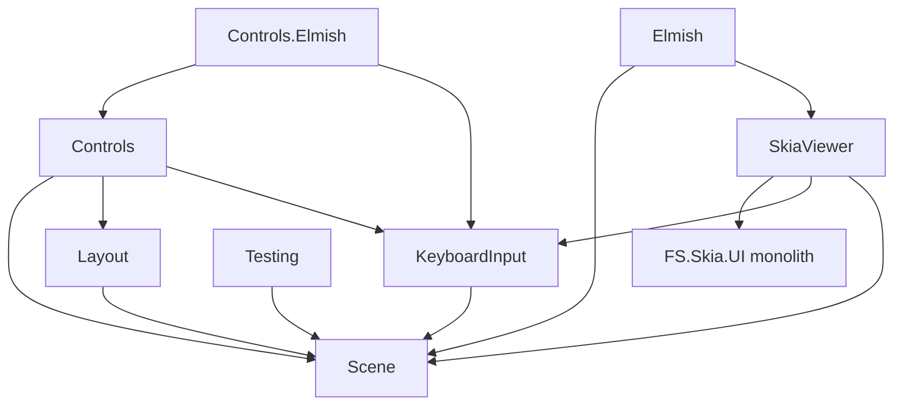

# V3 Monolith-Retirement — Stage 0 before-baseline

**Programme**: V3 modular distribution
(`docs/reports/2026-06-02-v3-modular-distribution-implementation-plan.md`, Stage 0).
**Feature**: `048-v3-retirement-baseline`. **Captured**: 2026-06-02.

This is a **SHA-pinned, reproducible** snapshot of the monolith's state before the
retirement moves. Every headline metric names the exact command that reproduces it
(SC-001). Stage 0 changes **no runtime code** (FR-010/SC-007).

## 1. Pin

- Baseline SHA: **`031e56072779c736adf6dd8b0345e17b58a62e73`**
  ```bash
  git rev-parse HEAD
  ```

## 2. Monolith LOC (per file)

The retiring monolith is `src/Lib` (`PackageId = FS.Skia.UI`). Per-file line counts:

```bash
wc -l src/Lib/Library.fs src/Lib/KeyboardInput.fs src/Lib/AgentValidation.fs \
      src/Lib/VulkanStartup.fs src/Lib/VulkanResources.fs src/Lib/InternalsVisibleTo.fs \
      src/Lib/*.fsi
```

| File | Lines |
|------|------:|
| `src/Lib/Library.fs` | 2408 |
| `src/Lib/KeyboardInput.fs` | 1398 |
| `src/Lib/AgentValidation.fs` | 835 |
| `src/Lib/VulkanStartup.fs` | 119 |
| `src/Lib/VulkanResources.fs` | 92 |
| `src/Lib/InternalsVisibleTo.fs` | 6 |
| `src/Lib/Library.fsi` | 552 |
| `src/Lib/KeyboardInput.fsi` | 450 |
| `src/Lib/AgentValidation.fsi` | 261 |
| `src/Lib/VulkanResources.fsi` | 64 |
| `src/Lib/VulkanStartup.fsi` | 29 |
| **Total** | **6214** |

The monolith bundles the Vulkan/Skia host (`VulkanStartup`/`VulkanResources`), the scene
vocabulary + viewer (`Library`), the keyboard input runtime (`KeyboardInput`), and the
agent-validation surface (`AgentValidation`) — each of which the split packages now own
or will own (see ADRs 0007–0011).

## 3. Runtime dependency graph

```bash
for f in src/*/*.fsproj; do echo "$f"; dotnet list "$f" reference; done
```

```
Scene            → (none)                                   # foundation vocabulary
Layout           → Scene
KeyboardInput    → Scene
Testing          → Scene
Controls         → Scene, Layout, KeyboardInput
Controls.Elmish  → Controls, KeyboardInput
SkiaViewer       → Lib (FS.Skia.UI monolith), KeyboardInput, Scene   ← LEAK (§5)
Elmish           → Scene, SkiaViewer                        # transitively pulls the monolith
Lib (monolith)   → (no project refs; bundles everything via NuGet packages)
```



## 4. Duplicate-type inventory

The scene vocabulary is defined in **both** the split `src/Scene/Scene.fsi` and the
monolith `src/Lib/Library.fsi` — the single largest source of the retirement's risk
(ADR 0008). Types defined in both:

```bash
comm -12 <(grep -oE '^type [A-Za-z0-9]+' src/Scene/Scene.fsi | sort -u) \
         <(grep -oE '^type [A-Za-z0-9]+' src/Lib/Library.fsi | sort -u)
```

**Count: 34.** `BlendMode`, `Clip`, `Color`, `ColorFilter`, `ColorSpace`,
`DiagnosticSeverity`, `DiagnosticStage`, `FontSpec`, `ImageFilter`, `MaskFilter`,
`Paint`, `PathCommand`, `PathEffect`, `PathFillType`, `PathMeasure`, `PathOperation`,
`PathSpec`, `PerspectiveTransform`, `Point`, `Rect`, `Region`, `RegionOperation`,
`RenderDiagnostic`, `RenderReadbackEvidence`, `SceneElementKind`, `Shader`, `Size`,
`Stroke`, `StrokeCap`, `StrokeJoin`, `TextMetrics`, `TextRun`, `Vertex`, `VertexMode`.

In addition, the monolith exposes `Scene`, `Picture`, `Colors`/`Paint`/`Path`/`Scene`
modules (opaque `Scene` in the monolith vs the structured `Scene = { Nodes: SceneNode
list }` in the split package), and a duplicate `SceneNode` is the structural heart of the
duplication. The host bridges the two via `src/SkiaViewer/SceneConversion.fs`.

## 5. Leak proof (FR-002 / SC-002)

A split package — `FS.Skia.UI.SkiaViewer` — **project-references the monolith**, so a
generated default `app` that consumes `SkiaViewer` (or `Elmish`) transitively resolves
`FS.Skia.UI`.

```bash
grep -n "Lib/Lib.fsproj\|SceneConversion" src/SkiaViewer/SkiaViewer.fsproj
dotnet list src/SkiaViewer/SkiaViewer.fsproj reference
dotnet list src/Elmish/Elmish.fsproj reference
```

- `src/SkiaViewer/SkiaViewer.fsproj` line 21: `<ProjectReference Include="..\Lib\Lib.fsproj" />`
  and line 15: `<Compile Include="SceneConversion.fs" />`.
- `dotnet list src/SkiaViewer/SkiaViewer.fsproj reference` →
  `../Lib/Lib.fsproj`, `../KeyboardInput/KeyboardInput.fsproj`, `../Scene/Scene.fsproj`.
- `dotnet list src/Elmish/Elmish.fsproj reference` → `../Scene/Scene.fsproj`,
  `../SkiaViewer/SkiaViewer.fsproj` — so `Elmish → SkiaViewer → Lib` pulls the monolith too.

**Conclusion:** the host (`SkiaViewer`) still lives inside the monolith via the
`Lib.fsproj` reference + `SceneConversion.fs` shim. Retiring the monolith requires moving
the Vulkan/Skia host ownership into `SkiaViewer` (ADR 0007) and deleting the duplicate
scene vocabulary + the `SceneConversion` shim (ADR 0008).

## 6. Consumer inventory (FR-003) — the retirement work-list

```bash
grep -rlE 'Lib[/\\]Lib\.fsproj|PackageReference Include="FS\.Skia\.UI"' \
     --include=*.fsproj samples tests src
```

### Runtime package
- `src/SkiaViewer` — `ProjectReference` to `Lib` + `SceneConversion.fs` (§5).

### Samples (12 at the pin; classified monolith-consumer vs split-package-only)
```bash
for f in samples/*/*.fsproj; do
  grep -qE 'Lib\.fsproj|FS\.Skia\.UI"' "$f" && echo "MONOLITH  $f" || echo "split     $f"; done
```
- **Monolith consumers (6):** `BasicViewer`, `DemoReel`, `EffectsGallery`,
  `InteractiveViewer`, `ParityGallery`, `ScreenshotGallery`.
- **Split-package-only (confirmed at capture):** `ChartsGallery`, `ControlsGallery`,
  `DataGridGallery`, `KeyboardInputGallery`, `LayoutGraphGallery` (and the non-gallery
  `KeyboardInput` sample). These already consume only split packages and need no repoint.

### Test projects (monolith consumers)
- `tests/Lib.Tests`, `tests/Smoke.Tests`, `tests/Package.Tests`, `tests/Parity.Tests`,
  `tests/Governance.Tests` all reference the monolith `Lib`. `Lib.Tests`/`Smoke.Tests`/
  `Parity.Tests` exercise the monolith directly; `Package.Tests` and `Governance.Tests`
  reference it for surface/agent-validation coverage (`AgentValidationFrameworkTests.fs`).

### Governance build front-end
- `build/Governance/Front/Support.fs` **no longer consumes** the monolith's
  `FS.Skia.UI.AgentValidation` — the governance library already owns `CapabilityRow`
  (`Capabilities`) and `ValidationFinding` (`Findings`). The `AgentValidation` **surface
  still lives in the monolith** (`src/Lib/AgentValidation.fs(i)`, 835+261 LOC) and its
  remaining consumer is `tests/Governance.Tests/AgentValidationFrameworkTests.fs`; ADR
  0009 relocates that surface into `FS.Skia.UI.Build` in programme Stage 2.
  ```bash
  grep -rln "AgentValidation" build tests --include=*.fs | grep -v obj/
  ```

## 7. Parity oracle (FR-004/005)

- **Authoritative** deterministic scene-output goldens for `basic-viewer`,
  `effects-gallery`, `screenshot-gallery`:
  `tests/Parity.Tests/fixtures/v3-host-golden/scene-output/<seed>.txt`. Re-derive
  byte-identically (SC-003):
  ```bash
  dotnet test tests/Parity.Tests/Parity.Tests.fsproj --filter "FullyQualifiedName~scene-output"
  ```
- **Corroboration** reference frame: `screenshots/basic-viewer.png` (real Vulkan capture).
- Capture environment: `tests/Parity.Tests/fixtures/v3-host-golden/capture-environment.md`.

## 8. Per-package surface baselines (FR-006)

Eight captured baselines under `readiness/per-package-surface/<PackageId>.fsi.txt`, diffed
at zero drift by the additive `PerPackageSurfaceDiff` target (SC-004):
```bash
./fake.sh build -t PerPackageSurfaceDiff
```

## 9. Decision records

The retirement's shape is locked in ADRs **0007–0011** (`docs/adr/`), cross-linked from
the programme implementation plan (§ ADR links).
