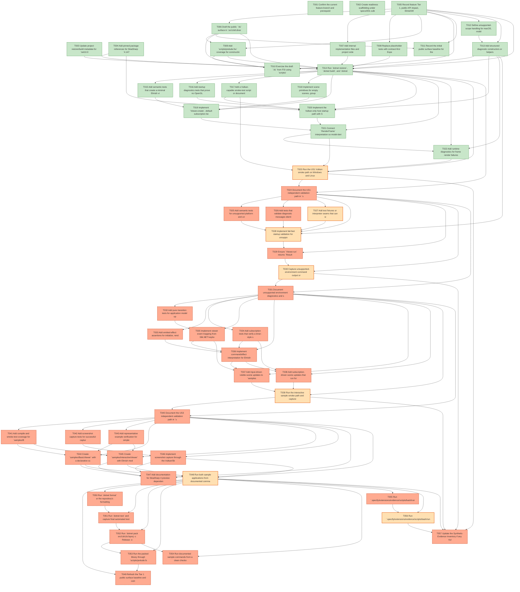

# Task Graph — 001-vulkan-elmish-viewer

## ✓ Graph is acyclic and consistent

## Status counts (effective)

| Status | Count |
|--------|-------|
| [X] done | 22 |
| [S] synthetic | 7 |
| [S*] auto-synthetic | 28 |

## Graph



## ASCII view

```
T001 [X] Confirm the current feature branch and prerequisites with `.specify/scripts/bash/check-prerequisites.sh --json --require-plan`
T002 [X] Create readiness scaffolding under `specs/001-vulkan-elmish-viewer/readiness/` for FSI transcripts, smoke logs, screenshots, package output notes, and Vulkan diagnostics
T003 [X] Update project restore/build metadata for `net10.0`, `LangVersion=latest`, package identity, and packable library defaults in `Directory.Build.props` and `src/Lib/Lib.fsproj`
T004 [X] Add pinned package references for SkiaSharp `4.147.0-preview.2.1`, Windows/Linux native assets, Fable.Elmish `4.2.0`, and Silk.NET Windowing/Input/Vulkan `2.23.0`
T005 [X] Record feature Tier 1, public API impact, Elmish/MVU applicability, Vulkan-only scope, supported OS scope, and required real-evidence obligations in `specs/001-vulkan-elmish-viewer/readiness/evidence-obligations.md`
T006 [X] Draft the public `.fsi` surface in `src/Lib/Library.fsi` for `Size`, `Color`, `ViewerConfiguration`, diagnostics, `ViewerEvent`, `Scene`, screenshot types, `ViewerEffect<'msg>`, `ViewerProgram<'model,'msg>`, `Scene`, and `Viewer` modules
T007 [X] Add internal implementation files and project ordering for scene data, diagnostics, Elmish program construction, Vulkan host/interpreter boundaries, and screenshot handling
T008 [X] Replace placeholder tests with contract-first Expecto suites for public surface construction, configuration validation, pure update behavior, emitted effects, and diagnostic values
T009 [X] Add `scripts/prelude.fsx` coverage for constructing a configuration, scene, minimal program, subscription stub, and screenshot request through the public API
T010 [X] Exercise the draft `.fsi` from FSI using `scripts/prelude.fsx` and capture the transcript to `specs/001-vulkan-elmish-viewer/readiness/fsi-session.txt`
T011 [X] Record the initial public surface baseline for the library API in `specs/001-vulkan-elmish-viewer/readiness/public-surface.txt`
T012 [X] Define unsupported-scope handling for macOS, mobile, browser, headless presentation, non-Vulkan renderer attempts, and non-Elmish integration attempts
T013 [X] Add structured diagnostic constructors or helpers for platform checks, Vulkan instance/device/surface/swapchain failures, Skia context failures, frame errors, screenshot errors, and shutdown errors
T014 [X] Run `dotnet restore`, `dotnet build`, and `dotnet test`; capture command summaries in `specs/001-vulkan-elmish-viewer/readiness/foundation-commands.txt`
T015 [X] Add semantic tests that create a minimal Elmish viewer program, assert `view` produces a scene, and assert render effects are requested without renderer selection
T016 [X] Add startup diagnostics tests that prove no OpenGL, CPU, software, or fallback renderer option is exposed by public configuration or program creation
T017 [X] Add a Vulkan-capable smoke-test script or documented command that records first-frame timing, renderer path, and absence of fallback usage to readiness logs
T018 [X] Implement scene primitives for empty scenes, groups, rectangles, text, images, charts, and stable composition data
T019 [X] Implement `Viewer.create`, default subscription behavior, and program validation while keeping `init`, `update`, and `view` pure at the public boundary
T020 [X] Implement the Vulkan-only host startup path with Silk.NET window creation, Vulkan instance/device/surface/swapchain setup, and Skia GPU context ownership
T021 [X] Connect `RenderFrame` interpretation so model-derived scenes render into the active Vulkan/Skia frame without window recreation
T022 [X] Add runtime diagnostics for frame render failures and prove errors are reported without switching renderer path
T023 [S] Run the US1 Vulkan smoke path on Windows and Linux supported workstations, capture first-frame timing and renderer evidence for each OS, and store results in `specs/001-vulkan-elmish-viewer/readiness/us1-vulkan-smoke.txt`   ← root cause
T024 [S*] Document the US1 independent validation path in `specs/001-vulkan-elmish-viewer/quickstart.md`   ← auto-synthetic
    └── T023 [S] Run the US1 Vulkan smoke path on Windows and Linux supported workstations, capture first-frame timing and renderer evidence for each OS, and store results in `specs/001-vulkan-elmish-viewer/readiness/us1-vulkan-smoke.txt`
T025 [S*] Add semantic tests for unsupported platform and unavailable Vulkan capability diagnostics before window display   ← auto-synthetic
    └── T024 [S*] Document the US1 independent validation path in `specs/001-vulkan-elmish-viewer/quickstart.md`
T026 [S*] Add tests that validate diagnostic messages identify Vulkan availability or initialization and never mention fallback rendering   ← auto-synthetic
    └── T024 [S*] Document the US1 independent validation path in `specs/001-vulkan-elmish-viewer/quickstart.md`
T027 [S] Add test fixtures or interpreter seams that can simulate missing Vulkan instance, device, surface, and swapchain capabilities without invoking real GPU resources   ← root cause
T028 [S] Implement fail-fast startup validation for unsupported OS, headless surface absence, Vulkan instance failure, device selection failure, surface failure, swapchain failure, and Skia context failure   ← root cause
T029 [S*] Ensure `Viewer.run` returns `Result<unit, RenderDiagnostic>` for startup failures before rendering begins   ← auto-synthetic
    └── T024 [S*] Document the US1 independent validation path in `specs/001-vulkan-elmish-viewer/quickstart.md`
    └── T028 [S] Implement fail-fast startup validation for unsupported OS, headless surface absence, Vulkan instance failure, device selection failure, surface failure, swapchain failure, and Skia context failure
T030 [S] Capture unsupported-environment command output or controlled fixture evidence in `specs/001-vulkan-elmish-viewer/readiness/us2-vulkan-unavailable.txt`   ← root cause
T031 [S*] Document unsupported environment diagnostics and supported OS/Vulkan requirements in `README.md` and `specs/001-vulkan-elmish-viewer/quickstart.md`   ← auto-synthetic
    └── T024 [S*] Document the US1 independent validation path in `specs/001-vulkan-elmish-viewer/quickstart.md`
    └── T030 [S] Capture unsupported-environment command output or controlled fixture evidence in `specs/001-vulkan-elmish-viewer/readiness/us2-vulkan-unavailable.txt`
T032 [S*] Add pure transition tests for application model updates from keyboard, pointer, resize, close, lifecycle, diagnostic, frame, screenshot, and subscription messages   ← auto-synthetic
    └── T031 [S*] Document unsupported environment diagnostics and supported OS/Vulkan requirements in `README.md` and `specs/001-vulkan-elmish-viewer/quickstart.md`
T033 [S*] Add emitted-effect assertions for initialize, render frame, capture screenshot, shutdown, diagnostic reporting, and dispatch effects   ← auto-synthetic
    └── T031 [S*] Document unsupported environment diagnostics and supported OS/Vulkan requirements in `README.md` and `specs/001-vulkan-elmish-viewer/quickstart.md`
T034 [S*] Add subscription tests that verify a timer-style subscription dispatches messages without direct mutable scene pushes   ← auto-synthetic
    └── T031 [S*] Document unsupported environment diagnostics and supported OS/Vulkan requirements in `README.md` and `specs/001-vulkan-elmish-viewer/quickstart.md`
T035 [S*] Implement viewer event mapping from Silk.NET keyboard, pointer, resize, close, lifecycle, and diagnostic callbacks to Elmish messages   ← auto-synthetic
    └── T031 [S*] Document unsupported environment diagnostics and supported OS/Vulkan requirements in `README.md` and `specs/001-vulkan-elmish-viewer/quickstart.md`
    └── T032 [S*] Add pure transition tests for application model updates from keyboard, pointer, resize, close, lifecycle, diagnostic, frame, screenshot, and subscription messages
T036 [S*] Implement command/effect interpretation for Elmish dispatch, subscriptions, render scheduling, screenshot requests, and shutdown disposal   ← auto-synthetic
    └── T031 [S*] Document unsupported environment diagnostics and supported OS/Vulkan requirements in `README.md` and `specs/001-vulkan-elmish-viewer/quickstart.md`
    └── T033 [S*] Add emitted-effect assertions for initialize, render frame, capture screenshot, shutdown, diagnostic reporting, and dispatch effects
    └── T034 [S*] Add subscription tests that verify a timer-style subscription dispatches messages without direct mutable scene pushes
    └── T035 [S*] Implement viewer event mapping from Silk.NET keyboard, pointer, resize, close, lifecycle, and diagnostic callbacks to Elmish messages
T037 [S*] Add input-driven visible scene updates to `samples/InteractiveViewer/Program.fs`   ← auto-synthetic
    └── T031 [S*] Document unsupported environment diagnostics and supported OS/Vulkan requirements in `README.md` and `specs/001-vulkan-elmish-viewer/quickstart.md`
    └── T035 [S*] Implement viewer event mapping from Silk.NET keyboard, pointer, resize, close, lifecycle, and diagnostic callbacks to Elmish messages
    └── T036 [S*] Implement command/effect interpretation for Elmish dispatch, subscriptions, render scheduling, screenshot requests, and shutdown disposal
T038 [S*] Add subscription-driven scene updates that run for at least 60 seconds in `samples/InteractiveViewer/Program.fs`   ← auto-synthetic
    └── T031 [S*] Document unsupported environment diagnostics and supported OS/Vulkan requirements in `README.md` and `specs/001-vulkan-elmish-viewer/quickstart.md`
    └── T034 [S*] Add subscription tests that verify a timer-style subscription dispatches messages without direct mutable scene pushes
    └── T036 [S*] Implement command/effect interpretation for Elmish dispatch, subscriptions, render scheduling, screenshot requests, and shutdown disposal
T039 [S] Run the interactive sample smoke path and capture input latency plus 60-second subscription evidence in `specs/001-vulkan-elmish-viewer/readiness/us3-interactive-smoke.txt`   ← root cause
T040 [S*] Document the US3 independent validation path in `specs/001-vulkan-elmish-viewer/quickstart.md`   ← auto-synthetic
    └── T031 [S*] Document unsupported environment diagnostics and supported OS/Vulkan requirements in `README.md` and `specs/001-vulkan-elmish-viewer/quickstart.md`
    └── T039 [S] Run the interactive sample smoke path and capture input latency plus 60-second subscription evidence in `specs/001-vulkan-elmish-viewer/readiness/us3-interactive-smoke.txt`
T041 [S*] Add compile and smoke-test coverage for `samples/BasicViewer` and `samples/InteractiveViewer` consuming only the packed public API   ← auto-synthetic
    └── T040 [S*] Document the US3 independent validation path in `specs/001-vulkan-elmish-viewer/quickstart.md`
T042 [S*] Add screenshot capture tests for successful capture after first frame and diagnostic capture before first successful frame   ← auto-synthetic
    └── T040 [S*] Document the US3 independent validation path in `specs/001-vulkan-elmish-viewer/quickstart.md`
T043 [S*] Add representative example verification for simple scene rendering, input handling, state update, layout or chart composition, and screenshot capture   ← auto-synthetic
    └── T040 [S*] Document the US3 independent validation path in `specs/001-vulkan-elmish-viewer/quickstart.md`
T044 [S*] Create `samples/BasicViewer` with a declarative scene containing shapes, text, image usage, layout composition, chart data, and screenshot command coverage   ← auto-synthetic
    └── T040 [S*] Document the US3 independent validation path in `specs/001-vulkan-elmish-viewer/quickstart.md`
    └── T041 [S*] Add compile and smoke-test coverage for `samples/BasicViewer` and `samples/InteractiveViewer` consuming only the packed public API
    └── T043 [S*] Add representative example verification for simple scene rendering, input handling, state update, layout or chart composition, and screenshot capture
T045 [S*] Create `samples/InteractiveViewer` with Elmish model, messages, update, view, input handling, subscriptions, diagnostics, and screenshot capture   ← auto-synthetic
    └── T040 [S*] Document the US3 independent validation path in `specs/001-vulkan-elmish-viewer/quickstart.md`
    └── T041 [S*] Add compile and smoke-test coverage for `samples/BasicViewer` and `samples/InteractiveViewer` consuming only the packed public API
    └── T043 [S*] Add representative example verification for simple scene rendering, input handling, state update, layout or chart composition, and screenshot capture
T046 [S*] Implement screenshot capture through the Vulkan/Skia frame path with PNG and JPEG output plus diagnostics for missing frame or write failure   ← auto-synthetic
    └── T040 [S*] Document the US3 independent validation path in `specs/001-vulkan-elmish-viewer/quickstart.md`
    └── T042 [S*] Add screenshot capture tests for successful capture after first frame and diagnostic capture before first successful frame
T047 [S*] Add documentation for SkiaSharp 4 preview dependency behavior, Windows/Linux support, sample commands, package consumption, compatibility impact, and migration guidance stating this is a first-version package with no prior public API migration path   ← auto-synthetic
    └── T040 [S*] Document the US3 independent validation path in `specs/001-vulkan-elmish-viewer/quickstart.md`
    └── T044 [S*] Create `samples/BasicViewer` with a declarative scene containing shapes, text, image usage, layout composition, chart data, and screenshot command coverage
    └── T045 [S*] Create `samples/InteractiveViewer` with Elmish model, messages, update, view, input handling, subscriptions, diagnostics, and screenshot capture
    └── T046 [S*] Implement screenshot capture through the Vulkan/Skia frame path with PNG and JPEG output plus diagnostics for missing frame or write failure
T048 [S] Run both sample applications from documented commands on Windows and Linux where available, capture smoke logs plus any screenshot artifacts under `specs/001-vulkan-elmish-viewer/readiness/`, and disclose missing platform evidence as synthetic if one OS cannot be exercised   ← root cause
T049 [S*] Refresh the Tier 1 public surface baseline and compare it against `contracts/public-api.md`   ← auto-synthetic
    └── T048 [S] Run both sample applications from documented commands on Windows and Linux where available, capture smoke logs plus any screenshot artifacts under `specs/001-vulkan-elmish-viewer/readiness/`, and disclose missing platform evidence as synthetic if one OS cannot be exercised
    └── T053 [S*] Run the packed library through `scripts/prelude.fsx` or an FSI session and capture final consumer evidence
T050 [S*] Run `dotnet format` or the repository's formatting command and fix only feature-owned formatting issues   ← auto-synthetic
    └── T048 [S] Run both sample applications from documented commands on Windows and Linux where available, capture smoke logs plus any screenshot artifacts under `specs/001-vulkan-elmish-viewer/readiness/`, and disclose missing platform evidence as synthetic if one OS cannot be exercised
T051 [S*] Run `dotnet test` and capture final automated test output in `specs/001-vulkan-elmish-viewer/readiness/final-test.txt`   ← auto-synthetic
    └── T048 [S] Run both sample applications from documented commands on Windows and Linux where available, capture smoke logs plus any screenshot artifacts under `specs/001-vulkan-elmish-viewer/readiness/`, and disclose missing platform evidence as synthetic if one OS cannot be exercised
    └── T050 [S*] Run `dotnet format` or the repository's formatting command and fix only feature-owned formatting issues
T052 [S*] Run `dotnet pack src/Lib/Lib.fsproj -c Release -o ~/.local/share/nuget-local/` and capture package output plus package artifact notes under `specs/001-vulkan-elmish-viewer/readiness/package/`   ← auto-synthetic
    └── T048 [S] Run both sample applications from documented commands on Windows and Linux where available, capture smoke logs plus any screenshot artifacts under `specs/001-vulkan-elmish-viewer/readiness/`, and disclose missing platform evidence as synthetic if one OS cannot be exercised
    └── T051 [S*] Run `dotnet test` and capture final automated test output in `specs/001-vulkan-elmish-viewer/readiness/final-test.txt`
T053 [S*] Run the packed library through `scripts/prelude.fsx` or an FSI session and capture final consumer evidence   ← auto-synthetic
    └── T048 [S] Run both sample applications from documented commands on Windows and Linux where available, capture smoke logs plus any screenshot artifacts under `specs/001-vulkan-elmish-viewer/readiness/`, and disclose missing platform evidence as synthetic if one OS cannot be exercised
    └── T052 [S*] Run `dotnet pack src/Lib/Lib.fsproj -c Release -o ~/.local/share/nuget-local/` and capture package output plus package artifact notes under `specs/001-vulkan-elmish-viewer/readiness/package/`
T054 [S*] Run documented sample commands from a clean checkout state or clean restore and capture final sample evidence   ← auto-synthetic
    └── T048 [S] Run both sample applications from documented commands on Windows and Linux where available, capture smoke logs plus any screenshot artifacts under `specs/001-vulkan-elmish-viewer/readiness/`, and disclose missing platform evidence as synthetic if one OS cannot be exercised
    └── T052 [S*] Run `dotnet pack src/Lib/Lib.fsproj -c Release -o ~/.local/share/nuget-local/` and capture package output plus package artifact notes under `specs/001-vulkan-elmish-viewer/readiness/package/`
T055 [S*] Run `.specify/extensions/evidence/scripts/bash/run-audit.sh specs/001-vulkan-elmish-viewer --graph-only` and confirm no cycles, dangling refs, or orphaned tasks   ← auto-synthetic
    └── T048 [S] Run both sample applications from documented commands on Windows and Linux where available, capture smoke logs plus any screenshot artifacts under `specs/001-vulkan-elmish-viewer/readiness/`, and disclose missing platform evidence as synthetic if one OS cannot be exercised
T056 [S] Run `.specify/extensions/evidence/scripts/bash/run-audit.sh specs/001-vulkan-elmish-viewer` and confirm PASS or document every `--accept-synthetic` override   ← root cause
T057 [S*] Update the Synthetic-Evidence Inventory if any Vulkan-capable smoke evidence cannot be collected on real supported hardware   ← auto-synthetic
    └── T023 [S] Run the US1 Vulkan smoke path on Windows and Linux supported workstations, capture first-frame timing and renderer evidence for each OS, and store results in `specs/001-vulkan-elmish-viewer/readiness/us1-vulkan-smoke.txt`
    └── T030 [S] Capture unsupported-environment command output or controlled fixture evidence in `specs/001-vulkan-elmish-viewer/readiness/us2-vulkan-unavailable.txt`
    └── T039 [S] Run the interactive sample smoke path and capture input latency plus 60-second subscription evidence in `specs/001-vulkan-elmish-viewer/readiness/us3-interactive-smoke.txt`
    └── T048 [S] Run both sample applications from documented commands on Windows and Linux where available, capture smoke logs plus any screenshot artifacts under `specs/001-vulkan-elmish-viewer/readiness/`, and disclose missing platform evidence as synthetic if one OS cannot be exercised
    └── T056 [S] Run `.specify/extensions/evidence/scripts/bash/run-audit.sh specs/001-vulkan-elmish-viewer` and confirm PASS or document every `--accept-synthetic` override
```

## Propagation report

The following tasks are marked `[S*]` because at least one of their dependencies is synthetic-only. Clearing the upstream `[S]` tasks (real evidence) will automatically clear these.

- **T024** ([S*]) ← T023
- **T025** ([S*]) ← T024
- **T026** ([S*]) ← T024
- **T029** ([S*]) ← T024, T028
- **T031** ([S*]) ← T024, T030
- **T032** ([S*]) ← T031
- **T033** ([S*]) ← T031
- **T034** ([S*]) ← T031
- **T035** ([S*]) ← T031, T032
- **T036** ([S*]) ← T031, T033, T034, T035
- **T037** ([S*]) ← T031, T035, T036
- **T038** ([S*]) ← T031, T034, T036
- **T040** ([S*]) ← T031, T039
- **T041** ([S*]) ← T040
- **T042** ([S*]) ← T040
- **T043** ([S*]) ← T040
- **T044** ([S*]) ← T040, T041, T043
- **T045** ([S*]) ← T040, T041, T043
- **T046** ([S*]) ← T040, T042
- **T047** ([S*]) ← T040, T044, T045, T046
- **T049** ([S*]) ← T048, T053
- **T050** ([S*]) ← T048
- **T051** ([S*]) ← T048, T050
- **T052** ([S*]) ← T048, T051
- **T053** ([S*]) ← T048, T052
- **T054** ([S*]) ← T048, T052
- **T055** ([S*]) ← T048
- **T057** ([S*]) ← T023, T030, T039, T048, T056

