# Task Graph — 002-skia-feature-parity

## ✓ Graph is acyclic and consistent

## Status counts (effective)

| Status | Count |
|--------|-------|
| [X] done | 15 |
| [S] synthetic | 2 |
| [S*] auto-synthetic | 67 |

## Graph

```mermaid
graph TD
  T001["T001 Confirm the pinned upstream baseline commit and re"]:::done
  T002["T002 Create feature readiness scaffolding under `readin"]:::done
  T003["T003 Add the local NuGet output, sample, and evidence c"]:::done
  T004["T004 Record feature Tier 1 obligations: public API impa"]:::done
  T005["T005 Capture current repository surface and sample/test"]:::done
  T006["T006 Draft `src/Lib` public `.fsi` contracts for scene,"]:::done
  T007["T007 Scaffold `src/Charts` and `src/Layout` packable pr"]:::done
  T008["T008 Draft `src/Charts` public `.fsi` contracts for sha"]:::done
  T009["T009 Draft `src/Layout` public `.fsi` contracts for lay"]:::done
  T010["T010 Create test projects `Charts.Tests`, `Layout.Tests"]:::done
  T011["T011 Create or update FSI prelude scripts for core, cha"]:::done
  T012["T012 Add surface-area baseline generation and compariso"]:::done
  T013["T013 Add shared deterministic rendering fixtures, scree"]:::done
  T014["T014 Add diagnostics test fixtures for unsupported Vulk"]:::synthetic
  T015["T015 Exercise the draft `.fsi` surface from FSI and cap"]:::done
  T016["T016 Document unsupported-scope handling for fallback r"]:::done
  T017["T017 Run foundation verification (`dotnet restore`, `do"]:::autoSynthetic
  T018["T018 Add packed-library/prelude semantic tests for prim"]:::autoSynthetic
  T019["T019 Add semantic tests for paint defaults and options:"]:::autoSynthetic
  T020["T020 Add semantic tests for shader, color filter, mask "]:::autoSynthetic
  T021["T021 Add semantic tests for path commands, fill types, "]:::autoSynthetic
  T022["T022 Add screenshot or render-readback verification for"]:::autoSynthetic
  T023["T023 Implement immutable scene, element, bounds, color,"]:::autoSynthetic
  T024["T024 Implement paint, blend mode, stroke, shader, color"]:::autoSynthetic
  T025["T025 Implement path, clipping, region, text, font, text"]:::autoSynthetic
  T026["T026 Implement Skia translation/rendering for primitive"]:::autoSynthetic
  T027["T027 Implement Skia translation/rendering for paint opt"]:::autoSynthetic
  T028["T028 Add diagnostics for invalid resources, unavailable"]:::autoSynthetic
  T029["T029 Build `samples/ParityGallery` and `samples/Effects"]:::autoSynthetic
  T030["T030 Document the US1 independent validation path and r"]:::autoSynthetic
  T031["T031 Add packed-library/prelude tests for chart props, "]:::autoSynthetic
  T032["T032 Add semantic and scale tests for line, bar, pie/do"]:::autoSynthetic
  T033["T033 Add semantic and scale tests for DataGrid columns,"]:::autoSynthetic
  T034["T034 Add composition tests proving charts and DataGrid "]:::autoSynthetic
  T035["T035 Implement shared chart/DataGrid types, defaults, p"]:::autoSynthetic
  T036["T036 Implement chart scaling, invalid-value filtering, "]:::autoSynthetic
  T037["T037 Implement line, bar, pie/donut, scatter, area, his"]:::autoSynthetic
  T038["T038 Implement DataGrid builder, visible-row calculatio"]:::autoSynthetic
  T039["T039 Build `samples/ChartsGallery` and `samples/DataGri"]:::autoSynthetic
  T040["T040 Document US2 validation and capture chart/DataGrid"]:::autoSynthetic
  T041["T041 Add packed-library/prelude tests for layout props,"]:::autoSynthetic
  T042["T042 Add layout resize tests for nested layouts with at"]:::autoSynthetic
  T043["T043 Add graph validation tests for cycles, duplicate i"]:::autoSynthetic
  T044["T044 Add graph layout/render tests for a 100-node DAG w"]:::autoSynthetic
  T045["T045 Implement layout shared types, sizing, measurement"]:::autoSynthetic
  T046["T046 Implement horizontal stack, vertical stack, and do"]:::autoSynthetic
  T047["T047 Implement graph shared types, style records, valid"]:::autoSynthetic
  T048["T048 Implement DAG layering and undirected weighted gra"]:::autoSynthetic
  T049["T049 Implement directed and undirected graph scene buil"]:::autoSynthetic
  T050["T050 Build `samples/LayoutGraphGallery` with nested lay"]:::autoSynthetic
  T051["T051 Document US3 validation and capture layout/graph F"]:::autoSynthetic
  T052["T052 Add `.fsi` contract tests for `ViewerProgram`, `Vi"]:::autoSynthetic
  T053["T053 Add pure Elmish transition tests for keyboard, poi"]:::autoSynthetic
  T054["T054 Add emitted-effect assertion tests for initialize "]:::autoSynthetic
  T055["T055 Add real interpreter evidence tests where safe for"]:::autoSynthetic
  T056["T056 Extend viewer contracts and implementation for key"]:::autoSynthetic
  T057["T057 Implement screenshot capture as Elmish edge effect"]:::autoSynthetic
  T058["T058 Implement Vulkan-only startup capability checks an"]:::autoSynthetic
  T059["T059 Implement frame-level recovery flow that reports r"]:::autoSynthetic
  T060["T060 Implement thread-safe lifecycle shutdown and dispo"]:::autoSynthetic
  T061["T061 Build or update `samples/InteractiveViewer` and `s"]:::autoSynthetic
  T062["T062 Document US4 validation and capture MVU transition"]:::autoSynthetic
  T063["T063 Add parity evidence report tests requiring one ite"]:::autoSynthetic
  T064["T064 Add clean-checkout package tests proving `FS.Skia."]:::autoSynthetic
  T065["T065 Add sample smoke tests for BasicViewer, Interactiv"]:::autoSynthetic
  T066["T066 Add documentation checks for the parity matrix, Vu"]:::autoSynthetic
  T067["T067 Implement `FS.Skia.UI.Parity` report types, serial"]:::autoSynthetic
  T068["T068 Implement `scripts/parity-evidence.fsx` to generat"]:::autoSynthetic
  T069["T069 Add package metadata, project references, versioni"]:::autoSynthetic
  T070["T070 Build `samples/DemoReel` and refresh BasicViewer t"]:::autoSynthetic
  T071["T071 Write consumer documentation and parity matrix map"]:::autoSynthetic
  T072["T072 Run all documented sample and quickstart commands "]:::autoSynthetic
  T073["T073 Generate the final parity evidence report and conf"]:::autoSynthetic
  T074["T074 Refresh public surface-area baselines for Tier 1 m"]:::autoSynthetic
  T075["T075 Run `dotnet restore`, `dotnet build`, `dotnet test"]:::autoSynthetic
  T076["T076 Run visual/screenshot verification across determin"]:::autoSynthetic
  T077["T077 Run Windows and Linux smoke evidence where availab"]:::synthetic
  T078["T078 Run `speckit.evidence.graph` and confirm no cycles"]:::autoSynthetic
  T079["T079 Run `speckit.evidence.audit` and confirm PASS, or "]:::autoSynthetic
  T080["T080 Update quickstart, docs, package notes, and sample"]:::autoSynthetic
  T081["T081 Final readiness review: verify the hard parity gat"]:::autoSynthetic
  T082["T082 Prepare merge summary with test commands, evidence"]:::autoSynthetic
  T083["T083 Capture first visible frame timing evidence for Ba"]:::autoSynthetic
  T084["T084 Write public API compatibility notes and migration"]:::autoSynthetic
  T005 --> T006
  T005 --> T007
  T007 --> T008
  T005 --> T008
  T007 --> T009
  T005 --> T009
  T005 --> T010
  T005 --> T011
  T006 --> T012
  T008 --> T012
  T009 --> T012
  T005 --> T012
  T005 --> T013
  T005 --> T014
  T006 --> T015
  T008 --> T015
  T009 --> T015
  T011 --> T015
  T005 --> T015
  T001 --> T016
  T004 --> T016
  T005 --> T016
  T012 --> T017
  T013 --> T017
  T014 --> T017
  T015 --> T017
  T016 --> T017
  T005 --> T017
  T017 --> T018
  T017 --> T019
  T017 --> T020
  T017 --> T021
  T017 --> T022
  T018 --> T023
  T017 --> T023
  T019 --> T024
  T017 --> T024
  T020 --> T025
  T021 --> T025
  T017 --> T025
  T018 --> T026
  T023 --> T026
  T017 --> T026
  T019 --> T027
  T020 --> T027
  T021 --> T027
  T024 --> T027
  T025 --> T027
  T026 --> T027
  T017 --> T027
  T020 --> T028
  T024 --> T028
  T025 --> T028
  T027 --> T028
  T017 --> T028
  T022 --> T029
  T026 --> T029
  T027 --> T029
  T028 --> T029
  T017 --> T029
  T022 --> T030
  T029 --> T030
  T017 --> T030
  T030 --> T031
  T030 --> T032
  T030 --> T033
  T030 --> T034
  T031 --> T035
  T030 --> T035
  T031 --> T036
  T032 --> T036
  T030 --> T036
  T032 --> T037
  T035 --> T037
  T036 --> T037
  T030 --> T037
  T033 --> T038
  T035 --> T038
  T030 --> T038
  T034 --> T039
  T037 --> T039
  T038 --> T039
  T030 --> T039
  T032 --> T040
  T033 --> T040
  T039 --> T040
  T030 --> T040
  T040 --> T041
  T040 --> T042
  T040 --> T043
  T040 --> T044
  T041 --> T045
  T042 --> T045
  T040 --> T045
  T041 --> T046
  T042 --> T046
  T045 --> T046
  T040 --> T046
  T043 --> T047
  T040 --> T047
  T043 --> T048
  T044 --> T048
  T047 --> T048
  T040 --> T048
  T043 --> T049
  T044 --> T049
  T047 --> T049
  T048 --> T049
  T040 --> T049
  T042 --> T050
  T046 --> T050
  T049 --> T050
  T040 --> T050
  T042 --> T051
  T044 --> T051
  T050 --> T051
  T040 --> T051
  T051 --> T052
  T051 --> T053
  T051 --> T054
  T051 --> T055
  T052 --> T056
  T053 --> T056
  T051 --> T056
  T052 --> T057
  T054 --> T057
  T055 --> T057
  T051 --> T057
  T052 --> T058
  T055 --> T058
  T051 --> T058
  T053 --> T059
  T054 --> T059
  T055 --> T059
  T056 --> T059
  T058 --> T059
  T051 --> T059
  T053 --> T060
  T054 --> T060
  T055 --> T060
  T056 --> T060
  T051 --> T060
  T056 --> T061
  T057 --> T061
  T058 --> T061
  T059 --> T061
  T060 --> T061
  T051 --> T061
  T053 --> T062
  T054 --> T062
  T055 --> T062
  T061 --> T062
  T051 --> T062
  T062 --> T063
  T062 --> T064
  T062 --> T065
  T062 --> T066
  T063 --> T067
  T062 --> T067
  T063 --> T068
  T067 --> T068
  T062 --> T068
  T064 --> T069
  T062 --> T069
  T065 --> T070
  T062 --> T070
  T066 --> T071
  T067 --> T071
  T062 --> T071
  T064 --> T072
  T065 --> T072
  T069 --> T072
  T070 --> T072
  T071 --> T072
  T062 --> T072
  T063 --> T073
  T068 --> T073
  T071 --> T073
  T072 --> T073
  T062 --> T073
  T006 --> T074
  T008 --> T074
  T009 --> T074
  T012 --> T074
  T073 --> T074
  T017 --> T075
  T030 --> T075
  T040 --> T075
  T051 --> T075
  T062 --> T075
  T073 --> T075
  T074 --> T075
  T022 --> T076
  T030 --> T076
  T040 --> T076
  T051 --> T076
  T075 --> T076
  T073 --> T076
  T055 --> T077
  T061 --> T077
  T072 --> T077
  T075 --> T077
  T073 --> T077
  T073 --> T078
  T073 --> T079
  T075 --> T079
  T076 --> T079
  T077 --> T079
  T078 --> T079
  T083 --> T079
  T084 --> T079
  T071 --> T080
  T075 --> T080
  T073 --> T080
  T073 --> T081
  T079 --> T081
  T080 --> T081
  T083 --> T081
  T084 --> T081
  T079 --> T082
  T081 --> T082
  T073 --> T082
  T065 --> T083
  T070 --> T083
  T075 --> T083
  T073 --> T083
  T069 --> T084
  T071 --> T084
  T080 --> T084
  T073 --> T084
  classDef pending fill:#eeeeee,stroke:#999
  classDef done fill:#c8e6c9,stroke:#2e7d32
  classDef synthetic fill:#ffe0b2,stroke:#e65100,stroke-width:2px
  classDef autoSynthetic fill:#ffab91,stroke:#bf360c,stroke-width:2px,stroke-dasharray:5 3
  classDef failed fill:#ffcdd2,stroke:#b71c1c,stroke-width:2px
  classDef skipped fill:#f5f5f5,stroke:#666,stroke-dasharray:3 3
```



## ASCII view

```
T001 [X] Confirm the pinned upstream baseline commit and record the inspected capability-area inventory in `readiness/baseline-capabilities.md`
T002 [X] Create feature readiness scaffolding under `readiness/` for transcripts, screenshots, parity reports, surface baselines, package logs, and smoke logs
T003 [X] Add the local NuGet output, sample, and evidence command conventions to the feature readiness notes
T004 [X] Record feature Tier 1 obligations: public API impact, required `.fsi` files, Elmish/MVU applicability, Vulkan-only constraint, and real-vs-synthetic evidence rules
T005 [X] Capture current repository surface and sample/test inventory as the starting implementation baseline
T006 [X] Draft `src/Lib` public `.fsi` contracts for scene, paint, shader, filter, path, clipping, text, picture, diagnostics, screenshots, parity reporting, and viewer MVU host APIs
T007 [X] Scaffold `src/Charts` and `src/Layout` packable projects with pinned dependencies and solution entries
T008 [X] Draft `src/Charts` public `.fsi` contracts for shared chart props, every chart module, DataGrid props, pure helpers, and hit-test projections
T009 [X] Draft `src/Layout` public `.fsi` contracts for layout types, stack/dock layout, graph validation, graph layout, graph builders, and hit-test projections
T010 [X] Create test projects `Charts.Tests`, `Layout.Tests`, `Parity.Tests`, `Package.Tests`, and `Smoke.Tests` and add them to the solution
T011 [X] Create or update FSI prelude scripts for core, charts, layout, and parity evidence workflows
T012 [X] Add surface-area baseline generation and comparison tests for all public modules in the three packages
T013 [X] Add shared deterministic rendering fixtures, screenshot tolerance metadata, large-data generators, and sample asset fixtures
T014 [S] Add diagnostics test fixtures for unsupported Vulkan, missing capability, screenshot failure, frame recovery, and shutdown failure scenarios   ← root cause
T015 [X] Exercise the draft `.fsi` surface from FSI and capture `readiness/fsi-session.txt`, including core `init`/`update`/effect paths and pure component construction
T016 [X] Document unsupported-scope handling for fallback renderer and non-Elmish integration baseline behaviors
T017 [S*] Run foundation verification (`dotnet restore`, `dotnet build`, surface baseline tests, and FSI scripts) and store logs under `readiness/`   ← auto-synthetic
    └── T014 [S] Add diagnostics test fixtures for unsupported Vulkan, missing capability, screenshot failure, frame recovery, and shutdown failure scenarios
T018 [S*] Add packed-library/prelude semantic tests for primitive, group, image, arc, point, vertices, picture, and nested scene constructors   ← auto-synthetic
    └── T017 [S*] Run foundation verification (`dotnet restore`, `dotnet build`, surface baseline tests, and FSI scripts) and store logs under `readiness/`
T019 [S*] Add semantic tests for paint defaults and options: fill, stroke, opacity, antialiasing, caps, joins, miter, and blend modes   ← auto-synthetic
    └── T017 [S*] Run foundation verification (`dotnet restore`, `dotnet build`, surface baseline tests, and FSI scripts) and store logs under `readiness/`
T020 [S*] Add semantic tests for shader, color filter, mask filter, image filter, and path effect declarations with unsupported-capability diagnostics   ← auto-synthetic
    └── T017 [S*] Run foundation verification (`dotnet restore`, `dotnet build`, surface baseline tests, and FSI scripts) and store logs under `readiness/`
T021 [S*] Add semantic tests for path commands, fill types, boolean operations, path measurement, segment extraction, and construction helpers   ← auto-synthetic
    └── T017 [S*] Run foundation verification (`dotnet restore`, `dotnet build`, surface baseline tests, and FSI scripts) and store logs under `readiness/`
T022 [S*] Add screenshot or render-readback verification for the drawing parity gallery covering at least 60 visual capabilities   ← auto-synthetic
    └── T017 [S*] Run foundation verification (`dotnet restore`, `dotnet build`, surface baseline tests, and FSI scripts) and store logs under `readiness/`
T023 [S*] Implement immutable scene, element, bounds, color, matrix, metadata, and composition data structures in `FS.Skia.UI`   ← auto-synthetic
    └── T017 [S*] Run foundation verification (`dotnet restore`, `dotnet build`, surface baseline tests, and FSI scripts) and store logs under `readiness/`
    └── T018 [S*] Add packed-library/prelude semantic tests for primitive, group, image, arc, point, vertices, picture, and nested scene constructors
T024 [S*] Implement paint, blend mode, stroke, shader, color filter, mask filter, image filter, and path effect declarations   ← auto-synthetic
    └── T017 [S*] Run foundation verification (`dotnet restore`, `dotnet build`, surface baseline tests, and FSI scripts) and store logs under `readiness/`
    └── T019 [S*] Add semantic tests for paint defaults and options: fill, stroke, opacity, antialiasing, caps, joins, miter, and blend modes
T025 [S*] Implement path, clipping, region, text, font, text-run, picture, color-space, and perspective transform declarations   ← auto-synthetic
    └── T017 [S*] Run foundation verification (`dotnet restore`, `dotnet build`, surface baseline tests, and FSI scripts) and store logs under `readiness/`
    └── T020 [S*] Add semantic tests for shader, color filter, mask filter, image filter, and path effect declarations with unsupported-capability diagnostics
    └── T021 [S*] Add semantic tests for path commands, fill types, boolean operations, path measurement, segment extraction, and construction helpers
T026 [S*] Implement Skia translation/rendering for primitive elements, groups, images, points, vertices, arcs, reusable pictures, and nested scenes   ← auto-synthetic
    └── T017 [S*] Run foundation verification (`dotnet restore`, `dotnet build`, surface baseline tests, and FSI scripts) and store logs under `readiness/`
    └── T018 [S*] Add packed-library/prelude semantic tests for primitive, group, image, arc, point, vertices, picture, and nested scene constructors
    └── T023 [S*] Implement immutable scene, element, bounds, color, matrix, metadata, and composition data structures in `FS.Skia.UI`
T027 [S*] Implement Skia translation/rendering for paint options, blend modes, shaders, filters, path effects, clipping, regions, color handling, and transforms   ← auto-synthetic
    └── T017 [S*] Run foundation verification (`dotnet restore`, `dotnet build`, surface baseline tests, and FSI scripts) and store logs under `readiness/`
    └── T019 [S*] Add semantic tests for paint defaults and options: fill, stroke, opacity, antialiasing, caps, joins, miter, and blend modes
    └── T020 [S*] Add semantic tests for shader, color filter, mask filter, image filter, and path effect declarations with unsupported-capability diagnostics
    └── T021 [S*] Add semantic tests for path commands, fill types, boolean operations, path measurement, segment extraction, and construction helpers
    └── T024 [S*] Implement paint, blend mode, stroke, shader, color filter, mask filter, image filter, and path effect declarations
    └── T025 [S*] Implement path, clipping, region, text, font, text-run, picture, color-space, and perspective transform declarations
    └── T026 [S*] Implement Skia translation/rendering for primitive elements, groups, images, points, vertices, arcs, reusable pictures, and nested scenes
T028 [S*] Add diagnostics for invalid resources, unavailable fonts, unsupported effects, invalid paths, and device-specific rendering capability gaps   ← auto-synthetic
    └── T017 [S*] Run foundation verification (`dotnet restore`, `dotnet build`, surface baseline tests, and FSI scripts) and store logs under `readiness/`
    └── T020 [S*] Add semantic tests for shader, color filter, mask filter, image filter, and path effect declarations with unsupported-capability diagnostics
    └── T024 [S*] Implement paint, blend mode, stroke, shader, color filter, mask filter, image filter, and path effect declarations
    └── T025 [S*] Implement path, clipping, region, text, font, text-run, picture, color-space, and perspective transform declarations
    └── T027 [S*] Implement Skia translation/rendering for paint options, blend modes, shaders, filters, path effects, clipping, regions, color handling, and transforms
T029 [S*] Build `samples/ParityGallery` and `samples/EffectsGallery` with representative drawing, styling, shader, filter, path, text, image, clipping, region, picture, color-space, and transform scenes   ← auto-synthetic
    └── T017 [S*] Run foundation verification (`dotnet restore`, `dotnet build`, surface baseline tests, and FSI scripts) and store logs under `readiness/`
    └── T022 [S*] Add screenshot or render-readback verification for the drawing parity gallery covering at least 60 visual capabilities
    └── T026 [S*] Implement Skia translation/rendering for primitive elements, groups, images, points, vertices, arcs, reusable pictures, and nested scenes
    └── T027 [S*] Implement Skia translation/rendering for paint options, blend modes, shaders, filters, path effects, clipping, regions, color handling, and transforms
    └── T028 [S*] Add diagnostics for invalid resources, unavailable fonts, unsupported effects, invalid paths, and device-specific rendering capability gaps
T030 [S*] Document the US1 independent validation path and record gallery screenshots or render evidence under `readiness/screenshots/`   ← auto-synthetic
    └── T017 [S*] Run foundation verification (`dotnet restore`, `dotnet build`, surface baseline tests, and FSI scripts) and store logs under `readiness/`
    └── T022 [S*] Add screenshot or render-readback verification for the drawing parity gallery covering at least 60 visual capabilities
    └── T029 [S*] Build `samples/ParityGallery` and `samples/EffectsGallery` with representative drawing, styling, shader, filter, path, text, image, clipping, region, picture, color-space, and transform scenes
T031 [S*] Add packed-library/prelude tests for chart props, axis/legend/palette config, pure scaling helpers, and empty/invalid data behavior   ← auto-synthetic
    └── T030 [S*] Document the US1 independent validation path and record gallery screenshots or render evidence under `readiness/screenshots/`
T032 [S*] Add semantic and scale tests for line, bar, pie/donut, scatter, area, histogram, candlestick, and radar charts, including 100,000-point datasets   ← auto-synthetic
    └── T030 [S*] Document the US1 independent validation path and record gallery screenshots or render evidence under `readiness/screenshots/`
T033 [S*] Add semantic and scale tests for DataGrid columns, cells, fixed headers, vertical viewport math, sorting, width management, and 10,000-row datasets   ← auto-synthetic
    └── T030 [S*] Document the US1 independent validation path and record gallery screenshots or render evidence under `readiness/screenshots/`
T034 [S*] Add composition tests proving charts and DataGrid are pure scene elements embedded in larger core scenes   ← auto-synthetic
    └── T030 [S*] Document the US1 independent validation path and record gallery screenshots or render evidence under `readiness/screenshots/`
T035 [S*] Implement shared chart/DataGrid types, defaults, palettes, labels, legends, axes, viewport records, sort records, and projection helpers   ← auto-synthetic
    └── T030 [S*] Document the US1 independent validation path and record gallery screenshots or render evidence under `readiness/screenshots/`
    └── T031 [S*] Add packed-library/prelude tests for chart props, axis/legend/palette config, pure scaling helpers, and empty/invalid data behavior
T036 [S*] Implement chart scaling, invalid-value filtering, empty-state output, label layout, legend layout, and pure hit-test projection helpers   ← auto-synthetic
    └── T030 [S*] Document the US1 independent validation path and record gallery screenshots or render evidence under `readiness/screenshots/`
    └── T031 [S*] Add packed-library/prelude tests for chart props, axis/legend/palette config, pure scaling helpers, and empty/invalid data behavior
    └── T032 [S*] Add semantic and scale tests for line, bar, pie/donut, scatter, area, histogram, candlestick, and radar charts, including 100,000-point datasets
T037 [S*] Implement line, bar, pie/donut, scatter, area, histogram, candlestick, and radar chart builders returning core scene elements   ← auto-synthetic
    └── T030 [S*] Document the US1 independent validation path and record gallery screenshots or render evidence under `readiness/screenshots/`
    └── T032 [S*] Add semantic and scale tests for line, bar, pie/donut, scatter, area, histogram, candlestick, and radar charts, including 100,000-point datasets
    └── T035 [S*] Implement shared chart/DataGrid types, defaults, palettes, labels, legends, axes, viewport records, sort records, and projection helpers
    └── T036 [S*] Implement chart scaling, invalid-value filtering, empty-state output, label layout, legend layout, and pure hit-test projection helpers
T038 [S*] Implement DataGrid builder, visible-row calculation, sorting helper, fixed header rendering, cell formatting, width management, and hit-test projection helpers   ← auto-synthetic
    └── T030 [S*] Document the US1 independent validation path and record gallery screenshots or render evidence under `readiness/screenshots/`
    └── T033 [S*] Add semantic and scale tests for DataGrid columns, cells, fixed headers, vertical viewport math, sorting, width management, and 10,000-row datasets
    └── T035 [S*] Implement shared chart/DataGrid types, defaults, palettes, labels, legends, axes, viewport records, sort records, and projection helpers
T039 [S*] Build `samples/ChartsGallery` and `samples/DataGridGallery` with realistic datasets, resizing behavior, and Elmish-owned selection/sort/scroll state   ← auto-synthetic
    └── T030 [S*] Document the US1 independent validation path and record gallery screenshots or render evidence under `readiness/screenshots/`
    └── T034 [S*] Add composition tests proving charts and DataGrid are pure scene elements embedded in larger core scenes
    └── T037 [S*] Implement line, bar, pie/donut, scatter, area, histogram, candlestick, and radar chart builders returning core scene elements
    └── T038 [S*] Implement DataGrid builder, visible-row calculation, sorting helper, fixed header rendering, cell formatting, width management, and hit-test projection helpers
T040 [S*] Document US2 validation and capture chart/DataGrid FSI transcripts, screenshots, and scale-test logs under `readiness/`   ← auto-synthetic
    └── T030 [S*] Document the US1 independent validation path and record gallery screenshots or render evidence under `readiness/screenshots/`
    └── T032 [S*] Add semantic and scale tests for line, bar, pie/donut, scatter, area, histogram, candlestick, and radar charts, including 100,000-point datasets
    └── T033 [S*] Add semantic and scale tests for DataGrid columns, cells, fixed headers, vertical viewport math, sorting, width management, and 10,000-row datasets
    └── T039 [S*] Build `samples/ChartsGallery` and `samples/DataGridGallery` with realistic datasets, resizing behavior, and Elmish-owned selection/sort/scroll state
T041 [S*] Add packed-library/prelude tests for layout props, horizontal stack, vertical stack, dock config, child sizing, padding, spacing, and zero/negative bounds   ← auto-synthetic
    └── T040 [S*] Document US2 validation and capture chart/DataGrid FSI transcripts, screenshots, and scale-test logs under `readiness/`
T042 [S*] Add layout resize tests for nested layouts with at least 10 child elements at three window sizes and no overlap of required content   ← auto-synthetic
    └── T040 [S*] Document US2 validation and capture chart/DataGrid FSI transcripts, screenshots, and scale-test logs under `readiness/`
T043 [S*] Add graph validation tests for cycles, duplicate identifiers, missing endpoints, disconnected components, self-loops, and dense edge sets   ← auto-synthetic
    └── T040 [S*] Document US2 validation and capture chart/DataGrid FSI transcripts, screenshots, and scale-test logs under `readiness/`
T044 [S*] Add graph layout/render tests for a 100-node DAG within 2 seconds and a 50-node weighted undirected graph with visible components   ← auto-synthetic
    └── T040 [S*] Document US2 validation and capture chart/DataGrid FSI transcripts, screenshots, and scale-test logs under `readiness/`
T045 [S*] Implement layout shared types, sizing, measurement, allocation, bounds handling, and deterministic child placement helpers   ← auto-synthetic
    └── T040 [S*] Document US2 validation and capture chart/DataGrid FSI transcripts, screenshots, and scale-test logs under `readiness/`
    └── T041 [S*] Add packed-library/prelude tests for layout props, horizontal stack, vertical stack, dock config, child sizing, padding, spacing, and zero/negative bounds
    └── T042 [S*] Add layout resize tests for nested layouts with at least 10 child elements at three window sizes and no overlap of required content
T046 [S*] Implement horizontal stack, vertical stack, and dock builders returning core scene elements   ← auto-synthetic
    └── T040 [S*] Document US2 validation and capture chart/DataGrid FSI transcripts, screenshots, and scale-test logs under `readiness/`
    └── T041 [S*] Add packed-library/prelude tests for layout props, horizontal stack, vertical stack, dock config, child sizing, padding, spacing, and zero/negative bounds
    └── T042 [S*] Add layout resize tests for nested layouts with at least 10 child elements at three window sizes and no overlap of required content
    └── T045 [S*] Implement layout shared types, sizing, measurement, allocation, bounds handling, and deterministic child placement helpers
T047 [S*] Implement graph shared types, style records, validation results, cycle detection, missing endpoint checks, duplicate checks, and component reporting   ← auto-synthetic
    └── T040 [S*] Document US2 validation and capture chart/DataGrid FSI transcripts, screenshots, and scale-test logs under `readiness/`
    └── T043 [S*] Add graph validation tests for cycles, duplicate identifiers, missing endpoints, disconnected components, self-loops, and dense edge sets
T048 [S*] Implement DAG layering and undirected weighted graph layout helpers with deterministic bounds and scale behavior   ← auto-synthetic
    └── T040 [S*] Document US2 validation and capture chart/DataGrid FSI transcripts, screenshots, and scale-test logs under `readiness/`
    └── T043 [S*] Add graph validation tests for cycles, duplicate identifiers, missing endpoints, disconnected components, self-loops, and dense edge sets
    └── T044 [S*] Add graph layout/render tests for a 100-node DAG within 2 seconds and a 50-node weighted undirected graph with visible components
    └── T047 [S*] Implement graph shared types, style records, validation results, cycle detection, missing endpoint checks, duplicate checks, and component reporting
T049 [S*] Implement directed and undirected graph scene builders with node, edge, label, weight, validation diagnostic, and hit-test output   ← auto-synthetic
    └── T040 [S*] Document US2 validation and capture chart/DataGrid FSI transcripts, screenshots, and scale-test logs under `readiness/`
    └── T043 [S*] Add graph validation tests for cycles, duplicate identifiers, missing endpoints, disconnected components, self-loops, and dense edge sets
    └── T044 [S*] Add graph layout/render tests for a 100-node DAG within 2 seconds and a 50-node weighted undirected graph with visible components
    └── T047 [S*] Implement graph shared types, style records, validation results, cycle detection, missing endpoint checks, duplicate checks, and component reporting
    └── T048 [S*] Implement DAG layering and undirected weighted graph layout helpers with deterministic bounds and scale behavior
T050 [S*] Build `samples/LayoutGraphGallery` with nested layouts, chart/grid composition, directed graph, invalid DAG diagnostic, and weighted undirected graph views   ← auto-synthetic
    └── T040 [S*] Document US2 validation and capture chart/DataGrid FSI transcripts, screenshots, and scale-test logs under `readiness/`
    └── T042 [S*] Add layout resize tests for nested layouts with at least 10 child elements at three window sizes and no overlap of required content
    └── T046 [S*] Implement horizontal stack, vertical stack, and dock builders returning core scene elements
    └── T049 [S*] Implement directed and undirected graph scene builders with node, edge, label, weight, validation diagnostic, and hit-test output
T051 [S*] Document US3 validation and capture layout/graph FSI transcripts, screenshots, validation reports, and performance logs under `readiness/`   ← auto-synthetic
    └── T040 [S*] Document US2 validation and capture chart/DataGrid FSI transcripts, screenshots, and scale-test logs under `readiness/`
    └── T042 [S*] Add layout resize tests for nested layouts with at least 10 child elements at three window sizes and no overlap of required content
    └── T044 [S*] Add graph layout/render tests for a 100-node DAG within 2 seconds and a 50-node weighted undirected graph with visible components
    └── T050 [S*] Build `samples/LayoutGraphGallery` with nested layouts, chart/grid composition, directed graph, invalid DAG diagnostic, and weighted undirected graph views
T052 [S*] Add `.fsi` contract tests for `ViewerProgram`, `ViewerEvent`, `ViewerEffect`, screenshot request/result types, diagnostics, `init`, `update`, and interpreter boundary   ← auto-synthetic
    └── T051 [S*] Document US3 validation and capture layout/graph FSI transcripts, screenshots, validation reports, and performance logs under `readiness/`
T053 [S*] Add pure Elmish transition tests for keyboard, pointer, scroll, resize, close, lifecycle, frame tick, diagnostic, screenshot, and recoverable frame-error messages   ← auto-synthetic
    └── T051 [S*] Document US3 validation and capture layout/graph FSI transcripts, screenshots, validation reports, and performance logs under `readiness/`
T054 [S*] Add emitted-effect assertion tests for initialize renderer, render frame, capture screenshot, report diagnostic, dispatch message, and shutdown commands   ← auto-synthetic
    └── T051 [S*] Document US3 validation and capture layout/graph FSI transcripts, screenshots, validation reports, and performance logs under `readiness/`
T055 [S*] Add real interpreter evidence tests where safe for screenshot output, lifecycle disposal, recoverable frame errors, and Vulkan-unavailable startup diagnostics   ← auto-synthetic
    └── T051 [S*] Document US3 validation and capture layout/graph FSI transcripts, screenshots, validation reports, and performance logs under `readiness/`
T056 [S*] Extend viewer contracts and implementation for keyboard, pointer, scroll, resize, close, lifecycle, frame tick, diagnostic, and recoverable frame-error events   ← auto-synthetic
    └── T051 [S*] Document US3 validation and capture layout/graph FSI transcripts, screenshots, validation reports, and performance logs under `readiness/`
    └── T052 [S*] Add `.fsi` contract tests for `ViewerProgram`, `ViewerEvent`, `ViewerEffect`, screenshot request/result types, diagnostics, `init`, `update`, and interpreter boundary
    └── T053 [S*] Add pure Elmish transition tests for keyboard, pointer, scroll, resize, close, lifecycle, frame tick, diagnostic, screenshot, and recoverable frame-error messages
T057 [S*] Implement screenshot capture as Elmish edge effects with PNG/JPEG output, post-frame gating, file failure diagnostics, and current-frame verification hooks   ← auto-synthetic
    └── T051 [S*] Document US3 validation and capture layout/graph FSI transcripts, screenshots, validation reports, and performance logs under `readiness/`
    └── T052 [S*] Add `.fsi` contract tests for `ViewerProgram`, `ViewerEvent`, `ViewerEffect`, screenshot request/result types, diagnostics, `init`, `update`, and interpreter boundary
    └── T054 [S*] Add emitted-effect assertion tests for initialize renderer, render frame, capture screenshot, report diagnostic, dispatch message, and shutdown commands
    └── T055 [S*] Add real interpreter evidence tests where safe for screenshot output, lifecycle disposal, recoverable frame errors, and Vulkan-unavailable startup diagnostics
T058 [S*] Implement Vulkan-only startup capability checks and structured diagnostics for unsupported hardware, driver, surface, swapchain, Skia context, and effect capabilities   ← auto-synthetic
    └── T051 [S*] Document US3 validation and capture layout/graph FSI transcripts, screenshots, validation reports, and performance logs under `readiness/`
    └── T052 [S*] Add `.fsi` contract tests for `ViewerProgram`, `ViewerEvent`, `ViewerEffect`, screenshot request/result types, diagnostics, `init`, `update`, and interpreter boundary
    └── T055 [S*] Add real interpreter evidence tests where safe for screenshot output, lifecycle disposal, recoverable frame errors, and Vulkan-unavailable startup diagnostics
T059 [S*] Implement frame-level recovery flow that reports recoverable errors and renders the next valid frame without crashing the application   ← auto-synthetic
    └── T051 [S*] Document US3 validation and capture layout/graph FSI transcripts, screenshots, validation reports, and performance logs under `readiness/`
    └── T053 [S*] Add pure Elmish transition tests for keyboard, pointer, scroll, resize, close, lifecycle, frame tick, diagnostic, screenshot, and recoverable frame-error messages
    └── T054 [S*] Add emitted-effect assertion tests for initialize renderer, render frame, capture screenshot, report diagnostic, dispatch message, and shutdown commands
    └── T055 [S*] Add real interpreter evidence tests where safe for screenshot output, lifecycle disposal, recoverable frame errors, and Vulkan-unavailable startup diagnostics
    └── T056 [S*] Extend viewer contracts and implementation for keyboard, pointer, scroll, resize, close, lifecycle, frame tick, diagnostic, and recoverable frame-error events
    └── T058 [S*] Implement Vulkan-only startup capability checks and structured diagnostics for unsupported hardware, driver, surface, swapchain, Skia context, and effect capabilities
T060 [S*] Implement thread-safe lifecycle shutdown and disposal with documented timeout behavior and failure diagnostics   ← auto-synthetic
    └── T051 [S*] Document US3 validation and capture layout/graph FSI transcripts, screenshots, validation reports, and performance logs under `readiness/`
    └── T053 [S*] Add pure Elmish transition tests for keyboard, pointer, scroll, resize, close, lifecycle, frame tick, diagnostic, screenshot, and recoverable frame-error messages
    └── T054 [S*] Add emitted-effect assertion tests for initialize renderer, render frame, capture screenshot, report diagnostic, dispatch message, and shutdown commands
    └── T055 [S*] Add real interpreter evidence tests where safe for screenshot output, lifecycle disposal, recoverable frame errors, and Vulkan-unavailable startup diagnostics
    └── T056 [S*] Extend viewer contracts and implementation for keyboard, pointer, scroll, resize, close, lifecycle, frame tick, diagnostic, and recoverable frame-error events
T061 [S*] Build or update `samples/InteractiveViewer` and `samples/ScreenshotGallery` to exercise input, lifecycle, screenshots, diagnostics, recovery, and shutdown from Elmish state   ← auto-synthetic
    └── T051 [S*] Document US3 validation and capture layout/graph FSI transcripts, screenshots, validation reports, and performance logs under `readiness/`
    └── T056 [S*] Extend viewer contracts and implementation for keyboard, pointer, scroll, resize, close, lifecycle, frame tick, diagnostic, and recoverable frame-error events
    └── T057 [S*] Implement screenshot capture as Elmish edge effects with PNG/JPEG output, post-frame gating, file failure diagnostics, and current-frame verification hooks
    └── T058 [S*] Implement Vulkan-only startup capability checks and structured diagnostics for unsupported hardware, driver, surface, swapchain, Skia context, and effect capabilities
    └── T059 [S*] Implement frame-level recovery flow that reports recoverable errors and renders the next valid frame without crashing the application
    └── T060 [S*] Implement thread-safe lifecycle shutdown and disposal with documented timeout behavior and failure diagnostics
T062 [S*] Document US4 validation and capture MVU transition logs, emitted-effect assertions, screenshot files, and interpreter evidence under `readiness/`   ← auto-synthetic
    └── T051 [S*] Document US3 validation and capture layout/graph FSI transcripts, screenshots, validation reports, and performance logs under `readiness/`
    └── T053 [S*] Add pure Elmish transition tests for keyboard, pointer, scroll, resize, close, lifecycle, frame tick, diagnostic, screenshot, and recoverable frame-error messages
    └── T054 [S*] Add emitted-effect assertion tests for initialize renderer, render frame, capture screenshot, report diagnostic, dispatch message, and shutdown commands
    └── T055 [S*] Add real interpreter evidence tests where safe for screenshot output, lifecycle disposal, recoverable frame errors, and Vulkan-unavailable startup diagnostics
    └── T061 [S*] Build or update `samples/InteractiveViewer` and `samples/ScreenshotGallery` to exercise input, lifecycle, screenshots, diagnostics, recovery, and shutdown from Elmish state
T063 [S*] Add parity evidence report tests requiring one item per pinned-baseline capability with normalized status, evidence type, command, path, and adaptation notes   ← auto-synthetic
    └── T062 [S*] Document US4 validation and capture MVU transition logs, emitted-effect assertions, screenshot files, and interpreter evidence under `readiness/`
T064 [S*] Add clean-checkout package tests proving `FS.Skia.UI`, `FS.Skia.UI.Charts`, and `FS.Skia.UI.Layout` restore, pack, and reference independently   ← auto-synthetic
    └── T062 [S*] Document US4 validation and capture MVU transition logs, emitted-effect assertions, screenshot files, and interpreter evidence under `readiness/`
T065 [S*] Add sample smoke tests for BasicViewer, InteractiveViewer, ParityGallery, EffectsGallery, ChartsGallery, DataGridGallery, LayoutGraphGallery, ScreenshotGallery, and DemoReel   ← auto-synthetic
    └── T062 [S*] Document US4 validation and capture MVU transition logs, emitted-effect assertions, screenshot files, and interpreter evidence under `readiness/`
T066 [S*] Add documentation checks for the parity matrix, Vulkan-only adaptations, Elmish-only adaptations, excluded baseline behaviors, and quickstart commands   ← auto-synthetic
    └── T062 [S*] Document US4 validation and capture MVU transition logs, emitted-effect assertions, screenshot files, and interpreter evidence under `readiness/`
T067 [S*] Implement `FS.Skia.UI.Parity` report types, serialization helpers, baseline capability IDs, and merge-ready validation rules   ← auto-synthetic
    └── T062 [S*] Document US4 validation and capture MVU transition logs, emitted-effect assertions, screenshot files, and interpreter evidence under `readiness/`
    └── T063 [S*] Add parity evidence report tests requiring one item per pinned-baseline capability with normalized status, evidence type, command, path, and adaptation notes
T068 [S*] Implement `scripts/parity-evidence.fsx` to generate `readiness/parity-evidence.json` from semantic, screenshot, smoke, package, and documentation evidence   ← auto-synthetic
    └── T062 [S*] Document US4 validation and capture MVU transition logs, emitted-effect assertions, screenshot files, and interpreter evidence under `readiness/`
    └── T063 [S*] Add parity evidence report tests requiring one item per pinned-baseline capability with normalized status, evidence type, command, path, and adaptation notes
    └── T067 [S*] Implement `FS.Skia.UI.Parity` report types, serialization helpers, baseline capability IDs, and merge-ready validation rules
T069 [S*] Add package metadata, project references, versioning, readme/package notes, and pack verification for all three packages   ← auto-synthetic
    └── T062 [S*] Document US4 validation and capture MVU transition logs, emitted-effect assertions, screenshot files, and interpreter evidence under `readiness/`
    └── T064 [S*] Add clean-checkout package tests proving `FS.Skia.UI`, `FS.Skia.UI.Charts`, and `FS.Skia.UI.Layout` restore, pack, and reference independently
T070 [S*] Build `samples/DemoReel` and refresh BasicViewer to demonstrate the combined parity workflow without fallback renderer controls   ← auto-synthetic
    └── T062 [S*] Document US4 validation and capture MVU transition logs, emitted-effect assertions, screenshot files, and interpreter evidence under `readiness/`
    └── T065 [S*] Add sample smoke tests for BasicViewer, InteractiveViewer, ParityGallery, EffectsGallery, ChartsGallery, DataGridGallery, LayoutGraphGallery, ScreenshotGallery, and DemoReel
T071 [S*] Write consumer documentation and parity matrix mapping baseline capabilities into Vulkan-only Elmish workflows with supported/adapted/excluded rationale   ← auto-synthetic
    └── T062 [S*] Document US4 validation and capture MVU transition logs, emitted-effect assertions, screenshot files, and interpreter evidence under `readiness/`
    └── T066 [S*] Add documentation checks for the parity matrix, Vulkan-only adaptations, Elmish-only adaptations, excluded baseline behaviors, and quickstart commands
    └── T067 [S*] Implement `FS.Skia.UI.Parity` report types, serialization helpers, baseline capability IDs, and merge-ready validation rules
T072 [S*] Run all documented sample and quickstart commands from a clean checkout or clean working directory and capture logs under `readiness/smoke/`   ← auto-synthetic
    └── T062 [S*] Document US4 validation and capture MVU transition logs, emitted-effect assertions, screenshot files, and interpreter evidence under `readiness/`
    └── T064 [S*] Add clean-checkout package tests proving `FS.Skia.UI`, `FS.Skia.UI.Charts`, and `FS.Skia.UI.Layout` restore, pack, and reference independently
    └── T065 [S*] Add sample smoke tests for BasicViewer, InteractiveViewer, ParityGallery, EffectsGallery, ChartsGallery, DataGridGallery, LayoutGraphGallery, ScreenshotGallery, and DemoReel
    └── T069 [S*] Add package metadata, project references, versioning, readme/package notes, and pack verification for all three packages
    └── T070 [S*] Build `samples/DemoReel` and refresh BasicViewer to demonstrate the combined parity workflow without fallback renderer controls
    └── T071 [S*] Write consumer documentation and parity matrix mapping baseline capabilities into Vulkan-only Elmish workflows with supported/adapted/excluded rationale
T073 [S*] Generate the final parity evidence report and confirm every non-conflicting baseline capability is `Supported` or `Adapted`   ← auto-synthetic
    └── T062 [S*] Document US4 validation and capture MVU transition logs, emitted-effect assertions, screenshot files, and interpreter evidence under `readiness/`
    └── T063 [S*] Add parity evidence report tests requiring one item per pinned-baseline capability with normalized status, evidence type, command, path, and adaptation notes
    └── T068 [S*] Implement `scripts/parity-evidence.fsx` to generate `readiness/parity-evidence.json` from semantic, screenshot, smoke, package, and documentation evidence
    └── T071 [S*] Write consumer documentation and parity matrix mapping baseline capabilities into Vulkan-only Elmish workflows with supported/adapted/excluded rationale
    └── T072 [S*] Run all documented sample and quickstart commands from a clean checkout or clean working directory and capture logs under `readiness/smoke/`
T074 [S*] Refresh public surface-area baselines for Tier 1 modules and verify no accidental public APIs leak through `.fsi`   ← auto-synthetic
    └── T073 [S*] Generate the final parity evidence report and confirm every non-conflicting baseline capability is `Supported` or `Adapted`
T075 [S*] Run `dotnet restore`, `dotnet build`, `dotnet test`, all FSI preludes, package verification, and parity evidence generation; store consolidated logs under `readiness/`   ← auto-synthetic
    └── T017 [S*] Run foundation verification (`dotnet restore`, `dotnet build`, surface baseline tests, and FSI scripts) and store logs under `readiness/`
    └── T030 [S*] Document the US1 independent validation path and record gallery screenshots or render evidence under `readiness/screenshots/`
    └── T040 [S*] Document US2 validation and capture chart/DataGrid FSI transcripts, screenshots, and scale-test logs under `readiness/`
    └── T051 [S*] Document US3 validation and capture layout/graph FSI transcripts, screenshots, validation reports, and performance logs under `readiness/`
    └── T062 [S*] Document US4 validation and capture MVU transition logs, emitted-effect assertions, screenshot files, and interpreter evidence under `readiness/`
    └── T073 [S*] Generate the final parity evidence report and confirm every non-conflicting baseline capability is `Supported` or `Adapted`
    └── T074 [S*] Refresh public surface-area baselines for Tier 1 modules and verify no accidental public APIs leak through `.fsi`
T076 [S*] Run visual/screenshot verification across deterministic galleries and document any manual visual review entries with rationale and reviewer evidence   ← auto-synthetic
    └── T022 [S*] Add screenshot or render-readback verification for the drawing parity gallery covering at least 60 visual capabilities
    └── T030 [S*] Document the US1 independent validation path and record gallery screenshots or render evidence under `readiness/screenshots/`
    └── T040 [S*] Document US2 validation and capture chart/DataGrid FSI transcripts, screenshots, and scale-test logs under `readiness/`
    └── T051 [S*] Document US3 validation and capture layout/graph FSI transcripts, screenshots, validation reports, and performance logs under `readiness/`
    └── T073 [S*] Generate the final parity evidence report and confirm every non-conflicting baseline capability is `Supported` or `Adapted`
    └── T075 [S*] Run `dotnet restore`, `dotnet build`, `dotnet test`, all FSI preludes, package verification, and parity evidence generation; store consolidated logs under `readiness/`
T077 [S] Run Windows and Linux smoke evidence where available, or mark platform-limited tasks `[S]` with Principle V disclosures and real-evidence follow-up paths   ← root cause
T078 [S*] Run `speckit.evidence.graph` and confirm no cycles, dangling refs, or unexpected propagated synthetic markers   ← auto-synthetic
    └── T073 [S*] Generate the final parity evidence report and confirm every non-conflicting baseline capability is `Supported` or `Adapted`
T079 [S*] Run `speckit.evidence.audit` and confirm PASS, or document every accepted synthetic override with a tracking issue   ← auto-synthetic
    └── T073 [S*] Generate the final parity evidence report and confirm every non-conflicting baseline capability is `Supported` or `Adapted`
    └── T075 [S*] Run `dotnet restore`, `dotnet build`, `dotnet test`, all FSI preludes, package verification, and parity evidence generation; store consolidated logs under `readiness/`
    └── T076 [S*] Run visual/screenshot verification across deterministic galleries and document any manual visual review entries with rationale and reviewer evidence
    └── T077 [S] Run Windows and Linux smoke evidence where available, or mark platform-limited tasks `[S]` with Principle V disclosures and real-evidence follow-up paths
    └── T078 [S*] Run `speckit.evidence.graph` and confirm no cycles, dangling refs, or unexpected propagated synthetic markers
    └── T083 [S*] Capture first visible frame timing evidence for BasicViewer, requiring under 2 seconds in at least 95% of supported-workstation smoke runs
    └── T084 [S*] Write public API compatibility notes and migration guidance for changed or expanded `FS.Skia.UI`, `FS.Skia.UI.Charts`, and `FS.Skia.UI.Layout` surfaces, including package references, revised core viewer APIs, and `.fsi` baseline impact
T080 [S*] Update quickstart, docs, package notes, and sample commands to match the final implemented paths and project names   ← auto-synthetic
    └── T071 [S*] Write consumer documentation and parity matrix mapping baseline capabilities into Vulkan-only Elmish workflows with supported/adapted/excluded rationale
    └── T073 [S*] Generate the final parity evidence report and confirm every non-conflicting baseline capability is `Supported` or `Adapted`
    └── T075 [S*] Run `dotnet restore`, `dotnet build`, `dotnet test`, all FSI preludes, package verification, and parity evidence generation; store consolidated logs under `readiness/`
T081 [S*] Final readiness review: verify the hard parity gate, three package boundaries, Vulkan-only constraint, Elmish-only constraint, and at least eight runnable samples   ← auto-synthetic
    └── T073 [S*] Generate the final parity evidence report and confirm every non-conflicting baseline capability is `Supported` or `Adapted`
    └── T079 [S*] Run `speckit.evidence.audit` and confirm PASS, or document every accepted synthetic override with a tracking issue
    └── T080 [S*] Update quickstart, docs, package notes, and sample commands to match the final implemented paths and project names
    └── T083 [S*] Capture first visible frame timing evidence for BasicViewer, requiring under 2 seconds in at least 95% of supported-workstation smoke runs
    └── T084 [S*] Write public API compatibility notes and migration guidance for changed or expanded `FS.Skia.UI`, `FS.Skia.UI.Charts`, and `FS.Skia.UI.Layout` surfaces, including package references, revised core viewer APIs, and `.fsi` baseline impact
T082 [S*] Prepare merge summary with test commands, evidence paths, synthetic-evidence inventory, and known platform caveats   ← auto-synthetic
    └── T073 [S*] Generate the final parity evidence report and confirm every non-conflicting baseline capability is `Supported` or `Adapted`
    └── T079 [S*] Run `speckit.evidence.audit` and confirm PASS, or document every accepted synthetic override with a tracking issue
    └── T081 [S*] Final readiness review: verify the hard parity gate, three package boundaries, Vulkan-only constraint, Elmish-only constraint, and at least eight runnable samples
T083 [S*] Capture first visible frame timing evidence for BasicViewer, requiring under 2 seconds in at least 95% of supported-workstation smoke runs   ← auto-synthetic
    └── T065 [S*] Add sample smoke tests for BasicViewer, InteractiveViewer, ParityGallery, EffectsGallery, ChartsGallery, DataGridGallery, LayoutGraphGallery, ScreenshotGallery, and DemoReel
    └── T070 [S*] Build `samples/DemoReel` and refresh BasicViewer to demonstrate the combined parity workflow without fallback renderer controls
    └── T073 [S*] Generate the final parity evidence report and confirm every non-conflicting baseline capability is `Supported` or `Adapted`
    └── T075 [S*] Run `dotnet restore`, `dotnet build`, `dotnet test`, all FSI preludes, package verification, and parity evidence generation; store consolidated logs under `readiness/`
T084 [S*] Write public API compatibility notes and migration guidance for changed or expanded `FS.Skia.UI`, `FS.Skia.UI.Charts`, and `FS.Skia.UI.Layout` surfaces, including package references, revised core viewer APIs, and `.fsi` baseline impact   ← auto-synthetic
    └── T069 [S*] Add package metadata, project references, versioning, readme/package notes, and pack verification for all three packages
    └── T071 [S*] Write consumer documentation and parity matrix mapping baseline capabilities into Vulkan-only Elmish workflows with supported/adapted/excluded rationale
    └── T073 [S*] Generate the final parity evidence report and confirm every non-conflicting baseline capability is `Supported` or `Adapted`
    └── T080 [S*] Update quickstart, docs, package notes, and sample commands to match the final implemented paths and project names
```

## Propagation report

The following tasks are marked `[S*]` because at least one of their dependencies is synthetic-only. Clearing the upstream `[S]` tasks (real evidence) will automatically clear these.

- **T017** ([S*]) ← T014
- **T018** ([S*]) ← T017
- **T019** ([S*]) ← T017
- **T020** ([S*]) ← T017
- **T021** ([S*]) ← T017
- **T022** ([S*]) ← T017
- **T023** ([S*]) ← T017, T018
- **T024** ([S*]) ← T017, T019
- **T025** ([S*]) ← T017, T020, T021
- **T026** ([S*]) ← T017, T018, T023
- **T027** ([S*]) ← T017, T019, T020, T021, T024, T025, T026
- **T028** ([S*]) ← T017, T020, T024, T025, T027
- **T029** ([S*]) ← T017, T022, T026, T027, T028
- **T030** ([S*]) ← T017, T022, T029
- **T031** ([S*]) ← T030
- **T032** ([S*]) ← T030
- **T033** ([S*]) ← T030
- **T034** ([S*]) ← T030
- **T035** ([S*]) ← T030, T031
- **T036** ([S*]) ← T030, T031, T032
- **T037** ([S*]) ← T030, T032, T035, T036
- **T038** ([S*]) ← T030, T033, T035
- **T039** ([S*]) ← T030, T034, T037, T038
- **T040** ([S*]) ← T030, T032, T033, T039
- **T041** ([S*]) ← T040
- **T042** ([S*]) ← T040
- **T043** ([S*]) ← T040
- **T044** ([S*]) ← T040
- **T045** ([S*]) ← T040, T041, T042
- **T046** ([S*]) ← T040, T041, T042, T045
- **T047** ([S*]) ← T040, T043
- **T048** ([S*]) ← T040, T043, T044, T047
- **T049** ([S*]) ← T040, T043, T044, T047, T048
- **T050** ([S*]) ← T040, T042, T046, T049
- **T051** ([S*]) ← T040, T042, T044, T050
- **T052** ([S*]) ← T051
- **T053** ([S*]) ← T051
- **T054** ([S*]) ← T051
- **T055** ([S*]) ← T051
- **T056** ([S*]) ← T051, T052, T053
- **T057** ([S*]) ← T051, T052, T054, T055
- **T058** ([S*]) ← T051, T052, T055
- **T059** ([S*]) ← T051, T053, T054, T055, T056, T058
- **T060** ([S*]) ← T051, T053, T054, T055, T056
- **T061** ([S*]) ← T051, T056, T057, T058, T059, T060
- **T062** ([S*]) ← T051, T053, T054, T055, T061
- **T063** ([S*]) ← T062
- **T064** ([S*]) ← T062
- **T065** ([S*]) ← T062
- **T066** ([S*]) ← T062
- **T067** ([S*]) ← T062, T063
- **T068** ([S*]) ← T062, T063, T067
- **T069** ([S*]) ← T062, T064
- **T070** ([S*]) ← T062, T065
- **T071** ([S*]) ← T062, T066, T067
- **T072** ([S*]) ← T062, T064, T065, T069, T070, T071
- **T073** ([S*]) ← T062, T063, T068, T071, T072
- **T074** ([S*]) ← T073
- **T075** ([S*]) ← T017, T030, T040, T051, T062, T073, T074
- **T076** ([S*]) ← T022, T030, T040, T051, T073, T075
- **T078** ([S*]) ← T073
- **T079** ([S*]) ← T073, T075, T076, T077, T078, T083, T084
- **T080** ([S*]) ← T071, T073, T075
- **T081** ([S*]) ← T073, T079, T080, T083, T084
- **T082** ([S*]) ← T073, T079, T081
- **T083** ([S*]) ← T065, T070, T073, T075
- **T084** ([S*]) ← T069, T071, T073, T080

