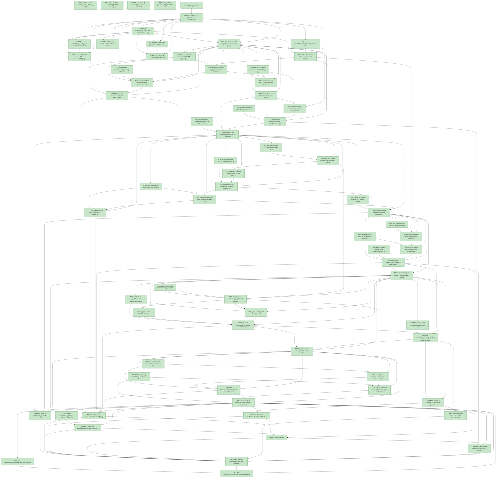

# Task Graph — 003-keyboard-input-framework

## ✓ Graph is acyclic and consistent

## Status counts (effective)

| Status | Count |
|--------|-------|
| [X] done | 72 |
| [S] synthetic | 0 |
| [S*] auto-synthetic | 0 |

## Graph



## ASCII view

```
T001 [X] Confirm current branch, feature directory, and prerequisite artifacts for `specs/003-keyboard-input-framework/`
T002 [X] Create readiness scaffolding for FSI transcripts, input replay, sample configs, surface baselines, package output, and sample smoke evidence
T003 [X] Record the YAML parser adoption note and pinned `YamlDotNet` version in feature evidence docs
T004 [X] Inventory affected projects and expected file additions in `src/Lib`, `tests/Lib.Tests`, `tests/Package.Tests`, `tests/Smoke.Tests`, `scripts`, and `samples/KeyboardInputGallery`
T005 [X] Record feature Tier 1 classification, public API impact, MVU applicability, and required real-evidence obligations
T006 [X] Confirm Principle IV applies because `InputRuntime` is stateful and document that no synthetic evidence is planned
T007 [X] Draft `src/Lib/KeyboardInput.fsi` with command registry, configuration, canonical model, mode stack, runtime, message, effect, layout-state, replay, bigram, diagnostics, and optional command-intent contracts
T008 [X] Add `src/Lib/KeyboardInput.fs` implementation skeleton matching the `.fsi` without top-level visibility modifiers
T009 [X] Add `YamlDotNet` `17.1.0` to `src/Lib/Lib.fsproj` and include `KeyboardInput.fsi` / `KeyboardInput.fs` in the correct compile order
T010 [X] Add `tests/Lib.Tests/KeyboardInputTests.fs` to the test project in the correct compile order
T011 [X] Create initial readiness sample config and invalid YAML fixtures under `specs/003-keyboard-input-framework/readiness/sample-configs/`
T012 [X] Create `scripts/input-prelude.fsx` that exercises registry creation, YAML parsing, validation, `init`, `update`, replay, and bigram analysis
T013 [X] Define shared test helpers for command registries, layouts, stateful modes, popup modes, temporary held modes, and key positions
T014 [X] Exercise the draft `.fsi` through `dotnet fsi scripts/input-prelude.fsx` and capture the transcript to readiness
T015 [X] Record the initial surface-area baseline for `FS.Skia.UI.KeyboardInput`
T016 [X] Record unsupported-scope behavior for touch, gamepad, automatic keymap rewriting, executable YAML host actions, and full command grammar execution
T017 [X] Add semantic tests for valid modal YAML parsing into `InputConfiguration` and validation into `CanonicalInputModel`
T018 [X] Add pure transition tests for normal bindings, popup push/pop, temporary held push/release, and emitted `CommandResolved` / `LayoutStateChanged` effects
T019 [X] Add replay transcript fixture for representative movement, popup, and held-mode key events
T020 [X] Add FSI prelude assertions covering the US1 command registry, modal YAML, `init`, and representative `update` paths
T021 [X] Implement command registry construction, duplicate command rejection, and canonical model validation for registered command identifiers
T022 [X] Implement YAML parsing for version, layouts, modes, bindings, disambiguation, bigram profile, and display options
T023 [X] Implement mode stack initialization with base standard or stateful mode and valid active layout
T024 [X] Implement key-down binding resolution for positional keymaps, normal command bindings, popup mode push, and temporary mode push
T025 [X] Implement key-up release behavior for temporary held modes and pressed-key tracking
T026 [X] Implement deterministic event recording and `replay` folding over `InputMsg` lists
T027 [X] Add actionable diagnostics for invalid YAML, unknown mode, unknown command, duplicate binding, and invalid host-action-like YAML
T028 [X] Document US1 independent validation in `quickstart.md` with the exact FSI and `dotnet test` commands
T029 [X] Add semantic tests for stateful mode default state validation, missing default rejection, and inspectable active state
T030 [X] Add pure transition tests for state transitions, state-dependent commands, popup restoration, and explicit popup state changes
T031 [X] Add replay evidence for focus loss, lost key-up recovery, and out-of-order release diagnostics
T032 [X] Extend FSI prelude assertions for stateful selection mode initialization and popup restoration
T033 [X] Implement stateful mode validation requiring non-empty state sets and valid default states
T034 [X] Implement `SetState` binding outcomes and state guards for mode-specific bindings
T035 [X] Implement popup cancellation, timeout handling, and restoration of the underlying stateful frame
T036 [X] Implement focus-loss cleanup for pressed keys and all active temporary held modes
T037 [X] Emit diagnostics for stale input events, ambiguous sequences, invalid mode state, and lost key release recovery
T038 [X] Update readiness replay artifacts and quickstart notes for state preservation behavior
T039 [X] Add semantic tests for layout profile validation across QWERTY, Dvorak, Colemak-style, and custom labels
T040 [X] Add bigram report tests for top weighted pairs, same-finger risk, long-travel risk, awkward hold risk, and suggestion limit
T041 [X] Add non-mutation tests proving `analyzeBigrams` does not rewrite the canonical model or YAML-derived keymap
T042 [X] Implement layout label resolution from physical key positions for display and analysis
T043 [X] Implement bigram scoring inputs from command-pair weights, binding positions, hand, finger, row, and column metadata
T044 [X] Implement `BigramReport` top pairs, risks, suggestions, and score summary without mutating configuration
T045 [X] Add sample bigram data to `modal-input.yaml` and document analysis-only behavior in quickstart evidence
T046 [X] Add tests for invalid duplicate binding, unregistered command, invalid host action, unknown layout, and impossible transition fixtures
T047 [X] Add tests for `layoutState` and `LayoutStateChanged` effects when active modes, held keys, pending sequences, and layout labels change
T048 [X] Add package or FSI evidence that applications can inspect `CanonicalInputModel` without parsing raw YAML
T049 [X] Implement full validation aggregation with diagnostics that identify affected mode, binding, transition, command, or layout entry
T050 [X] Implement disambiguation policy handling for pending sequences, prefix conflicts, and timeout resolution
T051 [X] Implement `SetLayout` handling and diagnostics for unknown layout changes after configuration load
T052 [X] Implement `layoutState` with active mode stack, active stateful mode, held modes, pending popup or sequence, active layout, and labels
T053 [X] Add `samples/KeyboardInputGallery` showing modal input, stateful selection, popup space mode, temporary copy/delete modes, bigram analysis, YAML failures, and optional layout-state display
T054 [X] Add smoke-test coverage for the sample gallery startup path where practical
T055 [X] Update quickstart with application-author workflow and sample smoke command
T056 [X] Add tests proving standard key input works with command intent disabled and no command grammar configuration
T057 [X] Add contract tests for command intent, command plan status, failure report fields, approval state, and unsatisfied intent diagnostics
T058 [X] Add optional command-intent data parsing and validation only where configured separately from standard key bindings
T059 [X] Expose command intent and command plan status data without implementing grammar parsing or command execution
T060 [X] Emit `UnsatisfiedCommandIntent` diagnostics for invalid optional intent policies
T061 [X] Document that advanced command intent is opt-in and data-only in v1
T062 [X] Refresh `tests/Package.Tests` surface-area baselines for the Tier 1 public API
T063 [X] Run `dotnet fsi scripts/input-prelude.fsx` and store the final transcript under readiness
T064 [X] Run `dotnet test tests/Lib.Tests/Lib.Tests.fsproj`
T065 [X] Run `dotnet test tests/Package.Tests/Package.Tests.fsproj`
T066 [X] Run `dotnet test tests/Smoke.Tests/Smoke.Tests.fsproj`
T067 [X] Run full `dotnet test`
T068 [X] Run sample gallery smoke command or document platform-specific Vulkan constraints in readiness evidence
T069 [X] Verify performance evidence for 95% event resolution under 16 ms, 10,000-event replay under 1 second, and 500-binding / 2,000-pair bigram report under 1 second
T070 [X] Run `.specify/extensions/evidence/scripts/bash/run-audit.sh specs/003-keyboard-input-framework --graph-only`
T071 [X] Run `.specify/extensions/evidence/scripts/bash/run-audit.sh specs/003-keyboard-input-framework` and resolve or disclose any findings
T072 [X] Update `tasks.md` statuses only with real evidence paths or explicit synthetic-evidence disclosures
```

