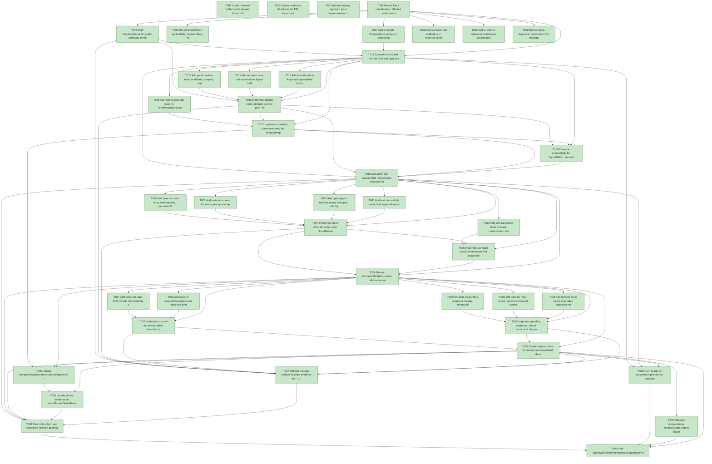

# Task Graph — 004-keyboard-state-display

## ✓ Graph is acyclic and consistent

## Status counts (effective)

| Status | Count |
|--------|-------|
| [X] done | 42 |
| [S] synthetic | 0 |
| [S*] auto-synthetic | 0 |

## Graph



## ASCII view

```
T001 [X] Confirm feature artifact set is present (`spec.md`, `plan.md`, `research.md`, `data-model.md`, `quickstart.md`, `contracts/public-api.md`)
T002 [X] Create readiness directories for FSI transcripts, sample smoke output, and surface baselines under `specs/004-keyboard-state-display/readiness/`
T003 [X] Identify existing keyboard input implementation, test, sample, prelude, smoke, and package baseline files affected by the feature
T004 [X] Record Tier 1 classification, affected public module, no-new-dependency constraint, and evidence obligations for pure display model plus Skia scene renderer
T005 [X] Draft `KeyboardInput.fsi` public contracts for display visibility, density, options, model records, omissions, and render/model functions
T006 [X] Record Elmish/MVU applicability: no new library `Model`/`Msg`/`Effect` contract is introduced, but tests must exercise existing `InputRuntime`, `InputMsg`, and `InputEffect` transitions through the public boundary
T007 [X] Add or update FSI/prelude coverage in `scripts/input-prelude.fsx` for compact, expanded, and hidden display construction through the public surface
T008 [X] Add semantic test scaffolding in `tests/Lib.Tests/KeyboardInputTests.fs` for reusable display fixtures, recent-effect capture, diagnostics, invalid layouts, and scene descriptions
T009 [X] Add or reserve surface-area baseline artifact path `specs/004-keyboard-state-display/readiness/surface-baselines/FS.Skia.UI.txt`
T010 [X] Define failure-diagnostic expectations for missing/invalid layout and non-actionable diagnostic filtering
T011 [X] Exercise the drafted `.fsi` with FSI and capture the transcript to `specs/004-keyboard-state-display/readiness/fsi/keyboard-state-display-prelude.txt`
T012 [X] Add public-surface tests for default, compact, expanded, and hidden display options
T013 [X] Add semantic tests that assert active layout id/display name, active top context, active state, and hidden-mode empty model/scene
T014 [X] Add tests that drive `KeyboardInput.update` layout/state changes and assert state display updates from emitted runtime/effects
T015 [X] Add `Scene.describe` tests for `renderKeyboardStateDisplay` and `renderKeyboardStateDisplayAt` returning stable text/shape primitives without custom app drawing
T016 [X] Implement display option defaults and the pure `keyboardStateDisplay` projection for visible/hidden orientation fields in `src/Lib/KeyboardInput.fs`
T017 [X] Implement standard scene rendering for compact/expanded orientation and hidden empty scene behavior using existing `Scene` primitives
T018 [X] Preserve compatibility for `layoutState`, `renderLayoutState`, and `renderLayoutStateAt`, delegating only where behavior remains compatible
T019 [X] Document and capture US1 independent validation through FSI transcript and focused `dotnet test` output
T020 [X] Add tests for stack entry kind mapping: permanent/stateful, popup, temporary held, and unknown contexts
T021 [X] Add tests for ordered full stack, exactly one top context, persistent flags, entered-by keys, and stateful mode state retention
T022 [X] Add compact-mode tests for stack condensation and omission metadata when stack depth exceeds compact display limits
T023 [X] Add update-path tests for popup push/pop, held-layer push/release, nested layers, and focus-loss cleanup diagnostics
T024 [X] Implement stack entry derivation from `InputRuntime.ModeStack`, mode definitions, held frames, and current state
T025 [X] Implement compact stack condensation and expanded full-stack preservation with `KeyboardStateDisplayOmission` metadata
T026 [X] Render permanent/stateful, popup, held, active-top, and partial/unknown context distinctions without text overlap for representative stack depth
T027 [X] Add tests that label hints include only bindings available in the active top context and matching state
T028 [X] Add tests for compact/expanded label caps and omitted-label counts
T029 [X] Add tests for pending sequence display, timeout/disambiguation fields, and option-controlled omission
T030 [X] Add tests for most recent resolved command selection from `InputEffect list`
T031 [X] Add tests for most recent actionable diagnostic selection and invalid-layout partial rendering
T032 [X] Implement current-top-context label extraction, outcome text, state filtering, layout-label fallback, and label caps
T033 [X] Implement pending sequence, recent command, diagnostic, omission, and `IsPartial` display-model behavior
T034 [X] Render optional hints in compact and expanded density while preserving orientation fields ahead of lower-priority hints
T035 [X] Update `samples/KeyboardInputGallery/Program.fs` to consume `renderKeyboardStateDisplayAt` and demonstrate compact/expanded/hidden behavior without custom state visualization logic
T036 [X] Update smoke evidence so `tests/Smoke.Tests/Tests.fs` captures `specs/004-keyboard-state-display/readiness/sample-smoke/keyboard-input-gallery-state-display.txt`
T037 [X] Refresh package surface baseline evidence for `FS.Skia.UI.KeyboardInput`
T038 [X] Run `dotnet test` and record the relevant passing output for semantic, package, and smoke coverage
T039 [X] Run `dotnet fsi scripts/input-prelude.fsx` and confirm the public API transcript includes keyboard state display construction
T040 [X] Run `.specify/extensions/evidence/scripts/bash/run-audit.sh specs/004-keyboard-state-display --graph-only` and then the full evidence audit before implementation is declared ready
T041 [X] Add tests for multiple active held layers where one key is released out of order, including expected stack recovery and displayed diagnostic/context
T042 [X] Measure representative `keyboardStateDisplay` model creation time and record evidence that it stays under 1 ms for compact, expanded, nested stack, 12-label, pending-sequence, recent-command, diagnostic, and partial-layout snapshots
```

