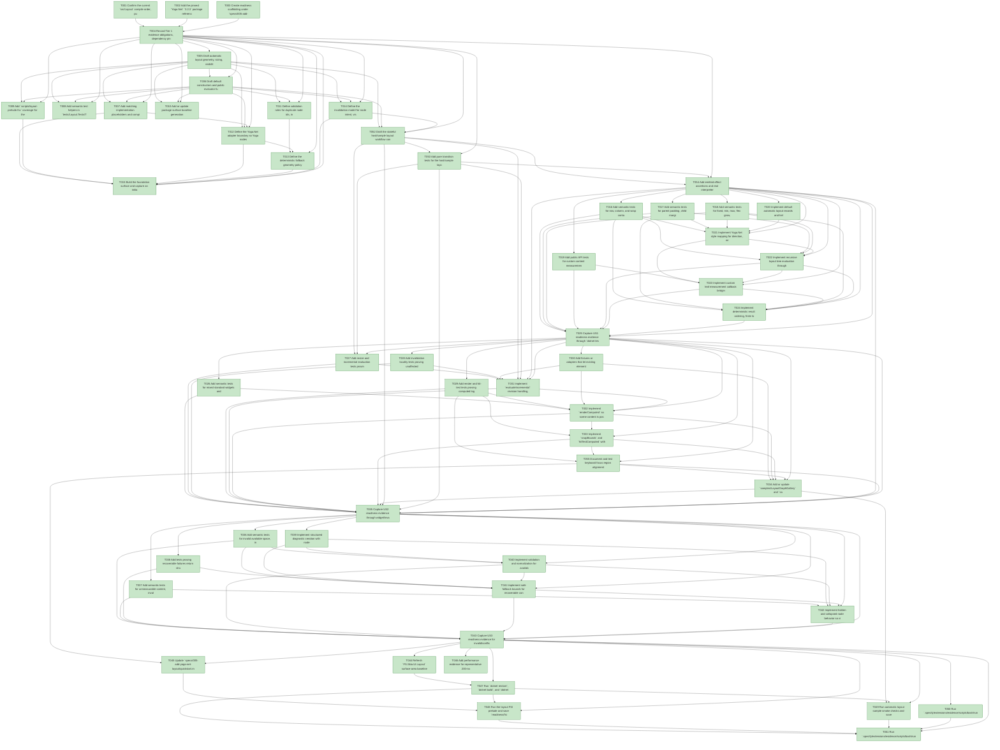

# Task Graph — 005-add-yoga-net-layout

## ✓ Graph is acyclic and consistent

## Status counts (effective)

| Status | Count |
|--------|-------|
| [X] done | 55 |
| [S] synthetic | 0 |
| [S*] auto-synthetic | 0 |

## Graph



## ASCII view

```
T001 [X] Confirm the current `src/Layout` compile order, public `.fsi` boundaries, test projects, and sample entry points affected by automatic layout.
T002 [X] Add the pinned `Yoga.Net` `3.2.3` package reference to `src/Layout/Layout.fsproj` without exposing Yoga.Net types in public signatures.
T003 [X] Create readiness scaffolding under `specs/005-add-yoga-net-layout/readiness/` for FSI, logs, performance, sample smoke, and surface baselines.
T004 [X] Record Tier 1 evidence obligations, dependency pinning rationale, MVU applicability, and unsupported v1 scope in `specs/005-add-yoga-net-layout/readiness/evidence-obligations.md`.
T005 [X] Draft automatic layout geometry, sizing, visibility, measurement, diagnostics, result, and pixel snapping types in `src/Layout/Types.fsi`.
T006 [X] Draft default constructors and public evaluator functions in `src/Layout/Layout.fsi` or `src/Layout/YogaLayout.fsi`, including `evaluate`, `evaluateIncremental`, `renderComputed`, `snapBounds`, and `hitTestComputed`.
T007 [X] Add matching implementation placeholders and compile-order entries in `src/Layout/Types.fs`, `src/Layout/Layout.fs`, and any new Yoga layout implementation files.
T008 [X] Add semantic test helpers in `tests/Layout.Tests/Tests.fs` for reading computed bounds, asserting non-overlap, deterministic results, diagnostics, and visibility.
T009 [X] Add `scripts/layout-prelude.fsx` coverage for the intended public automatic layout API and expected readiness transcript path.
T010 [X] Add or update package surface baseline generation notes for `FS.Skia.UI.Layout` under `specs/005-add-yoga-net-layout/readiness/surface-baselines/`.
T011 [X] Define validation rules for duplicate node ids, invalid available space, invalid numeric style values, invalid measurement output, min/max conflicts, and v1 rejection of absolute or overlay intent.
T012 [X] Define the Yoga.Net adapter boundary so Yoga nodes are allocated, styled, measured, evaluated, read back, and disposed without leaking Yoga.Net types through `.fsi`.
T013 [X] Define the deterministic fallback geometry policy for recoverable failures, including bounded root and child rectangles plus `LayoutDiagnostic` records.
T014 [X] Define the invalidation model for node intent, visibility, child structure, parent size, and content measurement changes, including stable unchanged sibling bounds.
T015 [X] Build the foundation surface and capture an initial FSI or build transcript proving the public signatures are reachable from the package.
T016 [X] Add semantic tests for row, column, and wrap containers with non-overlapping child bounds inside the parent.
T017 [X] Add semantic tests for parent padding, child margin, row and column gaps, and main/cross-axis alignment.
T018 [X] Add semantic tests for fixed, min, max, flex grow, flex shrink, flex basis, and deterministic repeated evaluation.
T019 [X] Add public API tests for custom content measurement callbacks that return preferred logical sizes and diagnostics.
T020 [X] Implement default automatic layout records and helper constructors for layout intents, nodes, available space, and pixel snap policies.
T021 [X] Implement Yoga.Net style mapping for direction, wrap, alignment, justification, padding, margin, gap, fixed/min/max size, grow, shrink, and basis.
T022 [X] Implement recursive layout tree evaluation through Yoga.Net and read back one logical `ComputedBounds` entry per participating node.
T023 [X] Implement custom leaf measurement callback bridging between public `MeasureRequest` / `MeasureResponse` and Yoga.Net measure callbacks.
T024 [X] Implement deterministic result ordering, finite logical bounds normalization, and valid-layout non-overlap guarantees.
T025 [X] Capture US1 readiness evidence through `dotnet test --filter` or equivalent and the FSI prelude transcript for nested element layout.
T026 [X] Add semantic tests for mixed standard widgets and custom elements participating in one automatic layout tree.
T027 [X] Add resize and incremental evaluation tests proving changed parent size or child measurement updates bounds without stale overlap.
T028 [X] Add invalidation locality tests proving unaffected sibling subtrees keep byte-for-byte equivalent computed bounds after unrelated changes.
T029 [X] Add render and hit-test tests proving computed logical bounds are consumed without independent layout recalculation.
T030 [X] Add fixtures or adapters that let existing element/widget scene content attach to `LayoutNode.Content` while keeping automatic layout opt-in.
T031 [X] Implement `evaluateIncremental` revision handling, invalidated node reporting, and changed-node ancestor propagation.
T032 [X] Implement `renderComputed` so scene content is positioned from computed bounds while existing manual stack, dock, graph, absolute, and overlay composition keep working.
T033 [X] Implement `snapBounds` and `hitTestComputed` with one deterministic `PixelSnapPolicy` shared by rendering and hit testing.
T034 [X] Add or update `samples/LayoutGraphGallery` and `samples/DemoReel` automatic layout examples for nested elements, mixed widgets, resizing, flexible sizing, and hidden elements.
T035 [X] Capture US2 readiness evidence through widget/invalidation tests and sample smoke transcript under `readiness/sample-smoke/`.
T036 [X] Add semantic tests for invalid available space, invalid style values, min/max conflicts, and size requests larger than the parent.
T037 [X] Add semantic tests for unmeasurable content, invalid measurement callback output, hidden nodes, and collapsed nodes.
T038 [X] Add tests proving recoverable failures return structured diagnostics and bounded fallback geometry without terminating render flow.
T039 [X] Implement structured diagnostic creation with node id, code, severity, message, constraint, and fallback flags.
T040 [X] Implement validation and normalization for available space, layout intent values, measurement output, and unsupported automatic-layout scope.
T041 [X] Implement safe fallback bounds for recoverable constraints and propagate diagnostics through `LayoutResult.Diagnostics`.
T042 [X] Implement hidden and collapsed node behavior so visibility diagnostics are distinguishable from layout failures and visible siblings stay stable.
T043 [X] Capture US3 readiness evidence for invalid/conflicting layouts and diagnostic samples.
T044 [X] Refresh `FS.Skia.UI.Layout` surface-area baseline and package tests for the new public contract.
T045 [X] Update `specs/005-add-yoga-net-layout/quickstart.md` and layout interaction docs for final public names, pointer hit testing, keyboard focus regions, visual bounds, and pixel snapping behavior.
T046 [X] Add performance evidence for representative 200-node resize/re-layout under `readiness/performance/yoga-layout-200-node-resize.txt`, including command, hardware/runtime profile, iteration count, median/p95 timing, and pass/fail against the SC-004 threshold.
T047 [X] Run `dotnet restore`, `dotnet build`, and `dotnet test`, saving final logs under `readiness/logs/`.
T048 [X] Run the layout FSI prelude and save `readiness/fsi/yoga-layout-prelude.txt`.
T049 [X] Run automatic layout sample smoke checks and save `readiness/sample-smoke/automatic-layout-gallery.txt`.
T050 [X] Run `.specify/extensions/evidence/scripts/bash/run-audit.sh specs/005-add-yoga-net-layout --graph-only` and confirm no dangling refs, cycles, or unexpected `[S*]` propagation.
T051 [X] Run `.specify/extensions/evidence/scripts/bash/run-audit.sh specs/005-add-yoga-net-layout` and document PASS or every explicit synthetic-evidence override.
T052 [X] Draft the stateful host/sample layout workflow contract for resize, widget updates, and content-measurement invalidation, including `Model`, `Msg`, `Effect` or `Cmd<Msg>`, `init`, `update`, and interpreter boundary.
T053 [X] Add pure transition tests for the host/sample layout workflow covering resize, visibility changes, layout-intent changes, and content-measurement changes.
T054 [X] Add emitted-effect assertions and real interpreter evidence for the host/sample layout workflow where safe, saving transcript output under `readiness/fsi/`.
T055 [X] Document and test keyboard focus region alignment with computed visual bounds and pointer hit-test bounds after pixel snapping.
```

