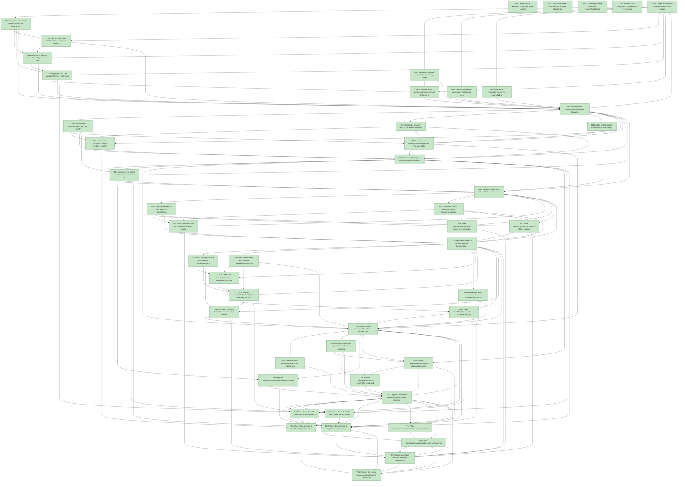

# Task Graph — 006-template-framework-governance

## ✓ Graph is acyclic and consistent

## Status counts (effective)

| Status | Count |
|--------|-------|
| [X] done | 50 |
| [S] synthetic | 0 |
| [S*] auto-synthetic | 0 |

## Graph



## ASCII view

```
T001 [X] Create feature readiness scaffolding under `specs/006-template-framework-governance/readiness/` for logs, FSI transcripts, sample smoke output, package notes, graph output, and audit output
T002 [X] Record the FAKE local-tool and wrapper adoption baseline for `.config/dotnet-tools.json`, `fake.sh`, and `fake.cmd`
T003 [X] Inventory existing duplicated restore/build/test/pack/evidence command order in README, docs, scripts, tests, and `.specify/workflows/speckit/workflow.yml`
T004 [X] Record Tier 1 governance obligations in `readiness/evidence-obligations.md`, including no runtime `.fsi` API impact, `BuildModel` / `BuildMsg` / `BuildEffect`, required v1 artifacts, and deferred roadmap categories
T005 [X] Create a command-target traceability matrix mapping `contracts/canonical-workflow.md` targets to planned implementation files, docs, tests, and readiness artifacts
T006 [X] Add failing command-contract checks for wrapper availability, required target names, target dependencies, `BuildModel` / `BuildMsg` / `BuildEffect`, pure `update` behavior, emitted effects, and documented pass/fail behavior
T007 [X] Add failing package-surface checks proving current baselines must be read from `readiness/surface-baselines/*.txt` instead of historical feature readiness folders
T008 [X] Add failing guidance checks proving touched docs, workflows, and generated task guidance reference canonical targets instead of duplicating raw command order
T009 [X] Add failing verification checks for required v1 artifact classes and actionable diagnostics when `Verify` is missing build, test, package, FSI, sample-smoke, task-graph, or audit output
T010 [X] Add the repo-local FAKE tool manifest and thin Bash/Windows wrappers that invoke the same target graph
T011 [X] Implement `build.fsx` foundation helpers and local `BuildModel` / `BuildMsg` / `BuildEffect` workflow effect algebra for repository paths, process execution, log capture, output directories, `Clean`, `Restore`, `Build`, `Test`, and target discovery
T012 [X] Implement the `Dev` target as the fast restore/build/default non-visual test path, keeping deferred package consumer smoke outside the default test set
T013 [X] Isolate existing package consumer smoke behavior behind a deferred path or explicit non-v1 target so `Dev`, `Verify`, and `Ci` do not require it
T014 [X] Run foundation verification for wrapper discovery, command-contract checks, stable-baseline checks, guidance checks, and artifact-diagnostic checks; store logs under `readiness/logs/`
T015 [X] Add command availability tests for `Dev`, `Verify`, `Ci`, `PackLocal`, `RefreshSurfaceBaselines`, `PackageSurfaceCheck`, `FsiTranscripts`, `SampleContractSmoke`, `EvidenceGraph`, and `EvidenceAudit`
T016 [X] Add target behavior tests or fixtures for workflow transition outputs, emitted process/file effects, log capture, required artifact detection, and missing-artifact diagnostics in the full verification path
T017 [X] Add a real-interpreter evidence plan for running `./fake.sh build -t Dev` and focused evidence targets with output captured under feature readiness
T018 [X] Implement `PackLocal` to pack `src/Lib`, `src/Charts`, and `src/Layout` into `~/.local/share/nuget-local/` and capture a package log
T019 [X] Implement `RefreshSurfaceBaselines`, `PackageSurfaceCheck`, `FsiTranscripts`, `SampleContractSmoke`, `EvidenceGraph`, and `EvidenceAudit` targets by wrapping existing tests, scripts, sample smoke commands, and the Spec Kit evidence extension through the build workflow interpreter
T020 [X] Implement `Verify` as the full v1 workflow requiring `Dev`, package surface checks, public contract transcripts, sample smoke output, task graph validation, evidence audit output, and build/test/package logs
T021 [X] Implement `Ci` as the non-interactive automation entry that delegates to `Verify` without duplicating command order
T022 [X] Capture independent US1 validation evidence by running `Dev` and focused graph/surface targets, then store logs and artifact paths under `readiness/`
T023 [X] Add docs checks for `docs/build.md`, `docs/testing.md`, and `docs/evidence.md` covering delivered target names, artifact paths, pass/fail behavior, and stable baseline location
T024 [X] Add docs checks proving template packaging, dependency governance, generated spec/plan hardening, layout evidence, visual evidence, package consumer smoke, and release validation are named as deferred and excluded from v1 `Dev`, `Verify`, and `Ci`
T025 [X] Write `docs/build.md` with canonical wrapper usage, target responsibilities, output locations, future CI guidance, and no duplicated raw command sequence
T026 [X] Write `docs/testing.md` with target-to-test mapping, default non-visual test scope, sample smoke expectations, and package consumer smoke deferral
T027 [X] Write `docs/evidence.md` with v1 artifact classes, stable paths, historical-vs-current evidence rules, synthetic evidence policy, and roadmap extension points
T028 [X] Update README or existing workflow documentation to point to the canonical docs and targets without reimplementing the command order
T029 [X] Add package surface tests proving `tests/Package.Tests/SurfaceAreaTests.fs` reads root-level `readiness/surface-baselines/*.txt` and fails when expected public names are missing
T030 [X] Add refresh-path tests proving `RefreshSurfaceBaselines`, `scripts/refresh-surface-baselines.fsx`, and `PackageSurfaceCheck` write and read the same stable current baseline location
T031 [X] Add artifact-path checks for build/test/package logs, FSI transcripts, sample smoke output, task graph output, and evidence audit output under the feature readiness directory
T032 [X] Create root `readiness/surface-baselines/` and seed `FS.Skia.UI.txt`, `FS.Skia.UI.Charts.txt`, and `FS.Skia.UI.Layout.txt` from the current validated public surface
T033 [X] Update `scripts/refresh-surface-baselines.fsx` and `tests/Package.Tests/SurfaceAreaTests.fs` to use the stable current baseline path
T034 [X] Route build/test/package logs, FSI transcripts, sample smoke output, task graph output, and audit output to the documented feature readiness paths
T035 [X] Remove v1 checks' dependence on historical readiness folders while preserving those folders as historical repository evidence
T036 [X] Capture stable-baseline and evidence-location validation by running `PackageSurfaceCheck`, `FsiTranscripts`, `SampleContractSmoke`, and `EvidenceGraph`
T037 [X] Add automation inspection checks for `.specify/workflows/speckit/workflow.yml` and any touched automation so verification delegates to `Ci`, `Verify`, or named canonical targets
T038 [X] Add generated task guidance checks for `.specify/presets/fsharp-opinionated/templates/tasks-template.md`, requiring canonical workflow entries and preserving `tasks.deps.yml` plus evidence graph requirements
T039 [X] Update `.specify/workflows/speckit/workflow.yml` if needed so repository automation invokes the canonical verification entry instead of duplicating command order
T040 [X] Update `.specify/presets/fsharp-opinionated/templates/tasks-template.md` so future generated tasks call canonical targets such as `Dev`, `Verify`, `PackLocal`, `RefreshSurfaceBaselines`, `PackageSurfaceCheck`, `EvidenceGraph`, and `EvidenceAudit`
T041 [X] Review `.agents/skills/speckit-tasks/SKILL.md` and either align it with canonical-target guidance or record why no skill change is needed
T042 [X] Capture automation and generated-guidance alignment evidence under `readiness/logs/` or `readiness/guidance-alignment.md`
T043 [X] Run `./fake.sh build -t RefreshSurfaceBaselines` and `./fake.sh build -t PackageSurfaceCheck`; store both logs under `readiness/logs/`
T044 [X] Run `./fake.sh build -t Dev`; store the log and record whether it completes within the 10 minute target on the current supported machine
T045 [X] Run `./fake.sh build -t Verify` from a clean checkout or freshly cloned working directory; confirm every required v1 artifact class exists and store build/test/package/evidence logs and machine/runtime assumptions under `readiness/`
T046 [X] Run `./fake.sh build -t PackLocal`; confirm local `.nupkg` outputs under `~/.local/share/nuget-local/` and store package evidence
T047 [X] Run `.specify/extensions/evidence/scripts/bash/run-audit.sh specs/006-template-framework-governance --graph-only` and confirm no cycles or dangling references
T048 [X] Run `.specify/extensions/evidence/scripts/bash/run-audit.sh specs/006-template-framework-governance` and confirm PASS, or document every unresolved synthetic or diff-scan blocker
T049 [X] Update quickstart, contract, and plan references only if final target names or artifact paths changed, then record the final readiness review
T050 [X] Prepare the merge summary with command results, evidence paths, synthetic-evidence inventory, and deferred roadmap boundaries
```

