# Task Graph — 007-v2-template-packaging

## ✓ Graph is acyclic and consistent

## Status counts (effective)

| Status | Count |
|--------|-------|
| [X] done | 64 |
| [S] synthetic | 0 |
| [S*] auto-synthetic | 0 |

## Graph

```mermaid
graph TD
  T001["T001 Create feature readiness scaffolding under `specs/"]:::done
  T002["T002 Inventory template-owned source files, generated-p"]:::done
  T003["T003 Inventory current direct package references and lo"]:::done
  T004["T004 Record V2 evidence obligations in `specs/007-v2-te"]:::done
  T005["T005 Create a traceability matrix mapping FR/SC/contrac"]:::done
  T006["T006 Add governance test helpers in `tests/Governance.T"]:::done
  T007["T007 Add failing V2 command-contract tests for required"]:::done
  T008["T008 Add failing readiness artifact path tests for V2 p"]:::done
  T009["T009 Add failing safe-operation tests for target-owned "]:::done
  T010["T010 Add shared path/model fields to `build.fsx` for th"]:::done
  T011["T011 Extend `BuildMsg`, `BuildEffect`, `update`, and in"]:::done
  T012["T012 Extend target discovery and target dependencies wi"]:::done
  T013["T013 Run foundation verification for command contracts,"]:::done
  T014["T014 Add `TemplateProfileTests` requiring `.template.co"]:::done
  T015["T015 Add `TemplateWorkflowTests` for `TemplatePack`, so"]:::done
  T016["T016 Add generated project validation tests or fixtures"]:::done
  T017["T017 Add a real-interpreter evidence plan for source in"]:::done
  T018["T018 Add `.template.config/template.json` with template"]:::done
  T019["T019 Add `.template.package/FS.Skia.UI.Template.fsproj`"]:::done
  T020["T020 Implement `TemplatePack` and package content verif"]:::done
  T021["T021 Implement `TemplateInstallSource` and `TemplateIns"]:::done
  T022["T022 Implement `TemplateInstantiate` to create source/d"]:::done
  T023["T023 Implement `TemplateSmoke` placeholder scans, exclu"]:::done
  T024["T024 Implement `TemplateCheck` as the full V2 template "]:::done
  T025["T025 Document template profiles, generation options, ar"]:::done
  T026["T026 Run focused `TemplateCheck` or staged source/packa"]:::done
  T027["T027 Add `DependencyGovernanceTests` requiring `Directo"]:::done
  T028["T028 Add dependency metadata/report tests requiring `do"]:::done
  T029["T029 Add a negative scan fixture or test proving an unm"]:::done
  T030["T030 Add `Directory.Packages.props` with central versio"]:::done
  T031["T031 Remove inline external dependency versions from re"]:::done
  T032["T032 Write `docs/dependencies.md` with required depende"]:::done
  T033["T033 Implement `scripts/dependency-report.fsx` to scan "]:::done
  T034["T034 Add the `DependencyReport` FAKE target and include"]:::done
  T035["T035 Ensure generated default and minimal template prof"]:::done
  T036["T036 Run `./fake.sh build -t DependencyReport` and focu"]:::done
  T037["T037 Add generated spec guidance tests requiring active"]:::done
  T038["T038 Add generated plan guidance tests requiring active"]:::done
  T039["T039 Add generated-artifact tests proving V2 obligation"]:::done
  T040["T040 Update `.specify/templates/spec-template.md` and `"]:::done
  T041["T041 Update `.specify/templates/plan-template.md` and `"]:::done
  T042["T042 Write `docs/speckit.md` documenting generated spec"]:::done
  T043["T043 Implement a generated guidance checker and the `Ge"]:::done
  T044["T044 Include `GeneratedGuidanceCheck` in `Verify` and i"]:::done
  T045["T045 Run `./fake.sh build -t GeneratedGuidanceCheck` an"]:::done
  T046["T046 Add `TemplateDriftTests` proving changed template-"]:::done
  T047["T047 Add deferral validation tests requiring every acce"]:::done
  T048["T048 Add drift report tests for path-level diagnostics,"]:::done
  T049["T049 Define template ownership and drift classification"]:::done
  T050["T050 Create root-level `readiness/template-deferrals.ym"]:::done
  T051["T051 Implement `scripts/template-drift.fsx` to collect "]:::done
  T052["T052 Add the `TemplateDrift` FAKE target and include it"]:::done
  T053["T053 Update `docs/build.md`, `docs/testing.md`, `docs/e"]:::done
  T054["T054 Run `./fake.sh build -t TemplateDrift` plus at lea"]:::done
  T055["T055 Run `./fake.sh build -t Dev` and confirm the V1 fa"]:::done
  T056["T056 Run `./fake.sh build -t TemplateCheck` and confirm"]:::done
  T057["T057 Run `./fake.sh build -t DependencyReport`, `./fake"]:::done
  T058["T058 Run `./fake.sh build -t Verify` and `./fake.sh bui"]:::done
  T059["T059 Validate `artifacts/templates/FS.Skia.UI.Template."]:::done
  T060["T060 Record a minimal profile review proving core libra"]:::done
  T061["T061 Run `.specify/extensions/evidence/scripts/bash/run"]:::done
  T062["T062 Run `.specify/extensions/evidence/scripts/bash/run"]:::done
  T063["T063 Update quickstart, contracts, plan notes, and read"]:::done
  T064["T064 Prepare the merge summary with command results, re"]:::done
  T005 --> T006
  T005 --> T007
  T005 --> T008
  T005 --> T009
  T007 --> T010
  T008 --> T010
  T005 --> T010
  T006 --> T011
  T007 --> T011
  T010 --> T011
  T005 --> T011
  T007 --> T012
  T010 --> T012
  T011 --> T012
  T005 --> T012
  T006 --> T013
  T007 --> T013
  T008 --> T013
  T009 --> T013
  T010 --> T013
  T011 --> T013
  T012 --> T013
  T005 --> T013
  T013 --> T014
  T013 --> T015
  T013 --> T016
  T013 --> T017
  T014 --> T018
  T016 --> T018
  T013 --> T018
  T014 --> T019
  T015 --> T019
  T013 --> T019
  T015 --> T020
  T019 --> T020
  T013 --> T020
  T015 --> T021
  T020 --> T021
  T013 --> T021
  T015 --> T022
  T018 --> T022
  T021 --> T022
  T013 --> T022
  T016 --> T023
  T022 --> T023
  T013 --> T023
  T015 --> T024
  T020 --> T024
  T021 --> T024
  T022 --> T024
  T023 --> T024
  T013 --> T024
  T014 --> T025
  T017 --> T025
  T018 --> T025
  T024 --> T025
  T013 --> T025
  T017 --> T026
  T020 --> T026
  T021 --> T026
  T022 --> T026
  T023 --> T026
  T024 --> T026
  T025 --> T026
  T013 --> T026
  T026 --> T027
  T026 --> T028
  T026 --> T029
  T027 --> T030
  T026 --> T030
  T027 --> T031
  T030 --> T031
  T026 --> T031
  T028 --> T032
  T030 --> T032
  T026 --> T032
  T027 --> T033
  T028 --> T033
  T029 --> T033
  T030 --> T033
  T031 --> T033
  T032 --> T033
  T026 --> T033
  T033 --> T034
  T026 --> T034
  T030 --> T035
  T031 --> T035
  T032 --> T035
  T034 --> T035
  T026 --> T035
  T033 --> T036
  T034 --> T036
  T035 --> T036
  T026 --> T036
  T036 --> T037
  T036 --> T038
  T036 --> T039
  T037 --> T040
  T039 --> T040
  T036 --> T040
  T038 --> T041
  T039 --> T041
  T036 --> T041
  T037 --> T042
  T038 --> T042
  T039 --> T042
  T040 --> T042
  T041 --> T042
  T036 --> T042
  T037 --> T043
  T038 --> T043
  T039 --> T043
  T040 --> T043
  T041 --> T043
  T042 --> T043
  T036 --> T043
  T043 --> T044
  T036 --> T044
  T043 --> T045
  T044 --> T045
  T036 --> T045
  T045 --> T046
  T045 --> T047
  T045 --> T048
  T046 --> T049
  T045 --> T049
  T047 --> T050
  T049 --> T050
  T045 --> T050
  T046 --> T051
  T047 --> T051
  T048 --> T051
  T049 --> T051
  T050 --> T051
  T045 --> T051
  T051 --> T052
  T045 --> T052
  T049 --> T053
  T052 --> T053
  T045 --> T053
  T051 --> T054
  T052 --> T054
  T053 --> T054
  T045 --> T054
  T054 --> T055
  T054 --> T056
  T054 --> T057
  T055 --> T058
  T056 --> T058
  T057 --> T058
  T054 --> T058
  T056 --> T059
  T054 --> T059
  T056 --> T060
  T054 --> T060
  T054 --> T061
  T058 --> T062
  T061 --> T062
  T054 --> T062
  T056 --> T063
  T057 --> T063
  T058 --> T063
  T062 --> T063
  T054 --> T063
  T056 --> T064
  T057 --> T064
  T058 --> T064
  T062 --> T064
  T063 --> T064
  T054 --> T064
  classDef pending fill:#eeeeee,stroke:#999
  classDef done fill:#c8e6c9,stroke:#2e7d32
  classDef synthetic fill:#ffe0b2,stroke:#e65100,stroke-width:2px
  classDef autoSynthetic fill:#ffab91,stroke:#bf360c,stroke-width:2px,stroke-dasharray:5 3
  classDef failed fill:#ffcdd2,stroke:#b71c1c,stroke-width:2px
  classDef skipped fill:#f5f5f5,stroke:#666,stroke-dasharray:3 3
```



## ASCII view

```
T001 [X] Create feature readiness scaffolding under `specs/007-v2-template-packaging/readiness/` for logs, template validation output, dependency reports, generated guidance, drift reports, task graph output, and audit output
T002 [X] Inventory template-owned source files, generated-product exclusions, optional profile scope, historical specs/readiness paths, and placeholder tokens in `specs/007-v2-template-packaging/readiness/template-source-inventory.md`
T003 [X] Inventory current direct package references and local package smoke/version exceptions in `specs/007-v2-template-packaging/readiness/dependency-inventory.md`
T004 [X] Record V2 evidence obligations in `specs/007-v2-template-packaging/readiness/evidence-obligations.md`, including Tier 1 scope, explicit no-op runtime `.fsi`/surface-baseline impact, `BuildModel` / `BuildMsg` / `BuildEffect` applicability, real evidence requirements, and deferred visual/release/external distribution boundaries
T005 [X] Create a traceability matrix mapping FR/SC/contract targets to planned tests, implementation files, docs, and readiness artifacts
T006 [X] Add governance test helpers in `tests/Governance.Tests/` for reading JSON, XML, YAML, Markdown, feature readiness paths, and focused FAKE target output
T007 [X] Add failing V2 command-contract tests for required target names, target dependencies, `007-v2-template-packaging` readiness paths, `Verify`/`Ci` extension, explicit `.fsi`/surface-baseline no-op assertions, pure `update` transitions, emitted effects, and interpreter boundaries
T008 [X] Add failing readiness artifact path tests for V2 package logs, install logs, generated project logs, placeholder/excluded-history scans, dependency report, generated guidance report, drift report, and local template package output
T009 [X] Add failing safe-operation tests for target-owned temp-root cleanup, source-preserving `Clean` behavior, missing tool/network diagnostics, and missing artifact-class diagnostics
T010 [X] Add shared path/model fields to `build.fsx` for the 007 feature directory, template logs, generated project roots, `artifacts/templates/`, and root deferral records while preserving V1 target behavior
T011 [X] Extend `BuildMsg`, `BuildEffect`, `update`, and interpreter helpers for template packaging, template installs, generated project commands, scan reports, structured report writing, and required artifact classes
T012 [X] Extend target discovery and target dependencies with `TemplatePack`, `TemplateInstallSource`, `TemplateInstallPackage`, `TemplateInstantiate`, `TemplateSmoke`, `TemplateCheck`, `DependencyReport`, `GeneratedGuidanceCheck`, and `TemplateDrift`; keep `Dev` independent of template packaging
T013 [X] Run foundation verification for command contracts, `.fsi`/surface-baseline no-op evidence, MVU/effect assertions, readiness artifact paths, and safe-operation diagnostics; store output under `specs/007-v2-template-packaging/readiness/logs/`
T014 [X] Add `TemplateProfileTests` requiring `.template.config/template.json` to define `fs-skia-ui`, `default` and `minimal` profile choices, product identity symbols, source/exclude modifiers, and historical feature/readiness exclusions
T015 [X] Add `TemplateWorkflowTests` for `TemplatePack`, source/package install targets, four-row artifact/profile instantiation, package artifact paths, target dependencies, emitted effects, and `TemplateCheck` verdict output
T016 [X] Add generated project validation tests or fixtures for unreplaced placeholder diagnostics, excluded-history diagnostics, minimal profile required contents, optional layout/charts/parity/visual exclusions, generated `Dev` logs, explicit non-visual/no-graphics support messaging, and broken-reference failures
T017 [X] Add a real-interpreter evidence plan for source install, package install, default/minimal generation, generated `Dev` execution, and logs under `specs/007-v2-template-packaging/readiness/template/`
T018 [X] Add `.template.config/template.json` with template identity, `profile` choice symbols, product identity substitutions, include/exclude source modifiers, default profile contents, minimal profile contents, and source-only history exclusions
T019 [X] Add `.template.package/FS.Skia.UI.Template.fsproj` with local NuGet template package metadata and pack output under `artifacts/templates/`
T020 [X] Implement `TemplatePack` and package content verification so `FS.Skia.UI.Template.*.nupkg` contains template metadata and template-owned files while excluding source-only artifacts
T021 [X] Implement `TemplateInstallSource` and `TemplateInstallPackage` with uninstall/reinstall-safe behavior, actionable diagnostics, and separate readiness logs
T022 [X] Implement `TemplateInstantiate` to create source/default, source/minimal, package/default, and package/minimal generated projects in isolated target-owned temp roots
T023 [X] Implement `TemplateSmoke` placeholder scans, excluded-history scans, optional profile reference checks, generated `./fake.sh build -t Dev` execution, per-project logs, and summary diagnostics
T024 [X] Implement `TemplateCheck` as the full V2 template validation target, require all readiness artifact classes, and wire `Verify`/`Ci` to include it without changing `Dev` into a packaging target
T025 [X] Document template profiles, generation options, artifact boundaries, validation commands, readiness paths, non-visual/no-graphics support messaging, and deferred visual/release/external distribution scope in `docs/template-profile.md`, `docs/build.md`, `docs/testing.md`, `docs/evidence.md`, README, and quickstart references
T026 [X] Run focused `TemplateCheck` or staged source/package/default/minimal validation and store package, install, generation, placeholder, excluded-history, generated `Dev`, and verdict evidence
T027 [X] Add `DependencyGovernanceTests` requiring `Directory.Packages.props` to enable Central Package Management, declare direct `<PackageVersion />` entries, and keep repo-owned `.fsproj` external `PackageReference` entries versionless
T028 [X] Add dependency metadata/report tests requiring `docs/dependencies.md` fields for package id, version, purpose, owner, license posture, upgrade expectation, preview risk where relevant, validation-only exceptions, and readiness output
T029 [X] Add a negative scan fixture or test proving an unmanaged inline external package version fails with project path, package id, and required remediation
T030 [X] Add `Directory.Packages.props` with central versions for current direct external packages and Central Package Management enabled
T031 [X] Remove inline external dependency versions from repo-owned project files while preserving only documented validation-only local package version properties
T032 [X] Write `docs/dependencies.md` with required dependency metadata, preview-risk notes, and validation-only exception policy
T033 [X] Implement `scripts/dependency-report.fsx` to scan project files, compare central policy and docs metadata, validate exceptions, and emit `specs/007-v2-template-packaging/readiness/dependencies.md`
T034 [X] Add the `DependencyReport` FAKE target and include it in `Verify`
T035 [X] Ensure generated default and minimal template profiles include central dependency policy files and dependency governance documentation expected by new products
T036 [X] Run `./fake.sh build -t DependencyReport` and focused dependency governance tests; store readiness evidence and diagnostics
T037 [X] Add generated spec guidance tests requiring active and preset-owned `spec-template.md` files to prompt for package impact, public contract impact, state workflow impact, layout/rendering impact, evidence obligations, unsupported scope, and build-target impact
T038 [X] Add generated plan guidance tests requiring active and preset-owned `plan-template.md` files to decide template ownership, dependency impact, command-surface impact, generated project impact, evidence paths, `.fsi`/contract impact, MVU/effect boundary applicability, synthetic evidence, test evidence, observability, and deferred scope
T039 [X] Add generated-artifact tests proving V2 obligations are distinguished from deferred visual evidence, release validation, external repository split, and distribution automation, with no manual copying from historical feature directories
T040 [X] Update `.specify/templates/spec-template.md` and `.specify/presets/fsharp-opinionated/templates/spec-template.md` with the required V2 spec prompts
T041 [X] Update `.specify/templates/plan-template.md` and `.specify/presets/fsharp-opinionated/templates/plan-template.md` with the required V2 planning decisions and constitution checks
T042 [X] Write `docs/speckit.md` documenting generated spec/plan governance, preset inheritance, evidence expectations, and deferred roadmap boundaries
T043 [X] Implement a generated guidance checker and the `GeneratedGuidanceCheck` FAKE target that emits `specs/007-v2-template-packaging/readiness/generated-guidance.md`
T044 [X] Include `GeneratedGuidanceCheck` in `Verify` and in generated project validation where the default and minimal profiles carry Spec Kit assets
T045 [X] Run `./fake.sh build -t GeneratedGuidanceCheck` and focused generated guidance tests; store readiness evidence
T046 [X] Add `TemplateDriftTests` proving changed template-owned source, docs, presets, dependency policy, samples, and command-surface paths require template, docs, dependency, guidance, command, or deferral alignment
T047 [X] Add deferral validation tests requiring every accepted record to include `id`, paths, rationale, owner, and target phase, and proving records only cover named paths
T048 [X] Add drift report tests for path-level diagnostics, accepted deferrals, missing alignment actions, missing artifact classes, and readiness output
T049 [X] Define template ownership and drift classification rules in `docs/template-profile.md` and/or machine-readable configuration consumed by the drift check
T050 [X] Create root-level `readiness/template-deferrals.yml` with schema comments and no accepted deferrals unless implementation discovers an intentional source-only or future-roadmap exception
T051 [X] Implement `scripts/template-drift.fsx` to collect changed paths, classify required alignment, validate deferrals, reject missing fields, and emit `specs/007-v2-template-packaging/readiness/template-drift.md`
T052 [X] Add the `TemplateDrift` FAKE target and include it in `Verify`
T053 [X] Update `docs/build.md`, `docs/testing.md`, `docs/evidence.md`, README, and `.specify/workflows/speckit/workflow.yml` so V2 validation delegates to canonical targets and documents drift/deferral boundaries
T054 [X] Run `./fake.sh build -t TemplateDrift` plus at least one negative fixture/test for missing alignment or invalid deferral; store readiness evidence
T055 [X] Run `./fake.sh build -t Dev` and confirm the V1 fast workflow still restores, builds, and runs default non-visual tests without template packaging
T056 [X] Run `./fake.sh build -t TemplateCheck` and confirm all four artifact/profile rows pass, no placeholders remain, no excluded history is present, generated `Dev` completes within the 15 minute target per project, elapsed time is recorded per artifact/profile row, and required artifact classes exist
T057 [X] Run `./fake.sh build -t DependencyReport`, `./fake.sh build -t GeneratedGuidanceCheck`, and `./fake.sh build -t TemplateDrift`; confirm readiness outputs and actionable diagnostics
T058 [X] Run `./fake.sh build -t Verify` and `./fake.sh build -t Ci`; confirm V1 plus V2 gates pass and `Ci` delegates to `Verify`
T059 [X] Validate `artifacts/templates/FS.Skia.UI.Template.*.nupkg` and generated output inventories directly enough to confirm packaged artifact shape matches source-directory validation
T060 [X] Record a minimal profile review proving core library, one basic sample, core tests, package checks, docs, and Spec Kit governance assets are present while optional layout, charts, parity, and visual sample scope are absent
T061 [X] Run `.specify/extensions/evidence/scripts/bash/run-audit.sh specs/007-v2-template-packaging --graph-only` and confirm no cycles, dangling references, orphaned tasks, or unexpected propagated statuses
T062 [X] Run `.specify/extensions/evidence/scripts/bash/run-audit.sh specs/007-v2-template-packaging` and confirm PASS, or document every unresolved synthetic-evidence or diff-scan blocker
T063 [X] Update quickstart, contracts, plan notes, and readiness final review only if final target names, artifact paths, or deferred boundaries changed during implementation
T064 [X] Prepare the merge summary with command results, readiness evidence paths, template validation matrix, dependency governance verdict, drift verdict, synthetic-evidence inventory, and deferred roadmap boundaries
```

