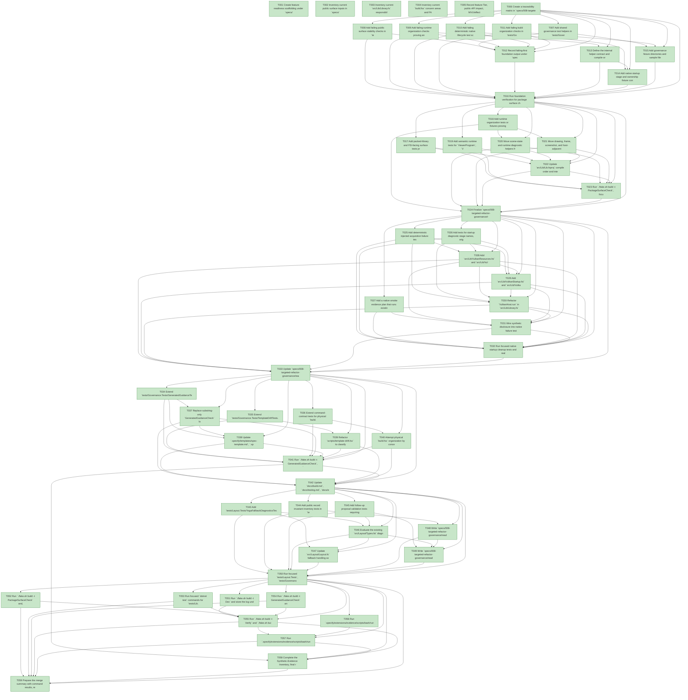

# Task Graph — 008-targeted-refactor-governance

## ✓ Graph is acyclic and consistent

## Status counts (effective)

| Status | Count |
|--------|-------|
| [X] done | 59 |
| [S] synthetic | 0 |
| [S*] auto-synthetic | 0 |

## Graph



## ASCII view

```
T001 [X] Create feature readiness scaffolding under `specs/008-targeted-refactor-governance/readiness/` for public surface, semantic tests, native cleanup, native smoke, build organization, generated guidance, template drift, Yoga fallback diagnostics, record invariants, follow-ups, graph output, and audit output
T002 [X] Inventory current public surface inputs in `specs/008-targeted-refactor-governance/readiness/public-surface-inventory.md`, including `src/Lib/Library.fsi`, package surface baselines under `readiness/surface-baselines/`, samples, and package tests
T003 [X] Inventory current `src/Lib/Library.fs` responsibilities in `specs/008-targeted-refactor-governance/readiness/runtime-responsibility-map.md`, covering scene state, diagnostics, drawing, native resources, frame flow, screenshots, and viewer hosting
T004 [X] Inventory current `build.fsx` concern areas and FAKE target load requirements in `specs/008-targeted-refactor-governance/readiness/build-organization.md`
T005 [X] Record feature Tier, public-API impact, MVU/effect-boundary applicability, synthetic native evidence policy, unsupported scope, and required evidence obligations in `specs/008-targeted-refactor-governance/readiness/evidence-obligations.md`
T006 [X] Create a traceability matrix in `specs/008-targeted-refactor-governance/readiness/traceability.md` mapping FR/SC/contract targets to tests, implementation files, commands, and readiness artifacts
T007 [X] Add shared governance test helpers in `tests/Governance.Tests/TestSupport.fs` for Markdown section spans, path-class fixtures, same-diff evidence fixtures, readiness table parsing, and command output assertions
T008 [X] Add failing public surface stability checks in `tests/Package.Tests/SurfaceAreaTests.fs` proving `src/Lib/Library.fsi`, package baselines, helper-module exports, and any new helper `.fsi` files do not introduce unapproved package-visible public modules or members for this feature
T009 [X] Add failing runtime organization checks proving any accepted `src/Lib/Library.fs` split uses paired `.fsi` contracts or documented named fallback sections without top-level visibility modifiers in `.fs` files
T010 [X] Add failing deterministic native lifecycle test scaffolding in `tests/Lib.Tests/NativeStartupCleanupTests.fs` for owned resource categories, injected acquisition failures, release order, and synthetic disclosure
T011 [X] Add failing build organization checks in `tests/Governance.Tests/CommandContractTests.fs` for `BuildModel`, `BuildMsg`, `BuildEffect`, pure `update`, emitted effects, edge interpreter behavior, and `Dev`/`Verify`/`Ci` load contracts
T012 [X] Record failing-first foundation output under `specs/008-targeted-refactor-governance/readiness/logs/` for the public surface, runtime organization, native lifecycle, and build organization checks
T013 [X] Define the internal helper contract and compile-order strategy in `specs/008-targeted-refactor-governance/readiness/runtime-responsibility-map.md`, including accepted `.fsi` file pairs or named-section fallback rules
T014 [X] Add native startup stage and ownership fixture contracts used by tests without exposing new public API from `src/Lib/Library.fsi`
T015 [X] Add governance fixture directories and sample files for generated guidance section failures, deferred-scope placement failures, template drift path classes, same-diff alignment evidence, and accepted deferral records
T016 [X] Run foundation verification for package surface checks, governance tests, native lifecycle scaffolding, and command-contract checks; store output under `specs/008-targeted-refactor-governance/readiness/logs/`
T017 [X] Add packed-library and FSI-facing surface tests proving `src/Lib/Library.fsi`, public modules, samples, and package baselines remain source-compatible after internal splitting
T018 [X] Add runtime organization tests or fixtures proving scene model, diagnostics, drawing, native resources, frame flow, screenshots, and viewer hosting are separated by files or named sections with recorded reviewer notes
T019 [X] Add semantic runtime tests for `ViewerProgram`, `ViewerEffect`, pure update behavior, emitted effects, and real interpreter or smoke evidence where safe
T020 [X] Move scene-state and runtime diagnostic helpers from `src/Lib/Library.fs` into paired helper files such as `src/Lib/SceneModel.fsi`/`.fs` and `src/Lib/RuntimeDiagnostics.fsi`/`.fs`, or record named-section fallback evidence
T021 [X] Move drawing, frame, screenshot, and host-adjacent helpers into paired helper files such as `src/Lib/VulkanFrame.fsi`/`.fs`, or record named-section fallback evidence when the split is not compile-stable
T022 [X] Update `src/Lib/Lib.fsproj` compile order and internal call sites so the public `Library.fs` facade and `src/Lib/Library.fsi` contract remain stable
T023 [X] Run `./fake.sh build -t PackageSurfaceCheck`, focused `tests/Lib.Tests`, and packed-library or FSI evidence; store outputs in `specs/008-targeted-refactor-governance/readiness/public-surface.txt` and `semantic-tests.txt`
T024 [X] Finalize `specs/008-targeted-refactor-governance/readiness/runtime-responsibility-map.md` with accepted split files or named-section fallback rationale and reviewer notes
T025 [X] Add deterministic injected acquisition failure tests in `tests/Lib.Tests/NativeStartupCleanupTests.fs` for Vulkan instance, surface, device/queues, swapchain/images, command pool/buffers, fences, staging buffers/memory, and Skia GPU resources
T026 [X] Add tests for startup diagnostic stage names, original native error preservation, reverse cleanup order, ownership transfer points, successful shutdown, and repeated cleanup idempotency
T027 [X] Add a native smoke evidence plan that runs existing real Vulkan smoke where supported and records unsupported-environment diagnostics separately from implementation defects
T028 [X] Add `src/Lib/VulkanResources.fsi` and `src/Lib/VulkanResources.fs` ownership helpers or equivalent scoped rules for owner, acquire stage, transfer point, release action, release order, and disposal state
T029 [X] Add `src/Lib/VulkanStartup.fsi` and `src/Lib/VulkanStartup.fs` named startup stages with `Result`-based failure propagation and acquisition abstraction for deterministic tests
T030 [X] Refactor `VulkanHost.run` in `src/Lib/Library.fs` to use the staged startup pipeline, unwind ownership in reverse order on failure, and transfer resources only after successful initialization
T031 [X] Wire synthetic disclosure into native failure test names and readiness evidence, and preserve real native smoke invocation where the current environment supports it
T032 [X] Run focused native startup cleanup tests and real native smoke or unsupported-environment smoke diagnostics; store outputs in `native-startup-cleanup-tests.txt` and `native-smoke.txt`
T033 [X] Update `specs/008-targeted-refactor-governance/readiness/native-startup-cleanup.md` with every startup stage, acquired resource, cleanup owner, failure diagnostic, release order, transfer point, and synthetic/real evidence status
T034 [X] Extend `tests/Governance.Tests/GeneratedGuidanceTests.fs` with failing fixtures for missing headings, missing prompts, prompts only in deferred scope, wrong-section prompts, and active/preset parity mismatches
T035 [X] Extend `tests/Governance.Tests/TemplateDriftTests.fs` with failing fixtures for template-owned path classes, required alignment classes, same-diff evidence, active spec/plan/readiness mentions, and accepted deferral schema fields
T036 [X] Extend command-contract tests for physical `build.fsx` split acceptance or named-section fallback, preserving `BuildModel`, `BuildMsg`, `BuildEffect`, pure `update`, emitted effects, interpreter boundaries, and `Dev`/`Verify`/`Ci` target semantics
T037 [X] Replace substring-only `GeneratedGuidanceCheck` logic with structured Markdown section parsing, scoped prompt validation, deferred-scope detection, and active/preset parity diagnostics that name path, section, prompt, and mismatch class
T038 [X] Update `.specify/templates/spec-template.md`, `.specify/presets/fsharp-opinionated/templates/spec-template.md`, `.specify/templates/plan-template.md`, and `.specify/presets/fsharp-opinionated/templates/plan-template.md` only where required by the semantic guidance contract
T039 [X] Refactor `scripts/template-drift.fsx` to classify changed template-owned paths, map path classes to required alignment classes, validate same-diff alignment files plus active feature evidence, and report accepted deferrals with required fields
T040 [X] Attempt physical `build.fsx` organization by concern; accept it only if `Dev`, `Verify`, and `Ci` load cross-platform, otherwise keep one canonical `build.fsx` with path model, effects, interpreter, validation, governance, guidance, and target graph sections
T041 [X] Run `./fake.sh build -t GeneratedGuidanceCheck`, `./fake.sh build -t TemplateDrift`, and Linux plus Windows `Dev`/`Verify`/`Ci` load checks where available; store outputs or unsupported-platform rationale in `generated-guidance.md`, `template-drift.md`, and `build-organization.md`
T042 [X] Update `docs/build.md`, `docs/testing.md`, `docs/evidence.md`, `docs/speckit.md`, README, or workflow docs only where final diagnostics, target semantics, or deferral boundaries changed
T043 [X] Add `tests/Layout.Tests/YogaFallbackDiagnosticsTests.fs` forcing recoverable Yoga execution failure and asserting safe fallback bounds plus an observable diagnostic through existing `LayoutDiagnostic` fields when sufficient
T044 [X] Add public record invariant inventory tests in `tests/Governance.Tests/PublicRecordInvariantTests.fs` that enumerate public records from `FS.Skia.UI`, `FS.Skia.UI.Layout`, and `FS.Skia.UI.Charts` and fail on missing inventory rows
T045 [X] Add follow-up proposal validation tests requiring Yoga public-surface blockers and helper-constructor or validation-first recommendations to appear in `specs/008-targeted-refactor-governance/readiness/follow-ups.md` with stable IDs
T046 [X] Evaluate the existing `src/Layout/Types.fsi` diagnostic surface and either implement Yoga fallback diagnostics using existing fields or record a follow-up API proposal without changing public signatures
T047 [X] Update `src/Layout/Layout.fs` fallback handling so recoverable Yoga execution failure keeps deterministic safe bounds and emits `FallbackBoundsApplied` diagnostic data through existing fields when surface-sufficient
T048 [X] Write `specs/008-targeted-refactor-governance/readiness/record-invariants.md` with package, record name, fields, invariant, construction stance, decision, rationale, and follow-up ID where needed for every public record
T049 [X] Write `specs/008-targeted-refactor-governance/readiness/follow-ups.md` for any Yoga diagnostic surface gap or public record helper/validation API recommendation, keeping all public API work out of this feature
T050 [X] Run focused `tests/Layout.Tests`, `tests/Governance.Tests`, and package surface checks for Yoga fallback diagnostics, record inventory completeness, follow-up validation, safe fallback bounds, and no `Library.fsi` change; store outputs in `yoga-fallback-diagnostics.txt`, `record-invariants.md`, and `follow-ups.md`
T051 [X] Run `./fake.sh build -t Dev` and store the log under `specs/008-targeted-refactor-governance/readiness/logs/`
T052 [X] Run `./fake.sh build -t PackageSurfaceCheck` and, only if intentionally refreshing unchanged baselines is required, `./fake.sh build -t RefreshSurfaceBaselines`; store public surface output in `specs/008-targeted-refactor-governance/readiness/public-surface.txt`
T053 [X] Run focused `dotnet test` commands for `tests/Lib.Tests`, `tests/Layout.Tests`, `tests/Governance.Tests`, and `tests/Package.Tests`; store semantic and diagnostic logs under `specs/008-targeted-refactor-governance/readiness/logs/`
T054 [X] Run `./fake.sh build -t GeneratedGuidanceCheck` and `./fake.sh build -t TemplateDrift`; confirm readiness reports name missing sections, prompts, path classes, alignment classes, and accepted deferrals
T055 [X] Run `./fake.sh build -t Verify` and `./fake.sh build -t Ci`; confirm `Ci` delegates to `Verify`, required evidence artifacts exist, and build organization acceptance or fallback evidence is recorded
T056 [X] Run `.specify/extensions/evidence/scripts/bash/run-audit.sh specs/008-targeted-refactor-governance --graph-only` and confirm no cycles, dangling references, orphaned tasks, or unexpected propagated statuses
T057 [X] Run `.specify/extensions/evidence/scripts/bash/run-audit.sh specs/008-targeted-refactor-governance` and confirm PASS, or document every unresolved synthetic-evidence or diff-scan blocker
T058 [X] Complete the Synthetic-Evidence Inventory, final readiness review, and follow-up proposal cross-links so no synthetic-only evidence or public API recommendation is hidden
T059 [X] Prepare the merge summary with command results, readiness evidence paths, public surface verdict, native cleanup verdict, governance diagnostic verdict, Yoga/record invariant verdict, and deferred public API work
```

