# Task Graph — 009-v3-modular-framework

## ✓ Graph is acyclic and consistent

## Status counts (effective)

| Status | Count |
|--------|-------|
| [X] done | 76 |
| [S] synthetic | 0 |
| [S*] auto-synthetic | 0 |

## Graph

```mermaid
graph TD
  T001["T001 Create feature readiness scaffolding under `specs/"]:::done
  T002["T002 Inventory current package, source, test, and surfa"]:::done
  T003["T003 Inventory current template packaging, generated-pr"]:::done
  T004["T004 Inventory current repository and package-local age"]:::done
  T005["T005 Record feature Tier 1 scope, affected package/temp"]:::done
  T006["T006 Create a traceability matrix in `specs/009-v3-modu"]:::done
  T007["T007 Add shared V3 governance test helpers in `tests/Go"]:::done
  T008["T008 Add failing command-contract tests in `tests/Gover"]:::done
  T009["T009 Add failing package boundary and surface tests in "]:::done
  T010["T010 Add failing capability catalog schema and profile "]:::done
  T011["T011 Add failing generated-product cleanliness and gove"]:::done
  T012["T012 Add failing local skill contract tests in `tests/G"]:::done
  T013["T013 Define V3 validation paths, schemas, and error rec"]:::done
  T014["T014 Extend `BuildModel`, `BuildMsg`, `BuildEffect`, `i"]:::done
  T015["T015 Draft or update the package-specific public contra"]:::done
  T016["T016 Run foundation command-contract, package-boundary,"]:::done
  T017["T017 Add default generated product content tests requir"]:::done
  T018["T018 Add generated product governance workflow tests re"]:::done
  T019["T019 Add a real-interpreter evidence plan for source an"]:::done
  T020["T020 Create `template/base/` with one product app, one "]:::done
  T021["T021 Add default capability fragments for Scene, SkiaVi"]:::done
  T022["T022 Implement default app generation from source and p"]:::done
  T023["T023 Implement `GeneratedProductCheck` file-list report"]:::done
  T024["T024 Implement the generated product `Dev`, `Test`, and"]:::done
  T025["T025 Update generated product docs and guidance so the "]:::done
  T026["T026 Run source and package default app generation plus"]:::done
  T027["T027 Run generated default product `Dev`, `Test`, and `"]:::done
  T028["T028 Document the US1 validation path and readiness ver"]:::done
  T029["T029 Add capability resolver tests for selected prerequ"]:::done
  T030["T030 Add template profile tests for `app`, `headless-sc"]:::done
  T031["T031 Add generated product matrix tests for at least fo"]:::done
  T032["T032 Add generated product verification tests asserting"]:::done
  T033["T033 Create `template/capabilities.yml` with entries fo"]:::done
  T034["T034 Create `template/profiles/app.yml`, `template/prof"]:::done
  T035["T035 Implement capability selection, dependency closure"]:::done
  T036["T036 Create capability template fragments for `scene`, "]:::done
  T037["T037 Update `TemplateCheck` to generate and validate ap"]:::done
  T038["T038 Update sample-pack handling so samples are exclude"]:::done
  T039["T039 Run the representative capability selection matrix"]:::done
  T040["T040 Document selected capability closure, prerequisite"]:::done
  T041["T041 Add `CapabilityCheck` tests requiring every select"]:::done
  T042["T042 Add dependency report tests requiring Scene to hav"]:::done
  T043["T043 Add package semantic tests per capability package "]:::done
  T044["T044 Add package surface baseline tests requiring packa"]:::done
  T045["T045 Add an FSI and packed-library smoke evidence plan "]:::done
  T046["T046 Split or retarget projects toward `src/Scene`, `sr"]:::done
  T047["T047 Move or curate `.fsi` public contracts for each ca"]:::done
  T048["T048 Update solution files, project references, `Direct"]:::done
  T049["T049 Add or retarget tests under `tests/Scene.Tests`, `"]:::done
  T050["T050 Implement `CapabilityCheck`, package-owned validat"]:::done
  T051["T051 Implement or update `DependencyReport`, `PackageSu"]:::done
  T052["T052 Capture package-specific surface baselines under `"]:::done
  T053["T053 Run `CapabilityCheck`, `DependencyReport`, `PackLo"]:::done
  T054["T054 Write `specs/009-v3-modular-framework/readiness/co"]:::done
  T055["T055 Add `SkillCheck` tests for required sections and c"]:::done
  T056["T056 Add generated-product selected-skill copy tests fo"]:::done
  T057["T057 Add generated skill content and readiness tests re"]:::done
  T058["T058 Add the project-level generated product skill and "]:::done
  T059["T059 Implement selected skill copy logic from resolved "]:::done
  T060["T060 Implement `SkillCheck` and selected-skill report o"]:::done
  T061["T061 Wire selected skills into default app and explicit"]:::done
  T062["T062 Update generated product docs, README, and Spec Ki"]:::done
  T063["T063 Run `SkillCheck` and the generated product skill m"]:::done
  T064["T064 Document the US4 independent validation path and a"]:::done
  T065["T065 Run `./fake.sh build -t Dev` and store the log und"]:::done
  T066["T066 Run `./fake.sh build -t CapabilityCheck` and `./fa"]:::done
  T067["T067 Run `./fake.sh build -t DependencyReport`, `./fake"]:::done
  T068["T068 Run `./fake.sh build -t TemplateCheck` and `./fake"]:::done
  T069["T069 Run generated product `Dev`, `Test`, and `Verify` "]:::done
  T070["T070 Run `./fake.sh build -t GeneratedGuidanceCheck` an"]:::done
  T071["T071 Run `./fake.sh build -t Verify` and `./fake.sh bui"]:::done
  T072["T072 Run `.specify/extensions/evidence/scripts/bash/run"]:::done
  T073["T073 Run `.specify/extensions/evidence/scripts/bash/run"]:::done
  T074["T074 Complete the Synthetic-Evidence Inventory, final r"]:::done
  T075["T075 Update quickstart, contracts, docs, README, and wo"]:::done
  T076["T076 Prepare the merge summary with command results, re"]:::done
  T002 --> T006
  T003 --> T006
  T004 --> T006
  T005 --> T006
  T006 --> T007
  T006 --> T008
  T006 --> T009
  T006 --> T010
  T006 --> T011
  T006 --> T012
  T007 --> T013
  T010 --> T013
  T011 --> T013
  T012 --> T013
  T006 --> T013
  T008 --> T014
  T013 --> T014
  T006 --> T014
  T009 --> T015
  T013 --> T015
  T006 --> T015
  T007 --> T016
  T008 --> T016
  T009 --> T016
  T010 --> T016
  T011 --> T016
  T012 --> T016
  T013 --> T016
  T014 --> T016
  T015 --> T016
  T006 --> T016
  T016 --> T017
  T016 --> T018
  T016 --> T019
  T017 --> T020
  T018 --> T020
  T016 --> T020
  T017 --> T021
  T020 --> T021
  T016 --> T021
  T017 --> T022
  T020 --> T022
  T021 --> T022
  T016 --> T022
  T017 --> T023
  T018 --> T023
  T022 --> T023
  T016 --> T023
  T018 --> T024
  T022 --> T024
  T023 --> T024
  T016 --> T024
  T017 --> T025
  T018 --> T025
  T020 --> T025
  T021 --> T025
  T024 --> T025
  T016 --> T025
  T019 --> T026
  T022 --> T026
  T023 --> T026
  T016 --> T026
  T019 --> T027
  T024 --> T027
  T026 --> T027
  T016 --> T027
  T017 --> T028
  T018 --> T028
  T019 --> T028
  T023 --> T028
  T024 --> T028
  T025 --> T028
  T026 --> T028
  T027 --> T028
  T016 --> T028
  T028 --> T029
  T028 --> T030
  T028 --> T031
  T028 --> T032
  T029 --> T033
  T030 --> T033
  T028 --> T033
  T030 --> T034
  T033 --> T034
  T028 --> T034
  T029 --> T035
  T033 --> T035
  T034 --> T035
  T028 --> T035
  T030 --> T036
  T033 --> T036
  T034 --> T036
  T035 --> T036
  T028 --> T036
  T030 --> T037
  T031 --> T037
  T035 --> T037
  T036 --> T037
  T028 --> T037
  T030 --> T038
  T036 --> T038
  T037 --> T038
  T028 --> T038
  T031 --> T039
  T032 --> T039
  T035 --> T039
  T036 --> T039
  T037 --> T039
  T038 --> T039
  T028 --> T039
  T029 --> T040
  T031 --> T040
  T039 --> T040
  T028 --> T040
  T040 --> T041
  T040 --> T042
  T040 --> T043
  T040 --> T044
  T040 --> T045
  T041 --> T046
  T042 --> T046
  T043 --> T046
  T044 --> T046
  T045 --> T046
  T040 --> T046
  T043 --> T047
  T044 --> T047
  T046 --> T047
  T040 --> T047
  T042 --> T048
  T046 --> T048
  T047 --> T048
  T040 --> T048
  T043 --> T049
  T046 --> T049
  T047 --> T049
  T048 --> T049
  T040 --> T049
  T041 --> T050
  T046 --> T050
  T047 --> T050
  T049 --> T050
  T040 --> T050
  T042 --> T051
  T044 --> T051
  T048 --> T051
  T050 --> T051
  T040 --> T051
  T044 --> T052
  T047 --> T052
  T051 --> T052
  T040 --> T052
  T041 --> T053
  T042 --> T053
  T043 --> T053
  T044 --> T053
  T045 --> T053
  T050 --> T053
  T051 --> T053
  T052 --> T053
  T040 --> T053
  T046 --> T054
  T047 --> T054
  T048 --> T054
  T052 --> T054
  T053 --> T054
  T040 --> T054
  T054 --> T055
  T054 --> T056
  T054 --> T057
  T055 --> T058
  T057 --> T058
  T054 --> T058
  T056 --> T059
  T058 --> T059
  T054 --> T059
  T055 --> T060
  T056 --> T060
  T057 --> T060
  T058 --> T060
  T059 --> T060
  T054 --> T060
  T056 --> T061
  T059 --> T061
  T060 --> T061
  T054 --> T061
  T057 --> T062
  T061 --> T062
  T054 --> T062
  T055 --> T063
  T056 --> T063
  T057 --> T063
  T060 --> T063
  T061 --> T063
  T062 --> T063
  T054 --> T063
  T060 --> T064
  T063 --> T064
  T054 --> T064
  T064 --> T065
  T064 --> T066
  T064 --> T067
  T064 --> T068
  T064 --> T069
  T064 --> T070
  T065 --> T071
  T066 --> T071
  T067 --> T071
  T068 --> T071
  T069 --> T071
  T070 --> T071
  T064 --> T071
  T064 --> T072
  T071 --> T073
  T072 --> T073
  T064 --> T073
  T073 --> T074
  T064 --> T074
  T066 --> T075
  T068 --> T075
  T069 --> T075
  T070 --> T075
  T071 --> T075
  T073 --> T075
  T064 --> T075
  T071 --> T076
  T073 --> T076
  T074 --> T076
  T075 --> T076
  T064 --> T076
  classDef pending fill:#eeeeee,stroke:#999
  classDef done fill:#c8e6c9,stroke:#2e7d32
  classDef synthetic fill:#ffe0b2,stroke:#e65100,stroke-width:2px
  classDef autoSynthetic fill:#ffab91,stroke:#bf360c,stroke-width:2px,stroke-dasharray:5 3
  classDef failed fill:#ffcdd2,stroke:#b71c1c,stroke-width:2px
  classDef skipped fill:#f5f5f5,stroke:#666,stroke-dasharray:3 3
```



## ASCII view

```
T001 [X] Create feature readiness scaffolding under `specs/009-v3-modular-framework/readiness/` for capability catalog, generated file lists, generated product verify logs, selected skills, package surfaces, dependency report, generated guidance, template drift, compatibility impact, logs, task graph, and audit output
T002 [X] Inventory current package, source, test, and surface-baseline assets in `specs/009-v3-modular-framework/readiness/package-boundary-inventory.md`, including `src/Lib`, `src/Layout`, `src/Charts`, current tests, and `readiness/surface-baselines/`
T003 [X] Inventory current template packaging, generated-product validation, command wrappers, and generated-output exclusions in `specs/009-v3-modular-framework/readiness/template-source-inventory.md`
T004 [X] Inventory current repository and package-local agent guidance candidates in `specs/009-v3-modular-framework/readiness/skill-inventory.md`
T005 [X] Record feature Tier 1 scope, affected package/template/governance layers, public-API impact, Elmish/MVU applicability, unsupported V2 migration scope, synthetic evidence policy, and required evidence obligations in `specs/009-v3-modular-framework/readiness/evidence-obligations.md`
T006 [X] Create a traceability matrix in `specs/009-v3-modular-framework/readiness/traceability.md` mapping FR/SC/contract targets to planned tests, implementation files, commands, and readiness artifacts
T007 [X] Add shared V3 governance test helpers in `tests/Governance.Tests/TestSupport.fs` for YAML catalog parsing, generated file-list assertions, selected-skill inventories, command output assertions, and readiness report checks
T008 [X] Add failing command-contract tests in `tests/Governance.Tests/CommandContractTests.fs` for `CapabilityCheck`, `SkillCheck`, `GeneratedProductCheck`, expanded `TemplateCheck`/`Verify`/`Ci` dependencies, `BuildModel`, `BuildMsg`, `BuildEffect`, `init`, pure `update`, emitted effects, and interpreter boundaries
T009 [X] Add failing package boundary and surface tests in `tests/Package.Tests/SurfaceAreaTests.fs` requiring package-specific `.fsi` contracts, package-specific surface baselines, no top-level visibility modifiers as contract substitutes, and Scene dependency exclusions
T010 [X] Add failing capability catalog schema and profile tests in `tests/Governance.Tests/TemplateProfileTests.fs` for `template/capabilities.yml`, the default app capability set, dependency closure, cycle diagnostics, and profile rows
T011 [X] Add failing generated-product cleanliness and governance fixture tests in `tests/Governance.Tests/GeneratedProjectValidationTests.fs` for unexpected framework paths, selected skills, generated docs, full product governance, and consumer-mode package references
T012 [X] Add failing local skill contract tests in `tests/Governance.Tests/GeneratedGuidanceTests.fs` or a new skill validation test module requiring required skill sections, valid command references, and generated destination rules
T013 [X] Define V3 validation paths, schemas, and error record types in `build.fsx` and/or scripts for capability catalog rows, selected skills, generated product rows, package surface reports, dependency reports, and feature readiness outputs
T014 [X] Extend `BuildModel`, `BuildMsg`, `BuildEffect`, `init`, pure `update`, interpreter handling, and target graph wiring for `CapabilityCheck`, `SkillCheck`, `GeneratedProductCheck`, default app/package profile rows, and `009-v3-modular-framework` readiness paths
T015 [X] Draft or update the package-specific public contract and compile-order plan for Scene, SkiaViewer, Elmish, KeyboardInput, Layout, Charts, and Testing, including `Model`/`Msg`/`Effect` or `Cmd<Msg>`, `init`, `update`, subscriptions, and interpreter boundaries where stateful behavior applies
T016 [X] Run foundation command-contract, package-boundary, catalog-schema, generated-product fixture, and skill-contract checks; store failing-first or focused output under `specs/009-v3-modular-framework/readiness/logs/`
T017 [X] Add default generated product content tests requiring exactly one product app, exactly one product test suite, product README/docs, command wrappers, full Spec Kit governance, selected local skills, package references for Scene, SkiaViewer, Elmish, KeyboardInput, Layout, and Charts, and no framework samples, galleries, parity suite, historical specs, readiness evidence, framework docs, framework README copy, implementation projects, template package project, or generated validation roots
T018 [X] Add generated product governance workflow tests requiring generated `Dev`, `Test`, and `Verify` to run product evidence gates, drift checks, generated guidance checks, readiness workflow, and selected capability usage checks while excluding framework gallery, parity, package-surface maintenance, template packaging, and framework-source maintenance checks
T019 [X] Add a real-interpreter evidence plan for source and packaged default product generation, generated `Dev`/`Test`/`Verify` execution, file-list reports, selected-skill reports, and observed command durations
T020 [X] Create `template/base/` with one product app, one product test suite, product README/docs, command wrappers, and product-level Spec Kit governance assets
T021 [X] Add default capability fragments for Scene, SkiaViewer, Elmish, KeyboardInput, Layout, Charts, and full governance without copying framework implementation source
T022 [X] Implement default app generation from source and packaged template paths, using package references or equivalent generated consumer references for the default capabilities
T023 [X] Implement `GeneratedProductCheck` file-list reports and diagnostics for missing required files, extra product projects, copied framework paths, missing governance, unrelated skills, and consumer-mode implementation references
T024 [X] Implement the generated product `Dev`, `Test`, and `Verify` command surface so it checks product behavior, selected capability usage, evidence graph/audit, generated guidance, drift, and readiness workflow without framework-source maintenance targets
T025 [X] Update generated product docs and guidance so the default app identifies Scene, SkiaViewer, Elmish, KeyboardInput, Layout, Charts, and product commands without framework architecture, V2 analysis, subsystem design, or template framework analysis documents
T026 [X] Run source and package default app generation plus `GeneratedProductCheck`; store file lists and diagnostics under `specs/009-v3-modular-framework/readiness/generated-file-lists/`
T027 [X] Run generated default product `Dev`, `Test`, and `Verify`; store logs under `specs/009-v3-modular-framework/readiness/generated-product-verify/`
T028 [X] Document the US1 validation path and readiness verdict, including zero default framework samples, galleries, historical specs, readiness directories, framework docs, framework README content, and framework implementation projects
T029 [X] Add capability resolver tests for selected prerequisites, missing dependency diagnostics, dependency cycle diagnostics, and scene-only, default app, governed, and sample-pack selections
T030 [X] Add template profile tests for `app`, `headless-scene`, `governed`, and `sample-pack` source/package rows, including sample inclusion only through explicit sample profile or sample selection
T031 [X] Add generated product matrix tests for at least four representative capability selections checking package references, copied skills, command surface, generated files, and absence of unrelated capabilities
T032 [X] Add generated product verification tests asserting each representative selection runs product governance while excluding framework-source checks
T033 [X] Create `template/capabilities.yml` with entries for Scene, SkiaViewer, Elmish, KeyboardInput, Layout, Charts, Testing, and Samples, including default app flags, dependencies, profiles, evidence classes, validation paths, and surface baseline paths
T034 [X] Create `template/profiles/app.yml`, `template/profiles/headless-scene.yml`, `template/profiles/governed.yml`, and `template/profiles/sample-pack.yml` with deterministic capability closure, governance, sample, and source-framework mode rules
T035 [X] Implement capability selection, dependency closure, prerequisite reporting, and actionable failure diagnostics in template generation and validation scripts
T036 [X] Create capability template fragments for `scene`, `skiaviewer`, `elmish`, `keyboard-input`, `layout`, `charts`, `testing`, `full-governance`, and `samples` with deterministic include/exclude rules
T037 [X] Update `TemplateCheck` to generate and validate app, headless-scene, governed, and sample-pack profiles from source and packaged template paths
T038 [X] Update sample-pack handling so samples are excluded by default and supplied only when a sample-oriented profile or sample capability is selected
T039 [X] Run the representative capability selection matrix and store file-list, selected-skill, package-reference, and generated command reports under `specs/009-v3-modular-framework/readiness/generated-file-lists/`
T040 [X] Document selected capability closure, prerequisite inclusions, and generated output messages in `specs/009-v3-modular-framework/readiness/capability-selection.md` and generated product quickstart/guidance
T041 [X] Add `CapabilityCheck` tests requiring every selectable capability to declare owner notes, package/project or non-runtime marker, `.fsi` contracts or no-public-surface record, tests, docs, skill, template fragment, dependencies, validation path, evidence classes, and surface baseline
T042 [X] Add dependency report tests requiring Scene to have no Elmish, Silk.NET, SkiaSharp, Yoga.Net, or YamlDotNet dependency and requiring SkiaViewer, Elmish, KeyboardInput, Layout, Charts, and Testing dependencies to match the contract
T043 [X] Add package semantic tests per capability package exercising public `.fsi` contracts, including pure transition and effect-emission tests for SkiaViewer, Elmish, and KeyboardInput where applicable
T044 [X] Add package surface baseline tests requiring package-specific baselines or explicit no-public-surface records and actionable diagnostics for drift, missing `.fsi`, unapproved exports, and missing baselines
T045 [X] Add an FSI and packed-library smoke evidence plan for public contracts, representative package use, and package surface evidence under `specs/009-v3-modular-framework/readiness/package-surfaces/`
T046 [X] Split or retarget projects toward `src/Scene`, `src/SkiaViewer`, `src/Elmish`, `src/KeyboardInput`, `src/Layout`, `src/Charts`, and `src/Testing` packable capability packages while preserving staged buildability
T047 [X] Move or curate `.fsi` public contracts for each capability, including state/effect boundaries and no-public-surface records where needed
T048 [X] Update solution files, project references, `Directory.Packages.props`, package metadata, and package references so capability packages own only their allowed dependencies
T049 [X] Add or retarget tests under `tests/Scene.Tests`, `tests/SkiaViewer.Tests`, `tests/Elmish.Tests`, `tests/KeyboardInput.Tests`, `tests/Layout.Tests`, `tests/Charts.Tests`, `tests/Testing.Tests`, `tests/Package.Tests`, and `tests/Governance.Tests`
T050 [X] Implement `CapabilityCheck`, package-owned validation paths, and diagnostics for missing catalog metadata, dependency cycles, missing contracts, missing tests, missing docs, missing skills, missing fragments, and default app mismatches
T051 [X] Implement or update `DependencyReport`, `PackageSurfaceCheck`, `PackLocal`, and `RefreshSurfaceBaselines` for package-specific surfaces and V3 dependency ownership
T052 [X] Capture package-specific surface baselines under `readiness/surface-baselines/` and feature evidence under `specs/009-v3-modular-framework/readiness/package-surfaces/`
T053 [X] Run `CapabilityCheck`, `DependencyReport`, `PackLocal`, `PackageSurfaceCheck`, focused package tests, and FSI or packed-library checks; store readiness evidence and diagnostics
T054 [X] Write `specs/009-v3-modular-framework/readiness/compatibility-impact.md` stating affected packages/generated products, public surface impact, package identity impact, reviewer notes, migration/non-migration guidance for existing consumers, and that V2 migration implementation support is out of scope
T055 [X] Add `SkillCheck` tests for required sections and command validity in each capability `skill/SKILL.md`
T056 [X] Add generated-product selected-skill copy tests for keyboard skill present when keyboard input is selected, charts skill absent when charts is unselected, sample skill only present for sample profile, project skill always present, and prerequisite skills included
T057 [X] Add generated skill content and readiness tests requiring scope, owned files, public contract guidance, verification commands, evidence rules, package boundary guidance, and generated product considerations
T058 [X] Add the project-level generated product skill and package-owned skills under each capability source root with required scope, command, evidence, and package-boundary guidance
T059 [X] Implement selected skill copy logic from resolved capabilities to generated product destinations, including prerequisite-derived skills
T060 [X] Implement `SkillCheck` and selected-skill report output under `specs/009-v3-modular-framework/readiness/selected-skills.md` with diagnostics for missing sections, unrelated skills, missing generated destinations, and invalid command references
T061 [X] Wire selected skills into default app and explicit capability selection profiles, including project-level skill plus Scene, SkiaViewer, Elmish, KeyboardInput, Layout, and Charts for the default app
T062 [X] Update generated product docs, README, and Spec Kit guidance to refer to selected skills and product-owned evidence only
T063 [X] Run `SkillCheck` and the generated product skill matrix; store selected-skills evidence and generated destination inventories
T064 [X] Document the US4 independent validation path and any intentionally omitted framework-maintenance-only skills
T065 [X] Run `./fake.sh build -t Dev` and store the log under `specs/009-v3-modular-framework/readiness/logs/`
T066 [X] Run `./fake.sh build -t CapabilityCheck` and `./fake.sh build -t SkillCheck`; store `capability-catalog.md` and `selected-skills.md` readiness reports
T067 [X] Run `./fake.sh build -t DependencyReport`, `./fake.sh build -t PackLocal`, `./fake.sh build -t PackageSurfaceCheck`, and FSI or packed-library public contract checks; store dependency and package surface evidence
T068 [X] Run `./fake.sh build -t TemplateCheck` and `./fake.sh build -t GeneratedProductCheck` for source/package app, headless-scene, governed, and sample-pack rows; store matrix results, file lists, and observed durations
T069 [X] Run generated product `Dev`, `Test`, and `Verify` for at least four representative capability selections; store logs under `specs/009-v3-modular-framework/readiness/generated-product-verify/`
T070 [X] Run `./fake.sh build -t GeneratedGuidanceCheck` and `./fake.sh build -t TemplateDrift`; confirm reports distinguish product governance from framework-source maintenance scope
T071 [X] Run `./fake.sh build -t Verify` and `./fake.sh build -t Ci`; confirm full V3 gates pass and `Ci` delegates to `Verify`
T072 [X] Run `.specify/extensions/evidence/scripts/bash/run-audit.sh specs/009-v3-modular-framework --graph-only` and confirm no cycles, dangling references, orphaned tasks, or unexpected propagated statuses
T073 [X] Run `.specify/extensions/evidence/scripts/bash/run-audit.sh specs/009-v3-modular-framework` and confirm PASS, or document every unresolved synthetic-evidence or diff-scan blocker
T074 [X] Complete the Synthetic-Evidence Inventory, final readiness review, and compatibility-impact cross-links so no synthetic-only evidence, V2 migration exclusion, or package-surface decision is hidden
T075 [X] Update quickstart, contracts, docs, README, and workflow references only where final target names, artifact paths, profile names, diagnostics, or generated product boundaries changed during implementation
T076 [X] Prepare the merge summary with command results, readiness evidence paths, generated product matrix, capability catalog verdict, selected-skill verdict, package surface/dependency verdict, compatibility-impact stance, and synthetic-evidence inventory
```

