# Task Graph — 010-skia-controls-library

## ✓ Graph is acyclic and consistent

## Status counts (effective)

| Status | Count |
|--------|-------|
| [X] done | 108 |
| [S] synthetic | 0 |
| [S*] auto-synthetic | 0 |
| [-] skipped | 1 |

## Graph

```mermaid
graph TD
  T001["T001 Create `specs/010-skia-controls-library/readiness/"]:::done
  T002["T002 Inventory existing Charts package, chart samples, "]:::done
  T003["T003 Inventory current build targets, generated product"]:::done
  T004["T004 Record Elmish/MVU applicability for Controls autho"]:::done
  T005["T005 Record the dependency baseline for Scene, Layout, "]:::done
  T006["T006 Record setup evidence obligations, unsupported sco"]:::done
  T007["T007 Add `src/Controls/Controls.fsproj` with `FS.Skia.U"]:::done
  T008["T008 Draft public `.fsi` contracts for `Types`, `Contro"]:::done
  T009["T009 Draft the reference gallery MVU contract with `Mod"]:::done
  T010["T010 Draft the generated product controls example MVU c"]:::done
  T011["T011 Define the structured `src/Controls/catalog.yml` s"]:::done
  T012["T012 Add `tests/Controls.Tests/Controls.Tests.fsproj` w"]:::done
  T013["T013 Add an FSI transcript harness for the packed or pr"]:::done
  T014["T014 Add the package surface baseline path `readiness/s"]:::done
  T015["T015 Update repository package/build inventory so Contr"]:::done
  T016["T016 Define structured diagnostics for missing attribut"]:::done
  T017["T017 Define the runtime boundary between Controls, Scen"]:::done
  T018["T018 Add failing-first governance tests for Controls de"]:::done
  T019["T019 Add failing-first skill governance tests for `fs-s"]:::done
  T020["T020 Exercise the draft `.fsi` contracts from FSI and c"]:::done
  T021["T021 Record foundation readiness, unsupported-scope dia"]:::done
  T022["T022 Add semantic tests that load the packed library or"]:::done
  T023["T023 Add pure MVU transition tests for the representati"]:::done
  T024["T024 Add interaction dispatch tests for pointer activat"]:::done
  T025["T025 Add a real interpreter or smoke-run evidence path "]:::done
  T026["T026 Implement the core typed DSL: `Control<'msg>`, `At"]:::done
  T027["T027 Implement content and children composition, stable"]:::done
  T028["T028 Implement representative view-function controls fo"]:::done
  T029["T029 Implement model-owned state reflection for display"]:::done
  T030["T030 Implement message-oriented event mapping so tested"]:::done
  T031["T031 Implement keyed transient interaction state for ho"]:::done
  T032["T032 Connect Controls render, layout, hit-test, focus, "]:::done
  T033["T033 Capture `readiness/semantic-tests.md` and `readine"]:::done
  T034["T034 Document the US1 independent validation path and c"]:::done
  T035["T035 Add catalog contract tests requiring at least 30 s"]:::done
  T036["T036 Add reference gallery rendering tests covering eve"]:::done
  T037["T037 Add accessibility validation tests for role, acces"]:::done
  T038["T038 Add large data control tests for 10,000 items, bou"]:::done
  T039["T039 Add chart and graph ownership tests proving catalo"]:::done
  T040["T040 Populate `src/Controls/catalog.yml` with supported"]:::done
  T041["T041 Implement supported display, input, selection, nav"]:::done
  T042["T042 Implement plain single-line and multi-line text en"]:::done
  T043["T043 Implement list and table-like controls with bounde"]:::done
  T044["T044 Move or adapt chart and graph controls into Contro"]:::done
  T045["T045 Build `samples/ControlsGallery/` as the reference "]:::done
  T046["T046 Implement accessibility metadata, focus traversal,"]:::done
  T047["T047 Implement `ControlsCatalogCheck` or equivalent `Ve"]:::done
  T048["T048 Implement `ControlsInteractionCheck` and `Controls"]:::done
  T049["T049 Capture `readiness/control-catalog.md` and `readin"]:::done
  T050["T050 Document the US2 independent catalog validation pa"]:::done
  T051["T051 Add tests that compose five unrelated controls fro"]:::done
  T052["T052 Add tests for duplicate attributes, missing requir"]:::done
  T053["T053 Add theme, style, and layout override tests across"]:::done
  T054["T054 Implement common attribute groups for content, chi"]:::done
  T055["T055 Normalize module names and `create : Attr<'msg> li"]:::done
  T056["T056 Implement application-level themes, per-control ov"]:::done
  T057["T057 Implement validation diagnostics for missing attri"]:::done
  T058["T058 Update catalog metadata, docs, and examples to dem"]:::done
  T059["T059 Exercise a five-control declarative configuration "]:::done
  T060["T060 Capture `readiness/semantic-tests.md` evidence for"]:::done
  T061["T061 Document the US3 independent validation path"]:::done
  T062["T062 Add package surface tests for Controls `.fsi` cove"]:::done
  T063["T063 Add generated product tests for default Controls c"]:::done
  T064["T064 Add capability and template tests rejecting active"]:::done
  T065["T065 Add skill validation tests for `fs-skia-ui-widgets"]:::done
  T066["T066 Add dependency governance tests proving Controls d"]:::done
  T067["T067 Add generated guidance and template drift tests fo"]:::done
  T068["T068 Update `template/capabilities.yml` and profiles so"]:::done
  T069["T069 Add `template/fragments/controls/` with Controls p"]:::done
  T070["T070 Add `src/Controls/skill/SKILL.md` and generated `f"]:::done
  T071["T071 Update Scene, SkiaViewer, Elmish, KeyboardInput, L"]:::done
  T072["T072 Remove or deactivate Charts package, capability, t"]:::done
  T073["T073 Update `build.fsx` command surface so `Dev`, `Veri"]:::done
  T074["T074 Update `Directory.Packages.props`, package metadat"]:::done
  T075["T075 Update governance, package, smoke, and surface-bas"]:::done
  T076["T076 Generate source/package validation roots and prove"]:::done
  T077["T077 Capture `readiness/generated-product-usage.md`, `r"]:::done
  T078["T078 Capture `readiness/public-surface.md` for Controls"]:::done
  T079["T079 Capture `readiness/compatibility-impact.md` for Ch"]:::done
  T080["T080 Document the US4 independent validation path"]:::done
  T081["T081 Add semantic tests for the `CustomControl` public "]:::done
  T082["T082 Add interaction, layout, and rendering tests for a"]:::done
  T083["T083 Add diagnostics tests proving missing layout, inpu"]:::done
  T084["T084 Implement `CustomControl.fsi` and `CustomControl.f"]:::done
  T085["T085 Integrate custom controls with the control tree, l"]:::done
  T086["T086 Add custom control wrapper catalog row and Control"]:::done
  T087["T087 Capture custom wrapper evidence in `readiness/sema"]:::done
  T088["T088 Document the US5 independent validation path and e"]:::done
  T089["T089 Run `./fake.sh build -t Dev` and targeted Controls"]:::done
  T090["T090 Run `./fake.sh build -t CapabilityCheck`, `./fake."]:::done
  T091["T091 Run `./fake.sh build -t PackLocal`, `./fake.sh bui"]:::done
  T092["T092 Run `./fake.sh build -t ControlsCatalogCheck`, `./"]:::done
  T093["T093 Run `./fake.sh build -t TemplateCheck` and `./fake"]:::done
  T094["T094 Run `./fake.sh build -t GeneratedGuidanceCheck` an"]:::done
  T095["T095 Run generated product `Dev`, `Test`, and `Verify` "]:::done
  T096["T096 Run `./fake.sh build -t Verify` and `./fake.sh bui"]:::done
  T097["T097 Run `./fake.sh build -t RefreshSurfaceBaselines` o"]:::done
  T098["T098 Update `docs/controls.md`, package notes, generate"]:::done
  T099["T099 Review active generated output and repository repo"]:::done
  T100["T100 Run `.specify/extensions/evidence/scripts/bash/run"]:::done
  T101["T101 Run `./fake.sh build -t EvidenceGraph` and `./fake"]:::done
  T102["T102 Review the Synthetic-Evidence Inventory and ensure"]:::done
  T103["T103 Review compatibility impact, dependency impact, un"]:::done
  T104["T104 Produce the final readiness summary tying all feat"]:::done
  T105["T105 Draft the text-input and collection-control MVU co"]:::done
  T106["T106 Add pure transition tests for text input, selectio"]:::done
  T107["T107 Add emitted-effect assertions and real interpreter"]:::done
  T108["T108 Run and record the first-time evaluator catalog wa"]:::skipped
  T109["T109 Run a timed form-and-dashboard walkthrough using c"]:::done
  T001 --> T006
  T002 --> T006
  T003 --> T006
  T004 --> T006
  T005 --> T006
  T006 --> T007
  T006 --> T008
  T006 --> T009
  T006 --> T010
  T006 --> T011
  T006 --> T012
  T006 --> T013
  T006 --> T014
  T006 --> T015
  T006 --> T016
  T006 --> T017
  T006 --> T018
  T006 --> T019
  T008 --> T020
  T013 --> T020
  T006 --> T020
  T007 --> T021
  T008 --> T021
  T009 --> T021
  T010 --> T021
  T011 --> T021
  T012 --> T021
  T013 --> T021
  T014 --> T021
  T015 --> T021
  T016 --> T021
  T017 --> T021
  T018 --> T021
  T019 --> T021
  T020 --> T021
  T006 --> T021
  T021 --> T022
  T021 --> T023
  T021 --> T024
  T021 --> T025
  T022 --> T026
  T023 --> T026
  T021 --> T026
  T026 --> T027
  T021 --> T027
  T022 --> T028
  T026 --> T028
  T027 --> T028
  T021 --> T028
  T022 --> T029
  T023 --> T029
  T026 --> T029
  T028 --> T029
  T021 --> T029
  T024 --> T030
  T026 --> T030
  T021 --> T030
  T024 --> T031
  T026 --> T031
  T021 --> T031
  T025 --> T032
  T027 --> T032
  T028 --> T032
  T030 --> T032
  T031 --> T032
  T021 --> T032
  T022 --> T033
  T023 --> T033
  T024 --> T033
  T025 --> T033
  T029 --> T033
  T030 --> T033
  T031 --> T033
  T032 --> T033
  T021 --> T033
  T033 --> T034
  T021 --> T034
  T034 --> T035
  T034 --> T036
  T034 --> T037
  T034 --> T038
  T034 --> T039
  T035 --> T040
  T039 --> T040
  T034 --> T040
  T035 --> T041
  T040 --> T041
  T034 --> T041
  T035 --> T042
  T037 --> T042
  T040 --> T042
  T041 --> T042
  T105 --> T042
  T106 --> T042
  T107 --> T042
  T034 --> T042
  T038 --> T043
  T040 --> T043
  T041 --> T043
  T105 --> T043
  T106 --> T043
  T034 --> T043
  T039 --> T044
  T040 --> T044
  T041 --> T044
  T034 --> T044
  T036 --> T045
  T040 --> T045
  T041 --> T045
  T042 --> T045
  T043 --> T045
  T044 --> T045
  T034 --> T045
  T037 --> T046
  T040 --> T046
  T041 --> T046
  T042 --> T046
  T043 --> T046
  T044 --> T046
  T034 --> T046
  T035 --> T047
  T040 --> T047
  T045 --> T047
  T046 --> T047
  T034 --> T047
  T036 --> T048
  T038 --> T048
  T041 --> T048
  T042 --> T048
  T043 --> T048
  T044 --> T048
  T045 --> T048
  T046 --> T048
  T107 --> T048
  T034 --> T048
  T047 --> T049
  T048 --> T049
  T034 --> T049
  T049 --> T050
  T034 --> T050
  T108 --> T051
  T108 --> T052
  T108 --> T053
  T051 --> T054
  T052 --> T054
  T053 --> T054
  T108 --> T054
  T051 --> T055
  T054 --> T055
  T108 --> T055
  T053 --> T056
  T054 --> T056
  T108 --> T056
  T052 --> T057
  T054 --> T057
  T056 --> T057
  T108 --> T057
  T051 --> T058
  T055 --> T058
  T056 --> T058
  T057 --> T058
  T108 --> T058
  T051 --> T059
  T055 --> T059
  T056 --> T059
  T058 --> T059
  T108 --> T059
  T051 --> T060
  T052 --> T060
  T053 --> T060
  T054 --> T060
  T055 --> T060
  T056 --> T060
  T057 --> T060
  T059 --> T060
  T108 --> T060
  T060 --> T061
  T108 --> T061
  T061 --> T062
  T061 --> T063
  T061 --> T064
  T061 --> T065
  T061 --> T066
  T061 --> T067
  T063 --> T068
  T064 --> T068
  T066 --> T068
  T061 --> T068
  T063 --> T069
  T068 --> T069
  T061 --> T069
  T065 --> T070
  T069 --> T070
  T061 --> T070
  T065 --> T071
  T070 --> T071
  T061 --> T071
  T064 --> T072
  T068 --> T072
  T070 --> T072
  T061 --> T072
  T062 --> T073
  T063 --> T073
  T064 --> T073
  T065 --> T073
  T066 --> T073
  T067 --> T073
  T068 --> T073
  T069 --> T073
  T070 --> T073
  T072 --> T073
  T061 --> T073
  T066 --> T074
  T068 --> T074
  T073 --> T074
  T061 --> T074
  T062 --> T075
  T073 --> T075
  T074 --> T075
  T061 --> T075
  T063 --> T076
  T069 --> T076
  T073 --> T076
  T075 --> T076
  T061 --> T076
  T065 --> T077
  T066 --> T077
  T067 --> T077
  T073 --> T077
  T074 --> T077
  T076 --> T077
  T061 --> T077
  T062 --> T078
  T073 --> T078
  T075 --> T078
  T061 --> T078
  T064 --> T079
  T072 --> T079
  T074 --> T079
  T061 --> T079
  T077 --> T080
  T078 --> T080
  T079 --> T080
  T061 --> T080
  T080 --> T081
  T080 --> T082
  T080 --> T083
  T081 --> T084
  T080 --> T084
  T082 --> T085
  T083 --> T085
  T084 --> T085
  T080 --> T085
  T081 --> T086
  T082 --> T086
  T084 --> T086
  T085 --> T086
  T080 --> T086
  T082 --> T087
  T083 --> T087
  T085 --> T087
  T086 --> T087
  T080 --> T087
  T087 --> T088
  T080 --> T088
  T088 --> T089
  T089 --> T090
  T088 --> T090
  T089 --> T091
  T088 --> T091
  T089 --> T092
  T088 --> T092
  T090 --> T093
  T088 --> T093
  T090 --> T094
  T088 --> T094
  T093 --> T095
  T088 --> T095
  T090 --> T096
  T091 --> T096
  T092 --> T096
  T093 --> T096
  T094 --> T096
  T095 --> T096
  T088 --> T096
  T091 --> T097
  T096 --> T097
  T088 --> T097
  T096 --> T098
  T088 --> T098
  T093 --> T099
  T094 --> T099
  T096 --> T099
  T088 --> T099
  T096 --> T100
  T088 --> T100
  T100 --> T101
  T088 --> T101
  T101 --> T102
  T088 --> T102
  T099 --> T103
  T102 --> T103
  T088 --> T103
  T096 --> T104
  T097 --> T104
  T098 --> T104
  T099 --> T104
  T101 --> T104
  T102 --> T104
  T103 --> T104
  T108 --> T104
  T109 --> T104
  T088 --> T104
  T034 --> T105
  T105 --> T106
  T034 --> T106
  T105 --> T107
  T106 --> T107
  T034 --> T107
  T049 --> T108
  T050 --> T108
  T034 --> T108
  T098 --> T109
  T088 --> T109
  classDef pending fill:#eeeeee,stroke:#999
  classDef done fill:#c8e6c9,stroke:#2e7d32
  classDef synthetic fill:#ffe0b2,stroke:#e65100,stroke-width:2px
  classDef autoSynthetic fill:#ffab91,stroke:#bf360c,stroke-width:2px,stroke-dasharray:5 3
  classDef failed fill:#ffcdd2,stroke:#b71c1c,stroke-width:2px
  classDef skipped fill:#f5f5f5,stroke:#666,stroke-dasharray:3 3
```



## ASCII view

```
T001 [X] Create `specs/010-skia-controls-library/readiness/` with placeholders for control catalog, public surface, semantic tests, interaction tests, layout/rendering, generated product usage, local skills, dependency report, generated guidance, template drift, evidence graph, evidence audit, and compatibility impact
T002 [X] Inventory existing Charts package, chart samples, chart template fragment, chart skill, generated profile references, and surface baselines in `specs/010-skia-controls-library/readiness/compatibility-impact.md`
T003 [X] Inventory current build targets, generated product validation, template profiles, package outputs, and readiness report paths that Controls must join in `specs/010-skia-controls-library/readiness/template-drift.md`
T004 [X] Record Elmish/MVU applicability for Controls authoring, reference gallery, generated product example, text/clipboard/environment edges, and validation runners in `specs/010-skia-controls-library/readiness/semantic-tests.md`
T005 [X] Record the dependency baseline for Scene, Layout, KeyboardInput, SkiaViewer, Elmish, Charts, central package versions, and the planned `FS.Skia.UI.Controls` package in `specs/010-skia-controls-library/readiness/dependency-report.md`
T006 [X] Record setup evidence obligations, unsupported scope, real-evidence paths, and initial synthetic-evidence policy in `specs/010-skia-controls-library/readiness/evidence-audit.md`
T007 [X] Add `src/Controls/Controls.fsproj` with `FS.Skia.UI.Controls` package metadata and wire it into repository package/build discovery
T008 [X] Draft public `.fsi` contracts for `Types`, `Control`, `Attributes`, `Theme`, `Accessibility`, `Diagnostics`, `Catalog`, `TextInput`, `Collections`, `Charts`, and `CustomControl`
T009 [X] Draft the reference gallery MVU contract with `Model`, `Msg`, `Effect` or `Cmd<Msg>`, `init`, pure `update`, and interpreter boundary
T010 [X] Draft the generated product controls example MVU contract with `Model`, `Msg`, `Effect` or `Cmd<Msg>`, `init`, pure `update`, and interpreter boundary
T011 [X] Define the structured `src/Controls/catalog.yml` schema and planned supported catalog rows across display, input, selection, navigation, layout, feedback, data, chart, graph, and custom categories
T012 [X] Add `tests/Controls.Tests/Controls.Tests.fsproj` with empty test modules for catalog, public surface, semantic behavior, interaction, text input, accessibility, and rendering coverage
T013 [X] Add an FSI transcript harness for the packed or prelude-loaded Controls public surface
T014 [X] Add the package surface baseline path `readiness/surface-baselines/FS.Skia.UI.Controls.txt` and baseline refresh expectations
T015 [X] Update repository package/build inventory so Controls contracts, tests, samples, and local package output are discoverable by existing FAKE targets
T016 [X] Define structured diagnostics for missing attributes, unsupported state combinations, missing stable keys, hit-test failures, layout conflicts, missing accessibility metadata, contrast failures, and unsupported environments
T017 [X] Define the runtime boundary between Controls, Scene, Layout, KeyboardInput, SkiaViewer, and Elmish so persistent state remains model-owned and only transient interaction state is retained
T018 [X] Add failing-first governance tests for Controls default capability inclusion, generated product package references, and Charts removal from active selection
T019 [X] Add failing-first skill governance tests for `fs-skia-ui-widgets` selection and stale `fs-skia-charts` or generated `fs-skia-layout` exclusion
T020 [X] Exercise the draft `.fsi` contracts from FSI and capture the session transcript in `specs/010-skia-controls-library/readiness/public-surface.md`
T021 [X] Record foundation readiness, unsupported-scope diagnostics, and command-surface obligations before story implementation begins
T022 [X] Add semantic tests that load the packed library or prelude and construct a representative counter/form screen through `Control<'msg>` and an Elmish-style view function
T023 [X] Add pure MVU transition tests for the representative screen `Model`, `Msg`, `update`, and emitted `Effect` or `Cmd<Msg>` values
T024 [X] Add interaction dispatch tests for pointer activation, keyboard activation, disabled/read-only suppression, exactly-once messages, and stale handler prevention after model changes
T025 [X] Add a real interpreter or smoke-run evidence path for the representative screen through the viewer/input edge, with unsupported GPU, font, clipboard, text-input, IME, or window diagnostics recorded when applicable
T026 [X] Implement the core typed DSL: `Control<'msg>`, `Attr<'msg>`, `ControlId`, `ControlEvent`, `ControlDiagnostic`, `Control.withKey`, `Control.render`, and `Control.diagnostics`
T027 [X] Implement content and children composition, stable child ordering, keyed control identity, and key-collision diagnostics
T028 [X] Implement representative view-function controls for text display, button activation, editable text, toggle/checkbox state, and stack/panel composition
T029 [X] Implement model-owned state reflection for displayed values, enabled state, visibility, validation, focus indicators, selection states, hover states, pressed states, and loading states
T030 [X] Implement message-oriented event mapping so tested actions dispatch the current-view message exactly once without app-owned widget lifecycle objects
T031 [X] Implement keyed transient interaction state for hover, pressed, focus, caret, active drag, and in-progress composition without storing durable application values
T032 [X] Connect Controls render, layout, hit-test, focus, and keyboard input output to Scene, Layout, and KeyboardInput boundaries for the representative screen
T033 [X] Capture `readiness/semantic-tests.md` and `readiness/interaction-tests.md` evidence for US1, including pure update assertions, emitted-effect assertions, and real interpreter evidence where safe
T034 [X] Document the US1 independent validation path and concise authoring example in Controls documentation or readiness notes
T035 [X] Add catalog contract tests requiring at least 30 supported controls or variants with purpose, attributes, events where applicable, visual states, accessibility metadata, examples, tests, evidence, and `.fsi` members
T036 [X] Add reference gallery rendering tests covering every supported row, common states, three viewport sizes, and two DPI scale factors
T037 [X] Add accessibility validation tests for role, accessible name source, state metadata, focus order, keyboard operation, and contrast evidence
T038 [X] Add large data control tests for 10,000 items, bounded visible range, recorded visible-range recalculation threshold, observed duration evidence, empty state, selection, and item update behavior
T039 [X] Add chart and graph ownership tests proving catalog rows, generated examples, public modules, tests, and evidence are Controls-owned and not active Charts capability artifacts
T040 [X] Populate `src/Controls/catalog.yml` with supported controls or variants across display, input, selection, navigation, layout, feedback, data, chart, graph, and custom categories
T041 [X] Implement supported display, input, selection, navigation, layout, and feedback controls declared by the catalog
T042 [X] Implement plain single-line and multi-line text entry with cursor movement, selection, clipboard commands, validation feedback, committed value changes, cancellation or rejection of invalid input, and IME/composition diagnostics
T043 [X] Implement list and table-like controls with bounded rendering or visible-range behavior for 10,000 items, threshold-recorded visible-range recalculation, scrolling, empty state, single and multiple selection, and item updates
T044 [X] Move or adapt chart and graph controls into Controls public modules, examples, tests, generated guidance, and evidence
T045 [X] Build `samples/ControlsGallery/` as the reference gallery that renders every supported catalog row and common visual state
T046 [X] Implement accessibility metadata, focus traversal, keyboard operation, and contrast validation for supported interactive controls
T047 [X] Implement `ControlsCatalogCheck` or equivalent `Verify` coverage that fails on missing catalog fields, examples, tests, evidence, accessibility metadata, `.fsi` members, or stale Charts ownership
T048 [X] Implement `ControlsInteractionCheck` and `ControlsRenderingCheck` or equivalent `Verify` coverage for interaction dispatch, text entry, large data, gallery rendering, viewport/DPI evidence, and environment diagnostics
T049 [X] Capture `readiness/control-catalog.md` and `readiness/layout-rendering.md` with supported row counts, viewport/DPI results, item counts, visible-range thresholds, observed durations, accessibility findings, and environment diagnostics
T050 [X] Document the US2 independent catalog validation path
T051 [X] Add tests that compose five unrelated controls from different categories using the same creation, value, children, layout, style, validation, accessibility, and event patterns
T052 [X] Add tests for duplicate attributes, missing required attributes, invalid combinations, documented precedence, and deterministic diagnostics
T053 [X] Add theme, style, and layout override tests across different containers and model updates
T054 [X] Implement common attribute groups for content, children, layout, styling, theme, state, validation, accessibility, and message-oriented events
T055 [X] Normalize module names and `create : Attr<'msg> list -> Control<'msg>` signatures across supported catalog controls
T056 [X] Implement application-level themes, per-control overrides, density, typography, fills, strokes, corner treatment, state variants, and contrast policy hooks
T057 [X] Implement validation diagnostics for missing attributes, duplicate or conflicting attributes, unsupported state combinations, missing stable keys, layout conflicts, and accessibility gaps
T058 [X] Update catalog metadata, docs, and examples to demonstrate consistent declarative attribute patterns without special-case wiring
T059 [X] Exercise a five-control declarative configuration screen from FSI against the packed or prelude-loaded surface and capture the transcript in `readiness/public-surface.md`
T060 [X] Capture `readiness/semantic-tests.md` evidence for declarative configuration, theme overrides, diagnostics, and model-driven updates
T061 [X] Document the US3 independent validation path
T062 [X] Add package surface tests for Controls `.fsi` coverage, public baseline drift, and removed chart member compatibility records
T063 [X] Add generated product tests for default Controls capability inclusion, package references, product-owned example view, product test coverage, and no copied framework samples or implementation projects
T064 [X] Add capability and template tests rejecting active `charts` capability selection, `FS.Skia.UI.Charts` default references, chart fragments, and `fs-skia-charts` generated skills
T065 [X] Add skill validation tests for `fs-skia-ui-widgets` required sections, generated selection, stale generated layout-control skill exclusion, and related skill redirects
T066 [X] Add dependency governance tests proving Controls dependencies are declared, Layout remains a separate runtime capability, and no unexpected dependency leaks are introduced
T067 [X] Add generated guidance and template drift tests for controls guidance, chart/graph replacement guidance, stale Charts references, stale generated Layout skill references, and unsupported copied assets
T068 [X] Update `template/capabilities.yml` and profiles so the default app resolves to Scene, SkiaViewer, Elmish, KeyboardInput, Layout, and Controls while Charts is no longer active
T069 [X] Add `template/fragments/controls/` with Controls package reference guidance, concise product-owned example view, product test coverage, and widgets skill selection
T070 [X] Add `src/Controls/skill/SKILL.md` and generated `fs-skia-ui-widgets` content with Scope, Public Contract, Build Commands, Test Commands, Evidence, Package Boundary, and Generated Product sections
T071 [X] Update Scene, SkiaViewer, Elmish, KeyboardInput, Layout, Testing, and project skills to route widget, control, chart, and graph authoring to `fs-skia-ui-widgets` where applicable
T072 [X] Remove or deactivate Charts package, capability, template fragment, generated package reference, and chart-specific skill from active generated product selection while preserving compatibility notes where needed
T073 [X] Update `build.fsx` command surface so `Dev`, `Verify`, `Ci`, `PackLocal`, `PackageSurfaceCheck`, `FsiTranscripts`, `CapabilityCheck`, `SkillCheck`, `GeneratedProductCheck`, `DependencyReport`, `GeneratedGuidanceCheck`, `TemplateDrift`, `EvidenceGraph`, and `EvidenceAudit` include Controls validation or evidence
T074 [X] Update `Directory.Packages.props`, package metadata, dependency documentation, and dependency reports for Controls ownership, Layout dependency behavior, and Charts removal from active defaults
T075 [X] Update governance, package, smoke, and surface-baseline tests for the Controls package and generated product behavior
T076 [X] Generate source/package validation roots and prove the default product builds with a product-owned Controls example and without copied framework samples, galleries, specs, readiness evidence, docs, README copy, or implementation projects
T077 [X] Capture `readiness/generated-product-usage.md`, `readiness/local-skills.md`, `readiness/dependency-report.md`, `readiness/generated-guidance.md`, and `readiness/template-drift.md`
T078 [X] Capture `readiness/public-surface.md` for Controls package surface review, FSI transcripts, and surface baseline status
T079 [X] Capture `readiness/compatibility-impact.md` for Charts removal, Controls replacement paths, lower-level API composition, in-scope compatibility work, and out-of-scope migration or release automation
T080 [X] Document the US4 independent validation path
T081 [X] Add semantic tests for the `CustomControl` public API through `.fsi`, including render, layout, hit-test, event, accessibility, and diagnostics hooks
T082 [X] Add interaction, layout, and rendering tests for a custom control wrapper placed beside built-in controls in a reference screen
T083 [X] Add diagnostics tests proving missing layout, input, accessibility, or diagnostic metadata fails validation before the wrapper is treated as supported
T084 [X] Implement `CustomControl.fsi` and `CustomControl.fs` wrapper APIs for render, layout, hit-test, event mapping, accessibility metadata, diagnostics, and supported state
T085 [X] Integrate custom controls with the control tree, layout/render/input pipeline, catalog diagnostics, and test diagnostics
T086 [X] Add custom control wrapper catalog row and ControlsGallery example beside built-in controls
T087 [X] Capture custom wrapper evidence in `readiness/semantic-tests.md`, `readiness/interaction-tests.md`, and `readiness/layout-rendering.md`
T088 [X] Document the US5 independent validation path and extension guidance
T089 [X] Run `./fake.sh build -t Dev` and targeted Controls tests, then update semantic and interaction readiness reports with commands, durations, and failures
T090 [X] Run `./fake.sh build -t CapabilityCheck`, `./fake.sh build -t SkillCheck`, and `./fake.sh build -t DependencyReport`, then update generated capability, skills, and dependency readiness reports
T091 [X] Run `./fake.sh build -t PackLocal`, `./fake.sh build -t PackageSurfaceCheck`, and `./fake.sh build -t FsiTranscripts`, then update public surface evidence
T092 [X] Run `./fake.sh build -t ControlsCatalogCheck`, `./fake.sh build -t ControlsInteractionCheck`, and `./fake.sh build -t ControlsRenderingCheck` or the equivalent `Verify` coverage, then update catalog, interaction, text, accessibility, and layout/rendering evidence
T093 [X] Run `./fake.sh build -t TemplateCheck` and `./fake.sh build -t GeneratedProductCheck`, then update generated product evidence
T094 [X] Run `./fake.sh build -t GeneratedGuidanceCheck` and `./fake.sh build -t TemplateDrift`, then update generated guidance and template drift evidence
T095 [X] Run generated product `Dev`, `Test`, and `Verify` commands in validation roots and record product-owned Controls example evidence
T096 [X] Run `./fake.sh build -t Verify` and `./fake.sh build -t Ci`, then record final command verdicts and any environment-specific skips or failures
T097 [X] Run `./fake.sh build -t RefreshSurfaceBaselines` only for intentional surface changes and record the approved baseline diff
T098 [X] Update `docs/controls.md`, package notes, generated quickstart guidance, timed walkthrough guidance, and compatibility notes with the final supported Controls catalog and deferred scope
T099 [X] Review active generated output and repository reports for stale Charts capability/package/template/skill references, stale generated Layout widget skill references, and copied framework sample/gallery/spec/readiness assets
T100 [X] Run `.specify/extensions/evidence/scripts/bash/run-audit.sh specs/010-skia-controls-library --graph-only` and update or link `readiness/evidence-graph.md`
T101 [X] Run `./fake.sh build -t EvidenceGraph` and `./fake.sh build -t EvidenceAudit`; document PASS or every `--accept-synthetic` override with justification
T102 [X] Review the Synthetic-Evidence Inventory and ensure no `[S]` or propagated `[S*]` task remains without documented real-evidence replacement or accepted override
T103 [X] Review compatibility impact, dependency impact, unsupported scope, and deferred V2 migration/release automation boundaries before sign-off
T104 [X] Produce the final readiness summary tying all feature requirements, success criteria, contracts, generated product obligations, and evidence reports to completed tasks
T105 [X] Draft the text-input and collection-control MVU contracts with `Model`, `Msg`, `Effect` or `Cmd<Msg>`, `init`, pure `update`, and interpreter boundaries for clipboard, IME/composition, focus, and scrolling effects
T106 [X] Add pure transition tests for text input, selection, validation, focus traversal, clipboard requests, IME/composition diagnostics, and large-data viewport updates
T107 [X] Add emitted-effect assertions and real interpreter evidence for clipboard, text-input, IME/composition, focus, and scrolling effects where safe
T108 [-] Run and record the first-time evaluator catalog walkthrough for the simple form task, including participant count, success count, failures, and documentation improvements (skipped: requires five external first-time evaluators unavailable in this workspace; deferred to release-readiness review)
T109 [X] Run a timed form-and-dashboard walkthrough using catalog documentation, covering at least 10 controls, 3 nested layout regions, and 5 interactions within the 30-minute SC-001 target
```

