# Task Graph — 011-controls-boundary-refactor

## ✓ Graph is acyclic and consistent

## Status counts (effective)

| Status | Count |
|--------|-------|
| [X] done | 85 |
| [S] synthetic | 0 |
| [S*] auto-synthetic | 0 |

## Graph

```mermaid
graph TD
  T001["T001 Create `specs/011-controls-boundary-refactor/readi"]:::done
  T002["T002 Inventory current Controls, Charts, KeyboardInput,"]:::done
  T003["T003 Inventory stale Charts package/capability referenc"]:::done
  T004["T004 Inventory command targets and readiness producers "]:::done
  T005["T005 Record Tier 1 scope, affected public contracts, pa"]:::done
  T006["T006 Create a traceability matrix mapping FR/SC/contrac"]:::done
  T007["T007 Record setup checkpoint evidence and open risks be"]:::done
  T008["T008 Add failing public-surface tests requiring curated"]:::done
  T009["T009 Add failing package/capability boundary tests requ"]:::done
  T010["T010 Add failing KeyboardInput runtime tests for `Model"]:::done
  T011["T011 Add failing ControlRuntime tests for product-owned"]:::done
  T012["T012 Add failing Elmish adapter tests for interpreting "]:::done
  T013["T013 Add failing template and generated-guidance tests "]:::done
  T014["T014 Draft or update Controls `.fsi` contracts for stab"]:::done
  T015["T015 Draft or update `FS.Skia.UI.KeyboardInput` `.fsi` "]:::done
  T016["T016 Draft or update the dedicated Elmish adapter `.fsi"]:::done
  T017["T017 Define `src/Controls/catalog.yml` schema updates a"]:::done
  T018["T018 Add or update FSI transcript harnesses, package su"]:::done
  T019["T019 Update build and governance wiring plans so `Dev`,"]:::done
  T020["T020 Define actionable diagnostics for stale package re"]:::done
  T021["T021 Exercise the draft `.fsi` contracts from FSI, incl"]:::done
  T022["T022 Record foundation checkpoint evidence, unresolved "]:::done
  T023["T023 Add semantic packed-package or FSI tests for stabl"]:::done
  T024["T024 Add pure ControlRuntime transition tests and emitt"]:::done
  T025["T025 Add pure KeyboardInput transition tests and emitte"]:::done
  T026["T026 Add Elmish adapter tests proving generic message-b"]:::done
  T027["T027 Add rich rendering visual evidence tests for Skia-"]:::done
  T028["T028 Implement Controls stable records, generic event a"]:::done
  T029["T029 Implement rich text/rich rendering declarations an"]:::done
  T030["T030 Implement product-owned `ControlRuntime` model, me"]:::done
  T031["T031 Implement the rich `FS.Skia.UI.KeyboardInput` runt"]:::done
  T032["T032 Implement the dedicated Elmish adapter interpreter"]:::done
  T033["T033 Connect Controls to the KeyboardInput package and "]:::done
  T034["T034 Update `samples/ControlsGallery/`, `samples/Keyboa"]:::done
  T035["T035 Capture `readiness/public-surface.md`, `readiness/"]:::done
  T036["T036 Document the US1 independent validation path and r"]:::done
  T037["T037 Add catalog contract tests requiring chart, graph,"]:::done
  T038["T038 Add public API and FSI tests proving chart, graph,"]:::done
  T039["T039 Add package, capability, generated product, and su"]:::done
  T040["T040 Add DataGrid large-row tests for 10,000 items, vis"]:::done
  T041["T041 Add sample and generated-product composition tests"]:::done
  T042["T042 Move or adapt chart and graph public contracts, im"]:::done
  T043["T043 Add or update `DataGrid.fsi` / `DataGrid.fs` under"]:::done
  T044["T044 Remove or deactivate the legacy Charts package/pro"]:::done
  T045["T045 Populate `src/Controls/catalog.yml` and documentat"]:::done
  T046["T046 Update `samples/ControlsGallery/`, `samples/DataGr"]:::done
  T047["T047 Refresh package surface baselines and FSI transcri"]:::done
  T048["T048 Capture `readiness/control-catalog.md`, `readiness"]:::done
  T049["T049 Document the US2 independent validation path and D"]:::done
  T050["T050 Add generated guidance tests rejecting stale chart"]:::done
  T051["T051 Add generated product tests requiring Controls pac"]:::done
  T052["T052 Add capability/profile/template drift tests requir"]:::done
  T053["T053 Add generated adapter guidance tests requiring gen"]:::done
  T054["T054 Update `template/capabilities.yml`, profiles, cont"]:::done
  T055["T055 Update generated local skills, generated spec/plan"]:::done
  T056["T056 Add product-owned generated examples for ordinary "]:::done
  T057["T057 Update `TemplateCheck`, `GeneratedProductCheck`, `"]:::done
  T058["T058 Capture `readiness/generated-product-usage.md`, `r"]:::done
  T059["T059 Document the US3 independent validation path for g"]:::done
  T060["T060 Add package surface and governance tests for Contr"]:::done
  T061["T061 Add dependency report tests proving Controls depen"]:::done
  T062["T062 Add command-contract tests requiring `Dev`, `Verif"]:::done
  T063["T063 Add compatibility and documentation tests requirin"]:::done
  T064["T064 Add failure-diagnostic tests requiring stale refer"]:::done
  T065["T065 Update `build.fsx`, scripts, and command target wi"]:::done
  T066["T066 Update `Directory.Packages.props`, project referen"]:::done
  T067["T067 Refresh surface baselines only for intentional pub"]:::done
  T068["T068 Update docs and compatibility guidance to explain "]:::done
  T069["T069 Update governance, package, smoke, and sample test"]:::done
  T070["T070 Generate validation roots and run generated produc"]:::done
  T071["T071 Capture `readiness/public-surface.md`, `readiness/"]:::done
  T072["T072 Document the US4 independent validation path and m"]:::done
  T073["T073 Run `./fake.sh build -t Dev` and focused Controls,"]:::done
  T074["T074 Run `./fake.sh build -t PackLocal`, `./fake.sh bui"]:::done
  T075["T075 Run `./fake.sh build -t Verify` plus `ControlsRunt"]:::done
  T076["T076 Run `ControlsCatalogCheck` and `ControlsRenderingC"]:::done
  T077["T077 Run `./fake.sh build -t CapabilityCheck`, `./fake."]:::done
  T078["T078 Run `./fake.sh build -t TemplateCheck`, `./fake.sh"]:::done
  T079["T079 Run generated product `Dev`, `Test`, and `Verify` "]:::done
  T080["T080 Run `./fake.sh build -t Verify` and `./fake.sh bui"]:::done
  T081["T081 Run `.specify/extensions/evidence/scripts/bash/run"]:::done
  T082["T082 Run `./fake.sh build -t EvidenceGraph` and `./fake"]:::done
  T083["T083 Review the Synthetic-Evidence Inventory and ensure"]:::done
  T084["T084 Search active source, templates, generated output,"]:::done
  T085["T085 Produce the final readiness summary tying requirem"]:::done
  T001 --> T007
  T002 --> T007
  T003 --> T007
  T004 --> T007
  T005 --> T007
  T006 --> T007
  T007 --> T008
  T007 --> T009
  T007 --> T010
  T007 --> T011
  T007 --> T012
  T007 --> T013
  T008 --> T014
  T011 --> T014
  T007 --> T014
  T010 --> T015
  T007 --> T015
  T012 --> T016
  T014 --> T016
  T015 --> T016
  T007 --> T016
  T008 --> T017
  T009 --> T017
  T013 --> T017
  T007 --> T017
  T014 --> T018
  T015 --> T018
  T016 --> T018
  T007 --> T018
  T009 --> T019
  T013 --> T019
  T017 --> T019
  T007 --> T019
  T009 --> T020
  T011 --> T020
  T012 --> T020
  T007 --> T020
  T014 --> T021
  T015 --> T021
  T016 --> T021
  T018 --> T021
  T007 --> T021
  T008 --> T022
  T009 --> T022
  T010 --> T022
  T011 --> T022
  T012 --> T022
  T013 --> T022
  T014 --> T022
  T015 --> T022
  T016 --> T022
  T017 --> T022
  T018 --> T022
  T019 --> T022
  T020 --> T022
  T021 --> T022
  T007 --> T022
  T022 --> T023
  T022 --> T024
  T022 --> T025
  T022 --> T026
  T022 --> T027
  T023 --> T028
  T024 --> T028
  T022 --> T028
  T023 --> T029
  T027 --> T029
  T028 --> T029
  T022 --> T029
  T024 --> T030
  T028 --> T030
  T022 --> T030
  T025 --> T031
  T022 --> T031
  T026 --> T032
  T030 --> T032
  T031 --> T032
  T022 --> T032
  T025 --> T033
  T026 --> T033
  T030 --> T033
  T031 --> T033
  T032 --> T033
  T022 --> T033
  T023 --> T034
  T027 --> T034
  T029 --> T034
  T030 --> T034
  T031 --> T034
  T032 --> T034
  T033 --> T034
  T022 --> T034
  T023 --> T035
  T024 --> T035
  T025 --> T035
  T026 --> T035
  T027 --> T035
  T029 --> T035
  T030 --> T035
  T031 --> T035
  T032 --> T035
  T033 --> T035
  T034 --> T035
  T022 --> T035
  T035 --> T036
  T022 --> T036
  T036 --> T037
  T036 --> T038
  T036 --> T039
  T036 --> T040
  T036 --> T041
  T037 --> T042
  T038 --> T042
  T039 --> T042
  T036 --> T042
  T037 --> T043
  T038 --> T043
  T040 --> T043
  T042 --> T043
  T036 --> T043
  T039 --> T044
  T042 --> T044
  T043 --> T044
  T036 --> T044
  T037 --> T045
  T042 --> T045
  T043 --> T045
  T044 --> T045
  T036 --> T045
  T041 --> T046
  T042 --> T046
  T043 --> T046
  T045 --> T046
  T036 --> T046
  T038 --> T047
  T039 --> T047
  T042 --> T047
  T043 --> T047
  T044 --> T047
  T045 --> T047
  T036 --> T047
  T037 --> T048
  T038 --> T048
  T039 --> T048
  T040 --> T048
  T041 --> T048
  T044 --> T048
  T045 --> T048
  T046 --> T048
  T047 --> T048
  T036 --> T048
  T048 --> T049
  T036 --> T049
  T049 --> T050
  T049 --> T051
  T049 --> T052
  T049 --> T053
  T050 --> T054
  T051 --> T054
  T052 --> T054
  T049 --> T054
  T050 --> T055
  T052 --> T055
  T054 --> T055
  T049 --> T055
  T051 --> T056
  T053 --> T056
  T054 --> T056
  T055 --> T056
  T049 --> T056
  T050 --> T057
  T051 --> T057
  T052 --> T057
  T053 --> T057
  T054 --> T057
  T055 --> T057
  T056 --> T057
  T049 --> T057
  T050 --> T058
  T051 --> T058
  T052 --> T058
  T053 --> T058
  T057 --> T058
  T049 --> T058
  T058 --> T059
  T049 --> T059
  T059 --> T060
  T059 --> T061
  T059 --> T062
  T059 --> T063
  T059 --> T064
  T062 --> T065
  T064 --> T065
  T059 --> T065
  T061 --> T066
  T065 --> T066
  T059 --> T066
  T060 --> T067
  T066 --> T067
  T059 --> T067
  T063 --> T068
  T066 --> T068
  T067 --> T068
  T059 --> T068
  T060 --> T069
  T061 --> T069
  T062 --> T069
  T063 --> T069
  T064 --> T069
  T065 --> T069
  T066 --> T069
  T068 --> T069
  T059 --> T069
  T062 --> T070
  T069 --> T070
  T059 --> T070
  T060 --> T071
  T061 --> T071
  T062 --> T071
  T063 --> T071
  T064 --> T071
  T067 --> T071
  T068 --> T071
  T069 --> T071
  T070 --> T071
  T059 --> T071
  T071 --> T072
  T059 --> T072
  T072 --> T073
  T073 --> T074
  T072 --> T074
  T073 --> T075
  T074 --> T075
  T072 --> T075
  T073 --> T076
  T075 --> T076
  T072 --> T076
  T073 --> T077
  T074 --> T077
  T072 --> T077
  T077 --> T078
  T072 --> T078
  T078 --> T079
  T072 --> T079
  T073 --> T080
  T074 --> T080
  T075 --> T080
  T076 --> T080
  T077 --> T080
  T078 --> T080
  T079 --> T080
  T072 --> T080
  T080 --> T081
  T072 --> T081
  T081 --> T082
  T072 --> T082
  T082 --> T083
  T072 --> T083
  T078 --> T084
  T080 --> T084
  T082 --> T084
  T083 --> T084
  T072 --> T084
  T080 --> T085
  T081 --> T085
  T082 --> T085
  T083 --> T085
  T084 --> T085
  T072 --> T085
  classDef pending fill:#eeeeee,stroke:#999
  classDef done fill:#c8e6c9,stroke:#2e7d32
  classDef synthetic fill:#ffe0b2,stroke:#e65100,stroke-width:2px
  classDef autoSynthetic fill:#ffab91,stroke:#bf360c,stroke-width:2px,stroke-dasharray:5 3
  classDef failed fill:#ffcdd2,stroke:#b71c1c,stroke-width:2px
  classDef skipped fill:#f5f5f5,stroke:#666,stroke-dasharray:3 3
```



## ASCII view

```
T001 [X] Create `specs/011-controls-boundary-refactor/readiness/` placeholders for public surface, package boundary, Elmish adapter, KeyboardInput package, control catalog, control runtime, rich rendering, keyboard input Elmish flow, chart/DataGrid Controls ownership, generated product usage, dependency report, template drift, compatibility impact, evidence graph, and evidence audit
T002 [X] Inventory current Controls, Charts, KeyboardInput, Elmish, Layout, Scene, SkiaViewer, template, sample, test, package, and surface-baseline assets in `specs/011-controls-boundary-refactor/readiness/package-boundary.md`
T003 [X] Inventory stale Charts package/capability references, chart-only guidance, DataGrid chart terminology, renderer-neutral controls wording, and generated product copy risks in `specs/011-controls-boundary-refactor/readiness/template-drift.md`
T004 [X] Inventory command targets and readiness producers that must cover the refactor in `specs/011-controls-boundary-refactor/readiness/dependency-report.md`
T005 [X] Record Tier 1 scope, affected public contracts, package/capability impact, MVU applicability, unsupported scope, synthetic-evidence policy, and real-evidence obligations in `specs/011-controls-boundary-refactor/readiness/evidence-audit.md`
T006 [X] Create a traceability matrix mapping FR/SC/contract obligations to tests, implementation files, commands, and readiness artifacts
T007 [X] Record setup checkpoint evidence and open risks before foundation work begins
T008 [X] Add failing public-surface tests requiring curated `.fsi` contracts for Controls, KeyboardInput, and the Elmish adapter, plus package surface baselines and FSI transcript coverage
T009 [X] Add failing package/capability boundary tests requiring Controls ownership for rich text, charts, graph views, and DataGrid while rejecting active `FS.Skia.UI.Charts`, `charts`, and `src/Lib`/viewer coupling
T010 [X] Add failing KeyboardInput runtime tests for `Model`, `Msg`, `Effect`, `init`, pure `update`, pressed keys, active layout, mode stack, persistent mode state, pending sequence, focus loss, diagnostics, emitted effects, and state display
T011 [X] Add failing ControlRuntime tests for product-owned transient focus, hover, pressed, caret/selection, composition, drag, stale target, recovery diagnostics, pure update, and emitted effects
T012 [X] Add failing Elmish adapter tests for interpreting keyboard/control effects into commands, subscriptions, program wiring, product messages, and diagnostics without moving `Cmd` into base Controls
T013 [X] Add failing template and generated-guidance tests for one Controls path, no renderer-neutral promise, no chart-only guidance, and generated generic-message plus adapter examples
T014 [X] Draft or update Controls `.fsi` contracts for stable records, generic event attributes, explicit Skia escape hatches, rich rendering, chart controls, graph views, DataGrid, diagnostics, catalog metadata, and `ControlRuntime`
T015 [X] Draft or update `FS.Skia.UI.KeyboardInput` `.fsi` contracts for rich runtime state, messages, effects, diagnostics, `init`, pure `update`, state display, and interpreter-facing effect data
T016 [X] Draft or update the dedicated Elmish adapter `.fsi` surface in `FS.Skia.UI.Controls.Elmish` with keyboard/control effect interpreters, subscriptions, program helpers, and diagnostics
T017 [X] Define `src/Controls/catalog.yml` schema updates and catalog validation rules for ordinary controls, rich rendering, charts, graph views, DataGrid, accessibility metadata, evidence links, and category diagnostics
T018 [X] Add or update FSI transcript harnesses, package surface baseline expectations, and public-surface readiness output for the draft Controls, KeyboardInput, and adapter contracts
T019 [X] Update build and governance wiring plans so `Dev`, `Verify`, `Ci`, `PackLocal`, `PackageSurfaceCheck`, `FsiTranscripts`, `TemplateCheck`, `CapabilityCheck`, `SkillCheck`, `GeneratedProductCheck`, `DependencyReport`, `GeneratedGuidanceCheck`, `TemplateDrift`, `EvidenceGraph`, and `EvidenceAudit` include this refactor
T020 [X] Define actionable diagnostics for stale package references, dependency leaks, catalog omissions, unsupported environment conditions, duplicate runtime definitions, stale event targets, and unsupported scope expansion
T021 [X] Exercise the draft `.fsi` contracts from FSI, including representative `init` / `update` paths and emitted effects for ControlRuntime, KeyboardInput, and the adapter, then record transcript paths in `readiness/public-surface.md`
T022 [X] Record foundation checkpoint evidence, unresolved decisions, and unsupported-scope diagnostics before story implementation begins
T023 [X] Add semantic packed-package or FSI tests for stable record form controls, generic product messages, rich text, custom Skia escape hatches, and deterministic diagnostics
T024 [X] Add pure ControlRuntime transition tests and emitted-effect assertions for focus, hover, pressed controls, caret/selection, text composition, drag lifecycle, focus loss, removed controls, cancelled interactions, and stale targets
T025 [X] Add pure KeyboardInput transition tests and emitted-effect assertions for key down/up, pressed keys, active layout, active mode stack, persistent mode state, temporary held layers, pending sequence, focus loss, reset, diagnostics, and state display
T026 [X] Add Elmish adapter tests proving generic message-based Controls works without `Cmd` and adapter paths translate keyboard/control effects into commands, subscriptions, or program wiring
T027 [X] Add rich rendering visual evidence tests for Skia-specific rich text, measurement, drawing, clipping/effects, diagnostics, render/readback or screenshot evidence, and unsupported environment reporting
T028 [X] Implement Controls stable records, generic event attributes, diagnostics, accessibility metadata hooks, and message-producing control declarations behind the curated `.fsi` surface
T029 [X] Implement rich text/rich rendering declarations and advanced `CustomControl` Skia escape hatches for measurement, drawing, clipping, effects, hit testing, diagnostics, and accessibility metadata
T030 [X] Implement product-owned `ControlRuntime` model, messages, pure update, effects, diagnostics, and stale/cancelled recovery helpers without storing product business values
T031 [X] Implement the rich `FS.Skia.UI.KeyboardInput` runtime, pure updates, effects, diagnostics, mode behavior, focus recovery, state display, and package-owned public surface
T032 [X] Implement the dedicated Elmish adapter interpreters and subscriptions for keyboard/control effects while keeping direct command/program types outside base Controls declarations
T033 [X] Connect Controls to the KeyboardInput package and adapter contracts without duplicate runtime definitions, hidden mutable state, or viewer/host-loop ownership
T034 [X] Update `samples/ControlsGallery/`, `samples/KeyboardInputGallery/`, and public examples to show stable records, rich rendering, product-owned runtimes, and adapter wiring
T035 [X] Capture `readiness/public-surface.md`, `readiness/control-runtime.md`, `readiness/keyboardinput-package.md`, `readiness/keyboard-input-elmish.md`, `readiness/rich-rendering.md`, and `readiness/elmish-adapter.md` with command results and evidence paths
T036 [X] Document the US1 independent validation path and remaining unsupported environment conditions
T037 [X] Add catalog contract tests requiring chart, graph, and DataGrid rows under Controls with category, required attributes, supported states, interaction metadata, accessibility metadata, examples, tests, and evidence links
T038 [X] Add public API and FSI tests proving chart, graph, and DataGrid authoring works through `FS.Skia.UI.Controls` without `FS.Skia.UI.Charts`
T039 [X] Add package, capability, generated product, and surface-baseline tests rejecting active Charts package/project/capability references and chart-specific generated skills
T040 [X] Add DataGrid large-row tests for 10,000 items, visible-range behavior, selection/focus interaction, bounded scene nodes, observed durations, and diagnostics
T041 [X] Add sample and generated-product composition tests combining form inputs, a chart, and a DataGrid through Controls only
T042 [X] Move or adapt chart and graph public contracts, implementations, tests, examples, diagnostics, and catalog ownership into Controls modules
T043 [X] Add or update `DataGrid.fsi` / `DataGrid.fs` under Controls as a data or collection control with product-owned data, selection, focus, sort/filter metadata, visible range, cell rendering, accessibility role, and diagnostics
T044 [X] Remove or deactivate the legacy Charts package/project, active `charts` capability, generated package references, chart-specific skill, and chart surface-baseline participation while preserving migration documentation
T045 [X] Populate `src/Controls/catalog.yml` and documentation with Controls-owned chart, graph, and DataGrid entries, including evidence links and DataGrid data/collection categorization
T046 [X] Update `samples/ControlsGallery/`, `samples/DataGridGallery/`, and any chart gallery references so chart, graph, and DataGrid usage is Controls-owned
T047 [X] Refresh package surface baselines and FSI transcripts for Controls-owned chart, graph, and DataGrid contracts and the removed Charts package surface
T048 [X] Capture `readiness/control-catalog.md`, `readiness/chart-datagrid-controls.md`, `readiness/package-boundary.md`, and `readiness/compatibility-impact.md` with command results, stale-reference scans, and migration notes
T049 [X] Document the US2 independent validation path and DataGrid category evidence
T050 [X] Add generated guidance tests rejecting stale chart-only active capability references, DataGrid-as-chart wording, renderer-neutral controls promises, host-loop ownership requirements, and missing Charts migration guidance
T051 [X] Add generated product tests requiring Controls package references, no `FS.Skia.UI.Charts`, form plus chart/DataGrid usage, product-owned source, product tests, and no copied framework samples/specs/readiness/docs/implementation projects
T052 [X] Add capability/profile/template drift tests requiring Controls as the active home for ordinary controls, rich text, charts, graph views, and DataGrid across generated profiles
T053 [X] Add generated adapter guidance tests requiring generic message-based Controls examples and Elmish adapter examples when program integration is selected
T054 [X] Update `template/capabilities.yml`, profiles, controls fragments, keyboard-input fragments, Elmish fragments, and package references so generated products select Controls as the single controls authoring path
T055 [X] Update generated local skills, generated spec/plan guidance, README/docs fragments, and migration notes to remove stale Charts guidance and renderer-neutral controls wording
T056 [X] Add product-owned generated examples for ordinary form controls, rich text or rich rendering, chart or graph controls, DataGrid, generic message flow, and Elmish adapter integration
T057 [X] Update `TemplateCheck`, `GeneratedProductCheck`, `GeneratedGuidanceCheck`, and `TemplateDrift` outputs and diagnostics for Controls ownership, copied-asset exclusions, stale references, and adapter guidance
T058 [X] Capture `readiness/generated-product-usage.md`, `readiness/template-drift.md`, and generated guidance evidence with generated profile names, file paths, package references, stale pattern scans, and command results
T059 [X] Document the US3 independent validation path for generated product consumers
T060 [X] Add package surface and governance tests for Controls, KeyboardInput, the Elmish adapter, removed Charts baseline participation, `.fsi` ownership, and no public visibility keywords as contract substitutes
T061 [X] Add dependency report tests proving Controls depends only on allowed direct packages, has no hidden `src/Lib`/viewer/runtime coupling, KeyboardInput owns one rich input runtime, and adapter dependency placement is explicit
T062 [X] Add command-contract tests requiring `Dev`, `Verify`, `Ci`, `PackLocal`, `PackageSurfaceCheck`, `FsiTranscripts`, `TemplateCheck`, `CapabilityCheck`, `SkillCheck`, `GeneratedProductCheck`, `DependencyReport`, `GeneratedGuidanceCheck`, `TemplateDrift`, `EvidenceGraph`, and `EvidenceAudit` to include the refactor
T063 [X] Add compatibility and documentation tests requiring a Charts replacement path, no compatibility shim promise, no automated migration promise, no release publishing promise, and preserved lower-level Scene/Layout/KeyboardInput/SkiaViewer/Elmish paths
T064 [X] Add failure-diagnostic tests requiring stale reference, package, capability, control, catalog entry, generated profile, adapter contract, runtime state, unsupported environment, or migration gap names in validation failures
T065 [X] Update `build.fsx`, scripts, and command target wiring so all governed targets produce or consume this feature's boundary evidence and actionable diagnostics
T066 [X] Update `Directory.Packages.props`, project references, package metadata, docs/dependency references, and dependency report generation for Controls, KeyboardInput, adapter, and Charts removal
T067 [X] Refresh surface baselines only for intentional public changes and remove Charts package baseline participation from active package surface checks
T068 [X] Update docs and compatibility guidance to explain Controls versus lower-level Scene/Layout/KeyboardInput/SkiaViewer/Elmish paths and the supported Charts replacement path
T069 [X] Update governance, package, smoke, and sample tests to cover boundary evidence, generated guidance, dependency impact, compatibility impact, and lower-level path preservation
T070 [X] Generate validation roots and run generated product source/package checks proving Controls usage and absence of copied framework implementation source
T071 [X] Capture `readiness/public-surface.md`, `readiness/package-boundary.md`, `readiness/dependency-report.md`, `readiness/template-drift.md`, `readiness/compatibility-impact.md`, and command logs with pass/fail verdicts
T072 [X] Document the US4 independent validation path and maintainer review checklist
T073 [X] Run `./fake.sh build -t Dev` and focused Controls, KeyboardInput, Elmish adapter, package, and governance tests; update readiness reports with commands, durations, and failures
T074 [X] Run `./fake.sh build -t PackLocal`, `./fake.sh build -t PackageSurfaceCheck`, and `./fake.sh build -t FsiTranscripts`; run `./fake.sh build -t RefreshSurfaceBaselines` only for intentional public changes and record approved baseline diffs
T075 [X] Run `./fake.sh build -t Verify` plus `ControlsRuntimeCheck`, `KeyboardInputCheck`, and `ControlsBoundaryCheck` if split targets exist; update runtime and adapter evidence
T076 [X] Run `ControlsCatalogCheck` and `ControlsRenderingCheck` if split targets exist, or equivalent `Verify` coverage; update catalog, rich rendering, chart/DataGrid, and unsupported environment evidence
T077 [X] Run `./fake.sh build -t CapabilityCheck`, `./fake.sh build -t SkillCheck`, and `./fake.sh build -t DependencyReport`; update package/capability, skill, and dependency readiness reports
T078 [X] Run `./fake.sh build -t TemplateCheck`, `./fake.sh build -t GeneratedProductCheck`, `./fake.sh build -t GeneratedGuidanceCheck`, and `./fake.sh build -t TemplateDrift`; update generated product and template evidence
T079 [X] Run generated product `Dev`, `Test`, and `Verify` commands for representative Controls selections; store logs and generated file/package-reference inventories
T080 [X] Run `./fake.sh build -t Verify` and `./fake.sh build -t Ci`; record final command verdicts and any environment-specific skips or failures
T081 [X] Run `.specify/extensions/evidence/scripts/bash/run-audit.sh specs/011-controls-boundary-refactor --graph-only` and update or link `readiness/evidence-graph.md`
T082 [X] Run `./fake.sh build -t EvidenceGraph` and `./fake.sh build -t EvidenceAudit`; document PASS or every unresolved synthetic-evidence or diff-scan blocker
T083 [X] Review the Synthetic-Evidence Inventory and ensure no `[S]` or propagated `[S*]` task remains without a documented real-evidence replacement or accepted override
T084 [X] Search active source, templates, generated output, docs, skills, and readiness reports for stale Charts package/capability references, renderer-neutral controls promises, chart-only DataGrid wording, hidden host-loop coupling, and copied framework assets
T085 [X] Produce the final readiness summary tying requirements, success criteria, contracts, commands, public-surface baselines, generated product obligations, compatibility impact, and evidence reports to completed tasks
```

