# Task Graph — 012-fix-refactor-process

## ✓ Graph is acyclic and consistent

## Status counts (effective)

| Status | Count |
|--------|-------|
| [ ] pending | 35 |
| [X] done | 31 |
| [S] synthetic | 0 |
| [S*] auto-synthetic | 0 |
| [F] failed | 1 |

## Graph

```mermaid
graph TD
  T001["T001 Create readiness scaffolding under `specs/012-fix-"]:::done
  T002["T002 Confirm `docs/controls-boundary-refactor-process-r"]:::done
  T003["T003 Record the Tier 2 classification, no-product-API-c"]:::done
  T004["T004 Record synthetic-evidence policy for this feature:"]:::done
  T005["T005 Consolidate setup notes into the readiness scaffol"]:::done
  T006["T006 Add failing command-contract tests in `tests/Gover"]:::done
  T007["T007 Add failing target-graph tests that every required"]:::done
  T008["T008 Add scanner fixture helpers for temporary XML proj"]:::done
  T009["T009 Extend the build workflow contract in `build.fsx` "]:::done
  T010["T010 Extend interpreter-side helpers for structured mar"]:::done
  T011["T011 Record `.fsi` applicability: no product `.fsi` sur"]:::done
  T012["T012 Update `docs/build.md`, `docs/evidence.md`, and `d"]:::done
  T013["T013 Verify foundation with pure `update` tests and emi"]:::done
  T014["T014 Add failing tests for process-health snapshots cov"]:::done
  T015["T015 Add pure `update` tests proving `Verify` and `Ci` "]:::done
  T016["T016 Add interpreter fixture tests for missing runner d"]:::done
  T017["T017 Implement repository-owned process-health threshol"]:::done
  T018["T018 Implement process-health collection for broad aggr"]:::done
  T019["T019 Implement bootstrap validation and warning classif"]:::done
  T020["T020 Wire `Verify` and `Ci` preflight fail-fast before "]:::done
  T021["T021 Write broad verification verdict reports to `proce"]:::done
  T022["T022 Capture real broad-run evidence for healthy and fa"]:::done
  T023["T023 Update `quickstart.md`, `docs/build.md`, and `docs"]:::done
  T024["T024 Document the US1 independent validation path and m"]:::done
  T025["T025 Add command-contract tests proving `PackageSurface"]:::done
  T026["T026 Add tests that focused gates fail when they depend"]:::done
  T027["T027 Add tests for stale `--no-build` or `--no-restore`"]:::done
  T028["T028 Refactor `targetDependencies` and target contracts"]:::done
  T029["T029 Add focused-gate summary output with target, direc"]:::done
  T030["T030 Add stale build/restore assumption checks and diag"]:::done
  T031["T031 Update `docs/build.md`, `docs/testing.md`, and `do"]:::done
  T032["T032 Capture real direct-invocation evidence for the re"]:::failed
  T033["T033 Document the US2 independent validation path and m"]:::pending
  T034["T034 Record the P1 checkpoint showing broad-verdict hon"]:::pending
  T035["T035 Add dependency scanner fixtures for package/projec"]:::pending
  T036["T036 Add generated product profile fixtures for allowed"]:::pending
  T037["T037 Add generated guidance and inventory tests requiri"]:::pending
  T038["T038 Refactor `scripts/dependency-report.fsx` and match"]:::pending
  T039["T039 Make generated product scanning profile-aware so `"]:::pending
  T040["T040 Extend generated product inventories to include so"]:::pending
  T041["T041 Add scanner diagnostics that name rule id, file pa"]:::pending
  T042["T042 Write scanner evidence to `readiness/governance-sc"]:::pending
  T043["T043 Update `docs/dependencies.md`, `docs/template-prof"]:::pending
  T044["T044 Capture real evidence from `dotnet test tests/Gove"]:::pending
  T045["T045 Document the US3 independent validation path and m"]:::pending
  T046["T046 Add seeded stale-reference fixtures across governa"]:::pending
  T047["T047 Add tests proving historical or migration referenc"]:::pending
  T048["T048 Add removed-package evidence tests requiring one r"]:::pending
  T049["T049 Add command-contract tests proving stale-boundary "]:::pending
  T050["T050 Implement stale-boundary scanning for active-tree "]:::pending
  T051["T051 Implement stale reference classification that sepa"]:::pending
  T052["T052 Wire stale-boundary scanning into the final audit "]:::pending
  T053["T053 Implement removed package evidence aggregation for"]:::pending
  T054["T054 Add diagnostics naming stale term, file path, line"]:::pending
  T055["T055 Update `docs/architecture.md`, `docs/build.md`, `d"]:::pending
  T056["T056 Capture real stale-boundary evidence in `readiness"]:::pending
  T057["T057 Document the US4 independent validation path and m"]:::pending
  T058["T058 Record the P2 checkpoint showing scanner accuracy "]:::pending
  T059["T059 Add final-readiness blocking tests proving a broad"]:::pending
  T060["T060 Integrate final readiness reports so process-healt"]:::pending
  T061["T061 Run `./fake.sh build -t BuildWorkflowCheck` and th"]:::pending
  T062["T062 Run required focused gates directly and refresh `f"]:::pending
  T063["T063 Run broad `Verify` and `Ci` on a healthy runner, o"]:::pending
  T064["T064 Run `./fake.sh build -t PackageSurfaceCheck` or eq"]:::pending
  T065["T065 Run `./fake.sh build -t EvidenceGraph` and update "]:::pending
  T066["T066 Run `./fake.sh build -t EvidenceAudit` and update "]:::pending
  T067["T067 Perform final documentation/readiness review: ever"]:::pending
  T001 --> T005
  T002 --> T005
  T003 --> T005
  T004 --> T005
  T005 --> T006
  T005 --> T007
  T005 --> T008
  T006 --> T009
  T005 --> T009
  T009 --> T010
  T005 --> T010
  T005 --> T011
  T006 --> T012
  T007 --> T012
  T008 --> T012
  T009 --> T012
  T010 --> T012
  T011 --> T012
  T005 --> T012
  T006 --> T013
  T007 --> T013
  T008 --> T013
  T009 --> T013
  T010 --> T013
  T012 --> T013
  T005 --> T013
  T013 --> T014
  T013 --> T015
  T013 --> T016
  T014 --> T017
  T015 --> T017
  T013 --> T017
  T017 --> T018
  T013 --> T018
  T016 --> T019
  T017 --> T019
  T018 --> T019
  T013 --> T019
  T015 --> T020
  T018 --> T020
  T019 --> T020
  T013 --> T020
  T020 --> T021
  T013 --> T021
  T021 --> T022
  T013 --> T022
  T021 --> T023
  T013 --> T023
  T022 --> T024
  T023 --> T024
  T013 --> T024
  T013 --> T025
  T013 --> T026
  T013 --> T027
  T025 --> T028
  T026 --> T028
  T013 --> T028
  T028 --> T029
  T013 --> T029
  T027 --> T030
  T029 --> T030
  T013 --> T030
  T028 --> T031
  T029 --> T031
  T030 --> T031
  T013 --> T031
  T029 --> T032
  T030 --> T032
  T031 --> T032
  T013 --> T032
  T032 --> T033
  T013 --> T033
  T024 --> T034
  T033 --> T034
  T013 --> T034
  T034 --> T035
  T034 --> T036
  T034 --> T037
  T035 --> T038
  T034 --> T038
  T036 --> T039
  T034 --> T039
  T037 --> T040
  T039 --> T040
  T034 --> T040
  T038 --> T041
  T039 --> T041
  T040 --> T041
  T034 --> T041
  T041 --> T042
  T034 --> T042
  T041 --> T043
  T034 --> T043
  T042 --> T044
  T043 --> T044
  T034 --> T044
  T044 --> T045
  T034 --> T045
  T034 --> T046
  T034 --> T047
  T034 --> T048
  T034 --> T049
  T046 --> T050
  T034 --> T050
  T047 --> T051
  T050 --> T051
  T034 --> T051
  T049 --> T052
  T050 --> T052
  T051 --> T052
  T034 --> T052
  T048 --> T053
  T051 --> T053
  T034 --> T053
  T050 --> T054
  T051 --> T054
  T052 --> T054
  T053 --> T054
  T034 --> T054
  T052 --> T055
  T053 --> T055
  T054 --> T055
  T034 --> T055
  T055 --> T056
  T034 --> T056
  T056 --> T057
  T034 --> T057
  T045 --> T058
  T057 --> T058
  T034 --> T058
  T058 --> T059
  T059 --> T060
  T058 --> T060
  T060 --> T061
  T058 --> T061
  T060 --> T062
  T061 --> T062
  T058 --> T062
  T060 --> T063
  T062 --> T063
  T058 --> T063
  T060 --> T064
  T063 --> T064
  T058 --> T064
  T062 --> T065
  T063 --> T065
  T058 --> T065
  T063 --> T066
  T065 --> T066
  T058 --> T066
  T064 --> T067
  T066 --> T067
  T058 --> T067
  classDef pending fill:#eeeeee,stroke:#999
  classDef done fill:#c8e6c9,stroke:#2e7d32
  classDef synthetic fill:#ffe0b2,stroke:#e65100,stroke-width:2px
  classDef autoSynthetic fill:#ffab91,stroke:#bf360c,stroke-width:2px,stroke-dasharray:5 3
  classDef failed fill:#ffcdd2,stroke:#b71c1c,stroke-width:2px
  classDef skipped fill:#f5f5f5,stroke:#666,stroke-dasharray:3 3
```



## ASCII view

```
T001 [X] Create readiness scaffolding under `specs/012-fix-refactor-process/readiness/`, including `logs/` and placeholders for the nine required evidence files.
T002 [X] Confirm `docs/controls-boundary-refactor-process-report.md`, `spec.md`, `plan.md`, `data-model.md`, `quickstart.md`, and contracts describe the same follow-up scope.
T003 [X] Record the Tier 2 classification, no-product-API-change constraint, and no package ownership change constraint in the setup evidence notes.
T004 [X] Record synthetic-evidence policy for this feature: scanner fixtures may be synthetic, final readiness evidence is expected to be real.
T005 [X] Consolidate setup notes into the readiness scaffolds and list any missing prerequisite artifacts before implementation starts.
T006 [X] Add failing command-contract tests in `tests/Governance.Tests/CommandContractTests.fs` or a new governance test module for process-health, bootstrap, verdict, and focused-gate effect contracts.
T007 [X] Add failing target-graph tests that every required focused gate is directly invocable and is not recoupled to `Verify` or `Ci` without a documented, tested prerequisite.
T008 [X] Add scanner fixture helpers for temporary XML project files, capability/template metadata, generated product roots, generated guidance, stale-reference files, and readiness reports.
T009 [X] Extend the build workflow contract in `build.fsx` with process-health snapshot, threshold, bootstrap, verification-verdict, focused-gate, stale-boundary, and readiness path data carried through `BuildModel`, `BuildMsg`, and `BuildEffect`.
T010 [X] Extend interpreter-side helpers for structured markdown/JSON report writes, command log paths, unsupported health signals, warning classification, and actionable diagnostics.
T011 [X] Record `.fsi` applicability: no product `.fsi` surface is expected, and the implementation contract is the build workflow's MVU-shaped model/message/effect/update/interpreter boundary.
T012 [X] Update `docs/build.md`, `docs/evidence.md`, and `docs/testing.md` with the new process-health, verdict, focused-gate, scanner, and stale-boundary evidence classes.
T013 [X] Verify foundation with pure `update` tests and emitted-effect assertions for representative `Dev`, `Verify`, `Ci`, focused gate, scanner, and audit targets.
T014 [X] Add failing tests for process-health snapshots covering timestamp, target, platform, memory, process count, zombie count, thread/file descriptor headroom, dotnet startup, FAKE bootstrap, unsupported signals, threshold decisions, and elapsed time from broad target start to preflight summary within 30 seconds.
T015 [X] Add pure `update` tests proving `Verify` and `Ci` emit process-health and bootstrap effects before high-pressure aggregate effects, and emit verdict effects for success, product failure, environment failure, and degraded outcomes.
T016 [X] Add interpreter fixture tests for missing runner dependencies, malformed threshold overrides, CoreCLR/startup failure, process exhaustion, and repeated bootstrap warnings.
T017 [X] Implement repository-owned process-health thresholds and override parsing with rule id, default value, override value, override source, and human-readable reason diagnostics.
T018 [X] Implement process-health collection for broad aggregates, including explicit unsupported-signal reporting on platforms where a signal cannot be measured and preflight timing fields that prove the summary was written within the SC-001 30-second bound.
T019 [X] Implement bootstrap validation and warning classification so missing runner dependencies fail as environment failures and warning noise does not hide later target failures.
T020 [X] Wire `Verify` and `Ci` preflight fail-fast before high-pressure work while preserving product-failure classification when product checks actually run and fail.
T021 [X] Write broad verification verdict reports to `process-health.md`, `bootstrap-runner.md`, `verification-verdicts.md`, and logs with failing stage, diagnostics, product-check status, authoritative flag, recommended rerun environment, and preflight elapsed-time evidence.
T022 [X] Capture real broad-run evidence for healthy and fail-fast paths where safe, or record the explicit environment-failure verdict and fresh-run requirement when the local runner is unhealthy.
T023 [X] Update `quickstart.md`, `docs/build.md`, and `docs/evidence.md` with broad verdict categories, threshold override rules, and fresh shell/container/CI rerun guidance.
T024 [X] Document the US1 independent validation path and map evidence to FR-001 through FR-005, FR-014, FR-017, FR-018, SC-001, SC-002, and SC-009.
T025 [X] Add command-contract tests proving `PackageSurfaceCheck`, `FsiTranscripts`, `ControlsCatalogCheck`, `ControlsInteractionCheck`, `ControlsRenderingCheck`, `DependencyReport`, `TemplateCheck`, `GeneratedProductCheck`, `GeneratedGuidanceCheck`, `TemplateDrift`, `EvidenceGraph`, and `EvidenceAudit` can be invoked directly.
T026 [X] Add tests that focused gates fail when they depend on `Verify`, `Ci`, or undocumented broad work, and pass only when direct prerequisites are documented and tested.
T027 [X] Add tests for stale `--no-build` or `--no-restore` assumptions that require diagnostics naming the affected gate and remediation command.
T028 [X] Refactor `targetDependencies` and target contracts so focused gates have only explicit small prerequisites such as restore, build, template pack, capability check, or evidence graph.
T029 [X] Add focused-gate summary output with target, direct prerequisites, duration/timestamp, log path, readiness path, verdict category, and failure rule or artifact.
T030 [X] Add stale build/restore assumption checks and diagnostics for focused gates that rely on generated, restored, built, or packed artifacts.
T031 [X] Update `docs/build.md`, `docs/testing.md`, and `docs/evidence.md` with the focused gate matrix, prerequisites, outputs, and recoupling rules.
T032 [F] Capture real direct-invocation evidence for the required focused gates and write `readiness/focused-gates.md`.
T033 [ ] Document the US2 independent validation path and map evidence to FR-006 through FR-008 and SC-003.
T034 [ ] Record the P1 checkpoint showing broad-verdict honesty and focused-gate independence are independently testable.
T035 [ ] Add dependency scanner fixtures for package/project substring false positives and real `PackageReference` or `ProjectReference` violations.
T036 [ ] Add generated product profile fixtures for allowed `sample-pack` content, forbidden ordinary-profile copied framework content, and stale package rejection.
T037 [ ] Add generated guidance and inventory tests requiring source markers and test markers for `RichText.create`, `LineChart.create`, `GraphView.create`, `DataGrid.create`, and `ControlsElmish.program`.
T038 [ ] Refactor `scripts/dependency-report.fsx` and matching governance checks to use project XML, central package XML, or anchored governed metadata scanning instead of arbitrary substring matching.
T039 [ ] Make generated product scanning profile-aware so `sample-pack` allows intended generated `samples/` content while ordinary profiles reject copied framework samples, implementation projects, historical specs, readiness evidence, docs, and stale package references.
T040 [ ] Extend generated product inventories to include source files, test files, package references, selected capabilities/skills, command logs, behavior markers, and framework-source exclusion results.
T041 [ ] Add scanner diagnostics that name rule id, file path, generated profile, package/project reference, capability id, source/test marker, readiness path, and remediation hint.
T042 [ ] Write scanner evidence to `readiness/governance-scanners.md` and `readiness/generated-product-validation.md`.
T043 [ ] Update `docs/dependencies.md`, `docs/template-profile.md`, `docs/evidence.md`, and generated guidance docs with scanner accuracy rules.
T044 [ ] Capture real evidence from `dotnet test tests/Governance.Tests/Governance.Tests.fsproj -m:1 --no-restore`, `DependencyReport`, `GeneratedProductCheck`, `TemplateCheck`, `GeneratedGuidanceCheck`, and `TemplateDrift`.
T045 [ ] Document the US3 independent validation path and map evidence to FR-009 through FR-011, FR-015, SC-004, and SC-005.
T046 [ ] Add seeded stale-reference fixtures across governance memory, architecture docs, active source, active tests, package metadata, capability metadata, template fragments, generated guidance, and readiness evidence.
T047 [ ] Add tests proving historical or migration references are allowed only when context clearly states replacement, removal, history, or deletion guidance.
T048 [ ] Add removed-package evidence tests requiring one report to identify source deletion, test deletion, package reference status, capability entry status, and active ownership documentation status.
T049 [ ] Add command-contract tests proving stale-boundary scanning runs before final evidence audit completion is accepted.
T050 [ ] Implement stale-boundary scanning for active-tree ownership docs, `.specify/memory/constitution.md`, architecture docs, source, tests, package metadata, capability metadata, generated guidance, template fragments, and readiness evidence.
T051 [ ] Implement stale reference classification that separates forbidden active ownership references from allowed historical or migration references.
T052 [ ] Wire stale-boundary scanning into the final audit path, or a documented focused gate consumed by `EvidenceAudit`, so stale active ownership blocks final readiness before audit completion.
T053 [ ] Implement removed package evidence aggregation for source, tests, package references, capability entries, active ownership claims, and migration guidance.
T054 [ ] Add diagnostics naming stale term, file path, line or context, classification, rule id, evidence path, and remediation action.
T055 [ ] Update `docs/architecture.md`, `docs/build.md`, `docs/evidence.md`, generated guidance, and any stale active references found in `.specify/memory/constitution.md`; do not introduce new constitution rules here unless a separate `/speckit-constitution` change is explicitly approved.
T056 [ ] Capture real stale-boundary evidence in `readiness/stale-boundary-scan.md`.
T057 [ ] Document the US4 independent validation path and map evidence to FR-012, FR-012a, FR-013, FR-015, SC-006, and SC-007.
T058 [ ] Record the P2 checkpoint showing scanner accuracy and stale-boundary readiness are independently testable.
T059 [ ] Add final-readiness blocking tests proving a broad aggregate `environment-failure` requires a later healthy broad aggregate pass, while focused passing evidence remains diagnostic but not final product proof.
T060 [ ] Integrate final readiness reports so process-health, bootstrap, verification verdicts, focused gates, governance scanners, generated product validation, and stale-boundary scan status are consumed consistently.
T061 [ ] Run `./fake.sh build -t BuildWorkflowCheck` and the governance test suite; save command logs under `readiness/logs/`.
T062 [ ] Run required focused gates directly and refresh `focused-gates.md`, `governance-scanners.md`, `generated-product-validation.md`, and `stale-boundary-scan.md`.
T063 [ ] Run broad `Verify` and `Ci` on a healthy runner, or record an environment-failure verdict plus the exact fresh-run requirement if the current runner is not authoritative.
T064 [ ] Run `./fake.sh build -t PackageSurfaceCheck` or equivalent surface review and record that Controls product behavior, public APIs, and package ownership did not change.
T065 [ ] Run `./fake.sh build -t EvidenceGraph` and update `readiness/evidence-graph.md` or link to `readiness/task-graph.md`.
T066 [ ] Run `./fake.sh build -t EvidenceAudit` and update `readiness/evidence-audit.md`, resolving any synthetic propagation or diff-scan blockers before declaring completion.
T067 [ ] Perform final documentation/readiness review: every required evidence path links to logs, final readiness states authoritative/waiting/environment-failure status, and the Synthetic-Evidence Inventory is accurate.
```

