# Task Graph — 013-tetris-demo-integration

## ✓ Graph is acyclic and consistent

## Status counts (effective)

| Status | Count |
|--------|-------|
| [X] done | 72 |
| [S] synthetic | 0 |
| [S*] auto-synthetic | 0 |

## Graph

```mermaid
graph TD
  T001["T001 Create readiness scaffolding under `specs/013-tetr"]:::done
  T002["T002 Confirm `spec.md`, `plan.md`, `data-model.md`, `qu"]:::done
  T003["T003 Record Tier 1 classification, affected packages/mo"]:::done
  T004["T004 Record synthetic-evidence policy: synthetic fixtur"]:::done
  T005["T005 Consolidate setup notes into readiness scaffolds a"]:::done
  T006["T006 Draft `.fsi` contracts for normalized viewer input"]:::done
  T007["T007 Draft `.fsi` contracts for bounded viewer smoke an"]:::done
  T008["T008 Draft `.fsi` contracts for deterministic scene evi"]:::done
  T009["T009 Draft generated app host or template-facing contra"]:::done
  T010["T010 Draft local consumer package report and generated "]:::done
  T011["T011 Add failing public-surface/semantic tests that com"]:::done
  T012["T012 Add or update shared diagnostics and failure class"]:::done
  T013["T013 Record FSI or packed-library transcript expectatio"]:::done
  T014["T014 Update foundation guidance in `docs/build.md`, `do"]:::done
  T015["T015 Verify foundation with focused signature, semantic"]:::done
  T016["T016 Add failing normalized input tests for arrows, ent"]:::done
  T017["T017 Add failing generated template tests proving initi"]:::done
  T018["T018 Add pure generated-app transition tests for user-r"]:::done
  T019["T019 Implement normalized viewer key values and raw-nam"]:::done
  T020["T020 Wire viewer keyboard events into generated graphic"]:::done
  T021["T021 Extend generated graphical template flows and fixt"]:::done
  T022["T022 Add app-flow diagnostics that name input value, ra"]:::done
  T023["T023 Capture packed-library/FSI evidence and generated "]:::done
  T024["T024 Document the US1 independent validation path and m"]:::done
  T025["T025 Add failing bounded run contract tests for first-f"]:::done
  T026["T026 Add failing forced pre-frame failure tests for blo"]:::done
  T027["T027 Add pure viewer lifecycle tests for bounded run `M"]:::done
  T028["T028 Implement bounded viewer run requests for first fr"]:::done
  T029["T029 Implement real viewer interpreter behavior that ex"]:::done
  T030["T030 Capture structured success evidence with frames re"]:::done
  T031["T031 Capture structured failure evidence with blocked s"]:::done
  T032["T032 Add generated consumer graphical smoke command int"]:::done
  T033["T033 Capture bounded real-viewer smoke evidence in `rea"]:::done
  T034["T034 Document the US2 independent validation path and m"]:::done
  T035["T035 Add failing diagnostic filtering tests for startup"]:::done
  T036["T036 Add failing frame sampling tests proving startup-o"]:::done
  T037["T037 Add failing diagnostic sink tests proving in-proce"]:::done
  T038["T038 Implement diagnostic event records with level, cat"]:::done
  T039["T039 Implement diagnostics options for independent leve"]:::done
  T040["T040 Wire viewer startup, input, renderer, swapchain/su"]:::done
  T041["T041 Add tests and generated smoke evidence proving sta"]:::done
  T042["T042 Capture diagnostic readiness in `readiness/diagnos"]:::done
  T043["T043 Document the US3 independent validation path and m"]:::done
  T044["T044 Add failing deterministic scene evidence tests for"]:::done
  T045["T045 Add failing tests proving scene evidence does not "]:::done
  T046["T046 Add failing unsupported-environment tests for miss"]:::done
  T047["T047 Implement scene evidence request/result helpers in"]:::done
  T048["T048 Implement hash, PNG, or metadata evidence writing "]:::done
  T049["T049 Implement unsupported-host classification for scen"]:::done
  T050["T050 Wire generated product validation to collect deter"]:::done
  T051["T051 Capture scene evidence readiness in `readiness/hea"]:::done
  T052["T052 Document the US4 independent validation path and m"]:::done
  T053["T053 Add failing local package report tests for feed pa"]:::done
  T054["T054 Add failing stale or missing local feed fixture te"]:::done
  T055["T055 Add failing generated consumer validation tests fo"]:::done
  T056["T056 Implement the local consumer package report comman"]:::done
  T057["T057 Implement stale/missing local feed classification "]:::done
  T058["T058 Wire generated guidance and quickstarts to show in"]:::done
  T059["T059 Wire generated consumer validation from `PackLocal"]:::done
  T060["T060 Capture local package guidance, `DependencyReport`"]:::done
  T061["T061 Document the US5 independent validation path and m"]:::done
  T062["T062 Refresh public surface baselines for all changed T"]:::done
  T063["T063 Run focused package and semantic checks for change"]:::done
  T064["T064 Run `./fake.sh build -t TemplateCheck`, `./fake.sh"]:::done
  T065["T065 Run `./fake.sh build -t PackLocal` and confirm gen"]:::done
  T066["T066 Run generated consumer validation from fresh packa"]:::done
  T067["T067 Run `./fake.sh build -t FsiTranscripts` and update"]:::done
  T068["T068 Update `quickstart.md`, `docs/build.md`, `docs/evi"]:::done
  T069["T069 Run `./fake.sh build -t Verify` and `./fake.sh bui"]:::done
  T070["T070 Run `./fake.sh build -t EvidenceGraph` and update "]:::done
  T071["T071 Run `./fake.sh build -t EvidenceAudit` and update "]:::done
  T072["T072 Perform final readiness review: every required evi"]:::done
  T001 --> T005
  T002 --> T005
  T003 --> T005
  T004 --> T005
  T005 --> T006
  T005 --> T007
  T005 --> T008
  T005 --> T009
  T005 --> T010
  T006 --> T011
  T007 --> T011
  T008 --> T011
  T009 --> T011
  T010 --> T011
  T005 --> T011
  T005 --> T012
  T006 --> T013
  T007 --> T013
  T008 --> T013
  T009 --> T013
  T010 --> T013
  T011 --> T013
  T005 --> T013
  T006 --> T014
  T007 --> T014
  T008 --> T014
  T009 --> T014
  T010 --> T014
  T012 --> T014
  T005 --> T014
  T011 --> T015
  T013 --> T015
  T014 --> T015
  T005 --> T015
  T015 --> T016
  T015 --> T017
  T015 --> T018
  T016 --> T019
  T015 --> T019
  T017 --> T020
  T018 --> T020
  T019 --> T020
  T015 --> T020
  T017 --> T021
  T018 --> T021
  T020 --> T021
  T015 --> T021
  T020 --> T022
  T021 --> T022
  T015 --> T022
  T019 --> T023
  T020 --> T023
  T021 --> T023
  T022 --> T023
  T015 --> T023
  T023 --> T024
  T015 --> T024
  T024 --> T025
  T024 --> T026
  T024 --> T027
  T025 --> T028
  T027 --> T028
  T024 --> T028
  T026 --> T029
  T028 --> T029
  T024 --> T029
  T028 --> T030
  T029 --> T030
  T024 --> T030
  T026 --> T031
  T029 --> T031
  T024 --> T031
  T029 --> T032
  T030 --> T032
  T031 --> T032
  T024 --> T032
  T030 --> T033
  T031 --> T033
  T032 --> T033
  T024 --> T033
  T033 --> T034
  T024 --> T034
  T034 --> T035
  T034 --> T036
  T034 --> T037
  T035 --> T038
  T037 --> T038
  T034 --> T038
  T036 --> T039
  T038 --> T039
  T034 --> T039
  T038 --> T040
  T039 --> T040
  T034 --> T040
  T039 --> T041
  T040 --> T041
  T034 --> T041
  T041 --> T042
  T034 --> T042
  T042 --> T043
  T034 --> T043
  T043 --> T044
  T043 --> T045
  T043 --> T046
  T044 --> T047
  T045 --> T047
  T043 --> T047
  T044 --> T048
  T047 --> T048
  T043 --> T048
  T046 --> T049
  T047 --> T049
  T043 --> T049
  T047 --> T050
  T048 --> T050
  T049 --> T050
  T043 --> T050
  T048 --> T051
  T049 --> T051
  T050 --> T051
  T043 --> T051
  T051 --> T052
  T043 --> T052
  T052 --> T053
  T052 --> T054
  T052 --> T055
  T053 --> T056
  T052 --> T056
  T054 --> T057
  T056 --> T057
  T052 --> T057
  T056 --> T058
  T057 --> T058
  T052 --> T058
  T055 --> T059
  T056 --> T059
  T057 --> T059
  T058 --> T059
  T052 --> T059
  T059 --> T060
  T052 --> T060
  T060 --> T061
  T052 --> T061
  T061 --> T062
  T061 --> T063
  T061 --> T064
  T056 --> T065
  T059 --> T065
  T060 --> T065
  T061 --> T065
  T023 --> T066
  T033 --> T066
  T051 --> T066
  T060 --> T066
  T065 --> T066
  T061 --> T066
  T013 --> T067
  T023 --> T067
  T033 --> T067
  T042 --> T067
  T051 --> T067
  T060 --> T067
  T061 --> T067
  T024 --> T068
  T034 --> T068
  T043 --> T068
  T052 --> T068
  T061 --> T068
  T062 --> T069
  T063 --> T069
  T064 --> T069
  T065 --> T069
  T066 --> T069
  T067 --> T069
  T068 --> T069
  T061 --> T069
  T069 --> T070
  T061 --> T070
  T070 --> T071
  T061 --> T071
  T066 --> T072
  T067 --> T072
  T068 --> T072
  T071 --> T072
  T061 --> T072
  classDef pending fill:#eeeeee,stroke:#999
  classDef done fill:#c8e6c9,stroke:#2e7d32
  classDef synthetic fill:#ffe0b2,stroke:#e65100,stroke-width:2px
  classDef autoSynthetic fill:#ffab91,stroke:#bf360c,stroke-width:2px,stroke-dasharray:5 3
  classDef failed fill:#ffcdd2,stroke:#b71c1c,stroke-width:2px
  classDef skipped fill:#f5f5f5,stroke:#666,stroke-dasharray:3 3
```



## ASCII view

```
T001 [X] Create readiness scaffolding under `specs/013-tetris-demo-integration/readiness/`, including `logs/` and placeholders for normalized input, bounded smoke, diagnostics, headless scene evidence, generated template flows, local consumer packages, generated consumer validation, evidence graph, and evidence audit.
T002 [X] Confirm `spec.md`, `plan.md`, `data-model.md`, `quickstart.md`, and all contracts describe the same Tetris demo integration scope and no Tetris-specific game-rule changes.
T003 [X] Record Tier 1 classification, affected packages/modules, public `.fsi` impact, generated template impact, command-surface impact, and package identity stability constraints in setup readiness notes.
T004 [X] Record synthetic-evidence policy: synthetic fixtures may cover forced pre-frame failures, unsupported host classification, stale package feeds, scanner inputs, and deterministic non-window scenes, but final readiness needs real public-surface or generated-product evidence where supported.
T005 [X] Consolidate setup notes into readiness scaffolds and list any missing prerequisite artifacts before foundation work starts.
T006 [X] Draft `.fsi` contracts for normalized viewer input in `src/KeyboardInput/` or `src/SkiaViewer/`, including `ViewerKey`, key down/up conversion, alternate raw-name handling, and unknown-key preservation.
T007 [X] Draft `.fsi` contracts for bounded viewer smoke and diagnostics in `src/SkiaViewer/`, including `ViewerRunRequest`, `ViewerRunEvidence`, `ViewerRunFailure`, diagnostic level/category/sampling, capturable sink, and MVU-shaped run model/message/effect/interpreter boundary.
T008 [X] Draft `.fsi` contracts for deterministic scene evidence in `src/Scene/` or `src/Testing/`, including scene evidence request/result, renderer mode, output format, unsupported-environment failure, and non-window guarantee.
T009 [X] Draft generated app host or template-facing contracts for normalized input, app lifecycle, ticking, diagnostics, bounded smoke, and optional lower-level viewer escape hatches.
T010 [X] Draft local consumer package report and generated validation workflow contracts in build/testing surfaces, including package identities, versions, feed path, snippets, restore command, drift diagnostics, and validation result categories.
T011 [X] Add failing public-surface/semantic tests that compile against the drafted signatures and exercise representative `init`, `update`, emitted effects, and interpreter boundaries for stateful or I/O-bearing workflows.
T012 [X] Add or update shared diagnostics and failure classification fixtures for blocked rendering stages, unsupported host capabilities, product defects, setup drift, app flow names, screens, input values, package identities, and evidence paths.
T013 [X] Record FSI or packed-library transcript expectations for the new public surfaces and initial surface-area baseline expectations for all changed packages.
T014 [X] Update foundation guidance in `docs/build.md`, `docs/evidence.md`, `docs/generated-apps.md`, and `docs/dependencies.md` so readiness, public contracts, local package feeds, generated validation, and unsupported-host diagnostics are named before story implementation.
T015 [X] Verify foundation with focused signature, semantic, and pure `update` tests, then capture foundation notes under `readiness/logs/`.
T016 [X] Add failing normalized input tests for arrows, enter, space, escape, backspace, letters, digits, function keys, common alternate raw names, unknown raw keys, key-down events, and key-up events.
T017 [X] Add failing generated template tests proving initial screen start, options navigation, primary interaction, pause/back where present, and end-screen restart through viewer key events rather than raw string comparisons.
T018 [X] Add pure generated-app transition tests for user-reachable screens, including MVU `Model`, `Msg`, `Effect` or `Cmd<Msg>`, `init`, `update`, and emitted-effect assertions for input-driven flows.
T019 [X] Implement normalized viewer key values and raw-name normalization with documented alternate mappings, unknown-key preservation, and down/up conversion.
T020 [X] Wire viewer keyboard events into generated graphical app input messages without backend-specific raw string comparisons in generated app code, including the optional generated app-host convenience path for initialization, update, view/scene production, normalized key mapping, ticking, diagnostics, bounded smoke, and lower-level viewer escape hatches.
T021 [X] Extend generated graphical template flows and fixtures for initial, options, main interaction, pause/back, and restart/exit screens where generated.
T022 [X] Add app-flow diagnostics that name input value, raw key, event direction, current screen, expected transition, and affected generated app flow.
T023 [X] Capture packed-library/FSI evidence and generated product validation for the viewer-key start/options/interaction/restart path and optional app-host convenience path in `readiness/normalized-viewer-input.md` and `readiness/generated-template-input-flows.md`.
T024 [X] Document the US1 independent validation path and map evidence to FR-001 through FR-006, FR-018, FR-019, SC-001, SC-002, and SC-008.
T025 [X] Add failing bounded run contract tests for first-frame success, positive frame count, positive timeout, elapsed time, output size, renderer mode, frame count, and last diagnostic summary.
T026 [X] Add failing forced pre-frame failure tests for blocked window, surface, renderer, swapchain, scene, readback, app, timeout, and unknown stages with unsupported-environment versus product-defect classification.
T027 [X] Add pure viewer lifecycle tests for bounded run `Model`, `Msg`, `Effect` or `Cmd<Msg>`, `init`, `update`, emitted effects, and interpreter decisions without relying on shell timeouts.
T028 [X] Implement bounded viewer run requests for first frame, exact frame count, and bounded duration with validation for positive frame counts and timeouts.
T029 [X] Implement real viewer interpreter behavior that exits after evidence target completion or returns structured pre-frame failure without external process timeout or stderr scraping.
T030 [X] Capture structured success evidence with frames rendered, elapsed time, initial output size, renderer mode, last diagnostic summary, and evidence path.
T031 [X] Capture structured failure evidence with blocked stage, classification, diagnostic category, message, and last diagnostic summary.
T032 [X] Add generated consumer graphical smoke command integration and readiness writing for supported-host success or explicit unsupported-host output.
T033 [X] Capture bounded real-viewer smoke evidence in `readiness/bounded-viewer-smoke.md`, including logs under `readiness/logs/`.
T034 [X] Document the US2 independent validation path and map evidence to FR-007 through FR-009, FR-014a, FR-019, SC-003, and SC-004.
T035 [X] Add failing diagnostic filtering tests for startup, input, frame, renderer, Vulkan, Skia, swapchain, scene, screenshot/readback categories and level thresholds.
T036 [X] Add failing frame sampling tests proving startup-only diagnostics exclude repeated per-frame messages while frame-loop messages appear only when enabled or sampled.
T037 [X] Add failing diagnostic sink tests proving in-process capture can assert startup, input, renderer, and frame categories without process stderr scraping.
T038 [X] Implement diagnostic event records with level, category, message, optional frame index, optional stage, elapsed timestamp, and capturable sink dispatch.
T039 [X] Implement diagnostics options for independent level/category selection, frame log limits or sampling, compatibility verbose behavior, and readable last-diagnostic summaries.
T040 [X] Wire viewer startup, input, renderer, swapchain/surface, scene drawing, screenshot/readback, and frame loop milestones through categorized diagnostics.
T041 [X] Add tests and generated smoke evidence proving startup-focused runs are readable and frame-focused runs contain frame messages only by explicit configuration.
T042 [X] Capture diagnostic readiness in `readiness/diagnostics.md`, including category examples and captured-sink assertions.
T043 [X] Document the US3 independent validation path and map evidence to FR-010 through FR-012, FR-019, SC-005, and SC-006.
T044 [X] Add failing deterministic scene evidence tests for hash, PNG, or metadata output with stable output size, renderer mode, evidence value, and representative generated graphical app scene.
T045 [X] Add failing tests proving scene evidence does not open a native viewer/window path and remains separate from bounded real viewer startup evidence.
T046 [X] Add failing unsupported-environment tests for missing rendering/readback capabilities with explicit diagnostics rather than ambiguous app failures.
T047 [X] Implement scene evidence request/result helpers in the appropriate Scene or Testing package using deterministic scene-level rendering rather than live viewer startup.
T048 [X] Implement hash, PNG, or metadata evidence writing with output size, renderer mode, evidence path, and value suitable for generated app validation.
T049 [X] Implement unsupported-host classification for scene evidence without treating unsupported hosts as successful product evidence.
T050 [X] Wire generated product validation to collect deterministic scene-level evidence while retaining separate bounded real-viewer smoke status.
T051 [X] Capture scene evidence readiness in `readiness/headless-scene-evidence.md`, including generated scene output or explicit unsupported-host diagnostics.
T052 [X] Document the US4 independent validation path and map evidence to FR-013, FR-014, FR-014a, FR-019, and SC-007.
T053 [X] Add failing local package report tests for feed path, package identities, versions, consumer package configuration snippet, optional `nuget.config` snippet, restore command, and generated consumer package set.
T054 [X] Add failing stale or missing local feed fixture tests proving package/feed drift is reported before generated consumer build, source, input, or rendering failures.
T055 [X] Add failing generated consumer validation tests for the path from fresh local package output to semantic tests, bounded real viewer smoke where supported, scene evidence or unsupported-host diagnostics, elapsed time, and reproducible command context.
T056 [X] Implement the local consumer package report command or workflow in build scripts, including package identities, versions, feed path, snippets, restore command, drift diagnostics, and whether package inventory comes from `DependencyReport` or from the local consumer package report workflow directly.
T057 [X] Implement stale/missing local feed classification as setup drift with package identity, expected version, actual version, feed path, and remediation command.
T058 [X] Wire generated guidance and quickstarts to show interactive run, bounded smoke, headless scene evidence, unsupported-host expectations, and local package restore setup.
T059 [X] Wire generated consumer validation from `PackLocal` output through restore, generated semantic tests, bounded smoke where available, scene evidence, and readiness writing.
T060 [X] Capture local package guidance, `DependencyReport` output when used for package inventory, and generated consumer validation evidence in `readiness/local-consumer-packages.md` and `readiness/generated-consumer-validation.md`.
T061 [X] Document the US5 independent validation path and map evidence to FR-015 through FR-017, FR-019, SC-009, SC-010, and SC-011.
T062 [X] Refresh public surface baselines for all changed Tier 1 packages and run `./fake.sh build -t PackageSurfaceCheck`.
T063 [X] Run focused package and semantic checks for changed projects, including `KeyboardInput.Tests`, `SkiaViewer.Tests`, `Scene.Tests`, `Testing.Tests`, `Governance.Tests`, `Smoke.Tests`, and `Package.Tests` as applicable. Evidence: focused logs under `readiness/logs/t063-*.txt`; `Governance.Tests` passes 93/93 after governance fixture drift fixes.
T064 [X] Run `./fake.sh build -t TemplateCheck`, `./fake.sh build -t GeneratedGuidanceCheck`, `./fake.sh build -t TemplateDrift`, and `./fake.sh build -t GeneratedProductCheck`; save command logs under `readiness/logs/`.
T065 [X] Run `./fake.sh build -t PackLocal` and confirm generated consumers use local packages rather than repository implementation source.
T066 [X] Run generated consumer validation from fresh package output to first-frame or deterministic visual evidence in under 10 minutes on a supported local machine, or record explicit unsupported-host diagnostics.
T067 [X] Run `./fake.sh build -t FsiTranscripts` and update FSI or packed-library transcript evidence for the new public contracts.
T068 [X] Update `quickstart.md`, `docs/build.md`, `docs/evidence.md`, `docs/generated-apps.md`, and `docs/dependencies.md` with final command names, generated app flows, diagnostics, package setup, and evidence paths.
T069 [X] Run `./fake.sh build -t Verify` and `./fake.sh build -t Ci`, or record a non-authoritative environment failure plus the exact required rerun environment.
T070 [X] Run `./fake.sh build -t EvidenceGraph` and update `readiness/evidence-graph.md` with the current task DAG status.
T071 [X] Run `./fake.sh build -t EvidenceAudit` and update `readiness/evidence-audit.md`, resolving synthetic propagation or diff-scan blockers before declaring completion.
T072 [X] Perform final readiness review: every required evidence file links to real logs or disclosed synthetic evidence, all unsupported-host outcomes are explicit, and the Synthetic-Evidence Inventory is accurate.
```

