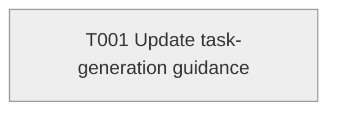

# Task Graph — mirror-mismatch

## ✗ Graph validation failed

### Errors
- T001: tasks.md mirror [speckit-implement] does not match tasks.deps.yml [speckit-tasks]

## Status counts (effective)

| Status | Count |
|--------|-------|
| [ ] pending | 1 |
| [S] synthetic | 0 |
| [S*] auto-synthetic | 0 |

## Graph



## ASCII view

```
T001 [ ] Update task-generation guidance
```

