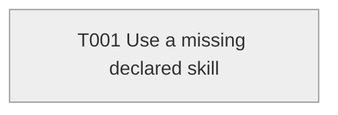

# Task Graph — missing-skill

## ✗ Graph validation failed

### Errors
- T001: declared skill missing-capability-skill is not readable or not registered

## Status counts (effective)

| Status | Count |
|--------|-------|
| [ ] pending | 1 |
| [S] synthetic | 0 |
| [S*] auto-synthetic | 0 |

## Graph



## ASCII view

```
T001 [ ] Use a missing declared skill
```

