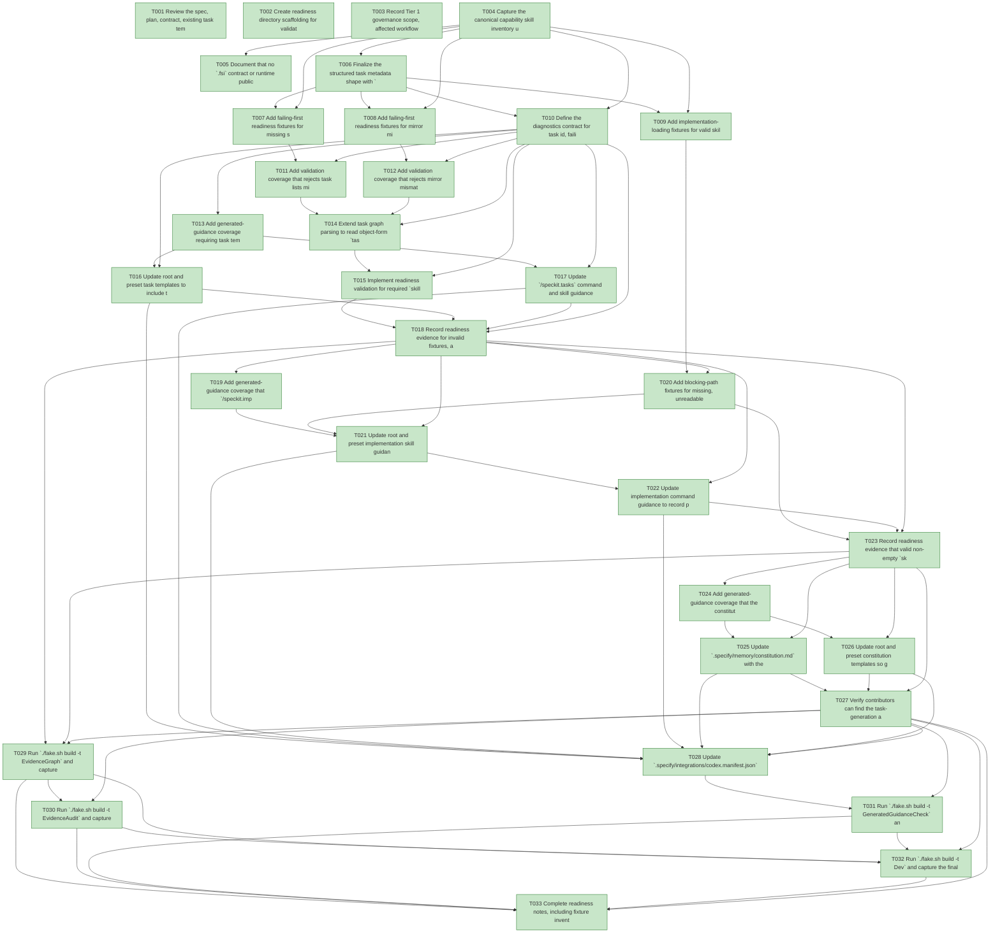

# Task Graph — 014-task-skilllist-governance

## ✓ Graph is acyclic and consistent

## Status counts (effective)

| Status | Count |
|--------|-------|
| [X] done | 33 |
| [S] synthetic | 0 |
| [S*] auto-synthetic | 0 |

## Graph



## ASCII view

```
T001 [X] Review the spec, plan, contract, existing task templates, and active skill inventory for this feature
T002 [X] Create readiness directory scaffolding for validation logs and task skilllist fixtures
T003 [X] Record Tier 1 governance scope, affected workflow surfaces, no public API impact, no package impact, and Principle IV non-applicability
T004 [X] Capture the canonical capability skill inventory used for post-task skill evaluation
T005 [X] Document that no `.fsi` contract or runtime public API surface is introduced by this feature
T006 [X] Finalize the structured task metadata shape with `deps` and `skillist` fields plus the `tasks.md` mirror format
T007 [X] Add failing-first readiness fixtures for missing structured `skillist`, non-list `skillist`, missing task mirrors, and existing bare-list metadata that must be migrated or regenerated
T008 [X] Add failing-first readiness fixtures for mirror mismatch, omitted obviously applicable capability skills, excess non-minimal skills, and invalid multi-skill dependency order
T009 [X] Add implementation-loading fixtures for valid skill loads, missing skills, unreadable skills, and ambiguous skill ids
T010 [X] Define the diagnostics contract for task id, failing field, unresolved skill id, and readiness-blocking verdicts
T011 [X] Add validation coverage that rejects task lists missing structured `skillist` fields or `tasks.md` mirrors
T012 [X] Add validation coverage that rejects mirror mismatches and omitted obvious capability skills
T013 [X] Add generated-guidance coverage requiring task templates and task-generation guidance to emit `skillist` values
T014 [X] Extend task graph parsing to read object-form `tasks.deps.yml` entries with `deps` and `skillist`
T015 [X] Implement readiness validation for required `skillist`, list typing, mirror presence, mirror equality, declared skill resolution, obvious capability omissions, non-minimal skill sets, multi-skill dependency order, and existing task-list migration blockers
T016 [X] Update root and preset task templates to include the `skillist` mirror on every task line and structured metadata for every task
T017 [X] Update `/speckit.tasks` command and skill guidance to require post-generation skill evaluation and minimal ordered skill selection
T018 [X] Record readiness evidence for invalid fixtures, a valid task list containing explicit empty and non-empty `skillist` values, and under-30-second missing-`skillist` rejection timing
T019 [X] Add generated-guidance coverage that `/speckit.implement` must load each task's declared skills before implementation
T020 [X] Add blocking-path fixtures for missing, unreadable, ambiguous declared task skills, and existing task lists that must be migrated or regenerated before implementation
T021 [X] Update root and preset implementation skill guidance to read `skillist`, resolve each skill, load skills in order, and stop on failures
T022 [X] Update implementation command guidance to record per-task skill-load evidence before code changes begin
T023 [X] Record readiness evidence that valid non-empty `skillist` entries are loaded and invalid entries block implementation
T024 [X] Add generated-guidance coverage that the constitution and constitution template require post-task skill evaluation and implementation-time loading
T025 [X] Update `.specify/memory/constitution.md` with the mandatory `skillist` governance gate
T026 [X] Update root and preset constitution templates so generated products inherit the mandatory `skillist` rule
T027 [X] Verify contributors can find the task-generation and implementation-loading obligations from the constitution and generated guidance
T028 [X] Update `.specify/integrations/codex.manifest.json` if generated skill hashes or governed integration state changed
T029 [X] Run `./fake.sh build -t EvidenceGraph` and capture `readiness/logs/evidence-graph.txt`
T030 [X] Run `./fake.sh build -t EvidenceAudit` and capture `readiness/logs/evidence-audit.txt`
T031 [X] Run `./fake.sh build -t GeneratedGuidanceCheck` and capture `readiness/logs/generated-guidance-check.txt`
T032 [X] Run `./fake.sh build -t Dev` and capture the final governed verification result
T033 [X] Complete readiness notes, including fixture inventory, validator diagnostics, implementation-load evidence, and any synthetic-evidence disclosures
```

