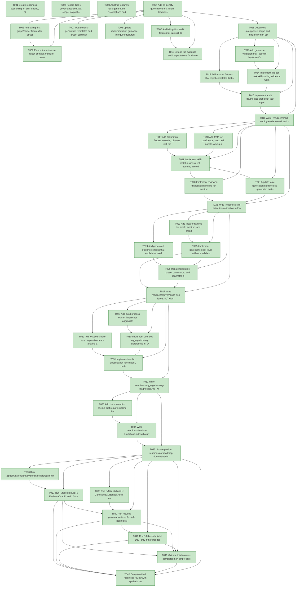

# Task Graph — 015-improve-governance-weaknesses

## ✓ Graph is acyclic and consistent

## Skill Match Assessments

| Task | Candidate | Confidence | Signals | Reviewer disposition | Diagnostic |
|------|-----------|------------|---------|----------------------|------------|
| T001 | speckit-evidence-graph | high | task-text | accepted | T001: task text matches speckit-evidence-graph |
| T001 | speckit-evidence-audit | high | task-text | accepted | T001: task text matches speckit-evidence-audit |
| T002 | (none) | none |  | accepted-empty | T002: no high-confidence capability signal detected |
| T003 | speckit-tasks | high | task-text | accepted | T003: task text matches speckit-tasks |
| T004 | (none) | none |  | accepted-empty | T004: no high-confidence capability signal detected |
| T005 | speckit-evidence-graph | high | task-text | accepted | T005: task text matches speckit-evidence-graph |
| T005 | speckit-implement | high | task-text | accepted | T005: task text matches speckit-implement |
| T006 | speckit-evidence-audit | high | task-text | accepted | T006: task text matches speckit-evidence-audit |
| T006 | speckit-implement | high | task-text | accepted | T006: task text matches speckit-implement |
| T007 | speckit-tasks | high | task-text | accepted | T007: task text matches speckit-tasks |
| T007 | speckit-implement | high | task-text | accepted | T007: task text matches speckit-implement |
| T008 | speckit-implement | high | task-text | accepted | T008: task text matches speckit-implement |
| T009 | speckit-evidence-graph | high | task-text | accepted | T009: task text matches speckit-evidence-graph |
| T010 | speckit-evidence-audit | high | task-text | accepted | T010: task text matches speckit-evidence-audit |
| T011 | (none) | none |  | accepted-empty | T011: no high-confidence capability signal detected |
| T012 | speckit-implement | high | task-text | accepted | T012: task text matches speckit-implement |
| T013 | (none) | none |  | declared | T013: no high-confidence capability signal detected |
| T014 | speckit-implement | high | task-text | accepted | T014: task text matches speckit-implement |
| T015 | speckit-implement | high | task-text | accepted | T015: task text matches speckit-implement |
| T016 | speckit-implement | high | task-text | accepted | T016: task text matches speckit-implement |
| T017 | (none) | none |  | declared | T017: no high-confidence capability signal detected |
| T018 | (none) | none |  | declared | T018: no high-confidence capability signal detected |
| T019 | speckit-evidence-graph | high | task-text | accepted | T019: task text matches speckit-evidence-graph |
| T020 | (none) | none |  | declared | T020: no high-confidence capability signal detected |
| T021 | speckit-tasks | high | task-text | accepted | T021: task text matches speckit-tasks |
| T022 | (none) | none |  | declared | T022: no high-confidence capability signal detected |
| T023 | (none) | none |  | declared | T023: no high-confidence capability signal detected |
| T024 | (none) | none |  | declared | T024: no high-confidence capability signal detected |
| T025 | (none) | none |  | declared | T025: no high-confidence capability signal detected |
| T026 | (none) | none |  | declared | T026: no high-confidence capability signal detected |
| T027 | (none) | none |  | declared | T027: no high-confidence capability signal detected |
| T028 | (none) | none |  | accepted-empty | T028: no high-confidence capability signal detected |
| T029 | (none) | none |  | accepted-empty | T029: no high-confidence capability signal detected |
| T030 | (none) | none |  | accepted-empty | T030: no high-confidence capability signal detected |
| T031 | (none) | none |  | accepted-empty | T031: no high-confidence capability signal detected |
| T032 | (none) | none |  | accepted-empty | T032: no high-confidence capability signal detected |
| T033 | (none) | none |  | accepted-empty | T033: no high-confidence capability signal detected |
| T034 | (none) | none |  | accepted-empty | T034: no high-confidence capability signal detected |
| T035 | (none) | none |  | accepted-empty | T035: no high-confidence capability signal detected |
| T036 | (none) | none |  | declared | T036: no high-confidence capability signal detected |
| T037 | speckit-evidence-graph | high | task-text | accepted | T037: task text matches speckit-evidence-graph |
| T037 | speckit-evidence-audit | high | task-text | accepted | T037: task text matches speckit-evidence-audit |
| T038 | speckit-implement | high | task-text | accepted | T038: task text matches speckit-implement |
| T039 | speckit-implement | high | task-text | accepted | T039: task text matches speckit-implement |
| T040 | (none) | none |  | accepted-empty | T040: no high-confidence capability signal detected |
| T041 | speckit-implement | high | task-text | accepted | T041: task text matches speckit-implement |
| T042 | (none) | none |  | declared | T042: no high-confidence capability signal detected |

## Status counts (effective)

| Status | Count |
|--------|-------|
| [X] done | 42 |
| [S] synthetic | 0 |
| [S*] auto-synthetic | 0 |

## Graph



## ASCII view

```
T001 [X] Create readiness scaffolding for skill loading, skill detection calibration, governance risk levels, aggregate hang diagnostics, runtime limitations, evidence graph, and evidence audit
T002 [X] Record Tier 1 governance-contract scope, no public F# API/package impact, no product MVU applicability, and required real evidence paths in `readiness/governance-risk-levels.md`
T003 [X] Add this feature's task-generation assumptions and initial skillist rationale to the readiness notes
T004 [X] Add or identify governance test fixture locations for task skill evidence, skill-match assessment, risk-level evidence, and aggregate timeout verdict examples
T005 [X] Add failing-first graph/parser fixtures for structured task metadata, skillist mirrors, missing skill-loading evidence references, and ambiguous skill diagnostics
T006 [X] Add failing-first audit fixtures for late skill-loading evidence, incomplete reviewer exceptions, synthetic disclosure separation, and readiness-blocking diagnostics
T007 [X] Update task-generation templates and preset command guidance to require skill-loading evidence obligations and confidence-based skill-match review in generated tasks
T008 [X] Update implementation guidance to require declared skills to be resolved, loaded in order before task work, and recorded in `readiness/skill-loading-evidence.md`
T009 [X] Extend the evidence graph contract model or parser expectations for skill match confidence, matched signals, ambiguity, and reviewer disposition
T010 [X] Extend the evidence audit expectations for risk-level evidence paths, timeout verdict records, and non-authoritative aggregate results
T011 [X] Document unsupported scope and Principle IV non-applicability for this governance-only feature in the readiness scaffold
T012 [X] Add tests or fixtures that reject completed tasks with non-empty skillist when pre-work skill-loading evidence is missing, late, unreadable, ambiguous, or exception-incomplete
T013 [X] Add guidance validation that `speckit-implement` records task id, skill id, resolved path, load result, loaded_at, work_started_at, evidence path, and reviewer exception fields
T014 [X] Implement the per-task skill-loading evidence workflow in implementation guidance and generated implementation command text
T015 [X] Implement audit diagnostics that block task completion when declared skill-loading evidence is absent, late, unresolved, or exception-incomplete
T016 [X] Write `readiness/skill-loading-evidence.md` with real validation evidence, sample accepted rows, rejection examples, and reviewer exception requirements
T017 [X] Add calibration fixtures covering obvious skill matches, ambiguous matches, indirect ownership matches, false positives, and valid empty skill lists
T018 [X] Add tests for confidence, matched signals, ambiguity, reviewer disposition, and diagnostics when no skill is selected for a capability-owned task
T019 [X] Implement skill-match assessment reporting in evidence graph validation without treating heuristic matches as authoritative proof
T020 [X] Implement reviewer-disposition handling for medium, low, ambiguous, indirect, false-positive, and valid-empty skill assessments
T021 [X] Update task-generation guidance so generated tasks disclose confidence review needs instead of presenting regex skill detection as certainty
T022 [X] Write `readiness/skill-detection-calibration.md` with calibration cases, runtime under 30 seconds, accepted dispositions, and remaining uncertainty
T023 [X] Add tests or fixtures for small, medium, and broad governance risk levels with required checks, broad_required, rationale, and missing-evidence failures
T024 [X] Add generated guidance checks that explain focused validation, broad validation, and non-authoritative aggregate results for each risk level
T025 [X] Implement governance risk-level evidence validation and final-readiness blocking when the selected evidence path is incomplete
T026 [X] Update templates, preset commands, and generated guidance to name minimum evidence paths for small, medium, and broad changes
T027 [X] Write `readiness/governance-risk-levels.md` with representative classifications and the required focused or broad checks for this feature
T028 [X] Add build-process tests or fixtures for aggregate `Dev` timeout verdicts including stage, elapsed duration, last observed command, focused rerun, and verdict category
T029 [X] Add focused smoke rerun separation tests proving a passing direct smoke check is not reported as an aggregate product failure after a hang
T030 [X] Implement bounded aggregate hang diagnostics in `Dev` or readiness reporting with stage timing, last active command, timeout policy, and recommended focused rerun
T031 [X] Implement verdict classification for timeout, orchestration concern, non-authoritative aggregate result, product failure, and environment failure
T032 [X] Write `readiness/aggregate-hang-diagnostics.md` with simulated or reproduced hang evidence, focused rerun command, focused result, and final classification
T033 [X] Add documentation checks that require runtime limitation notes to name platform, renderer, dependency, fallback, and toolchain boundaries without claiming new support
T034 [X] Write `readiness/runtime-limitations.md` with current .NET 10 desktop, Vulkan/SkiaSharp preview, unsupported macOS/mobile/browser, and no software-renderer fallback boundaries
T035 [X] Update product readiness or roadmap documentation to distinguish current support from separate future platform-expansion features
T036 [X] Run `.specify/extensions/evidence/scripts/bash/run-audit.sh specs/015-improve-governance-weaknesses --graph-only` and capture clean graph output in `readiness/evidence-graph.md`
T037 [X] Run `./fake.sh build -t EvidenceGraph` and `./fake.sh build -t EvidenceAudit`, then capture PASS or explicit blocking diagnostics in `readiness/evidence-audit.md`
T038 [X] Run `./fake.sh build -t GeneratedGuidanceCheck` and confirm generated task and implementation guidance preserve skillist, skill-loading evidence, confidence reporting, and risk-level rules
T039 [X] Run focused governance tests for skill-loading evidence, skill-match calibration, risk levels, aggregate timeout verdicts, and runtime limitation docs
T040 [X] Run `./fake.sh build -t Dev` only if the final declared risk level remains broad, otherwise document why focused validation is sufficient
T041 [X] Validate this feature's completed non-empty skillist tasks against `readiness/skill-loading-evidence.md`, including loaded skill path, load timing, work start timing, and reviewer-visible exceptions
T042 [X] Complete final readiness review with synthetic inventory, non-authoritative aggregate verdicts, unsupported scope, and no package/API/runtime support changes
```

