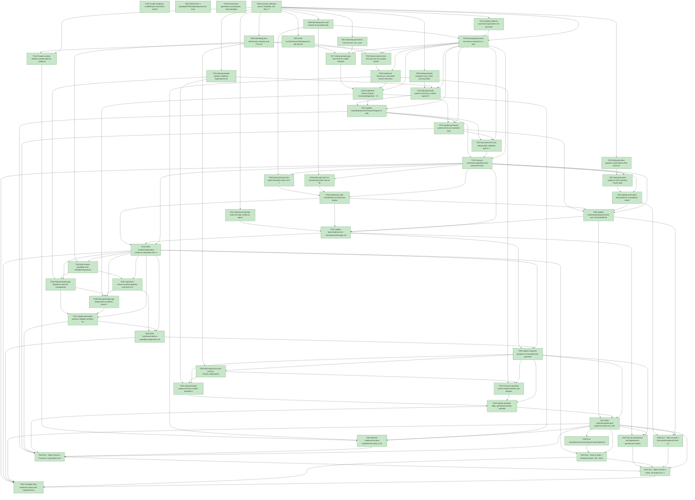

# Task Graph — 016-persistent-viewer-contract

## ✓ Graph is acyclic and consistent

## Skill Match Assessments

| Task | Candidate | Confidence | Signals | Reviewer disposition | Diagnostic |
|------|-----------|------------|---------|----------------------|------------|
| T001 | speckit-evidence-graph | high | task-text | accepted | T001: task text matches speckit-evidence-graph |
| T001 | speckit-evidence-audit | high | task-text | accepted | T001: task text matches speckit-evidence-audit |
| T002 | (none) | none |  | accepted-empty | T002: no high-confidence capability signal detected |
| T003 | speckit-tasks | high | task-text | accepted | T003: task text matches speckit-tasks |
| T004 | (none) | none |  | accepted-empty | T004: no high-confidence capability signal detected |
| T005 | (none) | none |  | declared | T005: no high-confidence capability signal detected |
| T006 | (none) | none |  | declared | T006: no high-confidence capability signal detected |
| T007 | (none) | none |  | declared | T007: no high-confidence capability signal detected |
| T008 | (none) | none |  | declared | T008: no high-confidence capability signal detected |
| T009 | (none) | none |  | declared | T009: no high-confidence capability signal detected |
| T010 | (none) | none |  | declared | T010: no high-confidence capability signal detected |
| T011 | (none) | none |  | declared | T011: no high-confidence capability signal detected |
| T012 | (none) | none |  | accepted-empty | T012: no high-confidence capability signal detected |
| T013 | (none) | none |  | declared | T013: no high-confidence capability signal detected |
| T014 | (none) | none |  | declared | T014: no high-confidence capability signal detected |
| T015 | (none) | none |  | accepted-empty | T015: no high-confidence capability signal detected |
| T016 | (none) | none |  | declared | T016: no high-confidence capability signal detected |
| T017 | (none) | none |  | declared | T017: no high-confidence capability signal detected |
| T018 | (none) | none |  | declared | T018: no high-confidence capability signal detected |
| T019 | (none) | none |  | declared | T019: no high-confidence capability signal detected |
| T020 | (none) | none |  | declared | T020: no high-confidence capability signal detected |
| T021 | (none) | none |  | declared | T021: no high-confidence capability signal detected |
| T022 | (none) | none |  | declared | T022: no high-confidence capability signal detected |
| T023 | (none) | none |  | accepted-empty | T023: no high-confidence capability signal detected |
| T024 | (none) | none |  | accepted-empty | T024: no high-confidence capability signal detected |
| T025 | (none) | none |  | declared | T025: no high-confidence capability signal detected |
| T026 | (none) | none |  | declared | T026: no high-confidence capability signal detected |
| T027 | (none) | none |  | declared | T027: no high-confidence capability signal detected |
| T028 | (none) | none |  | declared | T028: no high-confidence capability signal detected |
| T029 | speckit-tasks | high | task-text | accepted | T029: task text matches speckit-tasks |
| T030 | (none) | none |  | declared | T030: no high-confidence capability signal detected |
| T031 | (none) | none |  | accepted-empty | T031: no high-confidence capability signal detected |
| T032 | (none) | none |  | declared | T032: no high-confidence capability signal detected |
| T033 | (none) | none |  | declared | T033: no high-confidence capability signal detected |
| T034 | (none) | none |  | declared | T034: no high-confidence capability signal detected |
| T035 | (none) | none |  | declared | T035: no high-confidence capability signal detected |
| T036 | (none) | none |  | declared | T036: no high-confidence capability signal detected |
| T037 | (none) | none |  | declared | T037: no high-confidence capability signal detected |
| T038 | (none) | none |  | accepted-empty | T038: no high-confidence capability signal detected |
| T039 | (none) | none |  | accepted-empty | T039: no high-confidence capability signal detected |
| T040 | (none) | none |  | declared | T040: no high-confidence capability signal detected |
| T041 | (none) | none |  | declared | T041: no high-confidence capability signal detected |
| T042 | (none) | none |  | declared | T042: no high-confidence capability signal detected |
| T043 | (none) | none |  | declared | T043: no high-confidence capability signal detected |
| T044 | (none) | none |  | accepted-empty | T044: no high-confidence capability signal detected |
| T045 | (none) | none |  | declared | T045: no high-confidence capability signal detected |
| T046 | (none) | none |  | declared | T046: no high-confidence capability signal detected |
| T047 | (none) | none |  | accepted-empty | T047: no high-confidence capability signal detected |
| T048 | (none) | none |  | declared | T048: no high-confidence capability signal detected |
| T049 | speckit-evidence-graph | high | task-text | accepted | T049: task text matches speckit-evidence-graph |
| T049 | speckit-evidence-audit | high | task-text | accepted | T049: task text matches speckit-evidence-audit |
| T050 | (none) | none |  | declared | T050: no high-confidence capability signal detected |
| T051 | (none) | none |  | accepted-empty | T051: no high-confidence capability signal detected |
| T052 | (none) | none |  | declared | T052: no high-confidence capability signal detected |

## Status counts (effective)

| Status | Count |
|--------|-------|
| [X] done | 52 |
| [S] synthetic | 0 |
| [S*] auto-synthetic | 0 |

## Graph



## ASCII view

```
T001 [X] Create readiness scaffolding for persistent viewer contract, generated default launch, bounded evidence separation, runtime diagnostics, generated guidance, evidence graph, evidence audit, surface baselines, and supported-host launch artifacts
T002 [X] Record Tier 1 package/API/template/governance scope, public surface impact, generated product impact, and no-new-platform-support boundaries in `readiness/persistent-viewer-contract.md`
T003 [X] Record task-generation assumptions, story grouping, skill confidence review, and valid-empty skill dispositions in `readiness/task-generation.md`
T004 [X] Inventory affected source, template, test, docs, FAKE target, fixture, and readiness paths named by the spec and plan
T005 [X] Draft `src/SkiaViewer/SkiaViewer.fsi` with persistent `Viewer.run`, `Viewer.runApp`, runtime capability, launch outcome, diagnostics, `GeneratedAppHost`, `ViewerEffect`, keyboard mapping, tick, and viewer-edge interpreter boundary
T006 [X] Add failing-first SkiaViewer semantic and FSI-surface tests for `Viewer.run`, `Viewer.runApp`, launch outcome fields, bounded API separation, and runtime capability shape
T007 [X] Add failing-first MVU host tests for `init`, pure `update`, emitted `ViewerEffect` assertions, keyboard dispatch, tick mapping, render refresh, and close intent behavior
T008 [X] Add generated template source tests proving default graphical execution calls `Viewer.runApp viewerOptions generatedHost` and bounded evidence is flag-only
T009 [X] Add failing-first audit fixtures for bounded-only substitution, unsupported-host-only launch packages, missing persistent evidence fields, and missing supported-host artifact rejection
T010 [X] Add generated guidance expectations that future graphical viewer tasks include a non-substitutable persistent launch task and bounded-evidence separation notes
T011 [X] Add generated product validation expectations for semantic tests, bounded evidence, scene evidence, persistent launch source/wiring, and supported-host artifact collection
T012 [X] Add documentation stubs for build, evidence, generated apps, migration guidance, and unsupported-scope diagnostics
T013 [X] Update evidence command expectations for persistent graphical launch artifact categories, bounded helper categories, and synthetic evidence propagation constraints
T014 [X] Prepare surface baseline update path for `readiness/surface-baselines/FS.Skia.UI.SkiaViewer.txt` without refreshing the baseline during task generation
T015 [X] Record governance risk level as broad Tier 1, focused validation required for SkiaViewer/template/audit/docs paths, broad validation required before completion, and non-authoritative aggregate-result handling
T016 [X] Add semantic tests that exercise the packed SkiaViewer surface for persistent scene launch outcomes and preserve bounded APIs as explicit helpers
T017 [X] Add generated app host tests for model initialization, pure update transitions, emitted effects, keyboard input dispatch, tick progression, render refresh, and intentional close
T018 [X] Add generated product tests that a viewer-backed Tetris-style graphical profile's default executable path uses the persistent generated host, renders model-derived state, dispatches declared keyboard input, and keeps bounded smoke behind explicit flags
T019 [X] Implement `Viewer.run`, persistent launch outcomes, option validation, scene rendering handoff, and bounded API separation in `src/SkiaViewer/SkiaViewer.fs`
T020 [X] Implement `Viewer.runApp`, `GeneratedAppHost`, `ViewerEffect` interpretation, keyboard dispatch, tick dispatch, render refresh, and close behavior at the viewer edge
T021 [X] Update `template/base/src/Product/Program.fs` with a Tetris-style keyboard-capable generated app path using `Model`, `Msg`, `init`, pure `update`, `view`, `mapKey`, `tick`, `viewerOptions`, `generatedHost`, and default persistent launch wiring
T022 [X] Update generated product tests and validation helpers so default launch source/wiring is required and bounded smoke, first-frame, frame-count, and scene evidence remain explicit command paths
T023 [X] Document the US1 independent validation path in `readiness/generated-default-launch.md`, including command, expected persistent-window mode, keyboard applicability, and intentional exit criteria
T024 [X] Capture `readiness/supported-host-persistent-launch.txt` from a supported desktop host using the Tetris-style generated app with `status=ok`, `mode=persistent-window`, `window-opened=true`, model-derived state rendered, declared keyboard input dispatch verified, and `exit-path=true`
T025 [X] Add audit tests that reject bounded smoke, first-frame, frame-count, scene metadata, and unsupported-host diagnostics when no distinct supported-host persistent launch artifact exists
T026 [X] Add audit tests for required persistent launch fields: status, mode, command, window-opened, input-dispatch, exit-path, blocked-stage, classification, category, and message
T027 [X] Add generated guidance tests rejecting viewer-backed default paths that only print metadata, count controls, run bounded smoke, emit scene evidence, or exit without a persistent launch attempt
T028 [X] Implement audit classification and blocking diagnostics for missing persistent launch evidence, bounded-only substitution, unsupported-host-only evidence, and ambiguous launch fields
T029 [X] Update generated task guidance so graphical viewer features always include a persistent graphical launch evidence task that bounded helpers cannot complete
T030 [X] Update `GeneratedGuidanceCheck` and `GeneratedProductCheck` to require persistent generated host wiring and reject bounded-only or print-only default graphical paths
T031 [X] Update `docs/evidence.md`, `docs/generated-apps.md`, and `template/fragments/skiaviewer/README.md` to label bounded viewer commands as CI and diagnostic helpers, not interactive readiness substitutes
T032 [X] Write `readiness/bounded-evidence-separation.md` with real rejection evidence, evidence package names, selected broad risk level, focused validation command, and non-authoritative aggregate-result notes
T033 [X] Add runtime capability tests distinguishing persistent window support, bounded smoke support, keyboard input support, renderer mode, unsupported host reasons, and missing product/package capability
T034 [X] Add generated app diagnostic tests for unsupported display hosts, missing persistent contract capability, missing package capability, blocked stage, category, command, and reviewer-facing message
T035 [X] Implement `Viewer.runtimeCapability` and launch failure classification for supported host, unsupported environment, product defect, missing package capability, renderer mode, blocked stage, category, and actionable message
T036 [X] Wire generated app diagnostics so default launch reports unsupported environment or missing capability without falling back to bounded simulation as success
T037 [X] Update generated product validation artifacts to record runtime capability diagnostics separately from supported-host persistent launch evidence
T038 [X] Write `readiness/runtime-capability-diagnostics.md` with supported, unsupported-environment, missing-capability, and renderer-mode classifications plus reviewer decision guidance, including a 2-minute classification checklist for SC-007
T039 [X] Update migration guidance so bounded-only generated apps must adopt the persistent host, declare headless/non-interactive scope, or document missing persistent viewer capability as a blocking gap
T040 [X] Add regression tests proving `Viewer.runBounded`, `Viewer.runUntilFirstFrame`, and `Viewer.runForFrames` remain available as explicit evidence helpers
T041 [X] Add generated product tests for explicit bounded smoke, first-frame, frame-count, and scene evidence commands without changing the default persistent launch path
T042 [X] Preserve bounded viewer implementation and diagnostics while keeping all bounded outcomes out of persistent launch success classification
T043 [X] Update template flags, generated product validation, and readiness artifact names for bounded smoke, frame diagnostics, and deterministic scene metadata
T044 [X] Write `readiness/generated-guidance-check.md` with GeneratedGuidanceCheck evidence for persistent defaults and explicit bounded helper commands
T045 [X] Refresh `readiness/surface-baselines/FS.Skia.UI.SkiaViewer.txt` with `./fake.sh build -t RefreshSurfaceBaselines` and verify with `./fake.sh build -t PackageSurfaceCheck`
T046 [X] Run `./fake.sh build -t PackLocal`, generated consumer validation, and `./fake.sh build -t TemplateCheck`, then record generated default launch and package compatibility evidence
T047 [X] Run documentation and dependency governance checks, including `./fake.sh build -t DependencyReport`, and record no-new-dependency or package impact findings
T048 [X] Run `.specify/extensions/evidence/scripts/bash/run-audit.sh specs/016-persistent-viewer-contract --graph-only` and capture clean graph output in `readiness/evidence-graph.md`
T049 [X] Run `./fake.sh build -t EvidenceGraph` and `./fake.sh build -t EvidenceAudit`, then capture PASS or blocking diagnostics in `readiness/evidence-audit.md`
T050 [X] Run `./fake.sh build -t GeneratedGuidanceCheck` and confirm generated task and implementation guidance preserve persistent launch, skillist, synthetic disclosure, and risk-level rules
T051 [X] Run `./fake.sh build -t Verify` for broad Tier 1 validation or record explicit non-authoritative aggregate-result diagnostics with focused rerun evidence
T052 [X] Complete final readiness review with supported-host launch artifact, bounded evidence separation, unsupported-host diagnostics, synthetic inventory, and no bounded-only completion claims
```

