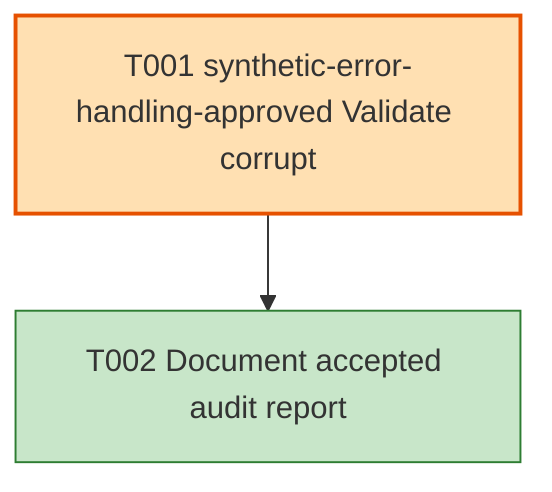

# Task Graph — accepted

## ✓ Graph is acyclic and consistent

## Skill Match Assessments

| Task | Candidate | Confidence | Signals | Reviewer disposition | Diagnostic |
|------|-----------|------------|---------|----------------------|------------|
| T001 | (none) | none |  | accepted-empty | T001: no high-confidence capability signal detected |
| T002 | (none) | none |  | accepted-empty | T002: no high-confidence capability signal detected |

## Status counts (effective)

| Status | Count |
|--------|-------|
| [X] done | 1 |
| [S] synthetic | 1 |
| [S*] auto-synthetic | 0 |
| accepted [SEH] synthetic | 1 |
| unaccepted synthetic | 0 |

## Synthetic Error-Handling Classification

| Task | Accepted | Label | Design source | Synthetic input class | Expected error behavior | Diagnostics |
|------|----------|-------|---------------|-----------------------|-------------------------|-------------|
| T001 | yes | yes | specs/017-synthetic-error-evidence/tasks.md:T019 | corrupt file content | fail with actionable diagnostic | (none) |

## Graph



## ASCII view

```
T001 [S] synthetic-error-handling-approved Validate corrupt file rejection   ← accepted [SEH]
T002 [X] Document accepted audit report
```

