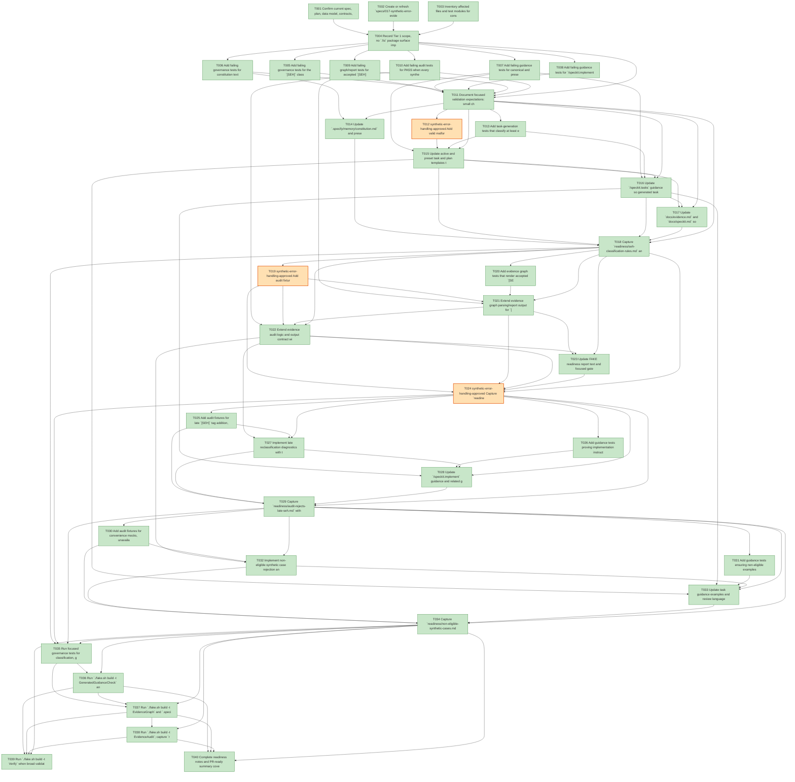

# Task Graph — 017-synthetic-error-evidence

## ✓ Graph is acyclic and consistent

## Skill Match Assessments

| Task | Candidate | Confidence | Signals | Reviewer disposition | Diagnostic |
|------|-----------|------------|---------|----------------------|------------|
| T001 | (none) | none |  | accepted-empty | T001: no high-confidence capability signal detected |
| T002 | speckit-tasks | high | task-text | accepted | T002: task text matches speckit-tasks |
| T003 | speckit-tasks | high | task-text | accepted | T003: task text matches speckit-tasks |
| T003 | speckit-implement | high | task-text | accepted | T003: task text matches speckit-implement |
| T003 | speckit-constitution | high | task-text | accepted | T003: task text matches speckit-constitution |
| T004 | (none) | none |  | accepted-empty | T004: no high-confidence capability signal detected |
| T005 | (none) | none |  | accepted-empty | T005: no high-confidence capability signal detected |
| T006 | speckit-constitution | high | task-text | accepted | T006: task text matches speckit-constitution |
| T007 | speckit-tasks | high | task-text | accepted | T007: task text matches speckit-tasks |
| T008 | speckit-implement | high | task-text | accepted | T008: task text matches speckit-implement |
| T009 | (none) | none |  | declared | T009: no high-confidence capability signal detected |
| T010 | (none) | none |  | declared | T010: no high-confidence capability signal detected |
| T011 | (none) | none |  | accepted-empty | T011: no high-confidence capability signal detected |
| T012 | (none) | none |  | accepted-empty | T012: no high-confidence capability signal detected |
| T013 | speckit-tasks | high | task-text | accepted | T013: task text matches speckit-tasks |
| T014 | speckit-constitution | high | task-text | accepted | T014: task text matches speckit-constitution |
| T015 | (none) | none |  | declared | T015: no high-confidence capability signal detected |
| T016 | speckit-tasks | high | task-text | accepted | T016: task text matches speckit-tasks |
| T017 | (none) | none |  | accepted-empty | T017: no high-confidence capability signal detected |
| T018 | speckit-tasks | high | task-text | accepted | T018: task text matches speckit-tasks |
| T019 | (none) | none |  | declared | T019: no high-confidence capability signal detected |
| T020 | speckit-evidence-graph | high | task-text | accepted | T020: task text matches speckit-evidence-graph |
| T021 | speckit-evidence-graph | high | task-text | accepted | T021: task text matches speckit-evidence-graph |
| T022 | speckit-evidence-audit | high | task-text | accepted | T022: task text matches speckit-evidence-audit |
| T023 | speckit-evidence-graph | high | task-text | accepted | T023: task text matches speckit-evidence-graph |
| T023 | speckit-evidence-audit | high | task-text | accepted | T023: task text matches speckit-evidence-audit |
| T024 | (none) | none |  | declared | T024: no high-confidence capability signal detected |
| T025 | (none) | none |  | declared | T025: no high-confidence capability signal detected |
| T026 | (none) | none |  | declared | T026: no high-confidence capability signal detected |
| T027 | (none) | none |  | declared | T027: no high-confidence capability signal detected |
| T028 | speckit-implement | high | task-text | accepted | T028: task text matches speckit-implement |
| T029 | (none) | none |  | accepted-empty | T029: no high-confidence capability signal detected |
| T030 | (none) | none |  | declared | T030: no high-confidence capability signal detected |
| T031 | (none) | none |  | declared | T031: no high-confidence capability signal detected |
| T032 | (none) | none |  | declared | T032: no high-confidence capability signal detected |
| T033 | (none) | none |  | declared | T033: no high-confidence capability signal detected |
| T034 | (none) | none |  | accepted-empty | T034: no high-confidence capability signal detected |
| T035 | (none) | none |  | accepted-empty | T035: no high-confidence capability signal detected |
| T036 | (none) | none |  | accepted-empty | T036: no high-confidence capability signal detected |
| T037 | speckit-evidence-graph | high | task-text | accepted | T037: task text matches speckit-evidence-graph |
| T038 | speckit-evidence-audit | high | task-text | accepted | T038: task text matches speckit-evidence-audit |
| T039 | (none) | none |  | accepted-empty | T039: no high-confidence capability signal detected |
| T040 | (none) | none |  | accepted-empty | T040: no high-confidence capability signal detected |

## Status counts (effective)

| Status | Count |
|--------|-------|
| [X] done | 37 |
| [S] synthetic | 3 |
| [S*] auto-synthetic | 0 |
| accepted [SEH] synthetic | 3 |
| unaccepted synthetic | 0 |

## Synthetic Error-Handling Classification

| Task | Accepted | Label | Design source | Synthetic input class | Expected error behavior | Diagnostics |
|------|----------|-------|---------------|-----------------------|-------------------------|-------------|
| T012 | yes | yes | specs/017-synthetic-error-evidence/tasks.md:T012 | malformed parser input | reject malformed task graph with reviewer diagnostics | (none) |
| T019 | yes | yes | specs/017-synthetic-error-evidence/tasks.md:T019 | corrupt file content | pass audit while reporting accepted synthetic count | (none) |
| T024 | yes | yes | specs/017-synthetic-error-evidence/tasks.md:T024 | forced error-result fixture | preserve `[S]` visibility with accepted audit status | (none) |

## Graph



## ASCII view

```
T001 [X] Confirm current spec, plan, data model, contracts, and quickstart describe the `[SEH]` governance contract without missing required readiness paths
T002 [X] Create or refresh `specs/017-synthetic-error-evidence/readiness/` placeholders for classification rules, task-generation guidance, accepted audit, late rejection, non-eligible cases, generated guidance, graph, and audit evidence
T003 [X] Inventory affected files and test modules for constitution, task templates, task command guidance, implementation command guidance, docs, evidence scripts, FAKE targets, and governance tests
T004 [X] Record Tier 1 scope, no `.fsi` package surface impact, Product MVU non-applicability, governance workflow state obligations, and small/medium/broad validation rules in readiness notes
T005 [X] Add failing governance tests for the `[SEH]` classification data model fields, required label, design source, synthetic input class, expected error behavior, and rationale
T006 [X] Add failing governance tests for constitution text that preserves Principle V disclosure while defining the narrow `[SEH]` exception
T007 [X] Add failing guidance tests for canonical and preset `tasks-template.md` plus `/speckit.tasks` examples covering eligible and non-eligible `[SEH]` classifications
T008 [X] Add failing guidance tests for `/speckit.implement` requiring newly discovered synthetic error-handling needs to return to task/design work instead of implementation-time relabeling
T009 [X] Add failing graph/report tests for accepted `[SEH]` counting, ordinary `[S]` counting, `[S*]` propagation visibility, and structured metadata fields
T010 [X] Add failing audit tests for PASS when every synthetic task is valid design-approved `[SEH]` and FAIL when any ordinary synthetic task remains
T011 [X] Document focused validation expectations: small changes use targeted governance tests, medium changes add fixture script runs, and broad validation requires `Verify` with non-authoritative aggregate results recorded separately
T012 [S] synthetic-error-handling-approved Add valid malformed-input fixture task lists that disclose synthetic input class, expected rejection behavior, design-phase source, and infeasible real-input rationale   ← accepted [SEH]
T013 [X] Add task-generation tests that classify at least eight examples across malformed parser input, corrupt file content, invalid arguments, protocol violations, missing data, hostile payloads, forced error results, and non-eligible convenience fixtures
T014 [X] Update `.specify/memory/constitution.md` and preset/active constitution templates with the narrow design-approved `[SEH]` exception and unchanged disclosure requirements
T015 [X] Update active and preset task and plan templates to document `[SEH]`, `synthetic-error-handling-approved`, required inventory fields, eligibility examples, non-eligible examples, and split/rename preservation rules
T016 [X] Update `/speckit.tasks` guidance so generated tasks assign `[SEH]` only during design/task generation and mirror the approval label in task metadata or the Synthetic-Evidence Inventory
T017 [X] Update `docs/evidence.md` and `docs/speckit.md` so reviewers can identify accepted synthetic error-handling tasks, rationale, and audit acceptance status within the 2-minute SC-006 threshold
T018 [X] Capture `readiness/seh-classification-rules.md` and `readiness/task-generation-seh.md` with eligible/non-eligible examples, reviewer classification timing, and evidence that eight examples can be classified within the 10-minute SC-004 threshold
T019 [S] synthetic-error-handling-approved Add audit fixture graphs where every synthetic task is valid `[SEH]` and assert PASS with accepted synthetic counts still reported as synthetic   ← accepted [SEH]
T020 [X] Add evidence graph tests that render accepted `[SEH]`, unaccepted `[S]`, and `[S*]` states with separate counts and root-cause annotations
T021 [X] Extend evidence graph parsing/report output for `[SEH]` annotation, approval label metadata, design source, synthetic input class, expected error behavior, and acceptance status
T022 [X] Extend evidence audit logic and output contract with `accepted-seh-tasks`, `unaccepted-synthetic-tasks`, `auto-synthetic-tasks`, `late-seh-tasks`, and reviewer-facing diagnostics
T023 [X] Update FAKE readiness report text and focused gate summaries so `EvidenceGraph`, `EvidenceAudit`, and generated reports describe accepted `[SEH]` separately from real task evidence
T024 [S] synthetic-error-handling-approved Capture `readiness/audit-accepted-seh.md` with real command output proving approved malformed/error-path synthetic fixtures pass while remaining visibly `[S]`   ← accepted [SEH]
T025 [X] Add audit fixtures for late `[SEH]` tag addition, late approval label addition, after-failure cleanup, missing provenance, and split/rename without preserved rationale
T026 [X] Add guidance tests proving implementation instructions forbid applying `[SEH]` locally and direct contributors back to task/design updates
T027 [X] Implement late reclassification diagnostics with task id, first synthetic sighting, first `[SEH]` sighting, implementation-start evidence, failure reason, and required planning action
T028 [X] Update `/speckit.implement` guidance and related generated guidance checks with the implementation-time relabeling prohibition
T029 [X] Capture `readiness/audit-rejects-late-seh.md` with real command evidence for late classification rejection and actionable diagnostic text
T030 [X] Add audit fixtures for convenience mocks, unavailable host substitutes, incomplete integrations, placeholder outputs, speed-only fixtures, and ordinary in-memory substitutes that must not pass under `[SEH]`
T031 [X] Add guidance tests ensuring non-eligible examples are rejected during task generation review even when they include synthetic data
T032 [X] Implement non-eligible synthetic case rejection and diagnostics without weakening the existing `--accept-synthetic` override path
T033 [X] Update task guidance examples and review language so convenience mocks, incomplete integrations, unavailable product capability, missing host support, placeholder outputs, and speed-only fixtures remain ordinary synthetic evidence
T034 [X] Capture `readiness/non-eligible-synthetic-cases.md` with real command evidence that non-eligible synthetic cases fail readiness
T035 [X] Run focused governance tests for classification, guidance, graph, and audit behavior; record command outputs in the relevant readiness files
T036 [X] Run `./fake.sh build -t GeneratedGuidanceCheck` and capture `readiness/generated-guidance-check.md`
T037 [X] Run `./fake.sh build -t EvidenceGraph` and `.specify/extensions/evidence/scripts/bash/run-audit.sh specs/017-synthetic-error-evidence --graph-only`; capture `readiness/evidence-graph.md`
T038 [X] Run `./fake.sh build -t EvidenceAudit`; capture `readiness/evidence-audit.md` with accepted `[SEH]` counts and no unaccepted synthetic blockers
T039 [X] Run `./fake.sh build -t Verify` when broad validation is required or any shared governance target changed; record aggregate results as supporting, non-authoritative evidence
T040 [X] Complete readiness notes and PR-ready summary covering changed governance surfaces, synthetic evidence disclosures, residual risks, and no package/API/runtime impact
```

