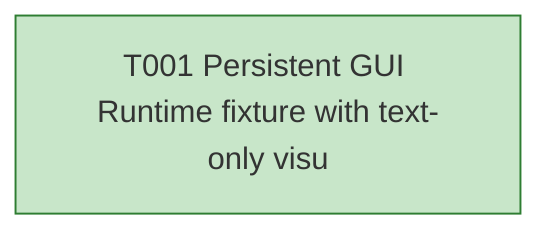

# Task Graph — text-only-visual-supported-host

## ✓ Graph is acyclic and consistent

## Skill Match Assessments

| Task | Candidate | Confidence | Signals | Reviewer disposition | Diagnostic |
|------|-----------|------------|---------|----------------------|------------|
| T001 | (none) | none |  | accepted-empty | T001: no high-confidence capability signal detected |

## Status counts (effective)

| Status | Count |
|--------|-------|
| [X] done | 1 |
| [S] synthetic | 0 |
| [S*] auto-synthetic | 0 |
| accepted [SEH] synthetic | 0 |
| unaccepted synthetic | 0 |

## Graph



## ASCII view

```
T001 [X] Persistent GUI Runtime fixture with text-only visual metadata on a supported host
```

