# Task Graph — 018-persistent-gui-runtime

## ✓ Graph is acyclic and consistent

## Skill Match Assessments

| Task | Candidate | Confidence | Signals | Reviewer disposition | Diagnostic |
|------|-----------|------------|---------|----------------------|------------|
| T001 | (none) | none |  | declared | T001: no high-confidence capability signal detected |
| T002 | (none) | none |  | accepted-empty | T002: no high-confidence capability signal detected |
| T003 | speckit-tasks | high | task-text | accepted | T003: task text matches speckit-tasks |
| T004 | (none) | none |  | accepted-empty | T004: no high-confidence capability signal detected |
| T005 | (none) | none |  | declared | T005: no high-confidence capability signal detected |
| T006 | (none) | none |  | declared | T006: no high-confidence capability signal detected |
| T007 | (none) | none |  | declared | T007: no high-confidence capability signal detected |
| T008 | (none) | none |  | declared | T008: no high-confidence capability signal detected |
| T009 | (none) | none |  | declared | T009: no high-confidence capability signal detected |
| T010 | (none) | none |  | declared | T010: no high-confidence capability signal detected |
| T011 | (none) | none |  | declared | T011: no high-confidence capability signal detected |
| T012 | (none) | none |  | declared | T012: no high-confidence capability signal detected |
| T013 | (none) | none |  | declared | T013: no high-confidence capability signal detected |
| T014 | (none) | none |  | declared | T014: no high-confidence capability signal detected |
| T015 | (none) | none |  | accepted-empty | T015: no high-confidence capability signal detected |
| T016 | (none) | none |  | declared | T016: no high-confidence capability signal detected |
| T017 | (none) | none |  | declared | T017: no high-confidence capability signal detected |
| T018 | (none) | none |  | declared | T018: no high-confidence capability signal detected |
| T019 | (none) | none |  | declared | T019: no high-confidence capability signal detected |
| T020 | (none) | none |  | declared | T020: no high-confidence capability signal detected |
| T021 | (none) | none |  | declared | T021: no high-confidence capability signal detected |
| T022 | (none) | none |  | declared | T022: no high-confidence capability signal detected |
| T023 | (none) | none |  | accepted-empty | T023: no high-confidence capability signal detected |
| T024 | (none) | none |  | declared | T024: no high-confidence capability signal detected |
| T025 | (none) | none |  | declared | T025: no high-confidence capability signal detected |
| T026 | (none) | none |  | declared | T026: no high-confidence capability signal detected |
| T027 | (none) | none |  | declared | T027: no high-confidence capability signal detected |
| T028 | (none) | none |  | accepted-empty | T028: no high-confidence capability signal detected |
| T029 | (none) | none |  | declared | T029: no high-confidence capability signal detected |
| T030 | (none) | none |  | declared | T030: no high-confidence capability signal detected |
| T031 | (none) | none |  | declared | T031: no high-confidence capability signal detected |
| T032 | (none) | none |  | declared | T032: no high-confidence capability signal detected |
| T033 | (none) | none |  | accepted-empty | T033: no high-confidence capability signal detected |
| T034 | (none) | none |  | declared | T034: no high-confidence capability signal detected |
| T035 | (none) | none |  | declared | T035: no high-confidence capability signal detected |
| T036 | (none) | none |  | declared | T036: no high-confidence capability signal detected |
| T037 | (none) | none |  | declared | T037: no high-confidence capability signal detected |
| T038 | (none) | none |  | declared | T038: no high-confidence capability signal detected |
| T039 | (none) | none |  | declared | T039: no high-confidence capability signal detected |
| T040 | (none) | none |  | declared | T040: no high-confidence capability signal detected |
| T041 | (none) | none |  | accepted-empty | T041: no high-confidence capability signal detected |
| T042 | speckit-implement | high | task-text | accepted | T042: task text matches speckit-implement |
| T043 | (none) | none |  | declared | T043: no high-confidence capability signal detected |
| T044 | (none) | none |  | declared | T044: no high-confidence capability signal detected |
| T045 | (none) | none |  | accepted-empty | T045: no high-confidence capability signal detected |
| T046 | (none) | none |  | declared | T046: no high-confidence capability signal detected |
| T047 | speckit-evidence-graph | high | task-text | accepted | T047: task text matches speckit-evidence-graph |
| T047 | speckit-evidence-audit | high | task-text | accepted | T047: task text matches speckit-evidence-audit |
| T048 | (none) | none |  | declared | T048: no high-confidence capability signal detected |
| T049 | (none) | none |  | accepted-empty | T049: no high-confidence capability signal detected |
| T050 | speckit-evidence-audit | high | task-text | accepted | T050: task text matches speckit-evidence-audit |

## Status counts (effective)

| Status | Count |
|--------|-------|
| [X] done | 49 |
| [S] synthetic | 1 |
| [S*] auto-synthetic | 0 |
| accepted [SEH] synthetic | 1 |
| unaccepted synthetic | 0 |

## Synthetic Error-Handling Classification

| Task | Accepted | Label | Design source | Synthetic input class | Expected error behavior | Diagnostics |
|------|----------|-------|---------------|-----------------------|-------------------------|-------------|
| T013 | yes | yes | `specs/018-persistent-gui-runtime/plan.md` synthetic evidence and FR-025 | malformed readiness rows, invalid command arguments, missing required package fields, corrupt evidence records | Audit reports missing accepted synthetic-error metadata or explicit validation error without treating placeholder output as success | (none) |

## Graph

```mermaid
graph TD
  T001["T001 Create `specs/018-persistent-gui-runtime/readiness"]:::done
  T002["T002 Record Tier 1 scope, public API impact, generated "]:::done
  T003["T003 Record task-generation assumptions, skill confiden"]:::done
  T004["T004 Inventory affected source, template, test, docs, F"]:::done
  T005["T005 Draft `src/SkiaViewer/SkiaViewer.fsi` contracts fo"]:::done
  T006["T006 Add failing-first SkiaViewer semantic and FSI-surf"]:::done
  T007["T007 Add failing-first MVU lifecycle tests for launch s"]:::done
  T008["T008 Add generated template/product tests proving norma"]:::done
  T009["T009 Add generated verification/package tests that fail"]:::done
  T010["T010 Add visual evidence tests for screenshot preferenc"]:::done
  T011["T011 Add audit fixtures rejecting missing readiness fil"]:::done
  T012["T012 Add generated guidance tests for implementation ba"]:::done
  T013["T013 synthetic-error-handling-approved Add pre-implemen"]:::synthetic
  T014["T014 Prepare surface baseline refresh path for `readine"]:::done
  T015["T015 Document Elmish/MVU evidence obligations, syntheti"]:::done
  T016["T016 Add semantic tests proving `Viewer.runApp` does no"]:::done
  T017["T017 Add generated host tests for `init`, pure `update`"]:::done
  T018["T018 Add generated product tests that the default Tetri"]:::done
  T019["T019 Implement interactive launch lifecycle, first-fram"]:::done
  T020["T020 Implement `GeneratedAppHost` interpretation for `i"]:::done
  T021["T021 Update `template/base/src/Product/Program.fs` with"]:::done
  T022["T022 Update generated product validation helpers so def"]:::done
  T023["T023 Record `readiness/interactive-lifecycle.md` with i"]:::done
  T024["T024 Add tests for explicit evidence launch API/flag se"]:::done
  T025["T025 Add generated command tests proving bounded eviden"]:::done
  T026["T026 Implement explicit evidence launch behavior, bound"]:::done
  T027["T027 Wire generated CLI/workflow evidence commands and "]:::done
  T028["T028 Record `readiness/evidence-launch-mode.md` with co"]:::done
  T029["T029 Add desktop readiness tests for runtime directory "]:::done
  T030["T030 Add generated app diagnostic tests proving normal "]:::done
  T031["T031 Implement desktop-session diagnostic model, Linux/"]:::done
  T032["T032 Wire generated app/container readiness commands so"]:::done
  T033["T033 Record `readiness/container-session-diagnostics.md"]:::done
  T034["T034 Add generated verification tests requiring exact p"]:::done
  T035["T035 Add generated game readiness tests requiring scree"]:::done
  T036["T036 Add audit tests for package-resolution evidence, g"]:::done
  T037["T037 Implement generated package-resolution verificatio"]:::done
  T038["T038 Implement generated visual evidence command select"]:::done
  T039["T039 Implement audit/readiness checks for required file"]:::done
  T040["T040 Update `Verify`, generated `Test`, `GeneratedProdu"]:::done
  T041["T041 Record `readiness/package-resolution.md`, `readine"]:::done
  T042["T042 Write `readiness/task-workflow-guidance.md` with i"]:::done
  T043["T043 Refresh `readiness/surface-baselines/FS.Skia.UI.Sk"]:::done
  T044["T044 Run `./fake.sh build -t PackLocal`, generated cons"]:::done
  T045["T045 Run documentation and dependency governance checks"]:::done
  T046["T046 Run `.specify/extensions/evidence/scripts/bash/run"]:::done
  T047["T047 Run `./fake.sh build -t EvidenceGraph` and `./fake"]:::done
  T048["T048 Run `./fake.sh build -t GeneratedGuidanceCheck` an"]:::done
  T049["T049 Run `./fake.sh build -t Verify` for broad Tier 1 v"]:::done
  T050["T050 Complete final readiness review with all eight req"]:::done
  T004 --> T005
  T005 --> T006
  T004 --> T006
  T005 --> T007
  T004 --> T007
  T004 --> T008
  T004 --> T009
  T004 --> T010
  T004 --> T011
  T004 --> T012
  T011 --> T013
  T004 --> T013
  T005 --> T014
  T004 --> T014
  T011 --> T015
  T012 --> T015
  T013 --> T015
  T004 --> T015
  T005 --> T016
  T006 --> T016
  T015 --> T016
  T005 --> T017
  T007 --> T017
  T015 --> T017
  T008 --> T018
  T010 --> T018
  T015 --> T018
  T016 --> T019
  T015 --> T019
  T017 --> T020
  T019 --> T020
  T015 --> T020
  T018 --> T021
  T020 --> T021
  T015 --> T021
  T018 --> T022
  T021 --> T022
  T015 --> T022
  T019 --> T023
  T020 --> T023
  T021 --> T023
  T022 --> T023
  T015 --> T023
  T005 --> T024
  T006 --> T024
  T023 --> T024
  T008 --> T025
  T024 --> T025
  T023 --> T025
  T024 --> T026
  T023 --> T026
  T025 --> T027
  T026 --> T027
  T023 --> T027
  T026 --> T028
  T027 --> T028
  T023 --> T028
  T006 --> T029
  T028 --> T029
  T008 --> T030
  T029 --> T030
  T028 --> T030
  T029 --> T031
  T028 --> T031
  T030 --> T032
  T031 --> T032
  T028 --> T032
  T031 --> T033
  T032 --> T033
  T028 --> T033
  T008 --> T034
  T009 --> T034
  T033 --> T034
  T010 --> T035
  T033 --> T035
  T011 --> T036
  T034 --> T036
  T035 --> T036
  T033 --> T036
  T034 --> T037
  T033 --> T037
  T021 --> T038
  T035 --> T038
  T033 --> T038
  T036 --> T039
  T037 --> T039
  T038 --> T039
  T033 --> T039
  T037 --> T040
  T039 --> T040
  T033 --> T040
  T037 --> T041
  T038 --> T041
  T040 --> T041
  T033 --> T041
  T012 --> T042
  T023 --> T042
  T028 --> T042
  T033 --> T042
  T041 --> T042
  T014 --> T043
  T019 --> T043
  T020 --> T043
  T026 --> T043
  T041 --> T043
  T021 --> T044
  T022 --> T044
  T027 --> T044
  T037 --> T044
  T038 --> T044
  T040 --> T044
  T043 --> T044
  T041 --> T044
  T002 --> T045
  T004 --> T045
  T041 --> T045
  T001 --> T046
  T003 --> T046
  T023 --> T046
  T028 --> T046
  T033 --> T046
  T041 --> T046
  T042 --> T046
  T039 --> T047
  T046 --> T047
  T041 --> T047
  T012 --> T048
  T027 --> T048
  T039 --> T048
  T042 --> T048
  T041 --> T048
  T044 --> T049
  T045 --> T049
  T047 --> T049
  T048 --> T049
  T041 --> T049
  T023 --> T050
  T028 --> T050
  T033 --> T050
  T041 --> T050
  T042 --> T050
  T047 --> T050
  T049 --> T050
  classDef pending fill:#eeeeee,stroke:#999
  classDef done fill:#c8e6c9,stroke:#2e7d32
  classDef synthetic fill:#ffe0b2,stroke:#e65100,stroke-width:2px
  classDef autoSynthetic fill:#ffab91,stroke:#bf360c,stroke-width:2px,stroke-dasharray:5 3
  classDef failed fill:#ffcdd2,stroke:#b71c1c,stroke-width:2px
  classDef skipped fill:#f5f5f5,stroke:#666,stroke-dasharray:3 3
```



## ASCII view

```
T001 [X] Create `specs/018-persistent-gui-runtime/readiness/` and scaffold required readiness files for interactive lifecycle, evidence launch mode, container session diagnostics, package resolution, generated verify, game visual evidence, task workflow guidance, graph, and audit
T002 [X] Record Tier 1 scope, public API impact, generated product impact, package impact, unsupported scope, and required evidence obligations in `readiness/evidence-obligations.md`
T003 [X] Record task-generation assumptions, skill confidence review, story grouping, valid-empty skill dispositions, `[SEH]` approval, and graph validation expectations in `readiness/task-generation.md`
T004 [X] Inventory affected source, template, test, docs, FAKE target, package, fixture, and readiness paths named by the spec, plan, contracts, and quickstart
T005 [X] Draft `src/SkiaViewer/SkiaViewer.fsi` contracts for `ViewerLaunchMode`, launch outcome fields, `runApp`, explicit evidence launch, desktop diagnostics, `Model`/`Msg`/`Effect`, `init`, pure `update`, and interpreter boundaries
T006 [X] Add failing-first SkiaViewer semantic and FSI-surface tests for interactive/evidence launch separation, first-frame keep-open behavior, outcome fields, close-source reporting, and desktop diagnostic classification
T007 [X] Add failing-first MVU lifecycle tests for launch states, pure update transitions, emitted effects, keyboard dispatch, tick progression, user close, evidence target completion, timeout, and failure transitions
T008 [X] Add generated template/product tests proving normal generated game execution defaults to interactive launch, evidence mode is explicit, generated tests run, and placeholder verification is non-authoritative
T009 [X] Add generated verification/package tests that fail on `NU1603`, requested/resolved `FS.Skia.UI.*` version mismatch, missing package sources, and generated test projects that exist but do not run
T010 [X] Add visual evidence tests for screenshot preference, pixel-readback fallback, readable board proof, input/progress observation, and explicit unsupported-host diagnostics
T011 [X] Add audit fixtures rejecting missing readiness files, bounded-only substitution for interactive evidence, text-only visual metadata on supported hosts, unresolved package mismatch, and missing generated test execution
T012 [X] Add generated guidance tests for implementation batches, red-green evidence logs, graph before/after records, task skill loading, and non-authoritative aggregate result reporting
T013 [S] synthetic-error-handling-approved Add pre-implementation synthetic error-handling metadata validation for malformed readiness rows, invalid command arguments, missing required package fields, and corrupt evidence records   ← accepted [SEH]
T014 [X] Prepare surface baseline refresh path for `readiness/surface-baselines/FS.Skia.UI.SkiaViewer.txt` without refreshing the baseline during task generation
T015 [X] Document Elmish/MVU evidence obligations, synthetic fake window-loop limits, required real interpreter evidence, small/medium/broad risk levels, focused validation, broad validation trigger, and non-authoritative aggregate handling
T016 [X] Add semantic tests proving `Viewer.runApp` does not complete after first-frame presentation without close, returns `mode=interactive-window`, reports `self-closed-for-evidence=false`, and remains open for at least 30 seconds unless an explicit close action occurs
T017 [X] Add generated host tests for `init`, pure `update`, emitted effects, keyboard input dispatch, time-based tick progression, first-frame state, and explicit user/host close
T018 [X] Add generated product tests that the default Tetris-style executable path renders board/grid plus side information, dispatches keyboard input, advances over time, and keeps evidence flags out of normal launch
T019 [X] Implement interactive launch lifecycle, first-frame non-completion, close-source tracking, outcome fields, option validation, and fast desktop-session precheck in `src/SkiaViewer/SkiaViewer.fs`
T020 [X] Implement `GeneratedAppHost` interpretation for `init`, pure `update`, rendered view refresh, keyboard dispatch, tick progression, emitted effects, and close handling
T021 [X] Update `template/base/src/Product/Program.fs` with default interactive generated game wiring, playable Tetris-style model/view/update/input/tick flow, and explicit non-default evidence flags
T022 [X] Update generated product validation helpers so default source/wiring requires interactive launch and rejects metadata-only, bounded-only, scene-only, or self-exiting graphical paths
T023 [X] Record `readiness/interactive-lifecycle.md` with independent validation commands, expected outcome fields, fake window-loop disclosure if used, supported-host path, and explicit close criteria
T024 [X] Add tests for explicit evidence launch API/flag selection, `mode=persistent-evidence`, first-frame/input fields, timeout/failure handling, and self-close-for-evidence reporting
T025 [X] Add generated command tests proving bounded evidence, first-frame, input-dispatch, screenshot, and pixel-readback checks are opt-in and never reported as ongoing interactive play
T026 [X] Implement explicit evidence launch behavior, bounded target completion, self-close semantics, timeout diagnostics, and outcome serialization
T027 [X] Wire generated CLI/workflow evidence commands and generated validation outputs for bounded launch evidence without changing the default interactive path
T028 [X] Record `readiness/evidence-launch-mode.md` with command evidence, outcome fields, self-close disclosure, input-dispatch status, and reviewer guidance distinguishing evidence from interactive play
T029 [X] Add desktop readiness tests for runtime directory presence, ownership suitability, permissions, display variables, Wayland/X11 sockets, session bus reporting, fallback labeling, and unsupported-host reason selection
T030 [X] Add generated app diagnostic tests proving normal interactive launch fails fast with environment/session diagnostics and does not silently switch to evidence, text-only metadata, or private runtime fallback
T031 [X] Implement desktop-session diagnostic model, Linux/container preflight checks, fallback runtime directory labeling, failure classes, blocked stages, categories, and actionable messages
T032 [X] Wire generated app/container readiness commands so diagnostics run before app lifecycle debugging and report environment/session failures separately from product defects
T033 [X] Record `readiness/container-session-diagnostics.md` with invalid configuration matrix, exact missing prerequisites, fallback-not-full-session labeling, supported-host integration notes, and a counted invalid-configuration matrix demonstrating the 95% readiness-validation threshold
T034 [X] Add generated verification tests requiring exact package resolution evidence, configured package sources, `NU1603` failure, generated test execution, authoritative flags, and failure class reporting
T035 [X] Add generated game readiness tests requiring screenshot proof when available, pixel-readback fallback when screenshot is unavailable, and unsupported-host diagnostic when neither visual path exists
T036 [X] Add audit tests for package-resolution evidence, generated verify evidence, visual game evidence, placeholder/non-authoritative target rejection, and missing readiness acceptance keywords
T037 [X] Implement generated package-resolution verification, source/resolved version reporting, `NU1603`/mismatch failure, generated test execution checks, and authoritative/non-authoritative output fields
T038 [X] Implement generated visual evidence command selection, screenshot capture path, pixel-readback fallback path, readable board/input-progress fields, and unsupported-host diagnostics
T039 [X] Implement audit/readiness checks for required files, required content, package mismatch, generated test execution, visual evidence substitution, and bounded-only lifecycle substitution
T040 [X] Update `Verify`, generated `Test`, `GeneratedProductCheck`, package verification, and relevant aggregate targets so generated tests and exact package resolution are enforced
T041 [X] Record `readiness/package-resolution.md`, `readiness/generated-verify.md`, and `readiness/game-visual-evidence.md` with requested/resolved versions, sources, generated test command evidence, visual proof or unsupported-host diagnostics, selected risk level, and focused rerun commands
T042 [X] Write `readiness/task-workflow-guidance.md` with implementation batch records, task ids, shared evidence, graph before/after paths, skill-loading notes, and red-green evidence log format
T043 [X] Refresh `readiness/surface-baselines/FS.Skia.UI.SkiaViewer.txt` with `./fake.sh build -t RefreshSurfaceBaselines` and verify with `./fake.sh build -t PackageSurfaceCheck`
T044 [X] Run `./fake.sh build -t PackLocal`, generated consumer restore/test/verify, `./fake.sh build -t TemplateCheck`, and `./fake.sh build -t GeneratedProductCheck`; record package compatibility and generated-product evidence
T045 [X] Run documentation and dependency governance checks, including `./fake.sh build -t DependencyReport`, and record no-new-dependency or package impact findings
T046 [X] Run `.specify/extensions/evidence/scripts/bash/run-audit.sh specs/018-persistent-gui-runtime --graph-only` after story readiness records exist and capture clean graph output in `readiness/evidence-graph.md`
T047 [X] Run `./fake.sh build -t EvidenceGraph` and `./fake.sh build -t EvidenceAudit`, then capture PASS or blocking diagnostics in `readiness/evidence-audit.md`
T048 [X] Run `./fake.sh build -t GeneratedGuidanceCheck` and confirm generated task/implementation guidance preserves persistent interactive launch, explicit evidence mode, skillist metadata, `[SEH]` validation, and risk-level rules
T049 [X] Run `./fake.sh build -t Verify` for broad Tier 1 validation or record explicit non-authoritative aggregate diagnostics with focused rerun evidence
T050 [X] Complete final readiness review with all eight required readiness files, supported-host visual or unsupported-host diagnostics, package/test verification evidence, synthetic inventory, and no bounded-only completion claims — final readiness passed: EvidenceAudit exits 0 with accepted `[SEH]` only, no unaccepted synthetic tasks, no auto-synthetic propagation, no readiness contract hits, no persistent launch/runtime hits, and no blocking diff-scan hits
```

