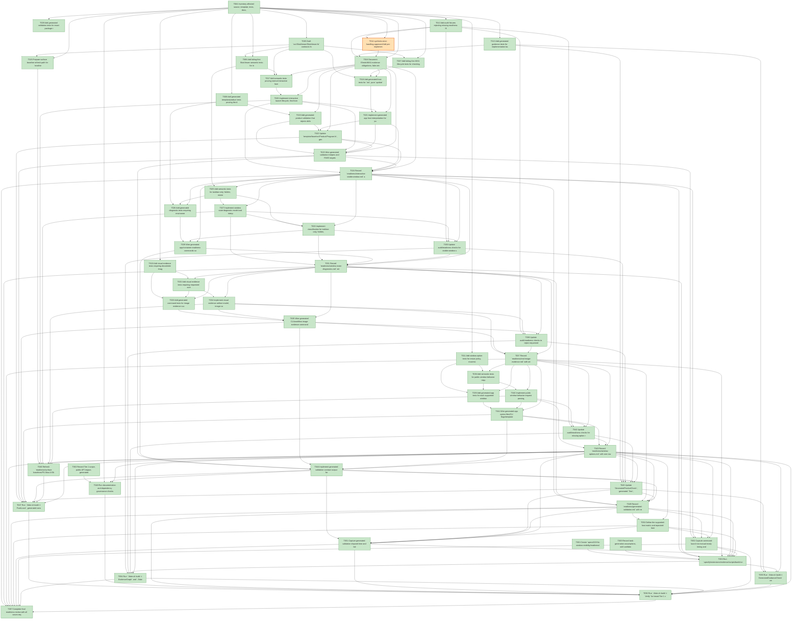

# Task Graph — 019-fix-window-visibility

## ✓ Graph is acyclic and consistent

## Skill Match Assessments

| Task | Candidate | Confidence | Signals | Reviewer disposition | Diagnostic |
|------|-----------|------------|---------|----------------------|------------|
| T001 | (none) | none |  | declared | T001: no high-confidence capability signal detected |
| T002 | (none) | none |  | accepted-empty | T002: no high-confidence capability signal detected |
| T003 | speckit-tasks | high | task-text | accepted | T003: task text matches speckit-tasks |
| T004 | (none) | none |  | accepted-empty | T004: no high-confidence capability signal detected |
| T005 | (none) | none |  | declared | T005: no high-confidence capability signal detected |
| T006 | (none) | none |  | declared | T006: no high-confidence capability signal detected |
| T007 | (none) | none |  | declared | T007: no high-confidence capability signal detected |
| T008 | (none) | none |  | declared | T008: no high-confidence capability signal detected |
| T009 | (none) | none |  | declared | T009: no high-confidence capability signal detected |
| T010 | (none) | none |  | declared | T010: no high-confidence capability signal detected |
| T011 | (none) | none |  | declared | T011: no high-confidence capability signal detected |
| T012 | (none) | none |  | declared | T012: no high-confidence capability signal detected |
| T013 | (none) | none |  | declared | T013: no high-confidence capability signal detected |
| T014 | (none) | none |  | declared | T014: no high-confidence capability signal detected |
| T015 | (none) | none |  | declared | T015: no high-confidence capability signal detected |
| T016 | (none) | none |  | accepted-empty | T016: no high-confidence capability signal detected |
| T017 | (none) | none |  | declared | T017: no high-confidence capability signal detected |
| T018 | (none) | none |  | declared | T018: no high-confidence capability signal detected |
| T019 | (none) | none |  | declared | T019: no high-confidence capability signal detected |
| T020 | (none) | none |  | declared | T020: no high-confidence capability signal detected |
| T021 | (none) | none |  | declared | T021: no high-confidence capability signal detected |
| T022 | (none) | none |  | declared | T022: no high-confidence capability signal detected |
| T023 | (none) | none |  | declared | T023: no high-confidence capability signal detected |
| T024 | (none) | none |  | accepted-empty | T024: no high-confidence capability signal detected |
| T025 | (none) | none |  | declared | T025: no high-confidence capability signal detected |
| T026 | (none) | none |  | declared | T026: no high-confidence capability signal detected |
| T027 | (none) | none |  | declared | T027: no high-confidence capability signal detected |
| T028 | (none) | none |  | declared | T028: no high-confidence capability signal detected |
| T029 | (none) | none |  | declared | T029: no high-confidence capability signal detected |
| T030 | (none) | none |  | declared | T030: no high-confidence capability signal detected |
| T031 | (none) | none |  | accepted-empty | T031: no high-confidence capability signal detected |
| T032 | (none) | none |  | declared | T032: no high-confidence capability signal detected |
| T033 | (none) | none |  | declared | T033: no high-confidence capability signal detected |
| T034 | (none) | none |  | declared | T034: no high-confidence capability signal detected |
| T035 | (none) | none |  | declared | T035: no high-confidence capability signal detected |
| T036 | (none) | none |  | declared | T036: no high-confidence capability signal detected |
| T037 | (none) | none |  | accepted-empty | T037: no high-confidence capability signal detected |
| T038 | (none) | none |  | declared | T038: no high-confidence capability signal detected |
| T039 | (none) | none |  | declared | T039: no high-confidence capability signal detected |
| T040 | (none) | none |  | declared | T040: no high-confidence capability signal detected |
| T041 | (none) | none |  | declared | T041: no high-confidence capability signal detected |
| T042 | (none) | none |  | declared | T042: no high-confidence capability signal detected |
| T043 | (none) | none |  | accepted-empty | T043: no high-confidence capability signal detected |
| T044 | (none) | none |  | declared | T044: no high-confidence capability signal detected |
| T045 | (none) | none |  | declared | T045: no high-confidence capability signal detected |
| T046 | (none) | none |  | declared | T046: no high-confidence capability signal detected |
| T047 | (none) | none |  | declared | T047: no high-confidence capability signal detected |
| T048 | (none) | none |  | accepted-empty | T048: no high-confidence capability signal detected |
| T049 | (none) | none |  | accepted-empty | T049: no high-confidence capability signal detected |
| T050 | (none) | none |  | accepted-empty | T050: no high-confidence capability signal detected |
| T051 | (none) | none |  | declared | T051: no high-confidence capability signal detected |
| T052 | (none) | none |  | declared | T052: no high-confidence capability signal detected |
| T053 | (none) | none |  | declared | T053: no high-confidence capability signal detected |
| T054 | speckit-evidence-graph | high | task-text | accepted | T054: task text matches speckit-evidence-graph |
| T054 | speckit-evidence-audit | high | task-text | accepted | T054: task text matches speckit-evidence-audit |
| T055 | (none) | none |  | declared | T055: no high-confidence capability signal detected |
| T056 | (none) | none |  | accepted-empty | T056: no high-confidence capability signal detected |
| T057 | speckit-evidence-audit | high | task-text | accepted | T057: task text matches speckit-evidence-audit |

## Status counts (effective)

| Status | Count |
|--------|-------|
| [X] done | 56 |
| [S] synthetic | 1 |
| [S*] auto-synthetic | 0 |
| accepted [SEH] synthetic | 1 |
| unaccepted synthetic | 0 |

## Synthetic Error-Handling Classification

| Task | Accepted | Label | Design source | Synthetic input class | Expected error behavior | Diagnostics |
|------|----------|-------|---------------|-----------------------|-------------------------|-------------|
| T014 | yes | yes | `specs/019-fix-window-visibility/plan.md` Synthetic Evidence and readiness/generated-validation contracts | malformed readiness rows, invalid evidence command arguments, corrupt image metadata records, missing generated-validation fields, hostile artifact paths | Validator or audit reports explicit validation errors without treating malformed records, placeholder artifacts, or hostile paths as success | (none) |

## Graph



## ASCII view

```
T001 [X] Create `specs/019-fix-window-visibility/readiness/` and scaffold required readiness files for interactive visible window, close reason separation, window diagnostics, window options, real image evidence, generated validation, and audit, plus supporting governance graph output
T002 [X] Record Tier 1 scope, public API impact, generated product impact, package impact, unsupported scope, and evidence obligations in `readiness/evidence-obligations.md`
T003 [X] Record task-generation assumptions, skill confidence review, valid-empty skill dispositions, `[SEH]` approval rationale, graph validation expectations, and risk-level evidence rules in `readiness/task-generation.md`
T004 [X] Inventory affected source, template, tests, docs, FAKE targets, package guidance, fixtures, and readiness paths named by the spec, plan, contracts, and quickstart
T005 [X] Draft `src/SkiaViewer/SkiaViewer.fsi` contracts for close reasons, observed values, window behavior requests, option results, launch outcomes, visual evidence artifacts, `Model`/`Msg`/`Effect`, `init`, pure `update`, and interpreter boundaries
T006 [X] Add failing-first SkiaViewer semantic tests for interactive/evidence mode separation, first-frame non-completion, taskbar-only degradation, close reason derivation, and visibility diagnostic fields
T007 [X] Add failing-first MVU lifecycle tests for checking-session, starting-window, visibility-checking, interactive-running, evidence-running, close-requested, unsupported, inaccessible-window, timeout, and failure transitions plus emitted effects
T008 [X] Add generated template/product tests proving the default command uses interactive visible-window launch and explicit commands are required for bounded, image, pixel-readback, or metadata evidence
T009 [X] Add generated validation tests for exact package resolution, generated tests ran, authoritative flags, failure classes, `NU1603`, missing package source, placeholder success, and non-authoritative source scans
T010 [X] Add visual evidence tests requiring decodable image artifacts for requested image evidence, clear metadata/hash labeling, scene-vs-desktop-visibility claims, and unsupported-host diagnostics
T011 [X] Add window option tests for resize policy, maximize policy, startup state, startup position, backend preference, honored/degraded/unsupported/failed results, and fallback messages
T012 [X] Add audit fixtures rejecting missing readiness files, process/taskbar-only visible-window substitution, evidence close reported as user close, metadata-only screenshot claims, unresolved package mismatch, and missing generated test execution
T013 [X] Add generated guidance tests for implementation batches, skill loading, graph refresh before/after status changes, red-green evidence logs, persistent launch rules, and non-authoritative aggregate reporting
T014 [S] synthetic-error-handling-approved Add pre-implementation synthetic error-handling validation for malformed readiness rows, invalid evidence command arguments, corrupt image metadata records, missing required generated-validation fields, and hostile artifact paths; approved synthetic error-handling evidence recorded in `readiness/logs/t014-synthetic-error-evidence.txt`   ← accepted [SEH]
T015 [X] Prepare surface baseline refresh path for `readiness/surface-baselines/FS.Skia.UI.SkiaViewer.txt` without refreshing the baseline during task generation
T016 [X] Document Elmish/MVU evidence obligations, fake window-loop limits, required real interpreter evidence, supported-host visible-window requirements, small/medium/broad validation levels, broad-validation trigger, and non-authoritative aggregate handling
T017 [X] Add semantic tests proving normal interactive launch remains open after first-frame presentation, reports `mode=interactive-window`, does not self-close for evidence, and only completes after user/app/host/failure close
T018 [X] Add generated host tests for `init`, pure `update`, emitted effects, first-frame state, input-device observation, manual input availability, and explicit user/native close
T019 [X] Add generated product validation that rejects default commands which exit after first frame, run bounded evidence, print metadata only, or lack an accessible desktop window claim
T020 [X] Implement interactive launch lifecycle, first-frame non-completion, user/app/host/failure close tracking, outcome compatibility fields, and desktop-session precheck in `src/SkiaViewer/SkiaViewer.fs`
T021 [X] Implement generated app host interpretation for pure update, rendered view refresh, input observation, emitted effects, and close handling without conflating evidence close with user close
T022 [X] Update `template/base/src/Product/Program.fs`, generated README/help text, and generated tests so the default executable path reaches the persistent visible-window launch
T023 [X] Wire generated validation helpers and FAKE targets to prove interactive persistence, supported-host visible-window accessibility, close reason reporting, and no bounded-only substitution
T024 [X] Record `readiness/interactive-visible-window.md` and `readiness/close-reason-separation.md` with command evidence, supported-host visibility facts, first-frame persistence, close criteria, and any fake-loop disclosure
T025 [X] Add semantic tests for taskbar-only, hidden, minimized-only, off-screen, unmapped, zero-sized, surface-less, and unsupported session classifications as degraded/failed rather than visible launch success
T026 [X] Add generated diagnostic tests requiring environment/session, window-visibility, app-lifecycle, and product-defect failure classes with observable-vs-unsupported native facts
T027 [X] Implement window state diagnostic model and interpreter reads for initialized, handle, visible, focusable, focused, minimized, maximized, client size, renderable surface, backend, and input-device facts
T028 [X] Implement classification for taskbar-only, hidden, minimized-only, off-screen, unmapped, zero-sized, surface-less, unsupported, unavailable, and environment/session failures with actionable messages
T029 [X] Wire generated app/container readiness commands so diagnostics run before app lifecycle debugging and do not silently switch to private runtime fallback or evidence mode
T030 [X] Update audit/readiness checks for visible-window substitution, missing diagnostic classes, unsupported-host-only claims, and process/taskbar-only success claims
T031 [X] Record `readiness/window-state-diagnostics.md` with invalid configuration matrix, observable native facts, unsupported fields, failure-class examples, and supported-host integration notes
T032 [X] Add visual evidence tests requiring requested screenshot/image artifacts to be decodable images, metadata/hash evidence to be labeled separately, and scene-rendering vs desktop-visibility claims to be explicit
T033 [X] Add generated command tests for image evidence success, pixel-readback fallback, metadata/hash output, unsupported-host output, and rejection of text hashes mislabeled as screenshots
T034 [X] Implement visual evidence artifact model, image capture or render-surface image output, decodability validation, pixel-readback fallback, metadata/hash labeling, and unsupported-host diagnostics
T035 [X] Wire generated CLI/workflow image evidence commands and generated validation output fields without changing the default interactive launch path; packed generated consumer image evidence consumed in T047
T036 [X] Update audit/readiness checks to reject requested image evidence that is metadata-only, undecodable, missing proof fields, or claiming desktop visibility from scene-only pixel readback
T037 [X] Record `readiness/real-image-evidence.md` with artifact paths, decodability proof, scene-rendering claim, desktop-visibility claim, fallback reason, and unsupported-host reason when applicable; updated to packed-package generated consumer evidence from T047
T038 [X] Add semantic tests for public window behavior request validation covering resize, maximize, startup state, startup position, backend preference, positive size constraints, invalid coordinates, and unsupported backend reporting
T039 [X] Add generated app tests for each supported window behavior setting and diagnostics when a host cannot honor the requested behavior
T040 [X] Implement public window behavior request parsing, validation, native option application, observed option result collection, fallback/degraded behavior, and failure-class reporting
T041 [X] Wire generated app option files/CLI flags/templates and generated validation outputs for resize, maximize, startup state, startup position, and backend preference; packed `runAppWithWindowBehavior` verified in T047
T042 [X] Update audit/readiness checks for missing option rows, silently ignored unsupported settings, and window-options failures hidden under generic app-lifecycle messages
T043 [X] Record `readiness/window-options.md` with one row per requested option, requested/observed values, honored/degraded/unsupported/failed status, and host-specific messages; readiness updated with T047 packed generated consumer evidence
T044 [X] Implement generated validation contract output for package resolution, generated test execution, default interactive launch validation, bounded evidence validation, close reason validation, window diagnostics, window options, image evidence, authoritative flag, and failure class
T045 [X] Update `GeneratedProductCheck`, generated `Test`, generated `Verify`, `TemplateCheck`, `GeneratedGuidanceCheck`, and package verification targets so misleading or incomplete generated app claims fail validation
T046 [X] Refresh `readiness/surface-baselines/FS.Skia.UI.SkiaViewer.txt` with `./fake.sh build -t RefreshSurfaceBaselines` and verify with `./fake.sh build -t PackageSurfaceCheck`
T047 [X] Run `./fake.sh build -t PackLocal`, generated consumer restore/test/verify, `./fake.sh build -t TemplateCheck`, and `./fake.sh build -t GeneratedProductCheck`; record package compatibility and generated-product evidence — `PackLocal`, `TemplateCheck`, and `GeneratedProductCheck` passed after routing persistent launches through the Vulkan/Skia presenter; see `readiness/logs/t047-retry-pack-local-presenter-tests.txt`, `readiness/logs/t047-retry-template-check-presenter-tests.txt`, `readiness/logs/t047-retry-generated-product-check-presenter-tests.txt`, and `readiness/generated-product-validation.md`
T048 [X] Run documentation and dependency governance checks, including `./fake.sh build -t DependencyReport`, and record no-new-dependency or package impact findings — DependencyReport passed and package impact was recorded for the SkiaViewer presenter bridge; see `readiness/logs/t048-dependency-report-after-docs.txt`, `readiness/dependency-report.md`, `readiness/dependencies.md`, and `readiness/dependency-governance.md`
T049 [X] Record `readiness/generated-validation.md` with restore/package evidence, generated test command evidence, interactive validation, bounded evidence validation, option validation, image evidence validation, authoritative verdict, and failure classes — authoritative generated validation recorded with package, generated Verify, interactive launch, bounded, options, image, verdict, and failure-class evidence
T050 [X] Define the supported-host matrix and repeated-launch attempt count used for SC-003, then record host/session/backend coverage and exception classification rules in `readiness/generated-validation.md` — supported-host matrix, 20-attempt/95% SC-003 rule, current Wayland/GPU-passthrough coverage, and exception classifications recorded
T051 [X] Capture generated validation elapsed time and fail or record blocking diagnostics when required checks exceed 5 minutes on a prepared supported host — dedicated `GeneratedProductCheck` timing passed with `elapsed-seconds=100`, `exit-code=0`; see `readiness/logs/t051-generated-product-check-elapsed.txt` and `readiness/generated-validation.md`
T052 [X] Capture command-launch-to-manual-ready timing and record whether manual interactive testing begins within 30 seconds without an environment-variable workaround — direct generated command launch completed with visible/accessibility diagnostics and manual close in `5` seconds without env-var workaround; see `readiness/logs/t052-command-launch-manual-ready.txt` and `readiness/generated-validation.md`
T053 [X] Run `.specify/extensions/evidence/scripts/bash/run-audit.sh specs/019-fix-window-visibility --graph-only` after story readiness records exist and capture clean graph output in `readiness/evidence-graph.md` — graph-only audit passed and refreshed `readiness/evidence-graph.md`, `readiness/task-graph.md`, and `readiness/task-graph.json`
T054 [X] Run `./fake.sh build -t EvidenceGraph` and `./fake.sh build -t EvidenceAudit`, then capture PASS or blocking diagnostics in `readiness/evidence-audit.md` — `EvidenceGraph` passed; `EvidenceAudit` failed with exit code `2` and blocking diagnostics captured in `readiness/evidence-audit.md`
T055 [X] Run `./fake.sh build -t GeneratedGuidanceCheck` and confirm generated task/implementation guidance preserves visible interactive launch, explicit evidence modes, skillist metadata, `[SEH]` validation, and risk-level rules — target passed; see `readiness/logs/t055-generated-guidance-check.txt`
T056 [X] Run `./fake.sh build -t Verify` for broad Tier 1 validation or record explicit non-authoritative aggregate diagnostics with focused rerun evidence — `Verify` reached the broad test chain after readiness preflight fixes; `Elmish.Tests` was fixed and passed, then the aggregate hung in `Smoke.Tests` after more than five minutes, so non-authoritative aggregate diagnostics were recorded in `readiness/aggregate-hang-diagnostics.md`
T057 [X] Complete final readiness review with all seven required readiness files, supported-host visible-window or unsupported-host diagnostics, package/test verification evidence, real image evidence, synthetic inventory, no bounded-only completion claims, and no unaccepted synthetic propagation — final `EvidenceAudit` passed with `unaccepted-synthetic-tasks=0`, `auto-synthetic-tasks=0`, and `diff-scan-hits=0`; see `readiness/logs/t057-evidence-audit-after-synthetic-resolution.txt`
```

