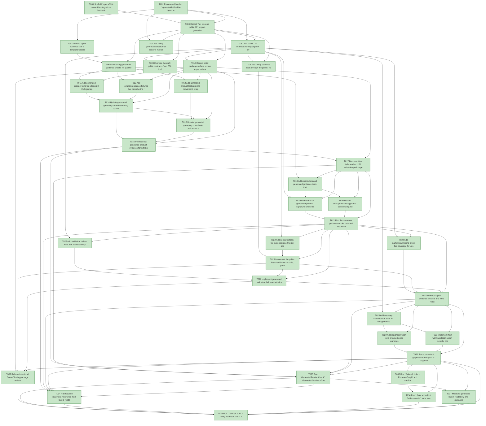

# Task Graph — 020-asteroids-integration-feedback

## ✓ Graph is acyclic and consistent

## Skill Match Assessments

| Task | Candidate | Confidence | Signals | Reviewer disposition | Diagnostic |
|------|-----------|------------|---------|----------------------|------------|
| T001 | (none) | none |  | accepted-empty | T001: no high-confidence capability signal detected |
| T002 | (none) | none |  | declared | T002: no high-confidence capability signal detected |
| T003 | (none) | none |  | declared | T003: no high-confidence capability signal detected |
| T004 | (none) | none |  | declared | T004: no high-confidence capability signal detected |
| T005 | (none) | none |  | declared | T005: no high-confidence capability signal detected |
| T006 | (none) | none |  | declared | T006: no high-confidence capability signal detected |
| T007 | (none) | none |  | declared | T007: no high-confidence capability signal detected |
| T008 | (none) | none |  | declared | T008: no high-confidence capability signal detected |
| T009 | (none) | none |  | declared | T009: no high-confidence capability signal detected |
| T010 | (none) | none |  | declared | T010: no high-confidence capability signal detected |
| T011 | (none) | none |  | declared | T011: no high-confidence capability signal detected |
| T012 | (none) | none |  | declared | T012: no high-confidence capability signal detected |
| T013 | (none) | none |  | declared | T013: no high-confidence capability signal detected |
| T014 | (none) | none |  | declared | T014: no high-confidence capability signal detected |
| T015 | (none) | none |  | declared | T015: no high-confidence capability signal detected |
| T016 | (none) | none |  | declared | T016: no high-confidence capability signal detected |
| T017 | (none) | none |  | declared | T017: no high-confidence capability signal detected |
| T018 | (none) | none |  | declared | T018: no high-confidence capability signal detected |
| T019 | (none) | none |  | declared | T019: no high-confidence capability signal detected |
| T020 | (none) | none |  | declared | T020: no high-confidence capability signal detected |
| T021 | (none) | none |  | declared | T021: no high-confidence capability signal detected |
| T022 | (none) | none |  | declared | T022: no high-confidence capability signal detected |
| T023 | (none) | none |  | declared | T023: no high-confidence capability signal detected |
| T024 | (none) | none |  | declared | T024: no high-confidence capability signal detected |
| T025 | (none) | none |  | declared | T025: no high-confidence capability signal detected |
| T026 | (none) | none |  | declared | T026: no high-confidence capability signal detected |
| T027 | (none) | none |  | declared | T027: no high-confidence capability signal detected |
| T028 | (none) | none |  | declared | T028: no high-confidence capability signal detected |
| T029 | (none) | none |  | declared | T029: no high-confidence capability signal detected |
| T030 | (none) | none |  | declared | T030: no high-confidence capability signal detected |
| T031 | (none) | none |  | declared | T031: no high-confidence capability signal detected |
| T032 | (none) | none |  | declared | T032: no high-confidence capability signal detected |
| T033 | (none) | none |  | declared | T033: no high-confidence capability signal detected |
| T034 | (none) | none |  | declared | T034: no high-confidence capability signal detected |
| T035 | speckit-evidence-graph | high | task-text | accepted | T035: task text matches speckit-evidence-graph |
| T036 | speckit-evidence-audit | high | task-text | accepted | T036: task text matches speckit-evidence-audit |
| T037 | (none) | none |  | declared | T037: no high-confidence capability signal detected |
| T038 | (none) | none |  | declared | T038: no high-confidence capability signal detected |

## Status counts (effective)

| Status | Count |
|--------|-------|
| [X] done | 38 |
| [S] synthetic | 0 |
| [S*] auto-synthetic | 0 |
| accepted [SEH] synthetic | 0 |
| unaccepted synthetic | 0 |

## Graph



## ASCII view

```
T001 [X] Scaffold `specs/020-asteroids-integration-feedback/readiness/` with the six required readiness files and placeholder command/status sections
T002 [X] Review and harden `.agents/skills/fs-skia-layout-evidence/SKILL.md` against the spec contracts, then record the resolved skill path in readiness notes
T003 [X] Add the layout evidence skill to `template/capabilities.yml` and any generated capability inventory consumed by task or guidance validation
T004 [X] Record Tier 1 scope, public API impact, generated product impact, MVU/effect-boundary applicability, synthetic limitations, and required evidence obligations in `readiness/layout-evidence.md`
T005 [X] Draft public `.fsi` contracts for layout proof levels, HUD/gameplay/text bounds, overlap diagnostics, unsupported reasons, and generated validation result types in `src/Scene/Scene.fsi` and/or `src/Testing/Testing.fsi`
T006 [X] Add failing semantic tests through the public `.fsi` surface for readable layout, deterministic-render-only evidence, unsupported layout inspection, and missing/overlapping bounds
T007 [X] Add failing governance tests that require `fs-skia-layout-evidence` metadata for layout, evidence, guidance, validation, and warning-classification tasks
T008 [X] Add failing generated guidance checks for qualified `Product.Program.view`, `Product.Program.generatedHost`, and `Product.Program.update` names
T009 [X] Exercise the draft public contracts from FSI, including representative readable, deterministic-only, and unsupported evidence records, and capture `readiness/public-contract-guidance.md`
T010 [X] Record initial package surface review expectations for changed Scene/Testing signatures and planned baseline updates
T011 [X] Add generated product tests for 1280x720 HUD/gameplay separation, 640x480 HUD readability, HUD/HUD overlap failure, and HUD/gameplay overlap failure
T012 [X] Add generated product tests proving movement, wrap, spawn, collision, and active entity bounds use the gameplay region instead of the full scene
T013 [X] Add template/guidance fixtures that describe the reserved HUD region, gameplay region, documented small-window size, and evidence command
T014 [X] Update generated game layout and rendering so score, lives, wave, status, and active gameplay entities are emitted with named HUD/gameplay regions
T015 [X] Update generated gameplay coordinate policies so entities wrap, clamp, spawn, and collide inside the gameplay region when the HUD region is reserved
T016 [X] Produce real generated product evidence for 1280x720 and 640x480 validation sizes and write `readiness/hud-layout-readability.md`
T017 [X] Document the independent US1 validation path in generated docs and `readiness/generated-validation.md`
T018 [X] Add public docs and generated guidance tests that fail on omitted or inconsistent `Product.Program.view`, `Product.Program.generatedHost`, or `Product.Program.update`
T019 [X] Add an FSI or generated-product signature smoke test that writes an app-owned signature using `FS.Skia.UI.Scene.Scene`, the generated host value, and a qualified update call
T020 [X] Update `docs/generated-apps.md`, `docs/testing.md`, template docs, and generated examples to use the qualified app-owned scene, host, and update names consistently
T021 [X] Run the consumer guidance smoke path and record command output, source snippets, and result in `readiness/public-contract-guidance.md`
T022 [X] Add semantic tests for evidence report fields: scene, output size, proof level, HUD region, gameplay region, text bounds, gameplay bounds, overlap status, measurement mode, unsupported reason, and diagnostics
T023 [X] Add validation helper tests that fail readability claims with missing facts, undisclosed unsupported facts, HUD/HUD overlap, HUD/gameplay overlap, or deterministic-render-only proof
T024 [X] Add malformed/missing layout fact coverage for unsupported and invalid evidence reports using public layout evidence constructors and classifiers
T025 [X] Implement the public layout evidence records, proof-level classification, conservative approximate measurement disclosure, and overlap diagnostics
T026 [X] Implement generated validation helpers that fail on missing, unsupported-without-disclosure, overlapping, or deterministic-only readability claims
T027 [X] Produce layout evidence artifacts and write `readiness/layout-evidence.md`
T028 [X] Add warning-classification tests for benign environment warnings, launch failures, rendering failures, layout failures, package failures, and unknown warnings
T029 [X] Add readiness/report tests proving benign warnings are non-fatal only when launch/render/layout/package evidence is otherwise successful or explicitly unsupported without a readability claim
T030 [X] Implement host warning classification records, non-fatal rule evaluation, and diagnostics that preserve real launch/render/layout/package failures
T031 [X] Run a persistent graphical launch path or supported unsupported-host diagnostic path and write `readiness/host-warning-classification.md`
T032 [X] Refresh intentional Scene/Testing package surface baselines and record `PackageSurfaceCheck` evidence
T033 [X] Run `GeneratedProductCheck`, `GeneratedGuidanceCheck`, and `TemplateCheck`, then update `readiness/generated-validation.md`
T034 [X] Run focused readiness review for `hud-layout-readability.md`, `public-contract-guidance.md`, `layout-evidence.md`, `host-warning-classification.md`, and `generated-validation.md`
T035 [X] Run `./fake.sh build -t EvidenceGraph` and confirm no cycles, dangling refs, mirror mismatches, invalid skill ids, or `[S*]` surprises
T036 [X] Run `./fake.sh build -t EvidenceAudit`, write `readiness/evidence-audit.md`, and document every accepted synthetic or unsupported condition
T037 [X] Measure generated layout-readability and guidance validation duration on a prepared supported host, require completion under 5 minutes, and record elapsed time in `readiness/generated-validation.md`
T038 [X] Run `./fake.sh build -t Verify` for broad Tier 1 validation, then record focused failures separately from non-authoritative aggregate results
```

