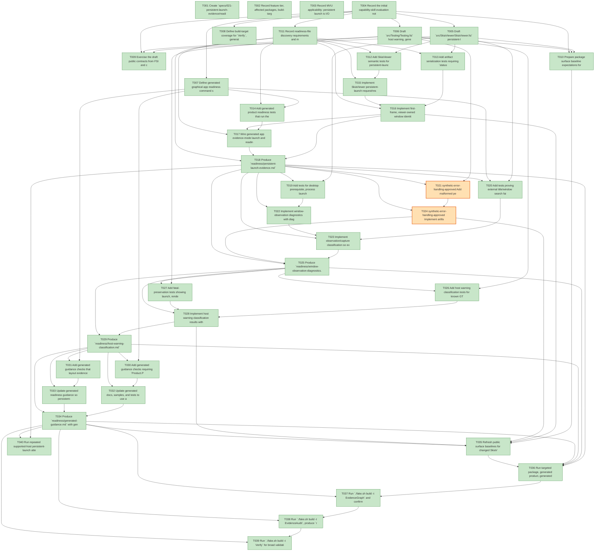

# Task Graph — 021-persistent-launch-evidence

## ✓ Graph is acyclic and consistent

## Skill Match Assessments

| Task | Candidate | Confidence | Signals | Reviewer disposition | Diagnostic |
|------|-----------|------------|---------|----------------------|------------|
| T001 | (none) | none |  | accepted-empty | T001: no high-confidence capability signal detected |
| T002 | (none) | none |  | accepted-empty | T002: no high-confidence capability signal detected |
| T003 | (none) | none |  | accepted-empty | T003: no high-confidence capability signal detected |
| T004 | (none) | none |  | accepted-empty | T004: no high-confidence capability signal detected |
| T005 | (none) | none |  | declared | T005: no high-confidence capability signal detected |
| T006 | (none) | none |  | declared | T006: no high-confidence capability signal detected |
| T007 | (none) | none |  | declared | T007: no high-confidence capability signal detected |
| T008 | speckit-evidence-graph | high | task-text | accepted | T008: task text matches speckit-evidence-graph |
| T008 | speckit-evidence-audit | high | task-text | accepted | T008: task text matches speckit-evidence-audit |
| T009 | (none) | none |  | declared | T009: no high-confidence capability signal detected |
| T010 | (none) | none |  | declared | T010: no high-confidence capability signal detected |
| T011 | (none) | none |  | accepted-empty | T011: no high-confidence capability signal detected |
| T012 | (none) | none |  | declared | T012: no high-confidence capability signal detected |
| T013 | (none) | none |  | declared | T013: no high-confidence capability signal detected |
| T014 | (none) | none |  | declared | T014: no high-confidence capability signal detected |
| T015 | (none) | none |  | declared | T015: no high-confidence capability signal detected |
| T016 | (none) | none |  | declared | T016: no high-confidence capability signal detected |
| T017 | (none) | none |  | declared | T017: no high-confidence capability signal detected |
| T018 | (none) | none |  | declared | T018: no high-confidence capability signal detected |
| T019 | (none) | none |  | declared | T019: no high-confidence capability signal detected |
| T020 | (none) | none |  | declared | T020: no high-confidence capability signal detected |
| T021 | (none) | none |  | declared | T021: no high-confidence capability signal detected |
| T022 | (none) | none |  | declared | T022: no high-confidence capability signal detected |
| T023 | (none) | none |  | declared | T023: no high-confidence capability signal detected |
| T024 | (none) | none |  | declared | T024: no high-confidence capability signal detected |
| T025 | (none) | none |  | declared | T025: no high-confidence capability signal detected |
| T026 | (none) | none |  | declared | T026: no high-confidence capability signal detected |
| T027 | (none) | none |  | declared | T027: no high-confidence capability signal detected |
| T028 | (none) | none |  | declared | T028: no high-confidence capability signal detected |
| T029 | (none) | none |  | declared | T029: no high-confidence capability signal detected |
| T030 | (none) | none |  | declared | T030: no high-confidence capability signal detected |
| T031 | (none) | none |  | declared | T031: no high-confidence capability signal detected |
| T032 | (none) | none |  | declared | T032: no high-confidence capability signal detected |
| T033 | (none) | none |  | declared | T033: no high-confidence capability signal detected |
| T034 | (none) | none |  | declared | T034: no high-confidence capability signal detected |
| T035 | (none) | none |  | declared | T035: no high-confidence capability signal detected |
| T036 | (none) | none |  | declared | T036: no high-confidence capability signal detected |
| T037 | speckit-evidence-graph | high | task-text | accepted | T037: task text matches speckit-evidence-graph |
| T038 | speckit-evidence-audit | high | task-text | accepted | T038: task text matches speckit-evidence-audit |
| T039 | (none) | none |  | accepted-empty | T039: no high-confidence capability signal detected |
| T040 | (none) | none |  | declared | T040: no high-confidence capability signal detected |

## Status counts (effective)

| Status | Count |
|--------|-------|
| [X] done | 38 |
| [S] synthetic | 2 |
| [S*] auto-synthetic | 0 |
| accepted [SEH] synthetic | 2 |
| unaccepted synthetic | 0 |

## Synthetic Error-Handling Classification

| Task | Accepted | Label | Design source | Synthetic input class | Expected error behavior | Diagnostics |
|------|----------|-------|---------------|-----------------------|-------------------------|-------------|
| T021 | yes | yes | `specs/021-persistent-launch-evidence/contracts/persistent-launch-evidence-contract.md`; `specs/021-persistent-launch-evidence/contracts/evidence-audit-contract.md` | Missing required fields, invalid enum values, and contradictory `status=ok` claims without real launch facts. | Reject artifact, identify missing or contradictory facts, and never satisfy supported-host persistent-launch readiness. | (none) |
| T024 | yes | yes | `specs/021-persistent-launch-evidence/contracts/persistent-launch-evidence-contract.md`; `specs/021-persistent-launch-evidence/contracts/evidence-audit-contract.md` | Missing required fields, invalid enum values, and contradictory `status=ok` claims without real launch facts. | Reject artifact, identify missing or contradictory facts, and never satisfy supported-host persistent-launch readiness. | (none) |

## Graph



## ASCII view

```
T001 [X] Create `specs/021-persistent-launch-evidence/readiness/` and placeholder names for the five required readiness files.
T002 [X] Record feature tier, affected packages, build-target impact, public-API impact, unsupported scope, and broad validation obligations in readiness notes.
T003 [X] Record MVU applicability: persistent launch is I/O-bearing and requires `Model`, `Msg`, `Effect`, `init`, `update`, emitted-effect tests, and interpreter evidence.
T004 [X] Record the initial capability-skill evaluation notes for valid-empty tasks plus the required `fs-skia-layout-evidence` matches.
T005 [X] Draft `src/SkiaViewer/SkiaViewer.fsi` persistent-launch request, artifact, outcome, window fact, blocked-stage, `Model`, `Msg`, `Effect`, `init`, `update`, and interpreter-boundary signatures.
T006 [X] Draft `src/Testing/Testing.fsi` host warning, generated guidance, persistent artifact validation, and readiness-file discovery contracts.
T007 [X] Define generated graphical app readiness command shape, artifact path, app-qualified naming rules, and separation of layout evidence from persistent-window evidence.
T008 [X] Define build-target coverage for `Verify`, generated `Test`, `GeneratedProductCheck`, `GeneratedGuidanceCheck`, `TemplateCheck`, `EvidenceGraph`, and `EvidenceAudit`.
T009 [X] Exercise the draft public contracts from FSI and capture representative request/result/update/effect transcript expectations in `readiness/fsi-session.txt`.
T010 [X] Prepare package surface baseline expectations for `FS.Skia.UI.SkiaViewer` and `FS.Skia.UI.Testing`.
T011 [X] Record readiness-file discovery requirements and missing-fact diagnostics for unsupported or blocked hosts.
T012 [X] Add SkiaViewer semantic tests for persistent-launch `init`/`update` transitions, emitted effects, first-frame recording, input-dispatch recording, and controlled-close state.
T013 [X] Add artifact serialization tests requiring `status`, `mode`, `command`, `window-opened`, `input-dispatch`, `exit-path`, `blocked-stage`, `classification`, `category`, `message`, and first-frame facts.
T014 [X] Add generated product readiness tests that run the explicit evidence-mode command without changing the normal persistent default launch. Evidence: `readiness/logs/t014-generated-product-check-green.txt`.
T015 [X] Implement SkiaViewer persistent-launch request/result model, pure update transitions, emitted effects, and edge interpreter hooks.
T016 [X] Implement first-frame, viewer-owned window identity, input-dispatch status, controlled evidence close, close reason, and artifact serialization.
T017 [X] Wire generated app evidence-mode launch and readiness artifact writing while preserving default user-driven persistent launch.
T018 [X] Produce `readiness/persistent-launch-evidence.md` from a supported-host real launch or record the exact blocked prerequisite stage without claiming pass.
T019 [X] Add tests for desktop prerequisite, process launch, window creation, first-frame/render, observation, capture, input verification, controlled-exit, and artifact-write blocked stages.
T020 [X] Add tests proving external title/window search failure cannot produce headless-only classification when viewer-owned facts and a live process exist.
T021 [S] synthetic-error-handling-approved Add malformed persistent-launch artifact parser tests for missing required fields, invalid field values, and contradictory pass claims.   ← accepted [SEH]
T022 [X] Implement window-observation diagnostics with diagnostic source, host facts, viewer facts, external observation facts, capture facts, missing facts, blocked stage, classification, and message.
T023 [X] Implement observation/capture classification so external observation failure stays observation/capture blocked when desktop prerequisites and viewer-owned launch facts are present.
T024 [S] synthetic-error-handling-approved Implement artifact validation diagnostics for missing fields, synthetic fixture rejection, contradictory pass claims, and actionable messages.   ← accepted [SEH]
T025 [X] Produce `readiness/window-observation-diagnostics.md` with real launch, generic host probe, and any synthetic fixture distinctions disclosed.
T026 [X] Add host warning classification tests for known GTK/module warnings paired with passing launch, first-frame/render, and exit facts.
T027 [X] Add fatal-preservation tests showing launch, rendering, layout, package, and artifact-write failures remain fatal even with benign warning text present.
T028 [X] Implement host warning classification results with raw message, warning class, fatal flag, evidence path, supporting facts, and diagnostics.
T029 [X] Produce `readiness/host-warning-classification.md` showing benign warnings preserved as non-blocking only when required real launch facts pass.
T030 [X] Add generated guidance checks requiring `Product.Program.view`, `Product.Program.generatedHost`, and `Product.Program.update` when framework capability namespaces are open.
T031 [X] Add generated guidance checks that layout evidence, deterministic render hashes, and persistent-window launch evidence are documented as separate proof types.
T032 [X] Update generated docs, samples, and tests to use app-qualified scene, host, and update names in collision-prone contexts.
T033 [X] Update generated readiness guidance so persistent-launch evidence is not described as layout, screenshot, or deterministic render proof.
T034 [X] Produce `readiness/generated-guidance.md` with generated guidance checks and any remaining naming or evidence-separation diagnostics.
T035 [X] Refresh public surface baselines for changed SkiaViewer and Testing contracts with `./fake.sh build -t RefreshSurfaceBaselines`, then verify with `./fake.sh build -t PackageSurfaceCheck`.
T036 [X] Run targeted package, generated product, generated guidance, template, and readiness checks; record small/medium/broad validation results and non-authoritative aggregate notes.
T037 [X] Run `./fake.sh build -t EvidenceGraph` and confirm no cycles, dangling refs, mirror mismatches, or invalid skill metadata.
T038 [X] Run `./fake.sh build -t EvidenceAudit`, produce `readiness/evidence-audit.md`, and confirm required readiness files and persistent-launch artifact fields are internally consistent.
T039 [X] Run `./fake.sh build -t Verify` for broad validation and record any host-specific unsupported prerequisites separately from feature failures.
T040 [X] Run repeated supported-host persistent-launch attempts, record pass ratio against the 95% SC-001 threshold, and classify every failed attempt by blocked stage in `readiness/persistent-launch-evidence.md`.
```

