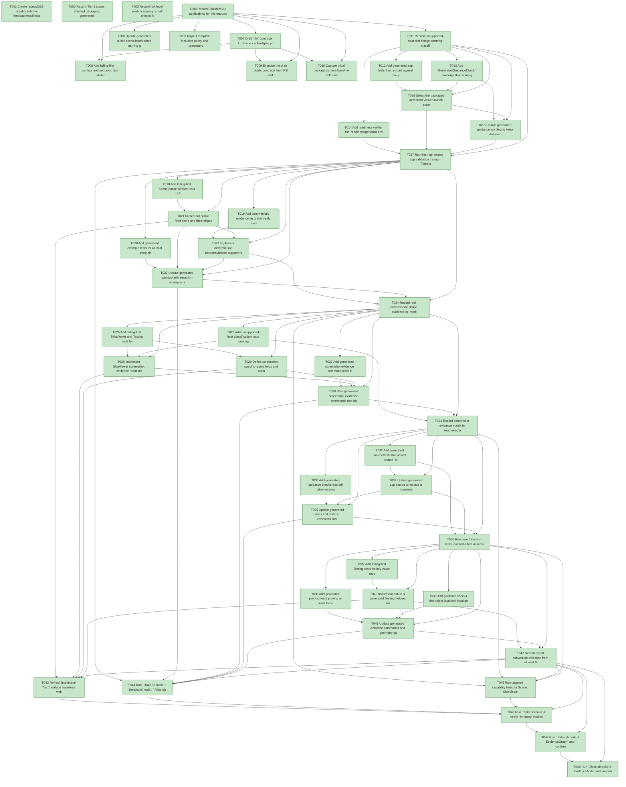

# Task Graph — 022-breakout-demo-feedback

## ✓ Graph is acyclic and consistent

## Skill Match Assessments

| Task | Candidate | Confidence | Signals | Reviewer disposition | Diagnostic |
|------|-----------|------------|---------|----------------------|------------|
| T001 | (none) | none |  | accepted-empty | T001: no high-confidence capability signal detected |
| T002 | (none) | none |  | accepted-empty | T002: no high-confidence capability signal detected |
| T003 | (none) | none |  | accepted-empty | T003: no high-confidence capability signal detected |
| T004 | (none) | none |  | accepted-empty | T004: no high-confidence capability signal detected |
| T005 | (none) | none |  | declared | T005: no high-confidence capability signal detected |
| T006 | (none) | none |  | declared | T006: no high-confidence capability signal detected |
| T007 | (none) | none |  | declared | T007: no high-confidence capability signal detected |
| T008 | (none) | none |  | declared | T008: no high-confidence capability signal detected |
| T009 | (none) | none |  | declared | T009: no high-confidence capability signal detected |
| T010 | (none) | none |  | declared | T010: no high-confidence capability signal detected |
| T011 | (none) | none |  | declared | T011: no high-confidence capability signal detected |
| T012 | (none) | none |  | declared | T012: no high-confidence capability signal detected |
| T013 | (none) | none |  | declared | T013: no high-confidence capability signal detected |
| T014 | (none) | none |  | declared | T014: no high-confidence capability signal detected |
| T015 | (none) | none |  | declared | T015: no high-confidence capability signal detected |
| T016 | (none) | none |  | declared | T016: no high-confidence capability signal detected |
| T017 | (none) | none |  | declared | T017: no high-confidence capability signal detected |
| T018 | (none) | none |  | declared | T018: no high-confidence capability signal detected |
| T019 | (none) | none |  | declared | T019: no high-confidence capability signal detected |
| T020 | (none) | none |  | declared | T020: no high-confidence capability signal detected |
| T021 | (none) | none |  | declared | T021: no high-confidence capability signal detected |
| T022 | (none) | none |  | declared | T022: no high-confidence capability signal detected |
| T023 | (none) | none |  | declared | T023: no high-confidence capability signal detected |
| T024 | (none) | none |  | declared | T024: no high-confidence capability signal detected |
| T025 | (none) | none |  | declared | T025: no high-confidence capability signal detected |
| T026 | (none) | none |  | declared | T026: no high-confidence capability signal detected |
| T027 | (none) | none |  | declared | T027: no high-confidence capability signal detected |
| T028 | (none) | none |  | declared | T028: no high-confidence capability signal detected |
| T029 | (none) | none |  | declared | T029: no high-confidence capability signal detected |
| T030 | (none) | none |  | declared | T030: no high-confidence capability signal detected |
| T031 | (none) | none |  | declared | T031: no high-confidence capability signal detected |
| T032 | (none) | none |  | declared | T032: no high-confidence capability signal detected |
| T033 | (none) | none |  | declared | T033: no high-confidence capability signal detected |
| T034 | (none) | none |  | declared | T034: no high-confidence capability signal detected |
| T035 | (none) | none |  | declared | T035: no high-confidence capability signal detected |
| T036 | (none) | none |  | declared | T036: no high-confidence capability signal detected |
| T037 | (none) | none |  | declared | T037: no high-confidence capability signal detected |
| T038 | (none) | none |  | declared | T038: no high-confidence capability signal detected |
| T039 | (none) | none |  | declared | T039: no high-confidence capability signal detected |
| T040 | (none) | none |  | declared | T040: no high-confidence capability signal detected |
| T041 | (none) | none |  | declared | T041: no high-confidence capability signal detected |
| T042 | (none) | none |  | declared | T042: no high-confidence capability signal detected |
| T043 | (none) | none |  | declared | T043: no high-confidence capability signal detected |
| T044 | (none) | none |  | declared | T044: no high-confidence capability signal detected |
| T045 | (none) | none |  | declared | T045: no high-confidence capability signal detected |
| T046 | (none) | none |  | accepted-empty | T046: no high-confidence capability signal detected |
| T047 | speckit-evidence-graph | high | task-text | accepted | T047: task text matches speckit-evidence-graph |
| T048 | speckit-evidence-audit | high | task-text | accepted | T048: task text matches speckit-evidence-audit |

## Status counts (effective)

| Status | Count |
|--------|-------|
| [X] done | 48 |
| [S] synthetic | 0 |
| [S*] auto-synthetic | 0 |
| accepted [SEH] synthetic | 0 |
| unaccepted synthetic | 0 |

## Graph



## ASCII view

```
T001 [X] Create `specs/022-breakout-demo-feedback/readiness/` with placeholders for `generated-viewer-guidance.md`, `scene-shape-evidence.md`, `screenshot-evidence.md`, `effect-boundary-guidance.md`, and `evidence-report-conventions.md`
T002 [X] Record Tier 1 scope, affected packages, generated-template ownership, required real evidence paths, and deferred scope in `readiness/feature-scope.md`
T003 [X] Record risk-level evidence policy: small checks for isolated docs/tests, medium checks for package/template changes, broad `Verify` plus graph/audit when public contracts or generated defaults change; aggregate results are non-authoritative unless backed by named artifacts
T004 [X] Record Elmish/MVU applicability for this feature: generated apps are stateful and I/O-bearing, so `Model`, `Msg`, app commands, pure `update`, viewer effects, and host interpreter evidence are required
T005 [X] Draft `.fsi` contracts for Scene circle/ellipse primitives, SkiaViewer screenshot results, Testing report/guidance helpers, and generated app `Model`/`Msg`/app command/update/host interpreter boundaries
T006 [X] Update generated public scene/host/update naming guidance so generated docs and tests use `Product.Program.view`, `Product.Program.generatedHost`, and `Product.Program.update`
T007 [X] Inspect template inclusion policy and `.template.config/template.json` for any new or renamed generated files needed by this feature
T008 [X] Add failing-first surface and semantic test skeletons for Scene, SkiaViewer, and Testing public contracts without implementing behavior
T009 [X] Exercise the draft public contracts from FSI and capture `readiness/fsi-session.txt`, including shape constructors, screenshot result construction, and report helper signatures
T010 [X] Capture initial package surface baseline diffs under `readiness/surface-baselines/` for `FS.Skia.UI.Scene`, `FS.Skia.UI.SkiaViewer`, and `FS.Skia.UI.Testing`
T011 [X] Record unsupported-host and benign-warning classification rules for screenshot evidence so unsupported capture is a real negative host fact, not synthetic success
T012 [X] Add generated app tests that compile against the packed package and fail if the documented persistent viewer entry point is missing
T013 [X] Add `GeneratedGuidanceCheck` coverage that scans generated source, tests, docs, quickstart text, and readiness wording for one selected persistent-launch contract
T014 [X] Add readiness verifier for `readiness/generated-viewer-guidance.md` requiring package version, selected entry point, files scanned, and distinct deterministic/persistent/screenshot evidence kinds
T015 [X] Select the packaged persistent viewer launch contract and update generated source, tests, docs, quickstart, and examples to use that public name consistently
T016 [X] Update generated guidance wording to keep deterministic render proof, persistent launch proof, and screenshot proof separate
T017 [X] Run fresh generated app validation through `TemplateCheck` and record the persistent launch guidance result in `readiness/generated-viewer-guidance.md`
T018 [X] Add failing-first Scene public surface tests for filled circle and filled ellipse constructors through `Scene.fsi`
T019 [X] Add deterministic evidence tests that verify circle and ellipse bounds, fill, placement, and partial-out-of-bounds behavior without live screenshot capture
T020 [X] Add generated example tests for at least three circular or elliptical entities without rectangle substitution
T021 [X] Implement public filled circle and filled ellipse Scene primitives, including node shapes, evidence descriptions, and geometry helper constructors where needed
T022 [X] Implement deterministic render/evidence support for circle and ellipse shape facts in under 5 seconds for the standard generated scene
T023 [X] Update generated game/chart/interaction examples and geometry guidance to use shared Scene geometry for layout evidence, collision bounds, containment checks, and rendering bounds when it fits
T024 [X] Record real deterministic shape evidence in `readiness/scene-shape-evidence.md`
T025 [X] Add failing-first SkiaViewer and Testing tests for screenshot success fields, unsupported fields, normalized statuses, dimensions, output paths, and diagnostics
T026 [X] Add unsupported-host classification tests proving unsupported screenshot capture never claims screenshot proof and always names `fallback=deterministic-scene-evidence`
T027 [X] Add generated screenshot evidence command tests for supported-host success where available and explicit unsupported result where capture is unavailable
T028 [X] Implement SkiaViewer screenshot evidence request/result contracts and host interpreter behavior using existing viewer/platform capability, returning explicit unsupported results when capture is unavailable
T029 [X] Define screenshot-specific report fields and status classification against the shared evidence report helper contract, without introducing a separate screenshot-only writer
T030 [X] Wire generated screenshot evidence commands and docs to the viewer result and report helpers
T031 [X] Record screenshot evidence matrix in `readiness/screenshot-evidence.md`: supported-host `status=ok` facts when capture support is available or a blocked supported-host note with exact missing capability and owner, plus unsupported-host `status=unsupported`, reason, and deterministic fallback without screenshot proof claims
T032 [X] Add generated source/tests that assert `update` is pure, app commands are emitted separately, and viewer render/window/screenshot effects are produced or interpreted at the host boundary
T033 [X] Add generated guidance checks that fail when examples append viewer effects to app command lists or use inconsistent effect-category names
T034 [X] Update generated app source to include a complete `Model`, `Msg`, app command, `init`, pure `update`, `view`, generated host, and interpreter-boundary example
T035 [X] Update generated docs and tests so reviewers can identify app commands, viewer effects, and host interpretation from the generated example alone
T036 [X] Run pure transition tests, emitted-effect assertions, real interpreter evidence where safe, and a timed reviewer checklist proving app commands versus viewer effects can be identified in under 2 minutes; record `readiness/effect-boundary-guidance.md`
T037 [X] Add failing-first Testing tests for key-value report helper ordering, parent directory creation, stdout/file parity, status vocabulary, unsupported-host fields, and exit behavior
T038 [X] Add generated product tests proving at least three evidence commands share the same report conventions
T039 [X] Add guidance checks that reject duplicate local geometry records when shared Scene geometry fits the generated app model
T040 [X] Implement public or generated Testing helpers for stable key-value evidence reports, directory creation, stdout echoing, normalized statuses, unsupported-host fields, and command exit classification
T041 [X] Update generated evidence commands and geometry guidance to reuse the standard report helpers and shared Scene geometry conventions
T042 [X] Record report convention evidence from at least three generated evidence commands in `readiness/evidence-report-conventions.md`
T043 [X] Refresh intentional Tier 1 surface baselines with `./fake.sh build -t RefreshSurfaceBaselines` and verify `./fake.sh build -t PackageSurfaceCheck`
T044 [X] Run `./fake.sh build -t TemplateCheck`, `./fake.sh build -t GeneratedGuidanceCheck`, and `./fake.sh build -t TemplateDrift`; record generated validation artifacts under readiness
T045 [X] Run targeted capability tests for Scene, SkiaViewer, Testing, and generated Elmish wiring plus `./fake.sh build -t FsiTranscripts`
T046 [X] Run `./fake.sh build -t Verify` for broad validation because public contracts and generated defaults changed; record non-authoritative aggregate output with links to authoritative readiness artifacts
T047 [X] Run `./fake.sh build -t EvidenceGraph` and confirm no cycles, dangling refs, mirror mismatches, invalid skills, or unexpected computed statuses
T048 [X] Run `./fake.sh build -t EvidenceAudit` and confirm verdict PASS or document every accepted synthetic override
```

