# Task Graph — 023-phased-refactor-cleanup

## ✓ Graph is acyclic and consistent

## Skill Match Assessments

| Task | Candidate | Confidence | Signals | Reviewer disposition | Diagnostic |
|------|-----------|------------|---------|----------------------|------------|
| T001 | (none) | none |  | accepted-empty | T001: no high-confidence capability signal detected |
| T002 | speckit-tasks | high | task-text | accepted | T002: task text matches speckit-tasks |
| T003 | (none) | none |  | accepted-empty | T003: no high-confidence capability signal detected |
| T004 | (none) | none |  | accepted-empty | T004: no high-confidence capability signal detected |
| T005 | (none) | none |  | accepted-empty | T005: no high-confidence capability signal detected |
| T006 | (none) | none |  | declared | T006: no high-confidence capability signal detected |
| T007 | (none) | none |  | accepted-empty | T007: no high-confidence capability signal detected |
| T008 | (none) | none |  | declared | T008: no high-confidence capability signal detected |
| T009 | (none) | none |  | accepted-empty | T009: no high-confidence capability signal detected |
| T010 | (none) | none |  | declared | T010: no high-confidence capability signal detected |
| T011 | (none) | none |  | declared | T011: no high-confidence capability signal detected |
| T012 | (none) | none |  | declared | T012: no high-confidence capability signal detected |
| T013 | (none) | none |  | declared | T013: no high-confidence capability signal detected |
| T014 | (none) | none |  | declared | T014: no high-confidence capability signal detected |
| T015 | (none) | none |  | declared | T015: no high-confidence capability signal detected |
| T016 | (none) | none |  | declared | T016: no high-confidence capability signal detected |
| T017 | (none) | none |  | declared | T017: no high-confidence capability signal detected |
| T018 | (none) | none |  | declared | T018: no high-confidence capability signal detected |
| T019 | (none) | none |  | declared | T019: no high-confidence capability signal detected |
| T020 | (none) | none |  | declared | T020: no high-confidence capability signal detected |
| T021 | (none) | none |  | declared | T021: no high-confidence capability signal detected |
| T022 | (none) | none |  | declared | T022: no high-confidence capability signal detected |
| T023 | (none) | none |  | declared | T023: no high-confidence capability signal detected |
| T024 | (none) | none |  | declared | T024: no high-confidence capability signal detected |
| T025 | (none) | none |  | accepted-empty | T025: no high-confidence capability signal detected |
| T026 | (none) | none |  | accepted-empty | T026: no high-confidence capability signal detected |
| T027 | (none) | none |  | accepted-empty | T027: no high-confidence capability signal detected |
| T028 | (none) | none |  | accepted-empty | T028: no high-confidence capability signal detected |
| T029 | speckit-evidence-graph | high | task-text | accepted | T029: task text matches speckit-evidence-graph |
| T029 | speckit-evidence-audit | high | task-text | accepted | T029: task text matches speckit-evidence-audit |
| T030 | speckit-evidence-graph | high | task-text | accepted | T030: task text matches speckit-evidence-graph |
| T031 | (none) | none |  | declared | T031: no high-confidence capability signal detected |
| T032 | (none) | none |  | declared | T032: no high-confidence capability signal detected |
| T033 | (none) | none |  | declared | T033: no high-confidence capability signal detected |
| T034 | (none) | none |  | declared | T034: no high-confidence capability signal detected |
| T035 | (none) | none |  | declared | T035: no high-confidence capability signal detected |
| T036 | (none) | none |  | declared | T036: no high-confidence capability signal detected |
| T037 | speckit-evidence-audit | high | task-text | accepted | T037: task text matches speckit-evidence-audit |
| T038 | speckit-evidence-graph | high | task-text | accepted | T038: task text matches speckit-evidence-graph |
| T038 | speckit-evidence-audit | high | task-text | accepted | T038: task text matches speckit-evidence-audit |
| T039 | (none) | none |  | accepted-empty | T039: no high-confidence capability signal detected |
| T040 | speckit-evidence-graph | high | task-text | accepted | T040: task text matches speckit-evidence-graph |
| T040 | speckit-evidence-audit | high | task-text | accepted | T040: task text matches speckit-evidence-audit |

## Status counts (effective)

| Status | Count |
|--------|-------|
| [X] done | 40 |
| [S] synthetic | 0 |
| [S*] auto-synthetic | 0 |
| accepted [SEH] synthetic | 0 |
| unaccepted synthetic | 0 |

## Graph

```mermaid
graph TD
  T001["T001 Create `specs/023-phased-refactor-cleanup/readines"]:::done
  T002["T002 Record the task-generation skill review in readine"]:::done
  T003["T003 Record feature Tier 2 scope, no-public-contract-ch"]:::done
  T004["T004 Capture initial branch, `git status --short`, sele"]:::done
  T005["T005 Inventory stable behavior contracts from the spec "]:::done
  T006["T006 Characterize generated evidence/report behavior in"]:::done
  T007["T007 Classify duplicated helper families from `docs/202"]:::done
  T008["T008 Characterize current viewer diagnostics, host capa"]:::done
  T009["T009 Define the implementation batch evidence log forma"]:::done
  T010["T010 Before changing generated evidence/report code, ca"]:::done
  T011["T011 Add or tighten generated layout/readability eviden"]:::done
  T012["T012 Introduce one generated-product-local report writi"]:::done
  T013["T013 Route generated evidence commands through the loca"]:::done
  T014["T014 Remove or consolidate drift-prone specialized gene"]:::done
  T015["T015 Run `dotnet test tests/Testing.Tests/Testing.Tests"]:::done
  T016["T016 Before changing generated source organization, cap"]:::done
  T017["T017 Add generated profile validation expectations that"]:::done
  T018["T018 Extract generated product model, messages, update/"]:::done
  T019["T019 Extract generated layout evidence helpers into a r"]:::done
  T020["T020 Extract generated viewer/window option behavior in"]:::done
  T021["T021 Move generated evidence command implementations in"]:::done
  T022["T022 Update `template/base/src/Product/Product.fsproj` "]:::done
  T023["T023 Update generated docs/tests only where they assert"]:::done
  T024["T024 Run `./fake.sh build -t TemplateCheck`, `./fake.sh"]:::done
  T025["T025 Before changing build governance helpers, capture "]:::done
  T026["T026 Add or tighten checks for path, process execution,"]:::done
  T027["T027 Extract build path and process execution helpers i"]:::done
  T028["T028 Extract report writing, scalar/list parsing, gener"]:::done
  T029["T029 Rewire `build.fsx` to load helper scripts in depen"]:::done
  T030["T030 Run focused moved-helper targets plus `./fake.sh b"]:::done
  T031["T031 Before changing viewer internals, capture current "]:::done
  T032["T032 Add or tighten governance checks that unsupported "]:::done
  T033["T033 Extract legacy scene conversion and generated app "]:::done
  T034["T034 Extract diagnostics filtering, desktop session det"]:::done
  T035["T035 Extract visual evidence artifact generation and sc"]:::done
  T036["T036 Update `src/SkiaViewer/SkiaViewer.fsproj` compile "]:::done
  T037["T037 Run `dotnet test tests/SkiaViewer.Tests/SkiaViewer"]:::done
  T038["T038 Run the evidence graph validation and refresh `rea"]:::done
  T039["T039 Review public surface baselines, package IDs, gene"]:::done
  T040["T040 Run final `./fake.sh build -t EvidenceGraph` and `"]:::done
  T001 --> T004
  T003 --> T004
  T004 --> T005
  T004 --> T006
  T004 --> T007
  T004 --> T008
  T005 --> T009
  T006 --> T009
  T007 --> T009
  T008 --> T009
  T004 --> T009
  T009 --> T010
  T009 --> T011
  T010 --> T012
  T009 --> T012
  T010 --> T013
  T011 --> T013
  T012 --> T013
  T009 --> T013
  T013 --> T014
  T009 --> T014
  T013 --> T015
  T014 --> T015
  T009 --> T015
  T015 --> T016
  T015 --> T017
  T016 --> T018
  T015 --> T018
  T016 --> T019
  T015 --> T019
  T016 --> T020
  T015 --> T020
  T016 --> T021
  T017 --> T021
  T018 --> T021
  T019 --> T021
  T020 --> T021
  T015 --> T021
  T018 --> T022
  T019 --> T022
  T020 --> T022
  T021 --> T022
  T015 --> T022
  T017 --> T023
  T021 --> T023
  T022 --> T023
  T015 --> T023
  T019 --> T024
  T021 --> T024
  T022 --> T024
  T023 --> T024
  T015 --> T024
  T024 --> T025
  T024 --> T026
  T025 --> T027
  T026 --> T027
  T024 --> T027
  T025 --> T028
  T026 --> T028
  T024 --> T028
  T027 --> T029
  T028 --> T029
  T024 --> T029
  T029 --> T030
  T024 --> T030
  T030 --> T031
  T030 --> T032
  T031 --> T033
  T030 --> T033
  T031 --> T034
  T030 --> T034
  T031 --> T035
  T032 --> T035
  T033 --> T035
  T034 --> T035
  T030 --> T035
  T033 --> T036
  T034 --> T036
  T035 --> T036
  T030 --> T036
  T035 --> T037
  T036 --> T037
  T030 --> T037
  T037 --> T038
  T037 --> T039
  T038 --> T040
  T039 --> T040
  T037 --> T040
  classDef pending fill:#eeeeee,stroke:#999
  classDef done fill:#c8e6c9,stroke:#2e7d32
  classDef synthetic fill:#ffe0b2,stroke:#e65100,stroke-width:2px
  classDef autoSynthetic fill:#ffab91,stroke:#bf360c,stroke-width:2px,stroke-dasharray:5 3
  classDef failed fill:#ffcdd2,stroke:#b71c1c,stroke-width:2px
  classDef skipped fill:#f5f5f5,stroke:#666,stroke-dasharray:3 3
```



## ASCII view

```
T001 [X] Create `specs/023-phased-refactor-cleanup/readiness/` and placeholder readiness files for baseline, generated evidence cleanup, template split validation, build governance decomposition, and viewer internal boundary
T002 [X] Record the task-generation skill review in readiness notes, including valid-empty dispositions and the absence of `fs-skia-template-update` for non-packaging generated source tasks
T003 [X] Record feature Tier 2 scope, no-public-contract-change constraints, MVU/effect-boundary preservation requirements, and required real evidence paths
T004 [X] Capture initial branch, `git status --short`, selected baseline commands, and any pre-existing failures in `readiness/baseline-status.md`
T005 [X] Inventory stable behavior contracts from the spec and contracts: generated command names, report fields, statuses, output paths, exit codes, profile names, FAKE targets, readiness paths, public signatures, and package IDs
T006 [X] Characterize generated evidence/report behavior in existing tests, including field names, status vocabulary, stdout echo behavior, parent directory creation, and exit-code meanings
T007 [X] Classify duplicated helper families from `docs/2026-05-27-2204-refactoring-analysis.md` as consolidate, intentional boundary copy, or deferred, with verification coverage for each decision
T008 [X] Characterize current viewer diagnostics, host capability classifications, window validation, visual evidence, screenshot evidence, and unsupported-host messages behind the unchanged viewer facade
T009 [X] Define the implementation batch evidence log format for phase readiness files, including command, exit code, focused/broad risk level, changed ownership area, and pre-existing failure attribution
T010 [X] Before changing generated evidence/report code, capture current branch status, focused baseline commands, exit codes, and any pre-existing failures in `readiness/generated-evidence-cleanup.md`; then add or tighten generated evidence command tests that assert unchanged required report fields, status vocabulary, output paths, stdout echo behavior, parent directory creation, and exit-code meanings before consolidation
T011 [X] Add or tighten generated layout/readability evidence checks so report-writer consolidation preserves HUD/gameplay bounds, proof levels, unsupported classifications, and diagnostics
T012 [X] Introduce one generated-product-local report writing path for equivalent evidence command output without changing generated command names or report schemas
T013 [X] Route generated evidence commands through the local report writer while preserving layout evidence fields, unsupported classifications, and command exit semantics
T014 [X] Remove or consolidate drift-prone specialized generated report writers that no longer own unique behavior, keeping intentional template/package boundary copies documented
T015 [X] Run `dotnet test tests/Testing.Tests/Testing.Tests.fsproj`, `./fake.sh build -t TemplateCheck`, and `./fake.sh build -t GeneratedGuidanceCheck`; record commands, results, and verdict in `readiness/generated-evidence-cleanup.md`
T016 [X] Before changing generated source organization, capture current branch status, focused baseline commands, exit codes, and any pre-existing failures in `readiness/template-split-validation.md`; then add generated source-shape and compile-order expectations for product model, view, evidence commands, window options, layout evidence, and entrypoint responsibilities
T017 [X] Add generated profile validation expectations that every previously supported profile still instantiates, builds, and runs its generated tests without unnecessary testing-helper references
T018 [X] Extract generated product model, messages, update/state helpers, and pure scene/view description into responsibility-specific generated files
T019 [X] Extract generated layout evidence helpers into a responsibility-specific generated file while preserving readability proof levels and unsupported diagnostics
T020 [X] Extract generated viewer/window option behavior into a responsibility-specific generated file while preserving launch, host, and unsupported-window behavior
T021 [X] Move generated evidence command implementations into the responsibility-specific generated file and reduce `Program.fs` to launch and command dispatch responsibilities
T022 [X] Update `template/base/src/Product/Product.fsproj` compile order and profile-conditioned generated file inclusion without changing template package IDs or generated profile names
T023 [X] Update generated docs/tests only where they assert source ownership, preserving public command names, report fields, generated output paths, and exit-code meanings
T024 [X] Run `./fake.sh build -t TemplateCheck`, `./fake.sh build -t GeneratedGuidanceCheck`, and `./fake.sh build -t TemplateDrift`; record commands, results, generated profile coverage, and verdict in `readiness/template-split-validation.md`
T025 [X] Before changing build governance helpers, capture current branch status, focused baseline commands, exit codes, and any pre-existing failures in `readiness/build-governance-decomposition.md`; then add or tighten focused governance assertions that preserve FAKE target names, dependency behavior, report outputs, readiness paths, missing-artifact classifications, and actionable failure wording
T026 [X] Add or tighten checks for path, process execution, report writing, generated scanning, package resolution, template validation, and process-health helper behavior before extraction
T027 [X] Extract build path and process execution helpers into loaded scripts under `scripts/build/` while preserving public FAKE target registration in `build.fsx`
T028 [X] Extract report writing, scalar/list parsing, generated scanning, package resolution, template validation, and process-health policy helpers into loaded scripts with stable failure messages
T029 [X] Rewire `build.fsx` to load helper scripts in dependency order while keeping `Dev`, `Verify`, `Ci`, `PackLocal`, `DependencyReport`, `TemplateCheck`, `GeneratedGuidanceCheck`, `TemplateDrift`, `EvidenceGraph`, and `EvidenceAudit` stable
T030 [X] Run focused moved-helper targets plus `./fake.sh build -t Dev`, `./fake.sh build -t Verify`, and `./fake.sh build -t EvidenceGraph`; record focused and aggregate results in `readiness/build-governance-decomposition.md`
T031 [X] Before changing viewer internals, capture current branch status, focused baseline commands, exit codes, and any pre-existing failures in `readiness/viewer-internal-boundary.md`; then add or tighten viewer tests for diagnostics filtering, host capability classification, window behavior validation, visual evidence artifacts, screenshot result handling, and unsupported-host classification
T032 [X] Add or tighten governance checks that unsupported screenshot hosts keep explicit unsupported evidence and never claim screenshot proof
T033 [X] Extract legacy scene conversion and generated app host interpretation behind the unchanged `src/SkiaViewer/SkiaViewer.fsi` facade
T034 [X] Extract diagnostics filtering, desktop session detection, host capability classification, and window behavior validation into internal viewer modules
T035 [X] Extract visual evidence artifact generation and screenshot evidence result handling while preserving diagnostics, unsupported classifications, and existing failure wording
T036 [X] Update `src/SkiaViewer/SkiaViewer.fsproj` compile order for new implementation-detail files, confirm no new public signed modules or surface baseline entries are introduced, and confirm `SkiaViewer.fsi` and existing surface baselines remain unchanged
T037 [X] Run `dotnet test tests/SkiaViewer.Tests/SkiaViewer.Tests.fsproj`, `dotnet test tests/Governance.Tests/Governance.Tests.fsproj`, and `./fake.sh build -t EvidenceAudit`; record commands, host classification, surface-baseline status, and verdict in `readiness/viewer-internal-boundary.md`
T038 [X] Run the evidence graph validation and refresh `readiness/task-graph.json` plus `readiness/task-graph.md`; confirm no cycles, dangling refs, mirror mismatches, or unexpected synthetic propagation
T039 [X] Review public surface baselines, package IDs, generated profile names, generated command names, report fields, FAKE target names, and readiness paths; document any unchanged baseline evidence or Tier 1 stop condition
T040 [X] Run final `./fake.sh build -t EvidenceGraph` and `./fake.sh build -t EvidenceAudit`; record merge-readiness verdict and any non-authoritative aggregate results in readiness notes
```

