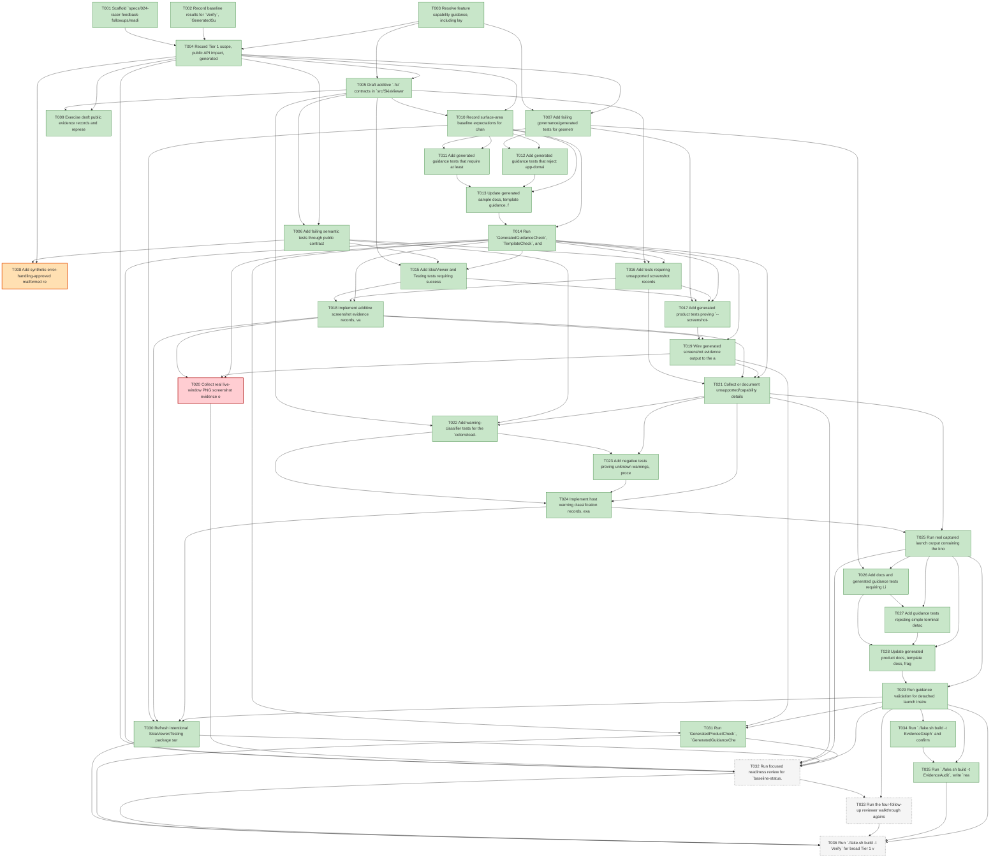

# Task Graph — 024-racer-feedback-followups

## ✓ Graph is acyclic and consistent

## Skill Match Assessments

| Task | Candidate | Confidence | Signals | Reviewer disposition | Diagnostic |
|------|-----------|------------|---------|----------------------|------------|
| T001 | (none) | none |  | accepted-empty | T001: no high-confidence capability signal detected |
| T002 | (none) | none |  | accepted-empty | T002: no high-confidence capability signal detected |
| T003 | (none) | none |  | declared | T003: no high-confidence capability signal detected |
| T004 | (none) | none |  | declared | T004: no high-confidence capability signal detected |
| T005 | (none) | none |  | declared | T005: no high-confidence capability signal detected |
| T006 | (none) | none |  | declared | T006: no high-confidence capability signal detected |
| T007 | (none) | none |  | declared | T007: no high-confidence capability signal detected |
| T008 | (none) | none |  | declared | T008: no high-confidence capability signal detected |
| T009 | (none) | none |  | declared | T009: no high-confidence capability signal detected |
| T010 | (none) | none |  | declared | T010: no high-confidence capability signal detected |
| T011 | (none) | none |  | declared | T011: no high-confidence capability signal detected |
| T012 | (none) | none |  | declared | T012: no high-confidence capability signal detected |
| T013 | (none) | none |  | declared | T013: no high-confidence capability signal detected |
| T014 | (none) | none |  | declared | T014: no high-confidence capability signal detected |
| T015 | (none) | none |  | declared | T015: no high-confidence capability signal detected |
| T016 | (none) | none |  | declared | T016: no high-confidence capability signal detected |
| T017 | (none) | none |  | declared | T017: no high-confidence capability signal detected |
| T018 | (none) | none |  | declared | T018: no high-confidence capability signal detected |
| T019 | (none) | none |  | declared | T019: no high-confidence capability signal detected |
| T020 | (none) | none |  | declared | T020: no high-confidence capability signal detected |
| T021 | (none) | none |  | declared | T021: no high-confidence capability signal detected |
| T022 | (none) | none |  | declared | T022: no high-confidence capability signal detected |
| T023 | (none) | none |  | declared | T023: no high-confidence capability signal detected |
| T024 | (none) | none |  | declared | T024: no high-confidence capability signal detected |
| T025 | (none) | none |  | declared | T025: no high-confidence capability signal detected |
| T026 | (none) | none |  | declared | T026: no high-confidence capability signal detected |
| T027 | (none) | none |  | declared | T027: no high-confidence capability signal detected |
| T028 | (none) | none |  | declared | T028: no high-confidence capability signal detected |
| T029 | (none) | none |  | declared | T029: no high-confidence capability signal detected |
| T030 | (none) | none |  | declared | T030: no high-confidence capability signal detected |
| T031 | (none) | none |  | declared | T031: no high-confidence capability signal detected |
| T032 | (none) | none |  | declared | T032: no high-confidence capability signal detected |
| T033 | (none) | none |  | declared | T033: no high-confidence capability signal detected |
| T034 | speckit-evidence-graph | high | task-text | accepted | T034: task text matches speckit-evidence-graph |
| T035 | speckit-evidence-audit | high | task-text | accepted | T035: task text matches speckit-evidence-audit |
| T036 | (none) | none |  | declared | T036: no high-confidence capability signal detected |

## Status counts (effective)

| Status | Count |
|--------|-------|
| [X] done | 31 |
| [S] synthetic | 1 |
| [S*] auto-synthetic | 0 |
| [F] failed | 1 |
| [-] skipped | 3 |
| accepted [SEH] synthetic | 1 |
| unaccepted synthetic | 0 |

## Synthetic Error-Handling Classification

| Task | Accepted | Label | Design source | Synthetic input class | Expected error behavior | Diagnostics |
|------|----------|-------|---------------|-----------------------|-------------------------|-------------|
| T008 | yes | yes | `plan.md` Synthetic Evidence and contracts/readiness-evidence-contract.md | malformed readiness report fields, missing required capability data, hidden-warning fixtures, hostile artifact paths | validators reject the report with visible failure diagnostics and no screenshot-success claim | (none) |

## Graph



## ASCII view

```
T001 [X] Scaffold `specs/024-racer-feedback-followups/readiness/` with placeholders for `baseline-status.md`, `generated-guidance-validation.md`, `screenshot-capability-detail.md`, `screenshot-success-artifact.md`, `host-warning-classification.md`, and `detached-launch-guidance.md`
T002 [X] Record baseline results for `Verify`, `GeneratedGuidanceCheck`, and `TemplateCheck` in `readiness/baseline-status.md`
T003 [X] Resolve feature capability guidance, including layout/evidence skill scope, screenshot proof restrictions, benign warning rules, and generated guidance naming constraints
T004 [X] Record Tier 1 scope, public API impact, generated product impact, MVU/effect-boundary applicability, synthetic limitations, small/medium/broad risk levels, and required evidence obligations in readiness notes
T005 [X] Draft additive `.fsi` contracts in `src/SkiaViewer/SkiaViewer.fsi` and/or `src/Testing/Testing.fsi` for screenshot capability detail, live-window capture source, viewer-open status, capture availability, warning classification, evidence validators, and the `EvidenceWorkflowModel` / `EvidenceWorkflowMsg` / `EvidenceWorkflowEffect` / `init` / `update` / interpreter boundary
T006 [X] Add failing semantic tests through public contracts for screenshot success fields, unsupported capability separation, deterministic fallback separation, benign GTK warnings, report validators, pure `update` transitions, and emitted evidence effects
T007 [X] Add failing governance/generated tests for geometry naming examples, rejected `Rect`/`Point`/`Size` app-domain recommendations, screenshot wording, and detached Linux launch guidance
T008 [S] Add synthetic-error-handling-approved malformed readiness report tests for invalid screenshot proof fields, missing capability details, hidden warnings, and hostile artifact paths   ← accepted [SEH]
T009 [X] Exercise draft public evidence records and representative `init`/`update` paths from FSI or focused transcripts, then capture public contract notes under `readiness/screenshot-capability-detail.md`
T010 [X] Record surface-area baseline expectations for changed SkiaViewer/Testing public modules ahead of intentional refreshes
T011 [X] Add generated guidance tests that require at least three domain-specific examples such as `WorldRect`, `WorldPoint`, `TrackBounds`, `CarPose`, or `CheckpointBounds`
T012 [X] Add generated guidance tests that reject app-domain recommendations named only `Rect`, `Point`, or `Size` when scene/layout primitives are in scope
T013 [X] Update generated sample docs, template guidance, fragment READMEs, and public generated-app docs to use domain-specific geometry names and avoid ambiguity-driven type annotations
T014 [X] Run `GeneratedGuidanceCheck`, `TemplateCheck`, and `TemplateDrift`, then record checked files, accepted examples, and rejected stale patterns in `readiness/generated-guidance-validation.md`
T015 [X] Add SkiaViewer and Testing tests requiring successful screenshot records to report `status=ok`, `evidence-kind=screenshot`, PNG artifact path, positive dimensions, first-frame presentation, and live-window capture source
T016 [X] Add tests requiring unsupported screenshot records to separate viewer-open status, first-frame status when known, capture availability, unsupported reason, deterministic fallback kind, and non-proof fields
T017 [X] Add generated product tests proving `--screenshot-evidence` uses the viewer screenshot contract and does not relabel deterministic render or pixel-readback output as screenshot proof
T018 [X] Implement additive screenshot evidence records, validators, diagnostics, and report fields while keeping window/process/filesystem work at the viewer or evidence interpreter edge
T019 [X] Wire generated screenshot evidence output to the additive fields, preserving existing interactive launch, bounded first-frame, deterministic render, screenshot, and unsupported paths
T020 [F] Collect real live-window PNG screenshot evidence on at least one supported Windows or Linux desktop host and record `readiness/screenshot-success-artifact.md`
T021 [X] Collect or document unsupported/capability details for unavailable capture or unavailable supported OS validation hosts and record `readiness/screenshot-capability-detail.md`
T022 [X] Add warning-classifier tests for the `colorreload-gtk-module` and `window-decorations-gtk-module` messages with first-frame success, preserved raw text, and no unrelated failures
T023 [X] Add negative tests proving unknown warnings, process exits, missing first-frame evidence, renderer errors, package failures, or mixed unrelated warnings are not hidden by benign classification
T024 [X] Implement host warning classification records, exact known GTK matching, launch-success gating, raw warning preservation, and final readiness status behavior
T025 [X] Run real captured launch output containing the known GTK messages with first-frame success, preserve the transcript, and record `readiness/host-warning-classification.md`; synthetic warning fixtures remain test-only and do not satisfy acceptance evidence
T026 [X] Add docs and generated guidance tests requiring Linux detached-session launch guidance with `setsid`, log capture, stderr redirection, and stdin from `/dev/null`
T027 [X] Add guidance tests rejecting simple terminal detachment, plain shell backgrounding, or plain `nohup dotnet run ... &` as the preferred reliable GUI default
T028 [X] Update generated product docs, template docs, fragments, and public generated-app docs to recommend the detached-session launch pattern and preserve log path diagnostics
T029 [X] Run guidance validation for detached launch instructions and record reviewed files, accepted command patterns, rejected stale guidance, and log/stdin facts in `readiness/detached-launch-guidance.md`
T030 [X] Refresh intentional SkiaViewer/Testing package surface baselines and record `PackageSurfaceCheck` evidence
T031 [X] Run `GeneratedProductCheck`, `GeneratedGuidanceCheck`, `TemplateCheck`, and `TemplateDrift`, then update generated guidance and detached launch readiness artifacts
T032 [-] Run focused readiness review for `baseline-status.md`, `generated-guidance-validation.md`, `screenshot-capability-detail.md`, `screenshot-success-artifact.md`, `host-warning-classification.md`, and `detached-launch-guidance.md`
T033 [-] Run the four-follow-up reviewer walkthrough against the source feedback file and six readiness artifacts, require completion under 10 minutes, and record elapsed time plus reviewed paths in readiness notes
T034 [X] Run `./fake.sh build -t EvidenceGraph` and confirm no cycles, dangling refs, mirror mismatches, invalid skill ids, or `[S*]` surprises
T035 [X] Run `./fake.sh build -t EvidenceAudit`, write `readiness/evidence-audit.md`, and document every accepted synthetic or unsupported condition
T036 [-] Run `./fake.sh build -t Verify` for broad Tier 1 validation, then record focused failures separately from non-authoritative aggregate results
```

