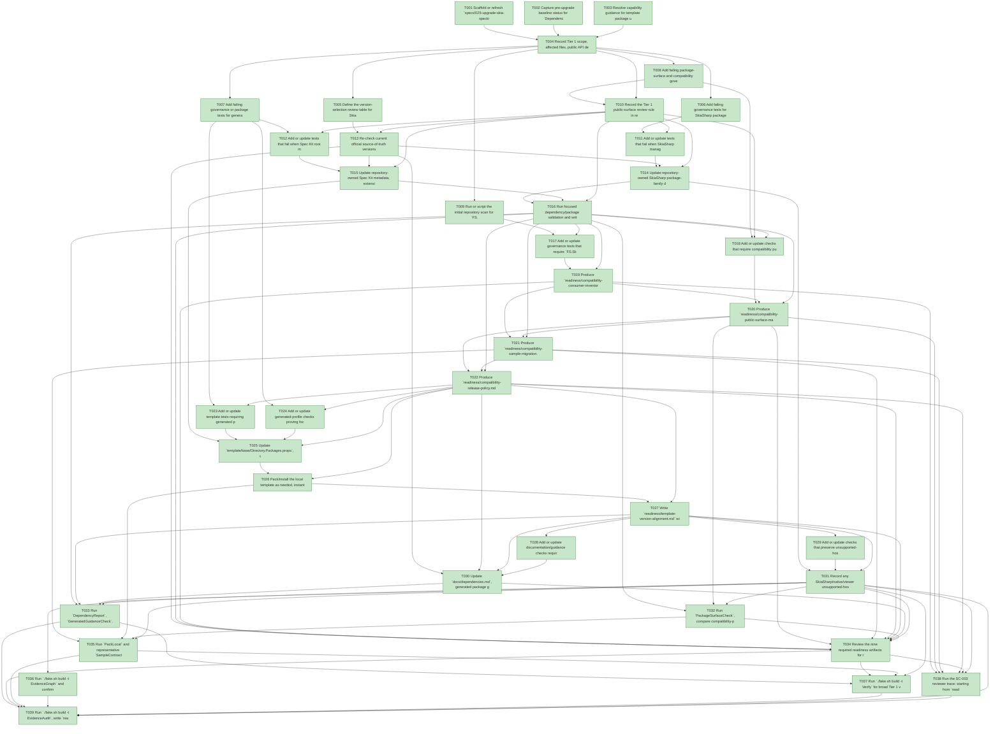

# Task Graph — 025-upgrade-skia-speckit

## ✓ Graph is acyclic and consistent

## Skill Match Assessments

| Task | Candidate | Confidence | Signals | Reviewer disposition | Diagnostic |
|------|-----------|------------|---------|----------------------|------------|
| T001 | (none) | none |  | accepted-empty | T001: no high-confidence capability signal detected |
| T002 | (none) | none |  | accepted-empty | T002: no high-confidence capability signal detected |
| T003 | (none) | none |  | declared | T003: no high-confidence capability signal detected |
| T004 | (none) | none |  | accepted-empty | T004: no high-confidence capability signal detected |
| T005 | (none) | none |  | accepted-empty | T005: no high-confidence capability signal detected |
| T006 | (none) | none |  | declared | T006: no high-confidence capability signal detected |
| T007 | (none) | none |  | declared | T007: no high-confidence capability signal detected |
| T008 | (none) | none |  | declared | T008: no high-confidence capability signal detected |
| T009 | (none) | none |  | accepted-empty | T009: no high-confidence capability signal detected |
| T010 | (none) | none |  | accepted-empty | T010: no high-confidence capability signal detected |
| T011 | (none) | none |  | declared | T011: no high-confidence capability signal detected |
| T012 | (none) | none |  | declared | T012: no high-confidence capability signal detected |
| T013 | (none) | none |  | accepted-empty | T013: no high-confidence capability signal detected |
| T014 | (none) | none |  | declared | T014: no high-confidence capability signal detected |
| T015 | (none) | none |  | declared | T015: no high-confidence capability signal detected |
| T016 | (none) | none |  | declared | T016: no high-confidence capability signal detected |
| T017 | (none) | none |  | declared | T017: no high-confidence capability signal detected |
| T018 | (none) | none |  | declared | T018: no high-confidence capability signal detected |
| T019 | (none) | none |  | accepted-empty | T019: no high-confidence capability signal detected |
| T020 | (none) | none |  | accepted-empty | T020: no high-confidence capability signal detected |
| T021 | (none) | none |  | accepted-empty | T021: no high-confidence capability signal detected |
| T022 | (none) | none |  | accepted-empty | T022: no high-confidence capability signal detected |
| T023 | (none) | none |  | declared | T023: no high-confidence capability signal detected |
| T024 | (none) | none |  | declared | T024: no high-confidence capability signal detected |
| T025 | (none) | none |  | declared | T025: no high-confidence capability signal detected |
| T026 | (none) | none |  | declared | T026: no high-confidence capability signal detected |
| T027 | (none) | none |  | declared | T027: no high-confidence capability signal detected |
| T028 | (none) | none |  | accepted-empty | T028: no high-confidence capability signal detected |
| T029 | (none) | none |  | declared | T029: no high-confidence capability signal detected |
| T030 | (none) | none |  | accepted-empty | T030: no high-confidence capability signal detected |
| T031 | (none) | none |  | declared | T031: no high-confidence capability signal detected |
| T032 | (none) | none |  | declared | T032: no high-confidence capability signal detected |
| T033 | (none) | none |  | declared | T033: no high-confidence capability signal detected |
| T034 | (none) | none |  | accepted-empty | T034: no high-confidence capability signal detected |
| T035 | (none) | none |  | accepted-empty | T035: no high-confidence capability signal detected |
| T036 | speckit-evidence-graph | high | task-text | accepted | T036: task text matches speckit-evidence-graph |
| T037 | (none) | none |  | accepted-empty | T037: no high-confidence capability signal detected |
| T038 | (none) | none |  | accepted-empty | T038: no high-confidence capability signal detected |
| T039 | speckit-evidence-audit | high | task-text | accepted | T039: task text matches speckit-evidence-audit |

## Status counts (effective)

| Status | Count |
|--------|-------|
| [X] done | 39 |
| [S] synthetic | 0 |
| [S*] auto-synthetic | 0 |
| accepted [SEH] synthetic | 0 |
| unaccepted synthetic | 0 |

## Graph



## ASCII view

```
T001 [X] Scaffold or refresh `specs/025-upgrade-skia-speckit/readiness/` placeholders for `version-selection.md`, `dependency-report.md`, `template-version-alignment.md`, `compatibility-consumer-inventory.md`, `compatibility-public-surface-map.md`, `compatibility-sample-migration.md`, `compatibility-release-policy.md`, `package-surface-baseline.md`, `evidence-audit.md`, and `logs/`
T002 [X] Capture pre-upgrade baseline status for `DependencyReport`, `PackageSurfaceCheck`, `TemplateCheck`, and `GeneratedGuidanceCheck` with command paths or unsupported reasons under `readiness/logs/`
T003 [X] Resolve capability guidance for template package updates, Skia/native viewer validation, package-surface checks, and readiness validator evidence
T004 [X] Record Tier 1 scope, affected files, public API default of no `.fsi` change, MVU/effect-boundary applicability, synthetic-evidence restrictions, small/medium/broad risk levels, and required readiness obligations
T005 [X] Define the version-selection review table for SkiaSharp package family and Spec Kit asset set, including current versions, implementation-time source checks, affected files, alignment rules, risk notes, and validation status
T006 [X] Add failing governance tests for SkiaSharp package-family alignment, Spec Kit root/generated asset alignment, and dependency-report before/after facts
T007 [X] Add failing governance or package tests for generated template package-pin alignment, selected skill asset alignment, and accidental broad `FS.Skia.UI` dependency detection in generated profiles
T008 [X] Add failing package-surface and compatibility governance checks that guard against unapproved `FS.Skia.UI` public API changes and require a recorded compatibility consumer inventory
T009 [X] Run or script the initial repository scan for `FS.Skia.UI` consumers across project references, package references, namespace opens, samples, templates, docs, and packaged-mode guidance
T010 [X] Record the Tier 1 public-surface review rule in readiness, including why no `.fsi` sketch is required unless package-surface evidence detects a public contract delta; any discovered compatibility-package surface change pauses implementation for `.fsi` sketch, semantic tests, FSI/package-surface evidence, docs, and explicit approval
T011 [X] Add or update tests that fail when SkiaSharp managed and native asset package declarations diverge, or when dependency-report evidence lacks before/after versions and cycle/spread status
T012 [X] Add or update tests that fail when Spec Kit root metadata, generated template copies, selected local skills, or generated guidance assets do not match the approved version/range
T013 [X] Re-check current official source-of-truth versions for SkiaSharp packages and Spec Kit assets immediately before editing, then write selected versions, checked-at timestamps, source URLs or governed paths, repository maintainer acceptance, affected files, and risks to `readiness/version-selection.md`
T014 [X] Update repository-owned SkiaSharp package-family declarations consistently, preserving native asset package alignment and recording any viewer/native validation risk
T015 [X] Update repository-owned Spec Kit metadata, extensions, presets, templates, workflows, generated copies, selected local skills, and package guidance files required by the approved Spec Kit version/range
T016 [X] Run focused dependency/package validation and write `readiness/dependency-report.md` with before/after package graph, dependency closure, cycle status, unexpected spread review, and non-authoritative aggregate notes
T017 [X] Add or update governance tests that require `FS.Skia.UI` consumer inventory coverage for source projects, package metadata, templates, generated output, samples, docs, namespace usage, and packaged-mode guidance
T018 [X] Add or update checks that require compatibility public-surface classification, focused replacement mapping, package-surface baseline status, and explicit release posture before accepting compatibility-package conclusions
T019 [X] Produce `readiness/compatibility-consumer-inventory.md` from real repository scans, with path, consumer kind, usage kind, package mode, focused replacement, migration status, and notes for every `FS.Skia.UI` consumer
T020 [X] Produce `readiness/compatibility-public-surface-map.md` classifying reviewed public compatibility areas as primary-only, duplicate, facade candidate, deprecated candidate, or permanent compatibility surface with focused equivalents or explicit gaps
T021 [X] Produce `readiness/compatibility-sample-migration.md` documenting representative sample/package-mode keep-unchanged or migration decisions and preserving supported sample behavior
T022 [X] Produce `readiness/compatibility-release-policy.md` with the near-term `FS.Skia.UI` posture, migration guidance, deferred decisions, unknown external-consumer limits, and user-facing package-choice guidance
T023 [X] Add or update template tests requiring generated package pins to match repository package posture for default, governed, headless, and sample-pack profiles where applicable
T024 [X] Add or update generated-profile checks proving focused-package profiles do not accidentally regain or expand a broad `FS.Skia.UI` dependency
T025 [X] Update `template/base/Directory.Packages.props`, template Spec Kit assets, template docs/guidance, selected copied skills, and `.template.package/FS.Skia.UI.Template.fsproj` metadata required by the approved versions
T026 [X] Pack/install the local template as needed, instantiate supported profiles, restore/test generated projects or record real unsupported-host facts, and capture profile command logs under `readiness/logs/`
T027 [X] Write `readiness/template-version-alignment.md` with checked profiles, emitted package pins, Spec Kit assets, selected skills, broad-package dependency status, validation commands, and pass/fail/unsupported evidence paths
T028 [X] Add or update documentation/guidance checks requiring upgraded version facts, compatibility posture, focused-package recommendation, conservative broad-package guidance, and deferred-decision wording
T029 [X] Add or update checks that preserve unsupported-host and viewer/native diagnostic behavior as observable compatibility evidence unless an intentional documented change is approved
T030 [X] Update `docs/dependencies.md`, generated package guidance, Spec Kit docs, compatibility analysis follow-up notes, and release-facing documentation with selected versions, risk notes, compatibility posture, and deferred decisions
T031 [X] Record any SkiaSharp/native/viewer unsupported-host facts from real command output, including platform, command, failure reason, and whether the result blocks acceptance
T032 [X] Run `PackageSurfaceCheck`, compare compatibility-package baselines, and write `readiness/package-surface-baseline.md` as the Tier 1 `.fsi`/surface evidence: unchanged, intentional change with `.fsi` path and migration guidance, or blocked
T033 [X] Run `DependencyReport`, `GeneratedGuidanceCheck`, `TemplateCheck`, and `TemplateDrift`, then update dependency/template readiness artifacts with focused results and non-authoritative aggregate notes
T034 [X] Review the nine required readiness artifacts for real-evidence provenance, source paths or URLs, affected files, before/after facts, generated profile status, compatibility consumer counts, and unsupported-host facts
T035 [X] Run `PackLocal` and representative `SampleContractSmoke` or equivalent packaged/local sample validation, then record whether supported sample behavior is preserved or intentionally migrated
T036 [X] Run `./fake.sh build -t EvidenceGraph` and confirm no cycles, dangling refs, mirror mismatches, invalid skill ids, non-minimal skill sets, or `[S*]` surprises
T037 [X] Run `./fake.sh build -t Verify` for broad Tier 1 validation, record aggregate result status separately from focused evidence, and note whether `Ci` is required before merge readiness
T038 [X] Run the SC-003 reviewer trace: starting from `readiness/compatibility-consumer-inventory.md`, trace every `FS.Skia.UI` repository consumer to classification and migration posture in under 10 minutes, then record elapsed time and reviewed paths
T039 [X] Run `./fake.sh build -t EvidenceAudit`, write `readiness/evidence-audit.md`, and document any accepted unsupported or synthetic condition without using synthetic evidence for version, dependency, template, inventory, or package-surface proof
```

