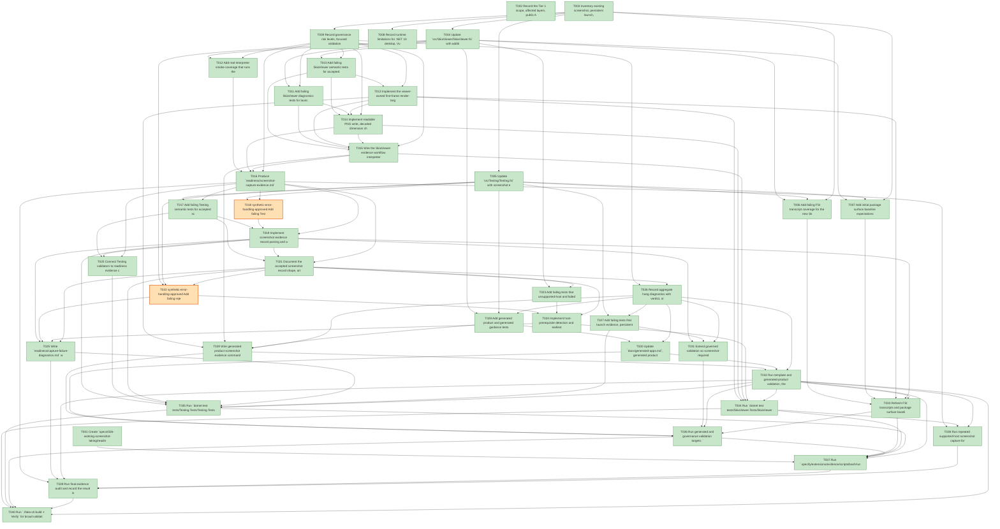

# Task Graph — 026-working-screenshot-taking

## ✓ Graph is acyclic and consistent

## Skill Match Assessments

| Task | Candidate | Confidence | Signals | Reviewer disposition | Diagnostic |
|------|-----------|------------|---------|----------------------|------------|
| T001 | speckit-evidence-graph | high | task-text | accepted | T001: task text matches speckit-evidence-graph |
| T002 | (none) | none |  | accepted-empty | T002: no high-confidence capability signal detected |
| T003 | (none) | none |  | accepted-empty | T003: no high-confidence capability signal detected |
| T004 | (none) | none |  | declared | T004: no high-confidence capability signal detected |
| T005 | (none) | none |  | declared | T005: no high-confidence capability signal detected |
| T006 | (none) | none |  | declared | T006: no high-confidence capability signal detected |
| T007 | (none) | none |  | declared | T007: no high-confidence capability signal detected |
| T008 | (none) | none |  | accepted-empty | T008: no high-confidence capability signal detected |
| T009 | (none) | none |  | accepted-empty | T009: no high-confidence capability signal detected |
| T010 | (none) | none |  | declared | T010: no high-confidence capability signal detected |
| T011 | (none) | none |  | declared | T011: no high-confidence capability signal detected |
| T012 | (none) | none |  | declared | T012: no high-confidence capability signal detected |
| T013 | (none) | none |  | declared | T013: no high-confidence capability signal detected |
| T014 | (none) | none |  | declared | T014: no high-confidence capability signal detected |
| T015 | (none) | none |  | declared | T015: no high-confidence capability signal detected |
| T016 | (none) | none |  | declared | T016: no high-confidence capability signal detected |
| T017 | (none) | none |  | declared | T017: no high-confidence capability signal detected |
| T018 | (none) | none |  | declared | T018: no high-confidence capability signal detected |
| T019 | (none) | none |  | declared | T019: no high-confidence capability signal detected |
| T020 | (none) | none |  | declared | T020: no high-confidence capability signal detected |
| T021 | (none) | none |  | declared | T021: no high-confidence capability signal detected |
| T022 | (none) | none |  | declared | T022: no high-confidence capability signal detected |
| T023 | (none) | none |  | declared | T023: no high-confidence capability signal detected |
| T024 | (none) | none |  | declared | T024: no high-confidence capability signal detected |
| T025 | (none) | none |  | declared | T025: no high-confidence capability signal detected |
| T026 | (none) | none |  | accepted-empty | T026: no high-confidence capability signal detected |
| T027 | (none) | none |  | declared | T027: no high-confidence capability signal detected |
| T028 | (none) | none |  | declared | T028: no high-confidence capability signal detected |
| T029 | (none) | none |  | declared | T029: no high-confidence capability signal detected |
| T030 | (none) | none |  | declared | T030: no high-confidence capability signal detected |
| T031 | (none) | none |  | declared | T031: no high-confidence capability signal detected |
| T032 | (none) | none |  | declared | T032: no high-confidence capability signal detected |
| T033 | (none) | none |  | declared | T033: no high-confidence capability signal detected |
| T034 | (none) | none |  | declared | T034: no high-confidence capability signal detected |
| T035 | (none) | none |  | declared | T035: no high-confidence capability signal detected |
| T036 | (none) | none |  | declared | T036: no high-confidence capability signal detected |
| T037 | speckit-evidence-graph | high | task-text | accepted | T037: task text matches speckit-evidence-graph |
| T038 | (none) | none |  | declared | T038: no high-confidence capability signal detected |
| T039 | speckit-evidence-audit | high | task-text | accepted | T039: task text matches speckit-evidence-audit |
| T040 | (none) | none |  | accepted-empty | T040: no high-confidence capability signal detected |

## Status counts (effective)

| Status | Count |
|--------|-------|
| [X] done | 38 |
| [S] synthetic | 2 |
| [S*] auto-synthetic | 0 |
| accepted [SEH] synthetic | 2 |
| unaccepted synthetic | 0 |

## Synthetic Error-Handling Classification

| Task | Accepted | Label | Design source | Synthetic input class | Expected error behavior | Diagnostics |
|------|----------|-------|---------------|-----------------------|-------------------------|-------------|
| T018 | yes | yes | `specs/026-working-screenshot-taking/plan.md` Synthetic Evidence and `contracts/screenshot-evidence-record-contract.md` Acceptance | malformed line-oriented record, corrupt PNG bytes, missing required data, out-of-readiness path, forced validator error result | validator rejects the record or artifact with a precise failed status and no screenshot proof claim | (none) |
| T022 | yes | yes | `specs/026-working-screenshot-taking/plan.md` Synthetic Evidence and `contracts/screenshot-capture-contract.md` Unsupported or Failed Result | invalid command arguments, missing required output path, forced launch/render/readback/write failure, malformed validator input | workflow reports unsupported or failed with blocked stage, classification, category, message, missing evidence fields, and no successful artifact claim | (none) |

## Graph



## ASCII view

```
T001 [X] Create `specs/026-working-screenshot-taking/readiness/` and placeholder files for screenshot capture, artifacts, failure diagnostics, generated guidance, package surface baseline, risk levels, runtime limitations, aggregate hang diagnostics, task graph, and final audit evidence
T002 [X] Record the Tier 1 scope, affected layers, public API impact, MVU/effect applicability, synthetic-success prohibition, and required real screenshot evidence obligations in the readiness package
T003 [X] Inventory existing screenshot, persistent launch, bounded launch, scene, layout, and generated evidence commands so implementation preserves separation between evidence kinds
T004 [X] Update `src/SkiaViewer/SkiaViewer.fsi` with additive screenshot capture request/result, capture mode, blocked stage, pixel validation, `EvidenceWorkflowModel`, `EvidenceWorkflowMsg`, `EvidenceWorkflowEffect`, `initEvidenceWorkflow`, `updateEvidenceWorkflow`, and interpreter boundary contracts
T005 [X] Update `src/Testing/Testing.fsi` with screenshot evidence record parsing and artifact validation contracts that reject missing, unreadable, zero-dimension, blank, synthetic, metadata-only, deterministic-scene-only, manual, and untraceable claims
T006 [X] Add failing FSI transcript coverage for the new SkiaViewer and Testing public contracts, including representative `initEvidenceWorkflow` and `updateEvidenceWorkflow` paths
T007 [X] Add initial package surface baseline expectations for `FS.Skia.UI.SkiaViewer` and `FS.Skia.UI.Testing` so later intentional public changes are reviewed
T008 [X] Record runtime limitations for .NET 10 desktop, Vulkan/Silk.NET, SkiaSharp preview, unsupported macOS/mobile/browser capture, and absence of a software-renderer fallback in `readiness/runtime-limitations.md`
T009 [X] Record governance risk levels, focused validation requirements, broad-validation triggers, and non-authoritative aggregate rerun handling in `readiness/governance-risk-levels.md`
T010 [X] Add failing SkiaViewer semantic tests for accepted first-frame screenshot capture with `capture-source=live-viewer-window`, `proves-screenshot=true`, positive decoded dimensions, non-blank pixel validation, command/app/host/capture-mode/timestamp traceability, pure workflow transitions, and emitted capture/write/cleanup effects
T011 [X] Add failing SkiaViewer diagnostics tests for launch, first-frame, render, capture/readback, pixel validation, artifact write, timeout, and unsupported-host outcomes without successful screenshot claims
T012 [X] Add real-interpreter smoke coverage that runs the supported viewer screenshot path where host prerequisites are available and records unsupported-host negative evidence otherwise
T013 [X] Implement the viewer-owned first-frame render-target PNG capture path using existing SkiaSharp/Silk.NET viewer surfaces before considering any new native capture dependency
T014 [X] Implement readable PNG write, decoded dimension checks, non-blank pixel sampling, readiness-relative artifact path validation, and precise blocked-stage diagnostics for capture and artifact failures
T015 [X] Wire the SkiaViewer evidence workflow interpreter so screenshot capture, file writes, and cleanup remain explicit effects while normal interactive launch behavior remains unchanged
T016 [X] Produce `readiness/screenshot-capture-evidence.md` and `readiness/screenshot-artifacts.md` from a supported-host working-code PNG run, or leave a failed task with concrete blocked-stage evidence if the host cannot support capture
T017 [X] Add failing Testing semantic tests for accepted screenshot evidence records with all required key/value fields, readiness-local artifact paths, live viewer capture source, positive dimensions, non-blank validation, and reviewer-traceable command/host/sample metadata
T018 [S] synthetic-error-handling-approved Add failing Testing rejection tests for malformed screenshot records, corrupt PNG bytes, missing required fields, out-of-readiness artifact paths, and forced validator error results   ← accepted [SEH]
T019 [X] Implement screenshot evidence record parsing and artifact validation helpers in `src/Testing/Testing.fs`, preserving strict rejection of metadata-only, structural, manual, synthetic, fallback-only, blank, unreadable, and untraceable proof
T020 [X] Connect Testing validators to readiness evidence checks and write reviewer-facing validation output to `readiness/screenshot-artifacts.md`
T021 [X] Document the accepted screenshot record shape, artifact inspection rules, and rejection cases in `docs/testing.md` and `docs/evidence.md`
T022 [S] synthetic-error-handling-approved Add failing rejection and diagnostic tests for invalid command arguments, missing required output paths, forced launch/render/readback/write failures, malformed validator input, and explicit unsupported classifications   ← accepted [SEH]
T023 [X] Add failing tests that unsupported-host and failed capture records include blocked stage, classification, category, host facts, attempted command, message, and missing evidence fields while claiming no screenshot success
T024 [X] Implement host-prerequisite detection and earliest-known blocked-stage classification for desktop prerequisite, launch, first frame, render, capture, readback, pixel validation, artifact write, timeout, and unknown failures
T025 [X] Write `readiness/capture-failure-diagnostics.md` with real unsupported-host or failure evidence produced by an actual command attempt and no synthetic screenshot substitute
T026 [X] Record aggregate hang diagnostics with verdict, stage, elapsed duration, last observed command, focused rerun command, and non-authoritative aggregate status in `readiness/aggregate-hang-diagnostics.md` whenever broad verification stalls or times out
T027 [X] Add failing tests that launch evidence, persistent-launch evidence, deterministic scene reports, layout/readability evidence, pixel-readback diagnostics, metadata, and manual descriptions do not satisfy screenshot-required readiness packages
T028 [X] Add generated product and generated guidance tests for `--screenshot-evidence` as a distinct opt-in operation on screenshot-ready visual profiles and absence of screenshot requirements on headless/non-ready profiles
T029 [X] Wire generated product screenshot evidence commands in `template/base/src/Product/EvidenceCommands.fs` and related program entry points without changing the default interactive launch path
T030 [X] Update `docs/generated-apps.md`, generated product docs, template fragments, and generated guidance text to name the screenshot command, artifact locations, acceptance rules, unsupported behavior, and separation from launch/layout/scene evidence
T031 [X] Extend governed validation so screenshot-required visual features fail graph/audit readiness when screenshot records or PNG artifacts are missing, unreadable, blank, synthetic, fallback-only, or untraceable
T032 [X] Run template and generated-product validation, then write `readiness/generated-guidance.md` with commands, outputs, and any non-authoritative aggregate caveats
T033 [X] Refresh FSI transcripts and package surface baselines for `FS.Skia.UI.SkiaViewer` and `FS.Skia.UI.Testing`, then record results in `readiness/package-surface-baseline.md`
T034 [X] Run `dotnet test tests/SkiaViewer.Tests/SkiaViewer.Tests.fsproj` and record focused results with any host limitation notes
T035 [X] Run `dotnet test tests/Testing.Tests/Testing.Tests.fsproj` and record focused validator results
T036 [X] Run generated and governance validation targets: `GeneratedProductCheck`, `GeneratedGuidanceCheck`, `TemplateCheck`, `PackageSurfaceCheck`, and `FsiTranscripts`
T037 [X] Run `.specify/extensions/evidence/scripts/bash/run-audit.sh specs/026-working-screenshot-taking --graph-only` and copy the task graph result to `readiness/evidence-graph.md`
T038 [X] Run repeated supported-host screenshot capture for a stable graphical sample, record run count, accepted artifact count, pass rate, failures, and artifact paths in `readiness/screenshot-capture-evidence.md`, and verify the result meets SC-001's 95% threshold
T039 [X] Run final evidence audit and record the result in `readiness/evidence-audit.md`, documenting every remaining blocker without using synthetic screenshot success
T040 [X] Run `./fake.sh build -t Verify` for broad validation when triggered by the risk rules, or record why focused medium-risk validation is sufficient for this feature state
```

