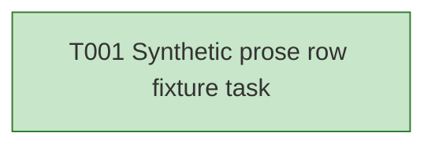

# Task Graph — multi-skill-prose

## ✗ Graph validation failed

### Errors
- multi-skill prose row is invalid: speckit-tasks and speckit-implement
- T001: declared skill speckit-tasks has no pre-work load evidence
- T001: declared skill speckit-implement has no pre-work load evidence

## Skill Match Assessments

| Task | Candidate | Confidence | Signals | Reviewer disposition | Diagnostic |
|------|-----------|------------|---------|----------------------|------------|
| T001 | (none) | none |  | declared | T001: no high-confidence capability signal detected |

## Status counts (effective)

| Status | Count |
|--------|-------|
| [X] done | 1 |
| [S] synthetic | 0 |
| [S*] auto-synthetic | 0 |
| accepted [SEH] synthetic | 0 |
| unaccepted synthetic | 0 |

## Graph



## ASCII view

```
T001 [X] Synthetic prose row fixture task
```

