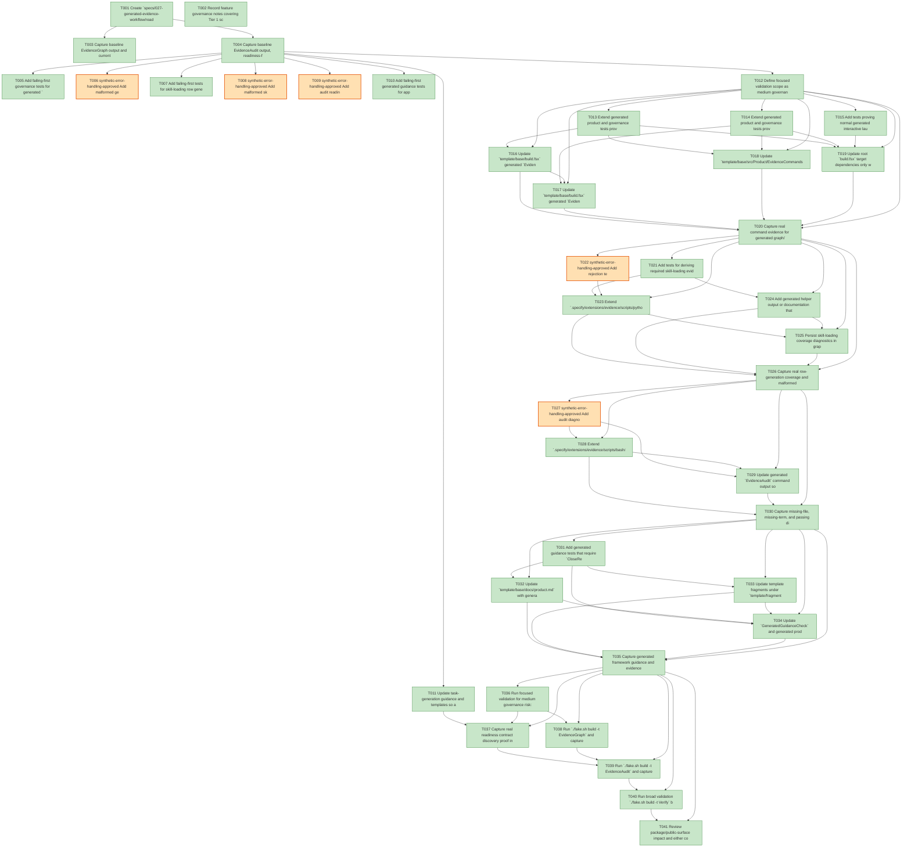

# Task Graph — 027-generated-evidence-workflow

## ✓ Graph is acyclic and consistent

## Skill Match Assessments

| Task | Candidate | Confidence | Signals | Reviewer disposition | Diagnostic |
|------|-----------|------------|---------|----------------------|------------|
| T001 | speckit-implement | high | task-text | accepted | T001: task text matches speckit-implement |
| T002 | (none) | none |  | accepted-empty | T002: no high-confidence capability signal detected |
| T003 | speckit-evidence-graph | high | task-text | accepted | T003: task text matches speckit-evidence-graph |
| T004 | speckit-evidence-audit | high | task-text | accepted | T004: task text matches speckit-evidence-audit |
| T005 | speckit-evidence-graph | high | task-text | accepted | T005: task text matches speckit-evidence-graph |
| T005 | speckit-evidence-audit | high | task-text | accepted | T005: task text matches speckit-evidence-audit |
| T006 | (none) | none |  | declared | T006: no high-confidence capability signal detected |
| T007 | speckit-implement | high | task-text | accepted | T007: task text matches speckit-implement |
| T008 | speckit-implement | high | task-text | accepted | T008: task text matches speckit-implement |
| T009 | (none) | none |  | declared | T009: no high-confidence capability signal detected |
| T010 | (none) | none |  | declared | T010: no high-confidence capability signal detected |
| T011 | speckit-tasks | high | task-text | accepted | T011: task text matches speckit-tasks |
| T011 | speckit-implement | high | task-text | accepted | T011: task text matches speckit-implement |
| T012 | (none) | none |  | accepted-empty | T012: no high-confidence capability signal detected |
| T013 | speckit-evidence-graph | high | task-text | accepted | T013: task text matches speckit-evidence-graph |
| T014 | speckit-evidence-audit | high | task-text | accepted | T014: task text matches speckit-evidence-audit |
| T015 | (none) | none |  | accepted-empty | T015: no high-confidence capability signal detected |
| T016 | speckit-evidence-graph | high | task-text | accepted | T016: task text matches speckit-evidence-graph |
| T017 | speckit-evidence-audit | high | task-text | accepted | T017: task text matches speckit-evidence-audit |
| T018 | (none) | none |  | accepted-empty | T018: no high-confidence capability signal detected |
| T019 | speckit-evidence-graph | high | task-text | accepted | T019: task text matches speckit-evidence-graph |
| T019 | speckit-evidence-audit | high | task-text | accepted | T019: task text matches speckit-evidence-audit |
| T020 | (none) | none |  | declared | T020: no high-confidence capability signal detected |
| T021 | speckit-evidence-graph | high | task-text | accepted | T021: task text matches speckit-evidence-graph |
| T021 | speckit-implement | high | task-text | accepted | T021: task text matches speckit-implement |
| T022 | speckit-implement | high | task-text | accepted | T022: task text matches speckit-implement |
| T023 | speckit-implement | high | task-text | accepted | T023: task text matches speckit-implement |
| T024 | (none) | none |  | declared | T024: no high-confidence capability signal detected |
| T025 | speckit-implement | high | task-text | accepted | T025: task text matches speckit-implement |
| T026 | speckit-implement | high | task-text | accepted | T026: task text matches speckit-implement |
| T027 | (none) | none |  | declared | T027: no high-confidence capability signal detected |
| T028 | (none) | none |  | declared | T028: no high-confidence capability signal detected |
| T029 | speckit-evidence-audit | high | task-text | accepted | T029: task text matches speckit-evidence-audit |
| T030 | (none) | none |  | declared | T030: no high-confidence capability signal detected |
| T031 | (none) | none |  | declared | T031: no high-confidence capability signal detected |
| T032 | (none) | none |  | declared | T032: no high-confidence capability signal detected |
| T033 | (none) | none |  | declared | T033: no high-confidence capability signal detected |
| T034 | (none) | none |  | declared | T034: no high-confidence capability signal detected |
| T035 | (none) | none |  | declared | T035: no high-confidence capability signal detected |
| T036 | (none) | none |  | accepted-empty | T036: no high-confidence capability signal detected |
| T037 | (none) | none |  | declared | T037: no high-confidence capability signal detected |
| T038 | speckit-evidence-graph | high | task-text | accepted | T038: task text matches speckit-evidence-graph |
| T039 | speckit-evidence-audit | high | task-text | accepted | T039: task text matches speckit-evidence-audit |
| T040 | (none) | none |  | accepted-empty | T040: no high-confidence capability signal detected |
| T041 | (none) | none |  | accepted-empty | T041: no high-confidence capability signal detected |

## Status counts (effective)

| Status | Count |
|--------|-------|
| [X] done | 36 |
| [S] synthetic | 5 |
| [S*] auto-synthetic | 0 |
| accepted [SEH] synthetic | 5 |
| unaccepted synthetic | 0 |

## Synthetic Error-Handling Classification

| Task | Accepted | Label | Design source | Synthetic input class | Expected error behavior | Diagnostics |
|------|----------|-------|---------------|-----------------------|-------------------------|-------------|
| T006 | yes | yes | `plan.md` Synthetic Evidence and `generated-evidence-command-contract.md` Failure Conditions | Malformed graph/audit package with cycles, dangling refs, missing files, skipped authority | Generated command exits non-zero, names failed validation area, and writes no pass claim | (none) |
| T008 | yes | yes | `skill-loading-evidence-contract.md` Validation Rules | Collapsed task ranges, prose batch rows, duplicate/late/equal timestamp rows | Skill-loading validation reports exact invalid row class and does not satisfy missing required rows | (none) |
| T009 | yes | yes | `audit-diagnostics-contract.md` Required Behavior | Missing readiness files and incomplete readiness content | Audit reports exact path and missing terms/sections as blocking diagnostics | (none) |
| T022 | yes | yes | `skill-loading-evidence-contract.md` Verification | Malformed skill-loading rows and unreadable/ambiguous skill paths | Graph/audit rejects malformed evidence and identifies task id plus skill id | (none) |
| T027 | yes | yes | `audit-diagnostics-contract.md` Console Output Requirements | Missing-file and missing-term readiness fixtures | Audit output distinguishes missing from incomplete and names every required repair target | (none) |

## Graph



## ASCII view

```
T001 [X] Create `specs/027-generated-evidence-workflow/readiness/` and placeholder files for generated-validation-authority, skill-loading-evidence-workflow, audit-diagnostics, readiness-contract-discovery, framework-guidance, evidence-vocabulary, evidence-graph, and evidence-audit
T002 [X] Record feature governance notes covering Tier 1 scope, no planned `.fsi` public API change, MVU non-applicability for normal generated runtime, synthetic evidence restrictions, and required readiness paths
T003 [X] Capture baseline EvidenceGraph output and current task metadata status to `readiness/evidence-graph.md`
T004 [X] Capture baseline EvidenceAudit output, readiness-file discovery gaps, and current blocking diagnostics to `readiness/evidence-audit.md`
T005 [X] Add failing-first governance tests for generated `EvidenceGraph` and `EvidenceAudit` targets that reject placeholder-only completion logs and preserve normal generated launch separation
T006 [S] synthetic-error-handling-approved Add malformed generated graph and audit fixtures with cycles, dangling references, missing readiness files, and skipped authority states for rejection tests   ← accepted [SEH]
T007 [X] Add failing-first tests for skill-loading row generation and validation, including one row per task/skill pairing, no duplicate masking, and timestamp ordering
T008 [S] synthetic-error-handling-approved Add malformed skill-loading evidence fixtures for collapsed task ranges, multi-skill prose rows, duplicate rows, late rows, and equal timestamps   ← accepted [SEH]
T009 [S] synthetic-error-handling-approved Add audit readiness diagnostic fixtures for missing readiness files and incomplete readiness files with omitted required terms   ← accepted [SEH]
T010 [X] Add failing-first generated guidance tests for app message qualification, vector-to-scene-point conversion, semantic scene evidence, screenshot vocabulary, and pixel-readback fallback claims
T011 [X] Update task-generation guidance and templates so audit-enforced readiness files and visible `skillist` metadata are discoverable before implementation starts
T012 [X] Define focused validation scope as medium governance risk: run story-specific governance/template checks after each story, broaden to `Verify` when graph/audit commands, template output, or root target aggregation changes, and record non-authoritative aggregate failures separately from authoritative verdicts
T013 [X] Extend generated product and governance tests proving generated `EvidenceGraph` delegates to authoritative graph validation and fails before any pass report on invalid generated evidence packages
T014 [X] Extend generated product and governance tests proving generated `EvidenceAudit` depends on a valid graph result, runs authoritative audit validation, and reports failed validation areas
T015 [X] Add tests proving normal generated interactive launch remains persistent and does not run evidence commands, close windows, or write evidence artifacts
T016 [X] Update `template/base/build.fsx` generated `EvidenceGraph` target to invoke or delegate to authoritative graph validation for the selected generated feature/readiness package
T017 [X] Update `template/base/build.fsx` generated `EvidenceAudit` target to require a valid graph result and invoke authoritative audit validation
T018 [X] Update `template/base/src/Product/EvidenceCommands.fs` report records and wording with command, target, generated app identity, authority, status, exit code, validation area, report path, and diagnostics
T019 [X] Update root `build.fsx` target dependencies only where `GeneratedGuidanceCheck`, `TemplateCheck`, `EvidenceGraph`, `EvidenceAudit`, `Verify`, or `Ci` aggregation must reflect generated validation authority
T020 [X] Capture real command evidence for generated graph/audit pass and rejection behavior in `readiness/generated-validation-authority.md`
T021 [X] Add tests for deriving required skill-loading evidence rows from every structured `skillist` pairing in `tasks.deps.yml`
T022 [S] synthetic-error-handling-approved Add rejection tests for malformed skill-loading rows that collapse task ranges, omit exact skill ids, use unreadable skill paths, or start work before loading   ← accepted [SEH]
T023 [X] Extend `.specify/extensions/evidence/scripts/python/compute-task-graph.py` or adjacent helpers to generate and validate one skill-loading evidence row per task/skill pairing
T024 [X] Add generated helper output or documentation that implementers can use before each task to record resolved skill path, loaded timestamp, work-start timestamp, and source
T025 [X] Persist skill-loading coverage diagnostics in graph/audit artifacts, including missing, late, duplicate, collapsed, and ambiguous-path rows
T026 [X] Capture real row-generation coverage and malformed-row rejection evidence in `readiness/skill-loading-evidence-workflow.md`
T027 [S] synthetic-error-handling-approved Add audit diagnostic tests where required readiness files are missing and where existing readiness files omit required terms or sections   ← accepted [SEH]
T028 [X] Extend `.specify/extensions/evidence/scripts/bash/run-audit.sh` diagnostics to name each missing readiness file and missing required term or section in console output and persisted artifacts
T029 [X] Update generated `EvidenceAudit` command output so graph failure, readiness contract failure, synthetic evidence failure, diff-scan failure, and unsupported host classification failures are distinct
T030 [X] Capture missing-file, missing-term, and passing diagnostic evidence in `readiness/audit-diagnostics.md`
T031 [X] Add generated guidance tests that require `CloseRequested` qualification examples, app vector to scene point conversion examples, semantic scene fact reporting, and strict screenshot/fallback vocabulary
T032 [X] Update `template/base/docs/product.md` with generated app guidance for qualifying app-owned messages, converting domain vectors to scene points, and reporting semantic scene facts explicitly
T033 [X] Update template fragments under `template/fragments/` with evidence-safe screenshot, pixel-readback fallback, deterministic scene evidence, unsupported host, and `proves-screenshot=false` wording
T034 [X] Update `GeneratedGuidanceCheck` and generated product tests so guidance wording is enforced before generated app authors implement evidence
T035 [X] Capture generated framework guidance and evidence vocabulary proof in `readiness/framework-guidance.md` and `readiness/evidence-vocabulary.md`
T036 [X] Run focused validation for medium governance risk: `dotnet test tests/Governance.Tests/Governance.Tests.fsproj`, `./fake.sh build -t GeneratedGuidanceCheck`, and `./fake.sh build -t TemplateCheck`; record command output paths and any non-authoritative aggregate failures
T037 [X] Capture real readiness contract discovery proof in `readiness/readiness-contract-discovery.md`, including the generated author-facing path list and the audit-enforced readiness contract source
T038 [X] Run `./fake.sh build -t EvidenceGraph` and capture authoritative graph output in `readiness/evidence-graph.md`
T039 [X] Run `./fake.sh build -t EvidenceAudit` and capture final audit output in `readiness/evidence-audit.md`, documenting any accepted synthetic error-handling rows
T040 [X] Run broad validation `./fake.sh build -t Verify` because this feature changes generated command behavior, evidence scripts, template output, and root target aggregation; record non-authoritative aggregate results separately from graph/audit verdicts
T041 [X] Review package/public-surface impact and either confirm no `.fsi` baseline refresh is required or run the required surface checks if implementation added a public helper
```

