# Task Graph — 028-agent-validation-framework

## ✓ Graph is acyclic and consistent

## Skill Match Assessments

| Task | Candidate | Confidence | Signals | Reviewer disposition | Diagnostic |
|------|-----------|------------|---------|----------------------|------------|
| T001 | (none) | none |  | accepted-empty | T001: no high-confidence capability signal detected |
| T002 | (none) | none |  | accepted-empty | T002: no high-confidence capability signal detected |
| T003 | (none) | none |  | accepted-empty | T003: no high-confidence capability signal detected |
| T004 | (none) | none |  | accepted-empty | T004: no high-confidence capability signal detected |
| T005 | (none) | none |  | accepted-empty | T005: no high-confidence capability signal detected |
| T006 | (none) | none |  | accepted-empty | T006: no high-confidence capability signal detected |
| T007 | (none) | none |  | accepted-empty | T007: no high-confidence capability signal detected |
| T008 | (none) | none |  | accepted-empty | T008: no high-confidence capability signal detected |
| T009 | (none) | none |  | declared | T009: no high-confidence capability signal detected |
| T010 | (none) | none |  | declared | T010: no high-confidence capability signal detected |
| T011 | (none) | none |  | accepted-empty | T011: no high-confidence capability signal detected |
| T012 | (none) | none |  | accepted-empty | T012: no high-confidence capability signal detected |
| T013 | (none) | none |  | accepted-empty | T013: no high-confidence capability signal detected |
| T014 | (none) | none |  | declared | T014: no high-confidence capability signal detected |
| T015 | (none) | none |  | accepted-empty | T015: no high-confidence capability signal detected |
| T016 | (none) | none |  | accepted-empty | T016: no high-confidence capability signal detected |
| T017 | (none) | none |  | accepted-empty | T017: no high-confidence capability signal detected |
| T018 | (none) | none |  | accepted-empty | T018: no high-confidence capability signal detected |
| T019 | (none) | none |  | accepted-empty | T019: no high-confidence capability signal detected |
| T020 | (none) | none |  | accepted-empty | T020: no high-confidence capability signal detected |
| T021 | (none) | none |  | accepted-empty | T021: no high-confidence capability signal detected |
| T022 | (none) | none |  | accepted-empty | T022: no high-confidence capability signal detected |
| T023 | (none) | none |  | accepted-empty | T023: no high-confidence capability signal detected |
| T024 | (none) | none |  | accepted-empty | T024: no high-confidence capability signal detected |
| T025 | (none) | none |  | accepted-empty | T025: no high-confidence capability signal detected |
| T026 | (none) | none |  | accepted-empty | T026: no high-confidence capability signal detected |
| T027 | (none) | none |  | accepted-empty | T027: no high-confidence capability signal detected |
| T028 | (none) | none |  | accepted-empty | T028: no high-confidence capability signal detected |
| T029 | (none) | none |  | accepted-empty | T029: no high-confidence capability signal detected |
| T030 | (none) | none |  | accepted-empty | T030: no high-confidence capability signal detected |
| T031 | (none) | none |  | declared | T031: no high-confidence capability signal detected |
| T032 | (none) | none |  | accepted-empty | T032: no high-confidence capability signal detected |
| T033 | (none) | none |  | accepted-empty | T033: no high-confidence capability signal detected |
| T034 | (none) | none |  | declared | T034: no high-confidence capability signal detected |
| T035 | (none) | none |  | declared | T035: no high-confidence capability signal detected |
| T036 | (none) | none |  | declared | T036: no high-confidence capability signal detected |
| T037 | (none) | none |  | declared | T037: no high-confidence capability signal detected |
| T038 | (none) | none |  | declared | T038: no high-confidence capability signal detected |
| T039 | (none) | none |  | declared | T039: no high-confidence capability signal detected |
| T040 | (none) | none |  | declared | T040: no high-confidence capability signal detected |
| T041 | (none) | none |  | declared | T041: no high-confidence capability signal detected |
| T042 | (none) | none |  | declared | T042: no high-confidence capability signal detected |
| T043 | (none) | none |  | declared | T043: no high-confidence capability signal detected |
| T044 | (none) | none |  | declared | T044: no high-confidence capability signal detected |
| T045 | (none) | none |  | declared | T045: no high-confidence capability signal detected |
| T046 | (none) | none |  | declared | T046: no high-confidence capability signal detected |
| T047 | (none) | none |  | declared | T047: no high-confidence capability signal detected |
| T048 | (none) | none |  | declared | T048: no high-confidence capability signal detected |
| T049 | (none) | none |  | declared | T049: no high-confidence capability signal detected |
| T050 | (none) | none |  | declared | T050: no high-confidence capability signal detected |
| T051 | (none) | none |  | declared | T051: no high-confidence capability signal detected |
| T052 | (none) | none |  | declared | T052: no high-confidence capability signal detected |
| T053 | (none) | none |  | declared | T053: no high-confidence capability signal detected |
| T054 | (none) | none |  | accepted-empty | T054: no high-confidence capability signal detected |
| T055 | (none) | none |  | accepted-empty | T055: no high-confidence capability signal detected |
| T056 | (none) | none |  | accepted-empty | T056: no high-confidence capability signal detected |
| T057 | (none) | none |  | accepted-empty | T057: no high-confidence capability signal detected |
| T058 | (none) | none |  | accepted-empty | T058: no high-confidence capability signal detected |
| T059 | (none) | none |  | accepted-empty | T059: no high-confidence capability signal detected |
| T060 | (none) | none |  | accepted-empty | T060: no high-confidence capability signal detected |
| T061 | (none) | none |  | accepted-empty | T061: no high-confidence capability signal detected |
| T062 | (none) | none |  | accepted-empty | T062: no high-confidence capability signal detected |
| T063 | (none) | none |  | declared | T063: no high-confidence capability signal detected |
| T064 | (none) | none |  | accepted-empty | T064: no high-confidence capability signal detected |
| T065 | (none) | none |  | accepted-empty | T065: no high-confidence capability signal detected |
| T066 | speckit-evidence-graph | high | task-text | accepted | T066: task text matches speckit-evidence-graph |
| T067 | speckit-evidence-audit | high | task-text | accepted | T067: task text matches speckit-evidence-audit |
| T068 | (none) | none |  | accepted-empty | T068: no high-confidence capability signal detected |
| T069 | (none) | none |  | accepted-empty | T069: no high-confidence capability signal detected |

## Status counts (effective)

| Status | Count |
|--------|-------|
| [X] done | 65 |
| [S] synthetic | 4 |
| [S*] auto-synthetic | 0 |
| accepted [SEH] synthetic | 4 |
| unaccepted synthetic | 0 |

## Synthetic Error-Handling Classification

| Task | Accepted | Label | Design source | Synthetic input class | Expected error behavior | Diagnostics |
|------|----------|-------|---------------|-----------------------|-------------------------|-------------|
| T011 | yes | yes | `specs/028-agent-validation-framework/plan.md` Synthetic Evidence and contracts | malformed YAML/JSON fields, duplicate ids, unknown gates | parser rejects invalid input with actionable diagnostics and no success verdict | (none) |
| T019 | yes | yes | `specs/028-agent-validation-framework/contracts/validation-contract.md` Drift Validation | malformed contract input, unknown target, duplicate rule id, invalid path pattern | routing rejects the fixture and reports governance-owned diagnostics | (none) |
| T028 | yes | yes | `specs/028-agent-validation-framework/contracts/agent-verdict-contract.md` Required Failure Classes | forced gate result errors for environment, unsupported host, stale prerequisite, missing evidence | verdict records the expected failure class, owner, diagnostics, and next command when required | (none) |
| T036 | yes | yes | `specs/028-agent-validation-framework/contracts/generated-evidence-policy-contract.md` Validation | missing generated artifact and unsupported host fixtures | explicit evidence command reports unsupported or stale prerequisite without changing product launch | (none) |

## Graph

```mermaid
graph TD
  T001["T001 Confirm branch, prerequisite spec artifacts, and e"]:::done
  T002["T002 Create or refresh `specs/028-agent-validation-fram"]:::done
  T003["T003 Record governance risk levels, selected focused va"]:::done
  T004["T004 Record Tier 1 scope, public API impact, command-su"]:::done
  T005["T005 Add failing governance tests for `validation.contr"]:::done
  T006["T006 Add failing governance tests for active-feature ch"]:::done
  T007["T007 Add failing verdict contract tests for required JS"]:::done
  T008["T008 Add failing target metadata drift tests for missin"]:::done
  T009["T009 Add failing controls contract tests and FSI transc"]:::done
  T010["T010 Add failing generated template tests proving norma"]:::done
  T011["T011 Add design-approved malformed validation contract "]:::synthetic
  T012["T012 Draft `.fsi` contracts for validation selection `M"]:::done
  T013["T013 Draft `.fsi` contracts for target metadata, agent "]:::done
  T014["T014 Draft `.fsi` contracts for typed controls front do"]:::done
  T015["T015 Capture FSI transcript evidence for the draft vali"]:::done
  T016["T016 Record initial package surface baseline expectatio"]:::done
  T017["T017 Add representative routing scenarios for controls,"]:::done
  T018["T018 Add pure transition tests for validation selection"]:::done
  T019["T019 Add malformed contract, unknown target, duplicate "]:::synthetic
  T020["T020 Add `validation.contract.yml` with required tiers,"]:::done
  T021["T021 Implement validation contract parser and schema di"]:::done
  T022["T022 Implement changed-path source selection from activ"]:::done
  T023["T023 Implement pure rule selection that unions gates, p"]:::done
  T024["T024 Implement interpreter wiring for feature metadata "]:::done
  T025["T025 Write `readiness/validation-contract.md` with real"]:::done
  T026["T026 Add verdict tests for passed, failed, unsupported,"]:::done
  T027["T027 Add pure transition tests for verdict aggregation,"]:::done
  T028["T028 Add forced error-result fixture tests for environm"]:::synthetic
  T029["T029 Implement `AgentVerdict` JSON and Markdown seriali"]:::done
  T030["T030 Implement gate result aggregation and failure owne"]:::done
  T031["T031 Add `AgentReady` build path that runs selected foc"]:::done
  T032["T032 Add degraded fallback handling that names `./fake."]:::done
  T033["T033 Write `readiness/agent-ready-verdict.md` and `read"]:::done
  T034["T034 Add generated product tests proving normal launch "]:::done
  T035["T035 Add generated evidence command tests proving expli"]:::done
  T036["T036 Add missing generated artifact and unsupported hos"]:::synthetic
  T037["T037 Refactor `template/base/src/Product/Program.fs` so"]:::done
  T038["T038 Implement generated `EvidenceCommands` orchestrati"]:::done
  T039["T039 Update generated product tests, template build tar"]:::done
  T040["T040 Update generated guidance and docs to prefer expli"]:::done
  T041["T041 Write `readiness/evidence-policy-separation.md` wi"]:::done
  T042["T042 Add compile-time or semantic rejection tests for m"]:::done
  T043["T043 Add chart and data grid typed data tests for serie"]:::done
  T044["T044 Add schema-backed diagnostics tests for missing re"]:::done
  T045["T045 Add FSI transcript scenarios for typed front doors"]:::done
  T046["T046 Implement typed standard control kind, event kind,"]:::done
  T047["T047 Implement typed standard creation and lowering com"]:::done
  T048["T048 Implement typed event, attribute, and custom exten"]:::done
  T049["T049 Implement typed chart data and grid data front doo"]:::done
  T050["T050 Implement shared control schema, catalog access, a"]:::done
  T051["T051 Update generated template controls guidance and ex"]:::done
  T052["T052 Refresh package surface baselines, FSI transcript "]:::done
  T053["T053 Write `readiness/typed-controls-front-door.md` wit"]:::done
  T054["T054 Add target metadata parity tests comparing native "]:::done
  T055["T055 Add seeded drift tests for missing target, missing"]:::done
  T056["T056 Add command compatibility tests for the full in-sc"]:::done
  T057["T057 Migrate in-scope validation targets in `build.fsx`"]:::done
  T058["T058 Add pure target metadata records with dependencies"]:::done
  T059["T059 Expose target metadata through a build target or g"]:::done
  T060["T060 Implement drift validation across native targets, "]:::done
  T061["T061 Update build, evidence, generated app, testing, an"]:::done
  T062["T062 Write `readiness/target-metadata.md` with real tar"]:::done
  T063["T063 Run `TemplateCheck` and record generated template "]:::done
  T064["T064 Run `GeneratedGuidanceCheck`, `PackageSurfaceCheck"]:::done
  T065["T065 Run `AgentReady` for this feature and confirm verd"]:::done
  T066["T066 Run `EvidenceGraph` and write `readiness/evidence-"]:::done
  T067["T067 Run `EvidenceAudit` and write `readiness/evidence-"]:::done
  T068["T068 Run `Verify` for broad validation when triggered b"]:::done
  T069["T069 Complete final readiness notes, docs cross-links, "]:::done
  T003 --> T004
  T004 --> T005
  T004 --> T006
  T004 --> T007
  T004 --> T008
  T004 --> T009
  T004 --> T010
  T004 --> T011
  T005 --> T012
  T006 --> T012
  T004 --> T012
  T007 --> T013
  T008 --> T013
  T004 --> T013
  T009 --> T014
  T004 --> T014
  T012 --> T015
  T013 --> T015
  T014 --> T015
  T004 --> T015
  T014 --> T016
  T015 --> T016
  T004 --> T016
  T016 --> T017
  T016 --> T018
  T016 --> T019
  T017 --> T020
  T016 --> T020
  T019 --> T021
  T020 --> T021
  T016 --> T021
  T018 --> T022
  T021 --> T022
  T016 --> T022
  T017 --> T023
  T020 --> T023
  T022 --> T023
  T016 --> T023
  T022 --> T024
  T023 --> T024
  T016 --> T024
  T020 --> T025
  T021 --> T025
  T022 --> T025
  T023 --> T025
  T024 --> T025
  T016 --> T025
  T025 --> T026
  T025 --> T027
  T025 --> T028
  T026 --> T029
  T027 --> T029
  T025 --> T029
  T026 --> T030
  T028 --> T030
  T029 --> T030
  T025 --> T030
  T024 --> T031
  T029 --> T031
  T030 --> T031
  T025 --> T031
  T022 --> T032
  T026 --> T032
  T031 --> T032
  T025 --> T032
  T029 --> T033
  T030 --> T033
  T031 --> T033
  T032 --> T033
  T025 --> T033
  T033 --> T034
  T033 --> T035
  T033 --> T036
  T034 --> T037
  T033 --> T037
  T035 --> T038
  T036 --> T038
  T033 --> T038
  T037 --> T039
  T038 --> T039
  T033 --> T039
  T037 --> T040
  T038 --> T040
  T039 --> T040
  T033 --> T040
  T037 --> T041
  T038 --> T041
  T039 --> T041
  T040 --> T041
  T033 --> T041
  T041 --> T042
  T041 --> T043
  T041 --> T044
  T041 --> T045
  T042 --> T046
  T041 --> T046
  T046 --> T047
  T041 --> T047
  T046 --> T048
  T047 --> T048
  T041 --> T048
  T043 --> T049
  T046 --> T049
  T047 --> T049
  T041 --> T049
  T044 --> T050
  T046 --> T050
  T048 --> T050
  T049 --> T050
  T041 --> T050
  T047 --> T051
  T048 --> T051
  T049 --> T051
  T050 --> T051
  T041 --> T051
  T045 --> T052
  T046 --> T052
  T047 --> T052
  T048 --> T052
  T049 --> T052
  T050 --> T052
  T041 --> T052
  T042 --> T053
  T043 --> T053
  T044 --> T053
  T045 --> T053
  T046 --> T053
  T047 --> T053
  T048 --> T053
  T049 --> T053
  T050 --> T053
  T051 --> T053
  T052 --> T053
  T041 --> T053
  T053 --> T054
  T053 --> T055
  T053 --> T056
  T056 --> T057
  T053 --> T057
  T054 --> T058
  T055 --> T058
  T053 --> T058
  T058 --> T059
  T053 --> T059
  T054 --> T060
  T055 --> T060
  T057 --> T060
  T058 --> T060
  T059 --> T060
  T053 --> T060
  T057 --> T061
  T058 --> T061
  T059 --> T061
  T060 --> T061
  T053 --> T061
  T054 --> T062
  T055 --> T062
  T056 --> T062
  T057 --> T062
  T058 --> T062
  T059 --> T062
  T060 --> T062
  T061 --> T062
  T053 --> T062
  T041 --> T063
  T062 --> T063
  T052 --> T064
  T053 --> T064
  T062 --> T064
  T025 --> T065
  T033 --> T065
  T041 --> T065
  T053 --> T065
  T062 --> T065
  T065 --> T066
  T062 --> T066
  T066 --> T067
  T062 --> T067
  T063 --> T068
  T064 --> T068
  T065 --> T068
  T066 --> T068
  T067 --> T068
  T062 --> T068
  T025 --> T069
  T033 --> T069
  T041 --> T069
  T053 --> T069
  T062 --> T069
  T066 --> T069
  T067 --> T069
  T068 --> T069
  classDef pending fill:#eeeeee,stroke:#999
  classDef done fill:#c8e6c9,stroke:#2e7d32
  classDef synthetic fill:#ffe0b2,stroke:#e65100,stroke-width:2px
  classDef autoSynthetic fill:#ffab91,stroke:#bf360c,stroke-width:2px,stroke-dasharray:5 3
  classDef failed fill:#ffcdd2,stroke:#b71c1c,stroke-width:2px
  classDef skipped fill:#f5f5f5,stroke:#666,stroke-dasharray:3 3
```



## ASCII view

```
T001 [X] Confirm branch, prerequisite spec artifacts, and existing worktree state for `028-agent-validation-framework` — recorded in `readiness/setup-status.md`
T002 [X] Create or refresh `specs/028-agent-validation-framework/readiness/` placeholders for all required real evidence files — required readiness files and capability evidence table initialized
T003 [X] Record governance risk levels, selected focused validation, broad-validation triggers, and non-authoritative aggregate result handling in readiness notes — recorded in `readiness/governance-validation-notes.md`
T004 [X] Record Tier 1 scope, public API impact, command-surface impact, generated template impact, and MVU/effect applicability for this feature — recorded in `readiness/governance-scope.md`
T005 [X] Add failing governance tests for `validation.contract.yml` shape, required rules, tier definitions, and unknown gate rejection — failing-first evidence in `readiness/logs/t005-validation-contract-tests.txt`
T006 [X] Add failing governance tests for active-feature changed-path selection, git merge-base fallback, unavailable context degradation, and multi-rule gate union — failing-first evidence in `readiness/logs/t006-t008-agent-validation-tests.txt`
T007 [X] Add failing verdict contract tests for required JSON fields, Markdown wording authority, missing gates, next command, and failure classes — failing-first evidence in `readiness/logs/t006-t008-agent-validation-tests.txt`
T008 [X] Add failing target metadata drift tests for missing runnable target, missing metadata, missing outputs, missing failure owner, and dependency divergence — failing-first evidence in `readiness/logs/t006-t008-agent-validation-tests.txt`
T009 [X] Add failing controls contract tests and FSI transcript expectations for typed standard controls, custom escape hatches, and schema diagnostics — failing-first evidence in `readiness/logs/t009-controls-contract-tests.txt`
T010 [X] Add failing generated template tests proving normal launch is evidence-free and explicit evidence commands are separately discoverable — failing-first evidence in `readiness/logs/t010-generated-template-tests.txt`
T011 [S] Add design-approved malformed validation contract and verdict fixture tests for rejection paths synthetic-error-handling-approved — synthetic failing-first evidence in `readiness/logs/t011-synthetic-malformed-fixtures.txt`   ← accepted [SEH]
T012 [X] Draft `.fsi` contracts for validation selection `Model`, `Msg`, `Effect`, `init`, `update`, and interpreter boundary — `src/Lib/AgentValidation.fsi` added and `dotnet build src/Lib/Lib.fsproj --no-restore` passed
T013 [X] Draft `.fsi` contracts for target metadata, agent verdict values, environment failure classification, and report serialization — `AgentValidation.fsi` extended and `dotnet build src/Lib/Lib.fsproj --no-restore` passed
T014 [X] Draft `.fsi` contracts for typed controls front doors, shared control schema, catalog access, diagnostics, and visibly custom extension APIs — controls `.fsi` contracts updated and `dotnet build src/Controls/Controls.fsproj --no-restore` passed
T015 [X] Capture FSI transcript evidence for the draft validation and controls signatures in `readiness/fsi-session.txt` — `dotnet fsi readiness/fsi-session.fsx` passed and wrote `readiness/fsi-session.txt`
T016 [X] Record initial package surface baseline expectations for changed public controls and validation modules — recorded in `readiness/package-surface-expectations.md`
T017 [X] Add representative routing scenarios for controls, templates, evidence governance, generated guidance, docs-only, package surface, and build-target contract paths — failing-first evidence in `readiness/logs/t017-t019-us1-routing-tests.txt`
T018 [X] Add pure transition tests for validation selection `init` and `update`, including emitted effects for feature metadata, git diff, contract load, and degraded fallback — public MVU transition tests passed in `readiness/logs/t017-t019-us1-routing-tests.txt`
T019 [S] Add malformed contract, unknown target, duplicate rule, and invalid path fixture tests synthetic-error-handling-approved — synthetic malformed fixture evidence in `readiness/logs/t017-t019-us1-routing-tests.txt`   ← accepted [SEH]
T020 [X] Add `validation.contract.yml` with required tiers, defaults, routing rules, expected artifacts, timeout classes, and failure owners — routing contract evidence in `readiness/logs/t020-validation-contract-routing.txt`
T021 [X] Implement validation contract parser and schema diagnostics with actionable unknown-gate and malformed-field errors — parser diagnostics evidence in `readiness/logs/t021-validation-contract-parser.txt`
T022 [X] Implement changed-path source selection from active feature metadata with git merge-base diff fallback and explicit unavailable state — public MVU source-selection evidence in `readiness/logs/t021-validation-contract-parser.txt`
T023 [X] Implement pure rule selection that unions gates, preserves selected rule ids, resolves risk categories, and avoids duplicate execution claims — rule selection evidence in `readiness/logs/t023-rule-selection.txt`
T024 [X] Implement interpreter wiring for feature metadata reads, git diff execution, contract loading, and readiness report inputs — real filesystem, real git merge-base diff, real contract load, report-write tests in `readiness/logs/t024-validation-interpreter.txt`, and public FSI transcript in `readiness/logs/t024-validation-interpreter-fsi.txt`
T025 [X] Write `readiness/validation-contract.md` with real routing evidence and the selected focused gates for representative scenarios — public FSI and real interpreter evidence summarized in `readiness/validation-contract.md`
T026 [X] Add verdict tests for passed, failed, unsupported, degraded, stale-prerequisite, and missing-evidence outcomes — verdict outcome tests passed in `readiness/logs/t026-t028-us2-verdict-tests.txt`
T027 [X] Add pure transition tests for verdict aggregation, completed and missing gate calculation, next command selection, and emitted report effects — aggregate calculation and serializer tests passed in `readiness/logs/t026-t028-us2-verdict-tests.txt`
T028 [S] Add forced error-result fixture tests for environment, unsupported-host, stale-prerequisite, and missing-evidence classification synthetic-error-handling-approved — synthetic forced-outcome classification tests passed in `readiness/logs/t026-t028-us2-verdict-tests.txt`   ← accepted [SEH]
T029 [X] Implement `AgentVerdict` JSON and Markdown serializers with status, authority, changed-path source, gates, artifacts, diagnostics, and timestamp — serializer tests in `readiness/logs/t026-t028-us2-verdict-tests.txt` and public FSI transcript in `readiness/logs/t029-t030-agent-verdict-fsi.txt`
T030 [X] Implement gate result aggregation and failure ownership classification for product, template, governance, environment, unsupported-host, stale-prerequisite, missing-evidence, and unknown outcomes — aggregation tests in `readiness/logs/t026-t028-us2-verdict-tests.txt` and public FSI transcript in `readiness/logs/t029-t030-agent-verdict-fsi.txt`
T031 [X] Add `AgentReady` build path that runs selected focused gates plus final readiness obligations and writes consolidated verdict artifacts — `./fake.sh build -t AgentReady` passed in `readiness/logs/t031-agent-ready.txt` and wrote degraded consolidated verdict artifacts in `readiness/agent-verdict.json`, `readiness/agent-verdict.md`, and `readiness/agent-ready-verdict.md`
T032 [X] Add degraded fallback handling that names `./fake.sh build -t Verify` whenever focused authority cannot be selected confidently — `AgentReady` degraded verdict and JSON fallback assertion passed in `readiness/logs/t032-degraded-fallback.txt`
T033 [X] Write `readiness/agent-ready-verdict.md` and `readiness/environment-failure-classification.md` from real command or governed diagnostic evidence — readiness files and verdict classification verified in `readiness/logs/t033-agent-ready-environment-classification.txt`
T034 [X] Add generated product tests proving normal launch remains persistent, interactive, and does not write readiness artifacts — failing-first governance evidence recorded in `readiness/logs/t034-generated-normal-launch-tests.txt`
T035 [X] Add generated evidence command tests proving explicit workflows produce governed reports and preserve product-owned versus policy-owned facts — failing-first explicit workflow evidence recorded in `readiness/logs/t035-generated-evidence-command-tests.txt`
T036 [S] Add missing generated artifact and unsupported host fixture tests for generated evidence command classification synthetic-error-handling-approved — synthetic failing-first fixture evidence recorded in `readiness/logs/t036-synthetic-generated-evidence-fixtures.txt`   ← accepted [SEH]
T037 [X] Refactor `template/base/src/Product/Program.fs` so default launch stays product-only and evidence-free — focused source verification recorded in `readiness/logs/t037-program-evidence-free.txt`
T038 [X] Implement generated `EvidenceCommands` orchestration for governed reports, authority wording, skipped gates, unsupported outcomes, and next commands — workflow metadata and SEH fixture contract verified in `readiness/logs/t038-evidence-command-workflows.txt`
T039 [X] Update generated product tests, template build targets, and package membership for explicit evidence workflow files — package membership and generated governance tests verified in `readiness/logs/t039-template-membership-tests.txt`
T040 [X] Update generated guidance and docs to prefer explicit evidence commands and avoid stronger claims than completed gates support — generated docs verification recorded in `readiness/logs/t040-generated-guidance-docs.txt`
T041 [X] Write `readiness/evidence-policy-separation.md` with normal-launch inspection and explicit evidence command proof — readiness note verified in `readiness/logs/t041-evidence-policy-separation.txt`
T042 [X] Add compile-time or semantic rejection tests for misspelled standard control kinds and standard event kinds across existing controls modules — controls semantic tests passed in `readiness/logs/t042-t045-us4-typed-controls-tests.txt`
T043 [X] Add chart and data grid typed data tests for series, points, columns, rows, visible range, selected rows, and focused cell values — controls semantic tests passed in `readiness/logs/t042-t045-us4-typed-controls-tests.txt`
T044 [X] Add schema-backed diagnostics tests for missing required attributes, unsupported attributes, unsupported events, and visibly custom usage — controls semantic tests passed in `readiness/logs/t042-t045-us4-typed-controls-tests.txt`
T045 [X] Add FSI transcript scenarios for typed front doors and deliberate custom extension APIs — transcript regenerated in `readiness/fsi-session.txt` and controls tests passed in `readiness/logs/t042-t045-us4-typed-controls-tests.txt`
T046 [X] Implement typed standard control kind, event kind, attribute name, and value primitives in `src/Controls/Types.fsi` and `.fs` — controls semantic tests passed in `readiness/logs/t042-t045-us4-typed-controls-tests.txt`
T047 [X] Implement typed standard creation and lowering compatibility in `Control.fsi` and `.fs` — controls semantic tests passed in `readiness/logs/t042-t045-us4-typed-controls-tests.txt`
T048 [X] Implement typed event, attribute, and custom extension front doors in `Attributes.fsi` and `.fs` — controls semantic tests passed in `readiness/logs/t042-t045-us4-typed-controls-tests.txt`
T049 [X] Implement typed chart data and grid data front doors in `Charts.fsi` and `DataGrid.fsi` with compatibility lowering — controls semantic tests passed in `readiness/logs/t042-t045-us4-typed-controls-tests.txt`
T050 [X] Implement shared control schema, catalog access, and schema-owned diagnostics in `Catalog.fsi`, `Catalog.fs`, `Diagnostics.fsi`, and `Diagnostics.fs` — controls semantic tests passed in `readiness/logs/t042-t045-us4-typed-controls-tests.txt`
T051 [X] Update generated template controls guidance and examples to use typed standard paths by default and visibly custom APIs only for deliberate extensions — source guidance verification recorded in `readiness/logs/t051-generated-controls-guidance.txt`
T052 [X] Refresh package surface baselines, FSI transcript evidence, and docs for additive public controls contracts — `PackageSurfaceCheck` and `FsiTranscripts` passed in `readiness/logs/t052-package-surface-check.txt` and `readiness/logs/t052-fsi-transcripts.txt`
T053 [X] Write `readiness/typed-controls-front-door.md` with real rejection, custom extension, diagnostic, and transcript evidence — readiness evidence recorded in `readiness/typed-controls-front-door.md`
T054 [X] Add target metadata parity tests comparing native FAKE targets, metadata entries, docs, and validation contract references — agent validation contract tests passed in `readiness/logs/t054-t056-target-metadata-tests.txt`
T055 [X] Add seeded drift tests for missing target, missing metadata, missing expected output, wrong dependency, and missing failure owner cases — agent validation contract tests passed in `readiness/logs/t054-t056-target-metadata-tests.txt`
T056 [X] Add command compatibility tests for the full in-scope stable validation target name set without changing existing command names — `BuildWorkflowCheck` and agent validation contract tests passed in `readiness/logs/t054-t056-target-metadata-tests.txt`
T057 [X] Migrate in-scope validation targets in `build.fsx` to native FAKE target registration while preserving stable command names — native FAKE target discovery, command compatibility, and metadata drift evidence passed in `readiness/logs/t057-build-workflow-check.txt` and `readiness/logs/t057-target-metadata-drift.txt`
T058 [X] Add pure target metadata records with dependencies, prerequisites, outputs, stale assumptions, timeout class, cost, authority, failure owner, and command fields — metadata records verified by `./fake.sh build -t TargetMetadataDrift` in `readiness/logs/t058-t060-target-metadata.txt`
T059 [X] Expose target metadata through a build target or generated report that external tooling can consume without prose inference — `TargetMetadata` wrote `readiness/target-metadata.json` via `TargetMetadataDrift` in `readiness/logs/t058-t060-target-metadata.txt`
T060 [X] Implement drift validation across native targets, metadata, docs, and `validation.contract.yml` — `TargetMetadataDrift` passed across native FAKE target registry, metadata, docs, and validation contract references in `readiness/logs/t060-target-metadata-drift.txt`
T061 [X] Update build, evidence, generated app, testing, and controls docs for target metadata and command compatibility — docs and validation contract references verified by `TargetMetadataDrift` in `readiness/logs/t061-target-metadata-docs.txt`
T062 [X] Write `readiness/target-metadata.md` with real target discovery, drift validation, and compatibility evidence — readiness summary verified by `TargetMetadataDrift` in `readiness/logs/t062-target-metadata-readiness.txt`
T063 [X] Run `TemplateCheck` and record generated template validation results relevant to this feature — `./fake.sh build -t TemplateCheck` passed in `readiness/logs/t063-template-check.txt`
T064 [X] Run `GeneratedGuidanceCheck`, `PackageSurfaceCheck`, and `FsiTranscripts`; refresh intentional baselines only through governed commands — checks passed in `readiness/logs/t064-generated-guidance-check.txt`, `readiness/logs/t064-package-surface-check.txt`, and `readiness/logs/t064-fsi-transcripts.txt`
T065 [X] Run `AgentReady` for this feature and confirm verdict artifacts match the contract and required readiness paths — `AgentReady` passed and required verdict artifacts were present in `readiness/logs/t065-agent-ready.txt`
T066 [X] Run `EvidenceGraph` and write `readiness/evidence-graph.md` with graph status, task metadata validation, and any propagation notes — graph passed in `readiness/logs/t066-evidence-graph.txt`
T067 [X] Run `EvidenceAudit` and write `readiness/evidence-audit.md` with PASS status or every accepted synthetic/error-path disclosure — audit passed with accepted `[SEH]` disclosure counts and no blocking diff hits in `readiness/logs/t067-evidence-audit-fixed.txt`
T068 [X] Run `Verify` for broad validation when triggered by risk classification or target migration scope, recording aggregate output as non-authoritative unless gate verdicts prove authority — `Verify` passed end-to-end in `readiness/logs/t068-verify-complete.txt`
T069 [X] Complete final readiness notes, docs cross-links, package membership review, and implementation handoff summary — final handoff recorded in `readiness/implementation-handoff.md` and re-audited in `readiness/logs/t069-evidence-audit.txt`
```

