# Task Graph — 029-bomberman-demo-feedback

## ✓ Graph is acyclic and consistent

## Skill Match Assessments

| Task | Candidate | Confidence | Signals | Reviewer disposition | Diagnostic |
|------|-----------|------------|---------|----------------------|------------|
| T001 | (none) | none |  | accepted-empty | T001: no high-confidence capability signal detected |
| T002 | (none) | none |  | accepted-empty | T002: no high-confidence capability signal detected |
| T003 | (none) | none |  | declared | T003: no high-confidence capability signal detected |
| T004 | (none) | none |  | accepted-empty | T004: no high-confidence capability signal detected |
| T005 | (none) | none |  | declared | T005: no high-confidence capability signal detected |
| T006 | (none) | none |  | declared | T006: no high-confidence capability signal detected |
| T007 | (none) | none |  | declared | T007: no high-confidence capability signal detected |
| T008 | (none) | none |  | declared | T008: no high-confidence capability signal detected |
| T009 | (none) | none |  | declared | T009: no high-confidence capability signal detected |
| T010 | (none) | none |  | declared | T010: no high-confidence capability signal detected |
| T011 | (none) | none |  | declared | T011: no high-confidence capability signal detected |
| T012 | (none) | none |  | declared | T012: no high-confidence capability signal detected |
| T013 | (none) | none |  | accepted-empty | T013: no high-confidence capability signal detected |
| T014 | (none) | none |  | accepted-empty | T014: no high-confidence capability signal detected |
| T015 | (none) | none |  | declared | T015: no high-confidence capability signal detected |
| T016 | (none) | none |  | declared | T016: no high-confidence capability signal detected |
| T017 | (none) | none |  | declared | T017: no high-confidence capability signal detected |
| T018 | (none) | none |  | declared | T018: no high-confidence capability signal detected |
| T019 | (none) | none |  | declared | T019: no high-confidence capability signal detected |
| T020 | (none) | none |  | declared | T020: no high-confidence capability signal detected |
| T021 | (none) | none |  | declared | T021: no high-confidence capability signal detected |
| T022 | (none) | none |  | declared | T022: no high-confidence capability signal detected |
| T023 | (none) | none |  | declared | T023: no high-confidence capability signal detected |
| T024 | (none) | none |  | declared | T024: no high-confidence capability signal detected |
| T025 | (none) | none |  | declared | T025: no high-confidence capability signal detected |
| T026 | (none) | none |  | declared | T026: no high-confidence capability signal detected |
| T027 | (none) | none |  | declared | T027: no high-confidence capability signal detected |
| T028 | (none) | none |  | declared | T028: no high-confidence capability signal detected |
| T029 | (none) | none |  | declared | T029: no high-confidence capability signal detected |
| T030 | (none) | none |  | declared | T030: no high-confidence capability signal detected |
| T031 | (none) | none |  | declared | T031: no high-confidence capability signal detected |
| T032 | (none) | none |  | declared | T032: no high-confidence capability signal detected |
| T033 | (none) | none |  | declared | T033: no high-confidence capability signal detected |
| T034 | (none) | none |  | declared | T034: no high-confidence capability signal detected |
| T035 | (none) | none |  | declared | T035: no high-confidence capability signal detected |
| T036 | (none) | none |  | declared | T036: no high-confidence capability signal detected |
| T037 | (none) | none |  | declared | T037: no high-confidence capability signal detected |
| T038 | (none) | none |  | declared | T038: no high-confidence capability signal detected |
| T039 | (none) | none |  | declared | T039: no high-confidence capability signal detected |
| T040 | (none) | none |  | declared | T040: no high-confidence capability signal detected |
| T041 | (none) | none |  | declared | T041: no high-confidence capability signal detected |
| T042 | (none) | none |  | declared | T042: no high-confidence capability signal detected |
| T043 | (none) | none |  | declared | T043: no high-confidence capability signal detected |
| T044 | (none) | none |  | declared | T044: no high-confidence capability signal detected |
| T045 | (none) | none |  | declared | T045: no high-confidence capability signal detected |
| T046 | (none) | none |  | declared | T046: no high-confidence capability signal detected |
| T047 | (none) | none |  | declared | T047: no high-confidence capability signal detected |
| T048 | (none) | none |  | declared | T048: no high-confidence capability signal detected |
| T049 | (none) | none |  | declared | T049: no high-confidence capability signal detected |
| T050 | (none) | none |  | declared | T050: no high-confidence capability signal detected |
| T051 | (none) | none |  | declared | T051: no high-confidence capability signal detected |
| T052 | (none) | none |  | declared | T052: no high-confidence capability signal detected |
| T053 | (none) | none |  | declared | T053: no high-confidence capability signal detected |
| T054 | (none) | none |  | accepted-empty | T054: no high-confidence capability signal detected |
| T055 | speckit-evidence-graph | high | task-text | accepted | T055: task text matches speckit-evidence-graph |
| T056 | speckit-evidence-audit | high | task-text | accepted | T056: task text matches speckit-evidence-audit |
| T057 | (none) | none |  | accepted-empty | T057: no high-confidence capability signal detected |

## Status counts (effective)

| Status | Count |
|--------|-------|
| [X] done | 56 |
| [S] synthetic | 1 |
| [S*] auto-synthetic | 0 |
| accepted [SEH] synthetic | 1 |
| unaccepted synthetic | 0 |

## Synthetic Error-Handling Classification

| Task | Accepted | Label | Design source | Synthetic input class | Expected error behavior | Diagnostics |
|------|----------|-------|---------------|-----------------------|-------------------------|-------------|
| T024 | yes | yes | `specs/029-bomberman-demo-feedback/contracts/evidence-workflows.md` | malformed or missing `key=value` screenshot report fields | validator rejects the report with diagnostics naming missing real capture probe detail | (none) |

## Graph

```mermaid
graph TD
  T001["T001 Confirm branch, feature directory, existing spec/d"]:::done
  T002["T002 Create required readiness placeholders for graph-c"]:::done
  T003["T003 Record capability-skill evaluation notes for layou"]:::done
  T004["T004 Record Tier 1 scope, affected package/template lay"]:::done
  T005["T005 Inspect generated-template ownership points and de"]:::done
  T006["T006 Draft candidate `.fsi` surfaces for screenshot evi"]:::done
  T007["T007 Define the generated game MVU contract: app-owned "]:::done
  T008["T008 Define screenshot evidence report validation field"]:::done
  T009["T009 Define generated command workflow changes for shel"]:::done
  T010["T010 Define scene/layout authoring examples for coordin"]:::done
  T011["T011 Exercise drafted public surfaces from FSI against "]:::done
  T012["T012 Record initial package surface baselines for every"]:::done
  T013["T013 Record unsupported-scope handling for browser/mobi"]:::done
  T014["T014 Complete foundation readiness notes with chosen br"]:::done
  T015["T015 Add generated-product test coverage proving graph/"]:::done
  T016["T016 Add generated verification-log tests that redirect"]:::done
  T017["T017 Add governance validation for generated command au"]:::done
  T018["T018 Update generated graph and audit command wrappers "]:::done
  T019["T019 Update generated verification output capture to us"]:::done
  T020["T020 Update template guidance, generated build fragment"]:::done
  T021["T021 Add actionable failure diagnostics for missing scr"]:::done
  T022["T022 Run generated app validation from a fresh checkout"]:::done
  T023["T023 Run at least three redirected `Verify` checks and "]:::done
  T024["T024 synthetic-error-handling-approved Add negative rep"]:::synthetic
  T025["T025 Add screenshot evidence tests requiring `ok` repor"]:::done
  T026["T026 Add classification tests distinguishing successful"]:::done
  T027["T027 Implement or refine the real screenshot capture pr"]:::done
  T028["T028 Implement stable `key=value` screenshot report val"]:::done
  T029["T029 Update generated screenshot evidence commands to r"]:::done
  T030["T030 Ensure app-command implementation errors are repor"]:::done
  T031["T031 Run the generated screenshot evidence command on t"]:::done
  T032["T032 Record current-host screenshot proof and separatel"]:::done
  T033["T033 Add pure transition tests for app-owned `init`, `u"]:::done
  T034["T034 Add host adapter tests asserting viewer/file/nativ"]:::done
  T035["T035 Add generated product tests for persistent launch "]:::done
  T036["T036 Implement or refine the standard generated host pa"]:::done
  T037["T037 Wire viewer key events and elapsed ticks into opti"]:::done
  T038["T038 Wire pure model-to-scene rendering through the gen"]:::done
  T039["T039 Update generated app source, tests, and guidance s"]:::done
  T040["T040 Run persistent launch validation or unsupported-ho"]:::done
  T041["T041 Capture FSI or smoke evidence that the public host"]:::done
  T042["T042 Add compile-time or guidance tests covering ambigu"]:::done
  T043["T043 Add generated guidance validation that rejects amb"]:::done
  T044["T044 Add or refine construction helpers, annotations, o"]:::done
  T045["T045 Add diagnostics and state authoring examples that "]:::done
  T046["T046 Add position authoring examples for text positions"]:::done
  T047["T047 Update generated guidance fragments and examples w"]:::done
  T048["T048 Run generated guidance validation and capture `rea"]:::done
  T049["T049 Confirm no new viewer, host, keyboard, or controls"]:::done
  T050["T050 Run TemplateCheck, GeneratedProductCheck, and Gene"]:::done
  T051["T051 Run focused package tests for every touched capabi"]:::done
  T052["T052 Refresh package surface baselines for intentional "]:::done
  T053["T053 Run TemplateDrift and document whether generated t"]:::done
  T054["T054 Complete readiness notes for runtime limitations, "]:::done
  T055["T055 Run graph-only readiness validation and commit ref"]:::done
  T056["T056 Run EvidenceAudit and document PASS or every remai"]:::done
  T057["T057 Run full `Verify`, confirm required readiness arti"]:::done
  T002 --> T004
  T005 --> T006
  T005 --> T007
  T005 --> T008
  T005 --> T009
  T005 --> T010
  T006 --> T011
  T007 --> T011
  T008 --> T011
  T010 --> T011
  T005 --> T011
  T006 --> T012
  T005 --> T012
  T005 --> T013
  T011 --> T014
  T012 --> T014
  T013 --> T014
  T005 --> T014
  T014 --> T015
  T014 --> T016
  T014 --> T017
  T015 --> T018
  T009 --> T018
  T014 --> T018
  T016 --> T019
  T009 --> T019
  T014 --> T019
  T018 --> T020
  T019 --> T020
  T014 --> T020
  T017 --> T021
  T018 --> T021
  T019 --> T021
  T014 --> T021
  T018 --> T022
  T020 --> T022
  T021 --> T022
  T014 --> T022
  T019 --> T023
  T020 --> T023
  T021 --> T023
  T014 --> T023
  T023 --> T024
  T023 --> T025
  T023 --> T026
  T024 --> T027
  T025 --> T027
  T008 --> T027
  T023 --> T027
  T024 --> T028
  T025 --> T028
  T026 --> T028
  T008 --> T028
  T023 --> T028
  T027 --> T029
  T028 --> T029
  T023 --> T029
  T026 --> T030
  T028 --> T030
  T029 --> T030
  T023 --> T030
  T029 --> T031
  T030 --> T031
  T023 --> T031
  T027 --> T032
  T028 --> T032
  T031 --> T032
  T023 --> T032
  T032 --> T033
  T032 --> T034
  T032 --> T035
  T033 --> T036
  T034 --> T036
  T007 --> T036
  T032 --> T036
  T033 --> T037
  T035 --> T037
  T036 --> T037
  T032 --> T037
  T035 --> T038
  T036 --> T038
  T032 --> T038
  T035 --> T039
  T036 --> T039
  T037 --> T039
  T038 --> T039
  T032 --> T039
  T039 --> T040
  T032 --> T040
  T036 --> T041
  T037 --> T041
  T038 --> T041
  T040 --> T041
  T032 --> T041
  T041 --> T042
  T041 --> T043
  T010 --> T044
  T042 --> T044
  T041 --> T044
  T010 --> T045
  T042 --> T045
  T043 --> T045
  T041 --> T045
  T010 --> T046
  T042 --> T046
  T041 --> T046
  T043 --> T047
  T044 --> T047
  T045 --> T047
  T046 --> T047
  T041 --> T047
  T047 --> T048
  T041 --> T048
  T044 --> T049
  T045 --> T049
  T046 --> T049
  T041 --> T049
  T022 --> T050
  T023 --> T050
  T031 --> T050
  T040 --> T050
  T048 --> T050
  T049 --> T050
  T021 --> T051
  T032 --> T051
  T041 --> T051
  T049 --> T051
  T012 --> T052
  T051 --> T052
  T049 --> T052
  T020 --> T053
  T029 --> T053
  T039 --> T053
  T047 --> T053
  T049 --> T053
  T004 --> T054
  T022 --> T054
  T023 --> T054
  T031 --> T054
  T040 --> T054
  T048 --> T054
  T049 --> T054
  T050 --> T055
  T051 --> T055
  T052 --> T055
  T053 --> T055
  T054 --> T055
  T049 --> T055
  T055 --> T056
  T049 --> T056
  T050 --> T057
  T051 --> T057
  T052 --> T057
  T053 --> T057
  T054 --> T057
  T056 --> T057
  T049 --> T057
  classDef pending fill:#eeeeee,stroke:#999
  classDef done fill:#c8e6c9,stroke:#2e7d32
  classDef synthetic fill:#ffe0b2,stroke:#e65100,stroke-width:2px
  classDef autoSynthetic fill:#ffab91,stroke:#bf360c,stroke-width:2px,stroke-dasharray:5 3
  classDef failed fill:#ffcdd2,stroke:#b71c1c,stroke-width:2px
  classDef skipped fill:#f5f5f5,stroke:#666,stroke-dasharray:3 3
```



## ASCII view

```
T001 [X] Confirm branch, feature directory, existing spec/design artifacts, and dirty-worktree scope before edits
T002 [X] Create required readiness placeholders for graph-command invocation, verify log cleanliness, screenshot probe, generated app wiring, scene layout authoring, governance risk levels, generated validation authority, capability-loading workflow, runtime limitations, and aggregate hang diagnostics
T003 [X] Record capability-skill evaluation notes for layout evidence, template updates, package surfaces, generated guidance, and valid empty task skill sets
T004 [X] Record Tier 1 scope, affected package/template layers, public API impact, MVU/effect applicability, and non-authoritative aggregate reporting rules in readiness notes
T005 [X] Inspect generated-template ownership points and decide whether package-only, template-only, or combined template validation is required
T006 [X] Draft candidate `.fsi` surfaces for screenshot evidence, generated host wiring, and scene/layout construction helpers before `.fs` bodies
T007 [X] Define the generated game MVU contract: app-owned `Model`, `Msg`, `Effect`, `init`, pure `update`, `view`, key mapping, tick mapping, and host interpreter boundary
T008 [X] Define screenshot evidence report validation fields and failure classification vocabulary from the evidence workflow contract
T009 [X] Define generated command workflow changes for shell-invoked Spec Kit scripts and text-only redirected verification logs
T010 [X] Define scene/layout authoring examples for coordinates, dimensions, diagnostics, state, and positions without adding host dependencies
T011 [X] Exercise drafted public surfaces from FSI against the prelude or packed libraries and capture `readiness/fsi-session.txt`
T012 [X] Record initial package surface baselines for every touched public module
T013 [X] Record unsupported-scope handling for browser/mobile screenshots, release publishing, new Bomberman gameplay, renderer replacement, and platform expansion
T014 [X] Complete foundation readiness notes with chosen broad risk level, focused checks, broad checks, and real-evidence obligations for all four stories
T015 [X] Add generated-product test coverage proving graph/audit scripts are invoked through `bash` and do not require executable file mode
T016 [X] Add generated verification-log tests that redirect passing and failing `Verify` output and assert readable text with zero embedded NUL bytes
T017 [X] Add governance validation for generated command authority, exit-code preservation, command path, output path, and diagnostic fields
T018 [X] Update generated graph and audit command wrappers to call the authoritative scripts through `bash`
T019 [X] Update generated verification output capture to use text APIs and preserve stdout/stderr diagnostics without binary padding
T020 [X] Update template guidance, generated build fragments, and profile documentation for the reliable evidence command workflows
T021 [X] Add actionable failure diagnostics for missing scripts, failed command launch, nonzero exit codes, and unreadable readiness logs
T022 [X] Run generated app validation from a fresh checkout and capture `readiness/evidence-graph-invocation.md`
T023 [X] Run at least three redirected `Verify` checks and capture `readiness/verify-log-cleanliness.md` with the NUL-byte scan result
T024 [S] synthetic-error-handling-approved Add negative report-parser tests rejecting `unsupported` screenshot reports that omit real capture probe detail   ← accepted [SEH]
T025 [X] Add screenshot evidence tests requiring `ok` reports to include a readiness-local, decodable, nonblank image artifact and capture source
T026 [X] Add classification tests distinguishing successful capture, unsupported host capability, and app-command implementation errors
T027 [X] Implement or refine the real screenshot capture probe path before unsupported fallback classification
T028 [X] Implement stable `key=value` screenshot report validation for required fields, artifact validation, and pixel-content classification
T029 [X] Update generated screenshot evidence commands to record viewer open status, first-frame status, capture availability, capture source, fallback, blocked stage, classification, category, and diagnostics
T030 [X] Ensure app-command implementation errors are reported as failed outcomes rather than unsupported host capability
T031 [X] Run the generated screenshot evidence command on the current host and capture `readiness/screenshot-evidence-probe.md`
T032 [X] Record current-host screenshot proof and separately satisfy SC-004 with a known supported-host nonblank artifact, or document the explicitly deferred real-evidence path if no supported host is available
T033 [X] Add pure transition tests for app-owned `init`, `update`, emitted app effects, key messages, and tick messages
T034 [X] Add host adapter tests asserting viewer/file/native effects are emitted only at the interpreter boundary
T035 [X] Add generated product tests for persistent launch wiring, key input, tick input, scene rendering, and explicit bounded evidence mode
T036 [X] Implement or refine the standard generated host path using pure app state transitions and separated host-side effect adaptation
T037 [X] Wire viewer key events and elapsed ticks into optional app messages without mutating app state
T038 [X] Wire pure model-to-scene rendering through the generated host without moving viewer dependencies into pure scene code
T039 [X] Update generated app source, tests, and guidance so the default executable attempts persistent graphical launch and evidence mode remains explicit
T040 [X] Run persistent launch validation or unsupported-host diagnostics from a generated app and capture `readiness/generated-app-wiring.md`
T041 [X] Capture FSI or smoke evidence that the public host value, pure update, emitted effects, and interpreter path were exercised
T042 [X] Add compile-time or guidance tests covering ambiguous coordinates, dimensions, diagnostics, state, and positions examples
T043 [X] Add generated guidance validation that rejects ambiguous record-heavy examples near overlapping open modules
T044 [X] Add or refine construction helpers, annotations, or module-qualified examples for coordinate and dimension records
T045 [X] Add diagnostics and state authoring examples that distinguish viewer diagnostics, layout diagnostics, evidence diagnostics, app model state, viewer lifecycle state, and workflow state
T046 [X] Add position authoring examples for text positions, vertex positions, window positions, and layout positions
T047 [X] Update generated guidance fragments and examples with the accepted disambiguation patterns
T048 [X] Run generated guidance validation and capture `readiness/scene-layout-authoring.md`
T049 [X] Confirm no new viewer, host, keyboard, or controls dependencies were introduced into Scene/Layout packages
T050 [X] Run TemplateCheck, GeneratedProductCheck, and GeneratedGuidanceCheck; record authoritative generated validation paths and any aggregate-only summaries
T051 [X] Run focused package tests for every touched capability and record package-level evidence
T052 [X] Refresh package surface baselines for intentional public additions and run PackageSurfaceCheck
T053 [X] Run TemplateDrift and document whether generated template changes are applied or intentionally deferred
T054 [X] Complete readiness notes for runtime limitations, generated validation authority, audit diagnostics, and aggregate hang diagnostics
T055 [X] Run graph-only readiness validation and commit refreshed `readiness/task-graph.md` plus `readiness/task-graph.json`
T056 [X] Run EvidenceAudit and document PASS or every remaining synthetic/blocking finding
T057 [X] Run full `Verify`, confirm required readiness artifacts exist, and summarize reviewer navigation for all Bomberman feedback items
```

