# Task Graph — 030-claude-code-ready

## ✓ Graph is acyclic and consistent

## Skill Match Assessments

| Task | Candidate | Confidence | Signals | Reviewer disposition | Diagnostic |
|------|-----------|------------|---------|----------------------|------------|
| T001 | (none) | none |  | accepted-empty | T001: no high-confidence capability signal detected |
| T002 | (none) | none |  | accepted-empty | T002: no high-confidence capability signal detected |
| T003 | (none) | none |  | accepted-empty | T003: no high-confidence capability signal detected |
| T004 | (none) | none |  | accepted-empty | T004: no high-confidence capability signal detected |
| T005 | (none) | none |  | accepted-empty | T005: no high-confidence capability signal detected |
| T006 | (none) | none |  | accepted-empty | T006: no high-confidence capability signal detected |
| T007 | (none) | none |  | declared | T007: no high-confidence capability signal detected |
| T008 | (none) | none |  | accepted-empty | T008: no high-confidence capability signal detected |
| T009 | (none) | none |  | accepted-empty | T009: no high-confidence capability signal detected |
| T010 | (none) | none |  | accepted-empty | T010: no high-confidence capability signal detected |
| T011 | (none) | none |  | accepted-empty | T011: no high-confidence capability signal detected |
| T012 | (none) | none |  | accepted-empty | T012: no high-confidence capability signal detected |
| T013 | (none) | none |  | accepted-empty | T013: no high-confidence capability signal detected |
| T014 | (none) | none |  | accepted-empty | T014: no high-confidence capability signal detected |
| T015 | (none) | none |  | accepted-empty | T015: no high-confidence capability signal detected |
| T016 | (none) | none |  | accepted-empty | T016: no high-confidence capability signal detected |
| T017 | (none) | none |  | accepted-empty | T017: no high-confidence capability signal detected |
| T018 | (none) | none |  | accepted-empty | T018: no high-confidence capability signal detected |
| T019 | (none) | none |  | accepted-empty | T019: no high-confidence capability signal detected |
| T020 | (none) | none |  | accepted-empty | T020: no high-confidence capability signal detected |
| T021 | (none) | none |  | accepted-empty | T021: no high-confidence capability signal detected |
| T022 | (none) | none |  | accepted-empty | T022: no high-confidence capability signal detected |
| T023 | (none) | none |  | declared | T023: no high-confidence capability signal detected |
| T024 | (none) | none |  | declared | T024: no high-confidence capability signal detected |
| T025 | (none) | none |  | declared | T025: no high-confidence capability signal detected |
| T026 | (none) | none |  | declared | T026: no high-confidence capability signal detected |
| T027 | (none) | none |  | declared | T027: no high-confidence capability signal detected |
| T028 | (none) | none |  | declared | T028: no high-confidence capability signal detected |
| T029 | (none) | none |  | declared | T029: no high-confidence capability signal detected |
| T030 | (none) | none |  | accepted-empty | T030: no high-confidence capability signal detected |
| T031 | (none) | none |  | accepted-empty | T031: no high-confidence capability signal detected |
| T032 | (none) | none |  | accepted-empty | T032: no high-confidence capability signal detected |
| T033 | (none) | none |  | accepted-empty | T033: no high-confidence capability signal detected |
| T034 | (none) | none |  | declared | T034: no high-confidence capability signal detected |
| T035 | (none) | none |  | accepted-empty | T035: no high-confidence capability signal detected |
| T036 | (none) | none |  | accepted-empty | T036: no high-confidence capability signal detected |
| T037 | (none) | none |  | accepted-empty | T037: no high-confidence capability signal detected |
| T038 | (none) | none |  | accepted-empty | T038: no high-confidence capability signal detected |
| T039 | (none) | none |  | accepted-empty | T039: no high-confidence capability signal detected |
| T040 | (none) | none |  | accepted-empty | T040: no high-confidence capability signal detected |
| T041 | (none) | none |  | accepted-empty | T041: no high-confidence capability signal detected |
| T042 | (none) | none |  | accepted-empty | T042: no high-confidence capability signal detected |
| T043 | (none) | none |  | declared | T043: no high-confidence capability signal detected |
| T044 | (none) | none |  | accepted-empty | T044: no high-confidence capability signal detected |
| T045 | speckit-evidence-graph | high | task-text | accepted | T045: task text matches speckit-evidence-graph |
| T046 | speckit-evidence-audit | high | task-text | accepted | T046: task text matches speckit-evidence-audit |
| T047 | (none) | none |  | accepted-empty | T047: no high-confidence capability signal detected |
| T048 | (none) | none |  | accepted-empty | T048: no high-confidence capability signal detected |
| T049 | (none) | none |  | accepted-empty | T049: no high-confidence capability signal detected |
| T050 | speckit-evidence-audit | high | task-text | accepted | T050: task text matches speckit-evidence-audit |
| T051 | speckit-evidence-graph | high | task-text | accepted | T051: task text matches speckit-evidence-graph |
| T051 | speckit-evidence-audit | high | task-text | accepted | T051: task text matches speckit-evidence-audit |

## Status counts (effective)

| Status | Count |
|--------|-------|
| [X] done | 51 |
| [S] synthetic | 0 |
| [S*] auto-synthetic | 0 |
| accepted [SEH] synthetic | 0 |
| unaccepted synthetic | 0 |

## Graph

```mermaid
graph TD
  T001["T001 Confirm branch, feature directory, current plan/sp"]:::done
  T002["T002 Create or refresh readiness placeholders for Claud"]:::done
  T003["T003 Record Tier 1 classification, affected repository/"]:::done
  T004["T004 Record Principle IV workflow boundaries for shared"]:::done
  T005["T005 Document capability skill evaluation outcomes, val"]:::done
  T006["T006 Add failing governance tests for repository Claude"]:::done
  T007["T007 Add failing generated-product tests proving every "]:::done
  T008["T008 Add failing drift tests for Codex/Claude source pa"]:::done
  T009["T009 Add failing validation tests for malformed `.claud"]:::done
  T010["T010 Define shared synchronization source records for i"]:::done
  T011["T011 Implement shared render/validation helpers for Cod"]:::done
  T012["T012 Wire focused build validation and report paths for"]:::done
  T013["T013 Seed readiness report writers for repository inven"]:::done
  T014["T014 Record foundation evidence obligations, unsupporte"]:::done
  T015["T015 Add tests that `CLAUDE.md` exists, imports `AGENTS"]:::done
  T016["T016 Add tests that repository `.claude/skills/<workflo"]:::done
  T017["T017 Add tests that repository `.claude/settings.json` "]:::done
  T018["T018 Generate repository `CLAUDE.md` from the shared in"]:::done
  T019["T019 Generate repository Claude project skills and opti"]:::done
  T020["T020 Generate repository `.claude/settings.json` and an"]:::done
  T021["T021 Write repository-agent-inventory readiness evidenc"]:::done
  T022["T022 Run focused repository guidance validation and cap"]:::done
  T023["T023 Add source-template validation for generated `CLAU"]:::done
  T024["T024 Add package-template validation proving packed tem"]:::done
  T025["T025 Add generated-project validation proving selected "]:::done
  T026["T026 Update template base artifacts to emit generated-p"]:::done
  T027["T027 Update profile/capability copying so generated Cla"]:::done
  T028["T028 Update template package content checks and generat"]:::done
  T029["T029 Run source and package generated-project validatio"]:::done
  T030["T030 Add deliberate one-line drift fixture coverage for"]:::done
  T031["T031 Add deliberate one-line drift fixture coverage for"]:::done
  T032["T032 Add tests that drift diagnostics name scope, sourc"]:::done
  T033["T033 Implement source-id based drift comparison for rep"]:::done
  T034["T034 Extend template drift validation to fail when gene"]:::done
  T035["T035 Wire repair actions or regeneration guidance into "]:::done
  T036["T036 Run the controlled drift validation, restore gener"]:::done
  T037["T037 Add documentation checks that Claude Code research"]:::done
  T038["T038 Add checks that generated guidance distinguishes p"]:::done
  T039["T039 Refresh Claude Code research readiness notes with "]:::done
  T040["T040 Update framework and generated-product guidance so"]:::done
  T041["T041 Record reviewer-facing limitations for unsupported"]:::done
  T042["T042 Run `./fake.sh build -t GeneratedGuidanceCheck` an"]:::done
  T043["T043 Run `./fake.sh build -t TemplateCheck` and record "]:::done
  T044["T044 Run `./fake.sh build -t TemplateDrift` and confirm"]:::done
  T045["T045 Run `./fake.sh build -t EvidenceGraph` and confirm"]:::done
  T046["T046 Run `./fake.sh build -t EvidenceAudit` and confirm"]:::done
  T047["T047 Run `./fake.sh build -t Verify` for broad Tier 1 s"]:::done
  T048["T048 Finalize readiness index and reviewer summary link"]:::done
  T049["T049 Validate and record whether planned code changes i"]:::done
  T050["T050 Add or update evidence audit pattern coverage prov"]:::done
  T051["T051 Confirm `Ci` aggregates the updated `Verify`, `Tem"]:::done
  T001 --> T005
  T002 --> T005
  T003 --> T005
  T004 --> T005
  T005 --> T006
  T005 --> T007
  T005 --> T008
  T005 --> T009
  T006 --> T010
  T007 --> T010
  T008 --> T010
  T009 --> T010
  T005 --> T010
  T010 --> T011
  T005 --> T011
  T010 --> T012
  T005 --> T012
  T010 --> T013
  T005 --> T013
  T011 --> T014
  T012 --> T014
  T013 --> T014
  T005 --> T014
  T049 --> T015
  T049 --> T016
  T049 --> T017
  T015 --> T018
  T049 --> T018
  T016 --> T019
  T018 --> T019
  T049 --> T019
  T017 --> T020
  T018 --> T020
  T049 --> T020
  T018 --> T021
  T019 --> T021
  T020 --> T021
  T049 --> T021
  T021 --> T022
  T049 --> T022
  T022 --> T023
  T022 --> T024
  T022 --> T025
  T023 --> T026
  T022 --> T026
  T025 --> T027
  T026 --> T027
  T022 --> T027
  T024 --> T028
  T026 --> T028
  T027 --> T028
  T022 --> T028
  T026 --> T029
  T027 --> T029
  T028 --> T029
  T022 --> T029
  T029 --> T030
  T029 --> T031
  T029 --> T032
  T030 --> T033
  T031 --> T033
  T032 --> T033
  T029 --> T033
  T033 --> T034
  T029 --> T034
  T033 --> T035
  T034 --> T035
  T029 --> T035
  T035 --> T036
  T029 --> T036
  T036 --> T037
  T036 --> T038
  T037 --> T039
  T036 --> T039
  T038 --> T040
  T039 --> T040
  T036 --> T040
  T039 --> T041
  T040 --> T041
  T036 --> T041
  T022 --> T042
  T029 --> T042
  T036 --> T042
  T041 --> T042
  T029 --> T043
  T041 --> T043
  T036 --> T044
  T041 --> T044
  T042 --> T045
  T043 --> T045
  T044 --> T045
  T041 --> T045
  T045 --> T046
  T050 --> T046
  T041 --> T046
  T042 --> T047
  T043 --> T047
  T044 --> T047
  T046 --> T047
  T051 --> T047
  T041 --> T047
  T047 --> T048
  T041 --> T048
  T014 --> T049
  T005 --> T049
  T042 --> T050
  T043 --> T050
  T044 --> T050
  T041 --> T050
  T042 --> T051
  T043 --> T051
  T044 --> T051
  T046 --> T051
  T041 --> T051
  classDef pending fill:#eeeeee,stroke:#999
  classDef done fill:#c8e6c9,stroke:#2e7d32
  classDef synthetic fill:#ffe0b2,stroke:#e65100,stroke-width:2px
  classDef autoSynthetic fill:#ffab91,stroke:#bf360c,stroke-width:2px,stroke-dasharray:5 3
  classDef failed fill:#ffcdd2,stroke:#b71c1c,stroke-width:2px
  classDef skipped fill:#f5f5f5,stroke:#666,stroke-dasharray:3 3
```



## ASCII view

```
T001 [X] Confirm branch, feature directory, current plan/spec/contracts, and existing agent/template artifact inventory
T002 [X] Create or refresh readiness placeholders for Claude research, repository inventory, sync validation, generated template artifacts, generated project readiness, governance risk levels, runtime limitations, generated validation authority, capability loading workflow, audit diagnostics, readiness contract discovery, framework guidance, and evidence vocabulary
T003 [X] Record Tier 1 classification, affected repository/template/build layers, no expected package identity/version change, and no expected public `.fsi` surface
T004 [X] Record Principle IV workflow boundaries for shared source rendering, drift comparison, settings validation, hook validation, and template file-system effects
T005 [X] Document capability skill evaluation outcomes, valid-empty runtime skill disposition, and skill evidence recording expectations
T006 [X] Add failing governance tests for repository Claude project instructions, project skills, settings, hooks, and command-alias rules
T007 [X] Add failing generated-product tests proving every template profile that emits Codex artifacts also emits Claude artifacts
T008 [X] Add failing drift tests for Codex/Claude source parity and actionable mismatch report fields
T009 [X] Add failing validation tests for malformed `.claude/settings.json`, non-project-local hook paths, missing hook scripts, and user-local settings dependency leaks
T010 [X] Define shared synchronization source records for instructions, lifecycle workflows, git extension workflows, evidence extension workflows, settings, hooks, and optional command aliases
T011 [X] Implement shared render/validation helpers for Codex and Claude artifact pairs with file writes kept at build or generator edges
T012 [X] Wire focused build validation and report paths for repository sync, generated guidance, template drift, and Claude settings or hook diagnostics
T013 [X] Seed readiness report writers for repository inventory, config sync validation, generated template artifacts, generated project readiness, and Claude Code research mapping
T014 [X] Record foundation evidence obligations, unsupported scope handling, and the no-public-API decision in readiness
T015 [X] Add tests that `CLAUDE.md` exists, imports `AGENTS.md`, avoids duplicated Codex instructions, and preserves active-plan guidance
T016 [X] Add tests that repository `.claude/skills/<workflow>/SKILL.md` files exist for lifecycle, git extension, and evidence extension workflows with valid discovery metadata
T017 [X] Add tests that repository `.claude/settings.json` is valid project-shareable JSON and references only supported project-local hooks
T018 [X] Generate repository `CLAUDE.md` from the shared instruction source with `AGENTS.md` import semantics
T019 [X] Generate repository Claude project skills and optional command aliases from the same workflow sources as Codex skills
T020 [X] Generate repository `.claude/settings.json` and any validated project-local hook scripts for supported workflows
T021 [X] Write repository-agent-inventory readiness evidence listing Codex and Claude artifacts by class, source id, path, and validation status
T022 [X] Run focused repository guidance validation and capture the independent US1 validation path in readiness
T023 [X] Add source-template validation for generated `CLAUDE.md`, `.claude/settings.json`, and Claude skills in all supported profiles that emit Spec Kit agent artifacts
T024 [X] Add package-template validation proving packed template contents include the same Claude artifacts as source template output
T025 [X] Add generated-project validation proving selected capability skills copied into `.agents/skills` have matching `.claude/skills` peers
T026 [X] Update template base artifacts to emit generated-product `CLAUDE.md`, `.claude/settings.json`, project skill, and supported workflow skills
T027 [X] Update profile/capability copying so generated Claude skill coverage follows the same selected capabilities as Codex skill coverage
T028 [X] Update template package content checks and generated file-list reports for Claude artifact coverage
T029 [X] Run source and package generated-project validation and record generated-template-agent-artifacts plus generated-project-claude-code-ready readiness evidence
T030 [X] Add deliberate one-line drift fixture coverage for Codex skill changed without Claude peer update
T031 [X] Add deliberate one-line drift fixture coverage for Claude skill changed without Codex peer update
T032 [X] Add tests that drift diagnostics name scope, source id, workflow id, expected path, actual path, difference summary, and repair action
T033 [X] Implement source-id based drift comparison for repository instruction, workflow, settings, hook, and optional command-alias artifacts
T034 [X] Extend template drift validation to fail when generated template output omits or mismatches a required Claude peer
T035 [X] Wire repair actions or regeneration guidance into drift reports and focused build failures
T036 [X] Run the controlled drift validation, restore generated artifacts, and record passing plus failing diagnostics in config-sync-validation readiness evidence
T037 [X] Add documentation checks that Claude Code research evidence cites official sources with retrieval dates and maps each source to implemented artifacts
T038 [X] Add checks that generated guidance distinguishes project-shareable settings from user-local Claude settings and identifies supported hook limitations
T039 [X] Refresh Claude Code research readiness notes with official documentation links, retrieval date 2026-05-29, supported concepts, and limitations
T040 [X] Update framework and generated-product guidance so Claude users can discover project skills, settings, hooks, optional command aliases, and active-plan reading behavior
T041 [X] Record reviewer-facing limitations for unsupported hooks, user-local preferences, watcher/session refresh behavior, and out-of-scope product runtime changes
T042 [X] Run `./fake.sh build -t GeneratedGuidanceCheck` and record focused report paths plus any non-authoritative aggregate notes
T043 [X] Run `./fake.sh build -t TemplateCheck` and record source/package template validation evidence for every supported profile
T044 [X] Run `./fake.sh build -t TemplateDrift` and confirm drift fixtures, deferrals, and repair diagnostics are governed
T045 [X] Run `./fake.sh build -t EvidenceGraph` and confirm no cycles, dangling refs, mirror mismatches, invalid skill ids, or unexpected computed status changes
T046 [X] Run `./fake.sh build -t EvidenceAudit` and confirm PASS or document every accepted synthetic override
T047 [X] Run `./fake.sh build -t Verify` for broad Tier 1 sign-off, or record environment-blocked aggregate results as non-authoritative
T048 [X] Finalize readiness index and reviewer summary linking repository readiness, generated project readiness, sync validation, Claude research, graph, audit, and broad verification evidence
T049 [X] Validate and record whether planned code changes introduced any reusable public `src/*` F# module; if yes, add `.fsi`, semantic FSI tests, surface-area baseline updates, and compatibility notes before further work continues
T050 [X] Add or update evidence audit pattern coverage proving `CLAUDE.md`, `.claude/**`, `AGENTS.md`, and `.agents/**` are all recognized where synthetic or readiness disclosure rules apply
T051 [X] Confirm `Ci` aggregates the updated `Verify`, `TemplateCheck`, `GeneratedGuidanceCheck`, `TemplateDrift`, `EvidenceGraph`, and `EvidenceAudit` expectations, or update the build aggregation and record the evidence
```

