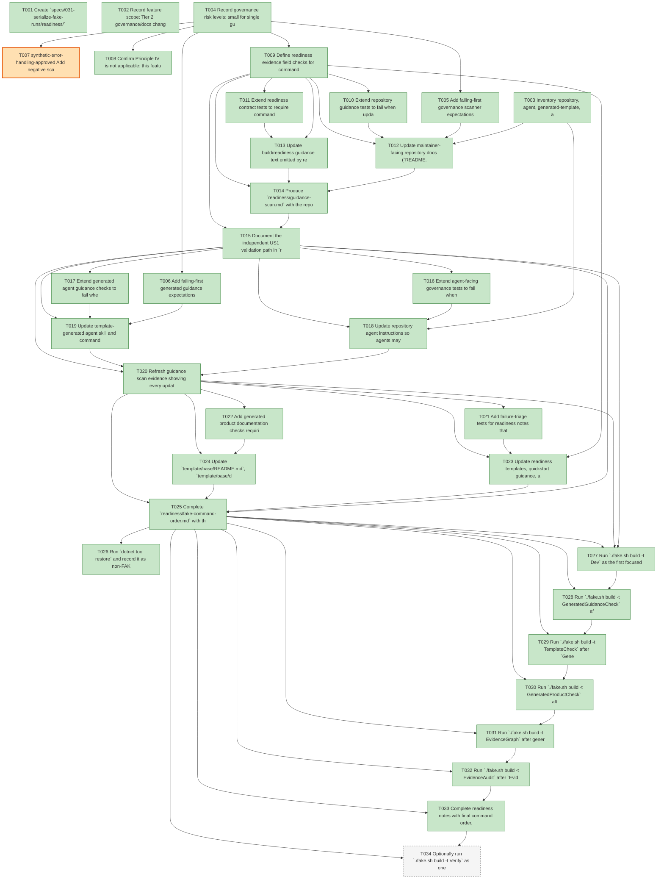

# Task Graph — 031-serialize-fake-runs

## ✓ Graph is acyclic and consistent

## Skill Match Assessments

| Task | Candidate | Confidence | Signals | Reviewer disposition | Diagnostic |
|------|-----------|------------|---------|----------------------|------------|
| T001 | speckit-implement | high | task-text | accepted | T001: task text matches speckit-implement |
| T002 | (none) | none |  | accepted-empty | T002: no high-confidence capability signal detected |
| T003 | (none) | none |  | accepted-empty | T003: no high-confidence capability signal detected |
| T004 | (none) | none |  | accepted-empty | T004: no high-confidence capability signal detected |
| T005 | (none) | none |  | accepted-empty | T005: no high-confidence capability signal detected |
| T006 | (none) | none |  | declared | T006: no high-confidence capability signal detected |
| T007 | (none) | none |  | accepted-empty | T007: no high-confidence capability signal detected |
| T008 | (none) | none |  | accepted-empty | T008: no high-confidence capability signal detected |
| T009 | (none) | none |  | accepted-empty | T009: no high-confidence capability signal detected |
| T010 | (none) | none |  | accepted-empty | T010: no high-confidence capability signal detected |
| T011 | (none) | none |  | accepted-empty | T011: no high-confidence capability signal detected |
| T012 | (none) | none |  | accepted-empty | T012: no high-confidence capability signal detected |
| T013 | (none) | none |  | accepted-empty | T013: no high-confidence capability signal detected |
| T014 | (none) | none |  | accepted-empty | T014: no high-confidence capability signal detected |
| T015 | (none) | none |  | accepted-empty | T015: no high-confidence capability signal detected |
| T016 | (none) | none |  | accepted-empty | T016: no high-confidence capability signal detected |
| T017 | (none) | none |  | declared | T017: no high-confidence capability signal detected |
| T018 | (none) | none |  | accepted-empty | T018: no high-confidence capability signal detected |
| T019 | (none) | none |  | declared | T019: no high-confidence capability signal detected |
| T020 | (none) | none |  | accepted-empty | T020: no high-confidence capability signal detected |
| T021 | (none) | none |  | accepted-empty | T021: no high-confidence capability signal detected |
| T022 | (none) | none |  | declared | T022: no high-confidence capability signal detected |
| T023 | (none) | none |  | accepted-empty | T023: no high-confidence capability signal detected |
| T024 | (none) | none |  | declared | T024: no high-confidence capability signal detected |
| T025 | (none) | none |  | accepted-empty | T025: no high-confidence capability signal detected |
| T026 | (none) | none |  | accepted-empty | T026: no high-confidence capability signal detected |
| T027 | (none) | none |  | accepted-empty | T027: no high-confidence capability signal detected |
| T028 | (none) | none |  | accepted-empty | T028: no high-confidence capability signal detected |
| T029 | (none) | none |  | declared | T029: no high-confidence capability signal detected |
| T030 | (none) | none |  | declared | T030: no high-confidence capability signal detected |
| T031 | speckit-evidence-graph | high | task-text | accepted | T031: task text matches speckit-evidence-graph |
| T032 | speckit-evidence-graph | high | task-text | accepted | T032: task text matches speckit-evidence-graph |
| T032 | speckit-evidence-audit | high | task-text | accepted | T032: task text matches speckit-evidence-audit |
| T033 | (none) | none |  | accepted-empty | T033: no high-confidence capability signal detected |
| T034 | (none) | none |  | accepted-empty | T034: no high-confidence capability signal detected |

## Status counts (effective)

| Status | Count |
|--------|-------|
| [X] done | 32 |
| [S] synthetic | 1 |
| [S*] auto-synthetic | 0 |
| [-] skipped | 1 |
| accepted [SEH] synthetic | 1 |
| unaccepted synthetic | 0 |

## Synthetic Error-Handling Classification

| Task | Accepted | Label | Design source | Synthetic input class | Expected error behavior | Diagnostics |
|------|----------|-------|---------------|-----------------------|-------------------------|-------------|
| T007 | yes | yes | `specs/031-serialize-fake-runs/research.md` decision "Validate guidance through focused text checks and generated artifact checks"; `contracts/guidance-contract.md` validation expectations | Malformed or unsafe validation guidance text that omits required `.fake` or sequential semantics, or implies concurrent FAKE execution | Scanner reports path/snippet context and rejects the unsafe guidance without changing production docs | (none) |

## Graph



## ASCII view

```
T001 [X] Create `specs/031-serialize-fake-runs/readiness/` placeholders for `sequential-fake-validation.md`, `guidance-scan.md`, `fake-command-order.md`, `evidence-graph.md`, `evidence-audit.md`, `governance-risk-levels.md`, `generated-validation-authority.md`, `skill-loading-evidence-workflow.md`, `audit-diagnostics.md`, `readiness-contract-discovery.md`, `framework-guidance.md`, and `evidence-vocabulary.md`
T002 [X] Record feature scope: Tier 2 governance/docs change, no package identity changes, no public F# API, no runtime UI/rendering change, and no MVU/effect boundary changes
T003 [X] Inventory repository, agent, generated-template, and readiness guidance surfaces that mention `fake.sh`, `fake.cmd`, `dotnet fake`, FAKE-backed tests, or FAKE targets
T004 [X] Record governance risk levels: small for single guidance edits, medium for generated-template guidance or scanner changes, broad when `Verify` or generated package output is needed; note non-authoritative aggregate logs separately from command-order evidence
T005 [X] Add failing-first governance scanner expectations for required semantics: FAKE-backed command class, `.fake` race risk, sequential execution, deterministic order, and non-FAKE parallelism distinction
T006 [X] Add failing-first generated guidance expectations that template source and generated product artifacts carry the sequential FAKE rule
T007 [S] synthetic-error-handling-approved Add negative scanner fixtures for malformed or unsafe FAKE guidance snippets that omit `.fake`, omit sequential order, or imply concurrent FAKE execution   ← accepted [SEH]
T008 [X] Confirm Principle IV is not applicable: this feature changes guidance and validation scans only, with filesystem/process effects remaining at existing build/test command boundaries
T009 [X] Define readiness evidence field checks for command order, working directory, purpose, relative or timestamped start/end order, exit code, log path, and race-like failure triage classification
T010 [X] Extend repository guidance tests to fail when updated maintainer validation instructions list multiple FAKE-backed commands without deterministic sequential ordering
T011 [X] Extend readiness contract tests to require command-order evidence whenever more than one FAKE-backed command supports a readiness claim
T012 [X] Update maintainer-facing repository docs (`README.md`, `docs/build.md`, `docs/testing.md`, `docs/evidence.md`, and related validation docs) so FAKE-backed commands are listed one at a time and named as unsafe to run concurrently because of shared `.fake` state
T013 [X] Update build/readiness guidance text emitted by repository validation paths so race-like FAKE failures tell maintainers to rerun affected FAKE-backed commands sequentially before product debugging
T014 [X] Produce `readiness/guidance-scan.md` with the repository guidance paths checked, required concepts found or missing, and repairs completed
T015 [X] Document the independent US1 validation path in `readiness/sequential-fake-validation.md` with the exact serialized command order used for focused repository validation
T016 [X] Extend agent-facing governance tests to fail when `AGENTS.md`, `CLAUDE.md`, `.agents/skills/*`, `.claude/skills/*`, or `.claude/commands/*` mention FAKE-backed validation without sequential execution guidance
T017 [X] Extend generated agent guidance checks to fail when generated `.agents/skills/` or `.claude/skills/` output omits the sequential FAKE rule
T018 [X] Update repository agent instructions so agents may parallelize safe non-FAKE reads/checks but must not run any FAKE-backed tests or FAKE targets concurrently
T019 [X] Update template-generated agent skill and command guidance so generated products list development, test, verification, and evidence-gate FAKE-backed commands as serialized work when multiple are needed
T020 [X] Refresh guidance scan evidence showing every updated agent-facing FAKE-backed instruction names `.fake`, sequential execution, and the non-FAKE parallelism exception
T021 [X] Add failure-triage tests for readiness notes that require failed command, concurrent FAKE context, `.fake` race classification, sequential rerun order, and follow-up classification
T022 [X] Add generated product documentation checks requiring the same race-like failure triage guidance in generated README/product docs
T023 [X] Update readiness templates, quickstart guidance, and failure notes so suspected or unknown concurrent FAKE context requires a sequential rerun before product-regression claims
T024 [X] Update `template/base/README.md`, `template/base/docs/product.md`, and generated product guidance sources with the sequential rerun triage rule
T025 [X] Complete `readiness/fake-command-order.md` with the focused command sequence, expected log paths, and the rule that aggregate `Verify` evidence is broad but not a substitute for ordered focused logs
T026 [X] Run `dotnet tool restore` and record it as non-FAKE setup before any FAKE-backed validation command
T027 [X] Run `./fake.sh build -t Dev` as the first focused FAKE-backed validation command and record start/end order, exit code, and log path
T028 [X] Run `./fake.sh build -t GeneratedGuidanceCheck` after `Dev` completes and record order, exit code, and log path
T029 [X] Run `./fake.sh build -t TemplateCheck` after `GeneratedGuidanceCheck` completes and record order, exit code, and log path
T030 [X] Run `./fake.sh build -t GeneratedProductCheck` after `TemplateCheck` completes and record order, exit code, and log path
T031 [X] Run `./fake.sh build -t EvidenceGraph` after generated product validation completes; refresh `readiness/evidence-graph.md`, `readiness/task-graph.md`, and `readiness/task-graph.json`
T032 [X] Run `./fake.sh build -t EvidenceAudit` after `EvidenceGraph` completes; refresh `readiness/evidence-audit.md` and record synthetic propagation plus diff-scan verdict
T033 [X] Complete readiness notes with final command order, failure triage outcome, generated validation authority, skill-loading workflow notes, and any non-authoritative aggregate results
T034 [-] Optionally run `./fake.sh build -t Verify` as one final broad FAKE-backed command only after focused commands are clean; skipped because the optional broad aggregate is non-authoritative for this feature and the required focused FAKE-backed sequence passed sequentially
```

