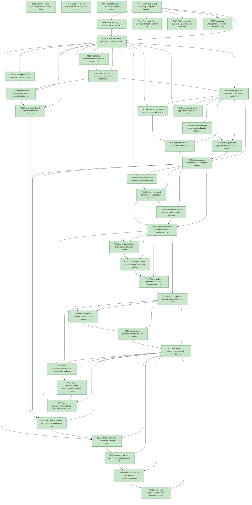

# Task Graph — 032-sokoban-feedback-followups

## ✓ Graph is acyclic and consistent

## Skill Match Assessments

| Task | Candidate | Confidence | Signals | Reviewer disposition | Diagnostic |
|------|-----------|------------|---------|----------------------|------------|
| T001 | (none) | none |  | accepted-empty | T001: no high-confidence capability signal detected |
| T002 | speckit-evidence-graph | high | task-text | accepted | T002: task text matches speckit-evidence-graph |
| T002 | speckit-evidence-audit | high | task-text | accepted | T002: task text matches speckit-evidence-audit |
| T003 | (none) | none |  | accepted-empty | T003: no high-confidence capability signal detected |
| T004 | speckit-implement | high | task-text | accepted | T004: task text matches speckit-implement |
| T005 | (none) | none |  | declared | T005: no high-confidence capability signal detected |
| T006 | (none) | none |  | declared | T006: no high-confidence capability signal detected |
| T007 | (none) | none |  | declared | T007: no high-confidence capability signal detected |
| T008 | (none) | none |  | declared | T008: no high-confidence capability signal detected |
| T009 | speckit-implement | high | task-text | accepted | T009: task text matches speckit-implement |
| T010 | (none) | none |  | declared | T010: no high-confidence capability signal detected |
| T011 | (none) | none |  | declared | T011: no high-confidence capability signal detected |
| T012 | (none) | none |  | declared | T012: no high-confidence capability signal detected |
| T013 | (none) | none |  | declared | T013: no high-confidence capability signal detected |
| T014 | (none) | none |  | declared | T014: no high-confidence capability signal detected |
| T015 | (none) | none |  | declared | T015: no high-confidence capability signal detected |
| T016 | (none) | none |  | declared | T016: no high-confidence capability signal detected |
| T017 | (none) | none |  | declared | T017: no high-confidence capability signal detected |
| T018 | (none) | none |  | declared | T018: no high-confidence capability signal detected |
| T019 | (none) | none |  | declared | T019: no high-confidence capability signal detected |
| T020 | (none) | none |  | declared | T020: no high-confidence capability signal detected |
| T021 | (none) | none |  | declared | T021: no high-confidence capability signal detected |
| T022 | (none) | none |  | declared | T022: no high-confidence capability signal detected |
| T023 | (none) | none |  | declared | T023: no high-confidence capability signal detected |
| T024 | (none) | none |  | declared | T024: no high-confidence capability signal detected |
| T025 | (none) | none |  | declared | T025: no high-confidence capability signal detected |
| T026 | (none) | none |  | declared | T026: no high-confidence capability signal detected |
| T027 | (none) | none |  | declared | T027: no high-confidence capability signal detected |
| T028 | (none) | none |  | declared | T028: no high-confidence capability signal detected |
| T029 | (none) | none |  | declared | T029: no high-confidence capability signal detected |
| T030 | speckit-evidence-graph | high | task-text | accepted | T030: task text matches speckit-evidence-graph |
| T031 | speckit-tasks | high | task-text | accepted | T031: task text matches speckit-tasks |
| T032 | speckit-tasks | high | task-text | accepted | T032: task text matches speckit-tasks |
| T033 | (none) | none |  | declared | T033: no high-confidence capability signal detected |
| T034 | (none) | none |  | declared | T034: no high-confidence capability signal detected |
| T035 | (none) | none |  | declared | T035: no high-confidence capability signal detected |
| T036 | (none) | none |  | declared | T036: no high-confidence capability signal detected |
| T037 | (none) | none |  | declared | T037: no high-confidence capability signal detected |
| T038 | (none) | none |  | declared | T038: no high-confidence capability signal detected |
| T039 | speckit-evidence-audit | high | task-text | accepted | T039: task text matches speckit-evidence-audit |
| T040 | (none) | none |  | accepted-empty | T040: no high-confidence capability signal detected |

## Status counts (effective)

| Status | Count |
|--------|-------|
| [X] done | 40 |
| [S] synthetic | 0 |
| [S*] auto-synthetic | 0 |
| accepted [SEH] synthetic | 0 |
| unaccepted synthetic | 0 |

## Graph



## ASCII view

```
T001 [X] Confirm current feature artifacts and active branch metadata point to `specs/032-sokoban-feedback-followups`
T002 [X] Create required readiness placeholders for default text, interactive close, consumer guidance, readiness contract, task guidance, risk levels, runtime limitations, aggregate hang diagnostics, evidence graph, and evidence audit
T003 [X] Record feature tier, public-API assumption, MVU/effect applicability, synthetic-evidence policy, risk levels, and serialized FAKE validation order in `readiness/governance-risk-levels.md`
T004 [X] Resolve and record capability skill paths needed for generated HUD/readability, viewer host, testing helper, Scene, KeyboardInput, and Elmish work in `readiness/skill-loading-evidence-workflow.md`
T005 [X] Review existing `.fsi` surfaces for default text rendering, screenshot capture, persistent launch, close reason, input dispatch, and validation helpers; document whether public contract changes are needed
T006 [X] Add failing-first governance/test fixtures for the five guidance scan areas and required readiness terms
T007 [X] Define common evidence report fields for screenshot glyph capture and persistent close evidence, including unsupported-host and failure classifications
T008 [X] Document unsupported host/runtime limitations, aggregate hang diagnostics, and non-authoritative aggregate result handling in readiness
T009 [X] If T005 finds new public API is required, draft `.fsi` signatures, FSI exercise notes, and expected surface baseline updates before implementation; otherwise record the no-new-surface decision
T010 [X] Add failing screenshot/rendering tests that demonstrate default text currently produces non-glyph block coverage in the capture path
T011 [X] Add failing validation-helper tests for glyph-shaped coverage, solid-block detection, placeholder/tofu detection, decodable screenshot checks, and unsupported-host classification
T012 [X] Implement glyph-capable default text rendering in screenshot evidence, reusing native glyph rendering and deterministic vector fallback where possible
T013 [X] Implement the screenshot-based capability check and report fields for `DefaultTextGlyphEvidence`
T014 [X] Capture real default-text glyph readiness evidence in `readiness/default-text-glyph-capture.md`
T015 [X] Update generated guidance to warn that explicit fonts are required for brand or typography guarantees beyond default readability
T016 [X] Add failing tests for app-owned close intent producing emitted host/viewer close effects while reducers remain pure
T017 [X] Add failing persistent-close evidence validator tests for real interactive-window mode, first frame, window-opened fact, close request source, clean exit, elapsed time, and bounded-substitution rejection
T018 [X] Wire generated app close-confirmed model state or message flow to a real viewer/window close effect at the host boundary
T019 [X] Implement or refine generated persistent launch evidence workflow and report serialization for `PersistentCloseEvidence`
T020 [X] Update generated app guidance with the CI-friendly persistent launch close recipe and bounded-evidence distinction
T021 [X] Capture real or supported-host-classified interactive close evidence in `readiness/interactive-window-close-evidence.md`
T022 [X] Add failing generated-guidance tests requiring a compact API map for keyboard keys, host callbacks, viewer effects, adapter commands, and common Scene nodes
T023 [X] Update generated consumer docs, template fragments, and local skills with the compact API map
T024 [X] Classify each follow-up item as framework behavior, generated-app guidance, Spec Kit guidance, or consumer-author mistake in guidance/backlog notes
T025 [X] Capture guidance scan evidence in `readiness/consumer-guidance-scan.md`
T026 [X] Add failing guidance tests requiring feature-scoped readiness directory discovery, required readiness files, and mandatory audit terms
T027 [X] Update Spec Kit and generated-app readiness guidance to name the authoritative feature-scoped readiness directory and distinguish repository-level evidence output
T028 [X] Add or update guidance scans for required terms covering governance risk levels, aggregate hang diagnostics, runtime limitations, and supported-host persistent launch evidence
T029 [X] Capture readiness contract scan evidence in `readiness/readiness-contract-scan.md`
T030 [X] Add failing task-guidance tests for title trigger phrase pitfalls, `tasks.deps.yml` object shape, indentation, one key per task id, and `skillist` mirror rules
T031 [X] Update task-generation templates and `speckit-tasks` guidance with validator pitfall examples and dependency-file formatting rules
T032 [X] Run graph-only validation against the updated generated task guidance examples and capture `readiness/task-guidance-scan.md`
T033 [X] Run `GeneratedGuidanceCheck` sequentially and record command order, log path, and result
T034 [X] Run `TemplateCheck` sequentially and record command order, log path, and result
T035 [X] Run `GeneratedProductCheck` sequentially and record command order, log path, and result
T036 [X] Run `Dev` or focused package tests sequentially and record text/close validation results
T037 [X] If T009 introduced public surface changes, run surface/package validation and refresh baselines; otherwise record the no-surface-change evidence
T038 [X] Run graph validation and refresh `readiness/task-graph.md` plus `readiness/evidence-graph.md`
T039 [X] Run evidence audit and refresh `readiness/evidence-audit.md`
T040 [X] Update final readiness notes with serialized FAKE-backed order, race-like failure rerun classification, and final follow-up scope decisions
```

