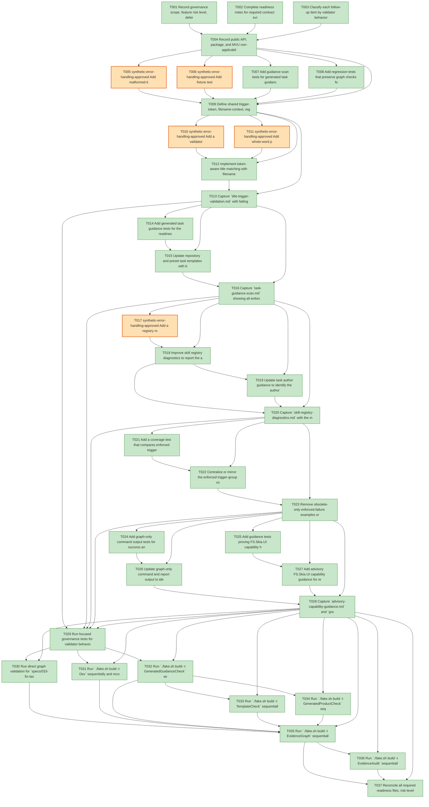

# Task Graph — 033-fix-task-validator-feedback

## ✓ Graph is acyclic and consistent

## Skill Match Assessments

| Task | Candidate | Confidence | Signals | Reviewer disposition | Diagnostic |
|------|-----------|------------|---------|----------------------|------------|
| T001 | (none) | none |  | accepted-empty | T001: no high-confidence capability signal detected |
| T002 | (none) | none |  | accepted-empty | T002: no high-confidence capability signal detected |
| T003 | (none) | none |  | accepted-empty | T003: no high-confidence capability signal detected |
| T004 | (none) | none |  | accepted-empty | T004: no high-confidence capability signal detected |
| T005 | (none) | none |  | accepted-empty | T005: no high-confidence capability signal detected |
| T006 | (none) | none |  | accepted-empty | T006: no high-confidence capability signal detected |
| T007 | speckit-tasks | high | generated task guidance | accepted | T007: task text matches speckit-tasks; trigger_group=task generation; matched_trigger=generated task guidance |
| T008 | (none) | none |  | declared | T008: no high-confidence capability signal detected |
| T009 | (none) | none |  | accepted-empty | T009: no high-confidence capability signal detected |
| T010 | (none) | none |  | accepted-empty | T010: no high-confidence capability signal detected |
| T011 | (none) | none |  | accepted-empty | T011: no high-confidence capability signal detected |
| T012 | (none) | none |  | accepted-empty | T012: no high-confidence capability signal detected |
| T013 | (none) | none |  | accepted-empty | T013: no high-confidence capability signal detected |
| T014 | speckit-tasks | high | generated task guidance | accepted | T014: task text matches speckit-tasks; trigger_group=task generation; matched_trigger=generated task guidance |
| T015 | speckit-tasks | high | task templates | accepted | T015: task text matches speckit-tasks; trigger_group=task generation; matched_trigger=task templates |
| T016 | (none) | none |  | declared | T016: no high-confidence capability signal detected |
| T017 | (none) | none |  | accepted-empty | T017: no high-confidence capability signal detected |
| T018 | (none) | none |  | accepted-empty | T018: no high-confidence capability signal detected |
| T019 | (none) | none |  | declared | T019: no high-confidence capability signal detected |
| T020 | (none) | none |  | accepted-empty | T020: no high-confidence capability signal detected |
| T021 | (none) | none |  | declared | T021: no high-confidence capability signal detected |
| T022 | (none) | none |  | declared | T022: no high-confidence capability signal detected |
| T023 | (none) | none |  | declared | T023: no high-confidence capability signal detected |
| T024 | (none) | none |  | declared | T024: no high-confidence capability signal detected |
| T025 | (none) | none |  | declared | T025: no high-confidence capability signal detected |
| T026 | speckit-evidence-audit | high | EvidenceAudit | accepted | T026: task text matches speckit-evidence-audit; trigger_group=evidence audit; matched_trigger=EvidenceAudit |
| T027 | (none) | none |  | declared | T027: no high-confidence capability signal detected |
| T028 | (none) | none |  | accepted-empty | T028: no high-confidence capability signal detected |
| T029 | (none) | none |  | accepted-empty | T029: no high-confidence capability signal detected |
| T030 | (none) | none |  | declared | T030: no high-confidence capability signal detected |
| T031 | (none) | none |  | accepted-empty | T031: no high-confidence capability signal detected |
| T032 | (none) | none |  | declared | T032: no high-confidence capability signal detected |
| T033 | (none) | none |  | accepted-empty | T033: no high-confidence capability signal detected |
| T034 | (none) | none |  | accepted-empty | T034: no high-confidence capability signal detected |
| T035 | speckit-evidence-graph | high | EvidenceGraph | accepted | T035: task text matches speckit-evidence-graph; trigger_group=graph validation; matched_trigger=EvidenceGraph |
| T036 | speckit-evidence-audit | high | EvidenceAudit | accepted | T036: task text matches speckit-evidence-audit; trigger_group=evidence audit; matched_trigger=EvidenceAudit |
| T037 | (none) | none |  | accepted-empty | T037: no high-confidence capability signal detected |

## Status counts (effective)

| Status | Count |
|--------|-------|
| [X] done | 32 |
| [S] synthetic | 5 |
| [S*] auto-synthetic | 0 |
| accepted [SEH] synthetic | 5 |
| unaccepted synthetic | 0 |

## Synthetic Error-Handling Classification

| Task | Accepted | Label | Design source | Synthetic input class | Expected error behavior | Diagnostics |
|------|----------|-------|---------------|-----------------------|-------------------------|-------------|
| T005 | yes | yes | `specs/033-fix-task-validator-feedback/plan.md` synthetic evidence decision | malformed task title / filename-context fixture | Validator reports no required skill for filename-only token matches and still reports clear whole-token matches. | (none) |
| T006 | yes | yes | `specs/033-fix-task-validator-feedback/contracts/skill-registry-diagnostics.md` | mismatched skill directory and declared `name:` fixture | Validator identifies the accepted declared id and source path. | (none) |
| T010 | yes | yes | `specs/033-fix-task-validator-feedback/contracts/title-trigger-validation.md` | mandated readiness filename embedded in task title | Validator accepts `skillist: []` when no workflow is requested. | (none) |
| T011 | yes | yes | `specs/033-fix-task-validator-feedback/contracts/title-trigger-validation.md` | whole-word workflow trigger title fixture | Validator blocks omitted required Spec Kit skill and reports the matched group. | (none) |
| T017 | yes | yes | `specs/033-fix-task-validator-feedback/contracts/skill-registry-diagnostics.md` | invalid skill id declaration for a readable skill path | Validator failure includes the accepted declared id and next action. | (none) |

## Graph



## ASCII view

```
T001 [X] Record governance scope, feature risk level, deferred runtime scope, and package impact in the readiness notes
T002 [X] Complete readiness notes for required contract evidence file placeholders
T003 [X] Classify each follow-up item by validator behavior, author guidance, registry guidance, advisory guidance, or output labeling
T004 [X] Record public API, package, and MVU non-applicability with the required evidence obligations
T005 [S] synthetic-error-handling-approved Add malformed-title fixture tests for filename-bound trigger tokens   ← accepted [SEH]
T006 [S] synthetic-error-handling-approved Add fixture tests for directory-like skill declarations that resolve to a different declared id   ← accepted [SEH]
T007 [X] Add guidance scan tests for generated task guidance coverage and safe setup-title examples
T008 [X] Add regression tests that preserve graph checks for cycles, missing deps, mirror mismatches, unreadable skills, and skill ordering
T009 [X] Define shared trigger-token, filename-context, registry-entry, and run-label helper boundaries for the validator script
T010 [S] synthetic-error-handling-approved Add a validator fixture where a setup title cites a mandated readiness filename but requests no implementation workflow   ← accepted [SEH]
T011 [S] synthetic-error-handling-approved Add whole-word positive fixtures that still require the intended Spec Kit workflow skill   ← accepted [SEH]
T012 [X] Implement token-aware title matching with filename and longer-word exclusions
T013 [X] Capture `title-trigger-validation.md` with failing-first and passing validator fixture output
T014 [X] Add generated task guidance tests for the readiness prefix, enforced trigger groups, and safe setup-title examples
T015 [X] Update repository and preset task templates with blocking rule documentation and safe setup wording
T016 [X] Capture `task-guidance-scan.md` showing all enforced groups, the readiness prefix, and three safe examples
T017 [S] synthetic-error-handling-approved Add a registry mismatch diagnostic fixture for a readable skill whose directory differs from its declared id   ← accepted [SEH]
T018 [X] Improve skill registry diagnostics to report the accepted declared id and source path for directory-like declarations
T019 [X] Update task author guidance to identify the authoritative skill registry roots and declared-id rule
T020 [X] Capture `skill-registry-diagnostics.md` with the mismatch diagnostic and author-facing accepted id
T021 [X] Add a coverage test that compares enforced trigger groups against published guidance text
T022 [X] Centralize or mirror the enforced trigger-group vocabulary so guidance and validator expectations stay reviewable together
T023 [X] Remove obsolete-only enforced-failure examples or relabel them as advisory suggestions
T024 [X] Add graph-only command output tests for success and failure labels
T025 [X] Add guidance tests proving FS.Skia.UI capability hints cover at least five categories without becoming blocking rules
T026 [X] Update graph-only command and report output to identify graph validation and direct merge-gate checks to EvidenceAudit
T027 [X] Add advisory FS.Skia.UI capability guidance for rendering, viewer, input, layout, testing, and evidence tasks
T028 [X] Capture `advisory-capability-guidance.md` and `graph-only-output-label.md` with non-blocking and output-label proof
T029 [X] Run focused governance tests for validator behavior, guidance coverage, registry diagnostics, and output labels
T030 [X] Run direct graph validation for `specs/033-fix-task-validator-feedback` and refresh `readiness/task-graph.md`
T031 [X] Run `./fake.sh build -t Dev` sequentially and record any non-authoritative aggregate result
T032 [X] Run `./fake.sh build -t GeneratedGuidanceCheck` sequentially after template and guidance edits
T033 [X] Run `./fake.sh build -t TemplateCheck` sequentially if template-owned files changed
T034 [X] Run `./fake.sh build -t GeneratedProductCheck` sequentially if generated product guidance changed
T035 [X] Run `./fake.sh build -t EvidenceGraph` sequentially and confirm the graph-only label evidence
T036 [X] Run `./fake.sh build -t EvidenceAudit` sequentially and document PASS or every accepted synthetic override
T037 [X] Reconcile all required readiness files, risk-level notes, and synthetic evidence disclosures before work handoff
```

