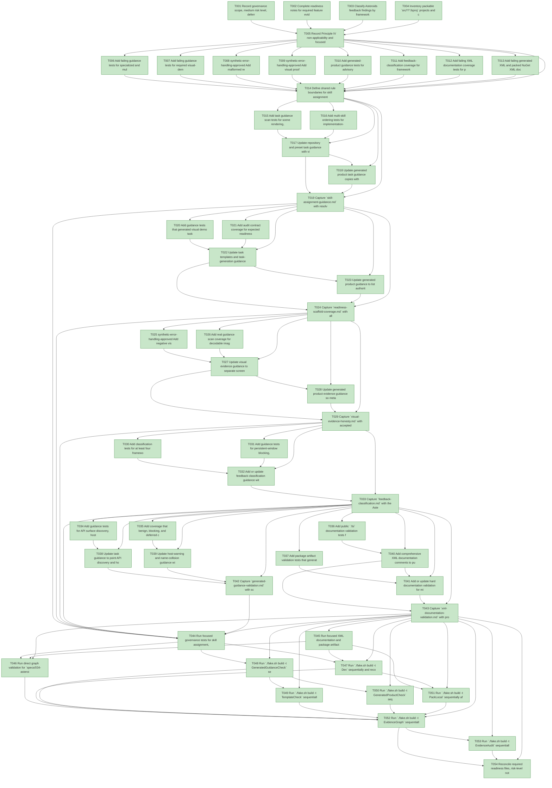

# Task Graph — 034-asteroids-feedback-skills

## ✓ Graph is acyclic and consistent

## Skill Match Assessments

| Task | Candidate | Confidence | Signals | Reviewer disposition | Diagnostic |
|------|-----------|------------|---------|----------------------|------------|
| T001 | (none) | none |  | accepted-empty | T001: no high-confidence capability signal detected |
| T002 | (none) | none |  | accepted-empty | T002: no high-confidence capability signal detected |
| T003 | (none) | none |  | declared | T003: no high-confidence capability signal detected |
| T004 | (none) | none |  | accepted-empty | T004: no high-confidence capability signal detected |
| T005 | (none) | none |  | accepted-empty | T005: no high-confidence capability signal detected |
| T006 | (none) | none |  | declared | T006: no high-confidence capability signal detected |
| T007 | (none) | none |  | declared | T007: no high-confidence capability signal detected |
| T008 | (none) | none |  | accepted-empty | T008: no high-confidence capability signal detected |
| T009 | (none) | none |  | accepted-empty | T009: no high-confidence capability signal detected |
| T010 | (none) | none |  | declared | T010: no high-confidence capability signal detected |
| T011 | (none) | none |  | declared | T011: no high-confidence capability signal detected |
| T012 | (none) | none |  | accepted-empty | T012: no high-confidence capability signal detected |
| T013 | (none) | none |  | accepted-empty | T013: no high-confidence capability signal detected |
| T014 | (none) | none |  | accepted-empty | T014: no high-confidence capability signal detected |
| T015 | (none) | none |  | declared | T015: no high-confidence capability signal detected |
| T016 | (none) | none |  | declared | T016: no high-confidence capability signal detected |
| T017 | (none) | none |  | declared | T017: no high-confidence capability signal detected |
| T018 | (none) | none |  | declared | T018: no high-confidence capability signal detected |
| T019 | (none) | none |  | declared | T019: no high-confidence capability signal detected |
| T020 | (none) | none |  | declared | T020: no high-confidence capability signal detected |
| T021 | (none) | none |  | declared | T021: no high-confidence capability signal detected |
| T022 | speckit-tasks | high | task-generation | accepted | T022: task text matches speckit-tasks; trigger_group=task generation; matched_trigger=task-generation |
| T023 | (none) | none |  | declared | T023: no high-confidence capability signal detected |
| T024 | (none) | none |  | declared | T024: no high-confidence capability signal detected |
| T025 | (none) | none |  | declared | T025: no high-confidence capability signal detected |
| T026 | (none) | none |  | declared | T026: no high-confidence capability signal detected |
| T027 | (none) | none |  | declared | T027: no high-confidence capability signal detected |
| T028 | (none) | none |  | declared | T028: no high-confidence capability signal detected |
| T029 | (none) | none |  | declared | T029: no high-confidence capability signal detected |
| T030 | (none) | none |  | declared | T030: no high-confidence capability signal detected |
| T031 | (none) | none |  | declared | T031: no high-confidence capability signal detected |
| T032 | (none) | none |  | declared | T032: no high-confidence capability signal detected |
| T033 | (none) | none |  | declared | T033: no high-confidence capability signal detected |
| T034 | (none) | none |  | declared | T034: no high-confidence capability signal detected |
| T035 | (none) | none |  | declared | T035: no high-confidence capability signal detected |
| T036 | (none) | none |  | accepted-empty | T036: no high-confidence capability signal detected |
| T037 | (none) | none |  | accepted-empty | T037: no high-confidence capability signal detected |
| T038 | (none) | none |  | declared | T038: no high-confidence capability signal detected |
| T039 | (none) | none |  | declared | T039: no high-confidence capability signal detected |
| T040 | (none) | none |  | accepted-empty | T040: no high-confidence capability signal detected |
| T041 | (none) | none |  | accepted-empty | T041: no high-confidence capability signal detected |
| T042 | (none) | none |  | declared | T042: no high-confidence capability signal detected |
| T043 | (none) | none |  | accepted-empty | T043: no high-confidence capability signal detected |
| T044 | (none) | none |  | declared | T044: no high-confidence capability signal detected |
| T045 | (none) | none |  | accepted-empty | T045: no high-confidence capability signal detected |
| T046 | (none) | none |  | declared | T046: no high-confidence capability signal detected |
| T047 | (none) | none |  | accepted-empty | T047: no high-confidence capability signal detected |
| T048 | (none) | none |  | declared | T048: no high-confidence capability signal detected |
| T049 | (none) | none |  | declared | T049: no high-confidence capability signal detected |
| T050 | (none) | none |  | declared | T050: no high-confidence capability signal detected |
| T051 | (none) | none |  | accepted-empty | T051: no high-confidence capability signal detected |
| T052 | speckit-evidence-graph | high | EvidenceGraph | accepted | T052: task text matches speckit-evidence-graph; trigger_group=graph validation; matched_trigger=EvidenceGraph |
| T053 | speckit-evidence-audit | high | EvidenceAudit | accepted | T053: task text matches speckit-evidence-audit; trigger_group=evidence audit; matched_trigger=EvidenceAudit |
| T054 | (none) | none |  | accepted-empty | T054: no high-confidence capability signal detected |

## Status counts (effective)

| Status | Count |
|--------|-------|
| [X] done | 54 |
| [S] synthetic | 0 |
| [S*] auto-synthetic | 0 |
| accepted [SEH] synthetic | 0 |
| unaccepted synthetic | 0 |

## Graph



## ASCII view

```
T001 [X] Record governance scope, medium risk level, deferred runtime package scope, and no-runtime-API-shape impact
T002 [X] Complete readiness notes for required feature evidence placeholders and acceptance cues
T003 [X] Classify Asteroids feedback findings by framework runtime, generated template workflow, documentation discoverability, and consumer authoring owner
T004 [X] Inventory packable `src/*/*.fsproj` projects and compiled public `.fsi` files that require XML documentation coverage
T005 [X] Record Principle IV non-applicability and focused versus broad validation obligations
T006 [X] Add failing guidance tests for specialized and multi-skill assignment patterns in generated visual demo task lists
T007 [X] Add failing guidance tests for required visual-demo readiness scaffold file enumeration and field cues
T008 [X] synthetic-error-handling-approved Add malformed readiness field fixtures for missing key/value acceptance cues
T009 [X] synthetic-error-handling-approved Add visual proof rejection fixtures for metadata-only reports, 1x1 fallback images, and layout-only bounds claims
T010 [X] Add generated-product guidance tests for advisory FS.Skia.UI skill discovery without hard-failing valid task lists
T011 [X] Add feedback-classification coverage for framework, template workflow, documentation, and consumer-authoring owner categories
T012 [X] Add failing XML documentation coverage tests for public `.fsi` summaries, parameters, returns, remarks, and examples with no local repo capability skill
T013 [X] Add failing generated XML and packed NuGet XML documentation validation tests with no local repo capability skill
T014 [X] Define shared rule boundaries for skill assignment, readiness scaffolds, visual proof classes, feedback owner categories, public documentation coverage, XML artifact validation, and scan result reporting
T015 [X] Add task guidance scan tests for scene rendering, screenshot capture, layout readability, persistent viewer launch, deterministic evidence mode, generated-package validation, graph validation, audit validation, and debug-loop skills
T016 [X] Add multi-skill ordering tests for implementation-before-evidence, graph-before-audit, and debug-before-broad-rerun guidance
T017 [X] Update repository and preset task guidance with visual demo skill assignment patterns and visible mirror requirements
T018 [X] Update generated product task guidance copies with the same skill assignment and no-skill rationale patterns
T019 [X] Capture `skill-assignment-guidance.md` with resolved skill ids, resolved `SKILL.md` paths, matched signals, confidence, ambiguity, and reviewer disposition
T020 [X] Add guidance tests that generated visual demo tasks enumerate visual, window, governance, aggregate hang, runtime limitation, generated validation, and real-image readiness files
T021 [X] Add audit contract coverage for expected readiness terms and fields without making final audit failures the discovery mechanism
T022 [X] Update task templates and task-generation guidance to scaffold audit-required readiness files early in the author workflow
T023 [X] Update generated product guidance to list authoritative commands, artifact paths, failure classes, and next-action fields for each readiness scaffold
T024 [X] Capture `readiness-scaffold-coverage.md` with all required readiness paths and field cues discoverable from guidance
T025 [X] synthetic-error-handling-approved Add negative visual evidence fixtures for ASCII screenshot reports, fallback PNG substitution, and layout-bounds-only claims
T026 [X] Add real guidance scan coverage for decodable image, dimensions, non-trivial content, renderer mode, fallback use, and unsupported reason fields
T027 [X] Update visual evidence guidance to separate screenshot proof, rasterized scene proof, layout readability proof, fallback classification, and unsupported proof
T028 [X] Update generated product evidence guidance so metadata-only reports and layout-only checks cannot satisfy visual proof tasks
T029 [X] Capture `visual-evidence-honesty.md` with accepted and rejected proof examples tied to real guidance paths
T030 [X] Add classification tests for at least four framework findings and at least three non-framework findings from the Asteroids feedback report
T031 [X] Add guidance tests for persistent-window blocking, display/session availability, auto-close smoke needs, and host-warning classification
T032 [X] Add or update feedback classification guidance with owner categories, source observation, deferred scope, and bounded next action
T033 [X] Capture `feedback-classification.md` with the Asteroids findings mapped to framework runtime, generated template workflow, documentation discoverability, and consumer authoring follow-ups
T034 [X] Add guidance tests for API surface discovery, host/window behavior, warning classification, and name-collision guidance in task metadata
T035 [X] Add coverage that benign, blocking, and deferred compile or host warnings remain explicitly classified
T036 [X] Add public `.fsi` documentation validation tests for every packable framework package with no local repo capability skill
T037 [X] Add package artifact validation tests that generated XML docs are non-empty and included in each corresponding `.nupkg` with no local repo capability skill
T038 [X] Update task guidance to point API discovery and host-friction work toward available local skills or documented no-skill rationales
T039 [X] Update host-warning and name-collision guidance with framework, documentation, or consumer-authoring ownership outcomes
T040 [X] Add comprehensive XML documentation comments to public `.fsi` surfaces in packable framework packages with no runtime API shape changes
T041 [X] Add or update hard documentation validation for missing `.fsi` XML comments, empty generated XML files, and missing XML entries in packed NuGet artifacts
T042 [X] Capture `generated-guidance-validation.md` with scan command, scanned files, observed and missing terms, advisory-only status, failure classification, and next action
T043 [X] Capture `xml-documentation-validation.md` with project paths, `.fsi` paths, generated XML paths, packed artifact entries, failures, and next actions
T044 [X] Run focused governance tests for skill assignment, readiness scaffolding, visual proof honesty, feedback classification, and advisory guidance behavior
T045 [X] Run focused XML documentation and package artifact validation tests for public `.fsi`, generated XML, and packed `.nupkg` coverage
T046 [X] Run direct graph validation for `specs/034-asteroids-feedback-skills` and refresh graph readiness artifacts
T047 [X] Run `./fake.sh build -t Dev` sequentially and record any non-authoritative aggregate result
T048 [X] Run `./fake.sh build -t GeneratedGuidanceCheck` sequentially after guidance edits
T049 [X] Run `./fake.sh build -t TemplateCheck` sequentially after template-owned edits
T050 [X] Run `./fake.sh build -t GeneratedProductCheck` sequentially after generated product guidance edits
T051 [X] Run `./fake.sh build -t PackLocal` sequentially after XML documentation edits and inspect packed XML entries
T052 [X] Run `./fake.sh build -t EvidenceGraph` sequentially and confirm graph output is current
T053 [X] Run `./fake.sh build -t EvidenceAudit` sequentially and document PASS or every accepted synthetic override
T054 [X] Reconcile required readiness files, risk-level notes, synthetic evidence disclosures, XML documentation evidence, package artifact evidence, and follow-up owner categories before handoff
```

