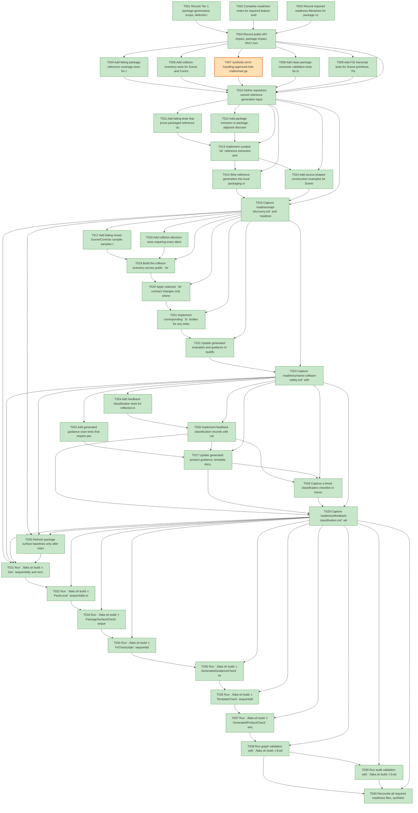

# Task Graph — 035-api-discovery-names

## ✓ Graph is acyclic and consistent

## Skill Match Assessments

| Task | Candidate | Confidence | Signals | Reviewer disposition | Diagnostic |
|------|-----------|------------|---------|----------------------|------------|
| T001 | (none) | none |  | accepted-empty | T001: no high-confidence capability signal detected |
| T002 | (none) | none |  | accepted-empty | T002: no high-confidence capability signal detected |
| T003 | (none) | none |  | accepted-empty | T003: no high-confidence capability signal detected |
| T004 | (none) | none |  | accepted-empty | T004: no high-confidence capability signal detected |
| T005 | (none) | none |  | declared | T005: no high-confidence capability signal detected |
| T006 | (none) | none |  | declared | T006: no high-confidence capability signal detected |
| T007 | (none) | none |  | declared | T007: no high-confidence capability signal detected |
| T008 | (none) | none |  | declared | T008: no high-confidence capability signal detected |
| T009 | (none) | none |  | declared | T009: no high-confidence capability signal detected |
| T010 | (none) | none |  | declared | T010: no high-confidence capability signal detected |
| T011 | (none) | none |  | declared | T011: no high-confidence capability signal detected |
| T012 | (none) | none |  | declared | T012: no high-confidence capability signal detected |
| T013 | (none) | none |  | declared | T013: no high-confidence capability signal detected |
| T014 | (none) | none |  | declared | T014: no high-confidence capability signal detected |
| T015 | (none) | none |  | declared | T015: no high-confidence capability signal detected |
| T016 | (none) | none |  | declared | T016: no high-confidence capability signal detected |
| T017 | (none) | none |  | declared | T017: no high-confidence capability signal detected |
| T018 | (none) | none |  | declared | T018: no high-confidence capability signal detected |
| T019 | (none) | none |  | declared | T019: no high-confidence capability signal detected |
| T020 | (none) | none |  | declared | T020: no high-confidence capability signal detected |
| T021 | (none) | none |  | declared | T021: no high-confidence capability signal detected |
| T022 | (none) | none |  | declared | T022: no high-confidence capability signal detected |
| T023 | (none) | none |  | declared | T023: no high-confidence capability signal detected |
| T024 | (none) | none |  | declared | T024: no high-confidence capability signal detected |
| T025 | (none) | none |  | declared | T025: no high-confidence capability signal detected |
| T026 | (none) | none |  | declared | T026: no high-confidence capability signal detected |
| T027 | (none) | none |  | declared | T027: no high-confidence capability signal detected |
| T028 | (none) | none |  | declared | T028: no high-confidence capability signal detected |
| T029 | (none) | none |  | declared | T029: no high-confidence capability signal detected |
| T030 | (none) | none |  | declared | T030: no high-confidence capability signal detected |
| T031 | (none) | none |  | declared | T031: no high-confidence capability signal detected |
| T032 | (none) | none |  | declared | T032: no high-confidence capability signal detected |
| T033 | (none) | none |  | declared | T033: no high-confidence capability signal detected |
| T034 | (none) | none |  | declared | T034: no high-confidence capability signal detected |
| T035 | (none) | none |  | declared | T035: no high-confidence capability signal detected |
| T036 | (none) | none |  | declared | T036: no high-confidence capability signal detected |
| T037 | (none) | none |  | declared | T037: no high-confidence capability signal detected |
| T038 | speckit-evidence-graph | high | EvidenceGraph | accepted | T038: task text matches speckit-evidence-graph; trigger_group=graph validation; matched_trigger=EvidenceGraph |
| T039 | speckit-evidence-audit | high | EvidenceAudit | accepted | T039: task text matches speckit-evidence-audit; trigger_group=evidence audit; matched_trigger=EvidenceAudit |
| T040 | (none) | none |  | accepted-empty | T040: no high-confidence capability signal detected |

## Status counts (effective)

| Status | Count |
|--------|-------|
| [X] done | 39 |
| [S] synthetic | 1 |
| [S*] auto-synthetic | 0 |
| accepted [SEH] synthetic | 1 |
| unaccepted synthetic | 0 |

## Synthetic Error-Handling Classification

| Task | Accepted | Label | Design source | Synthetic input class | Expected error behavior | Diagnostics |
|------|----------|-------|---------------|-----------------------|-------------------------|-------------|
| T007 | yes | yes | `specs/035-api-discovery-names/plan.md` synthetic evidence restrictions | malformed generated guidance / forbidden authoring advice fixture | Guidance scanner fails with diagnostics that name reflection-first or repository-source-copy advice and the required package-reference alternative. | (none) |

## Graph



## ASCII view

```
T001 [X] Record Tier 1 package-governance scope, deferred runtime scope, and broad-risk validation rules in the readiness notes
T002 [X] Complete readiness notes for required feature evidence files: `api-discovery.md`, `name-collision-safety.md`, `generated-consumer-validation.md`, `feedback-classification.md`, `package-reference-material.md`, `package-surface-baseline.md`, `evidence-graph.md`, and `evidence-audit.md`
T003 [X] Record required readiness filenames for package commands, artifact paths, failure classes, and next actions
T004 [X] Record public API impact, package impact, MVU non-applicability, synthetic-evidence limits, and unsupported runtime/rendering scope
T005 [X] Add failing package-reference coverage tests for curated `.fsi` signatures, source-shaped names, XML summaries, omitted-symbol reasons, and sampled symbol counts
T006 [X] Add collision inventory tests for Scene and Controls overlapping names, decision records, and explicit qualification guidance
T007 [S] synthetic-error-handling-approved Add malformed generated-guidance scanner fixtures that reject reflection-first or repository-source-copy authoring advice   ← accepted [SEH]
T008 [X] Add clean package-consumer validation tests for local package restore, no project references, no copied `src/`, no reflection authoring source, and actionable diagnostics
T009 [X] Add FSI transcript tests for Scene primitives, `Paint` helpers, geometry records, viewer records, keyboard cases, and Controls-adjacent declarations
T010 [X] Define repository-owned reference generation inputs, package output locations, report schema, and FAKE target boundaries without adding runtime dependencies
T011 [X] Add failing tests that prove packaged reference output preserves F# authoring spellings for Scene, Controls, viewer, geometry, paint, and keyboard samples
T012 [X] Add package inclusion or package-adjacent discoverability tests that locate one reference index per packable framework package
T013 [X] Implement curated `.fsi` reference extraction and deterministic Markdown/report output with symbol counts, samples, omissions, diagnostics, package id, and version
T014 [X] Wire reference generation into local packaging or package-adjacent validation reports and preserve deterministic artifact paths
T015 [X] Add source-shaped construction examples for Scene primitives, `Paint`, viewer records, geometry records, Controls front doors, and Controls.Elmish adapters
T016 [X] Capture `readiness/api-discovery.md` and `readiness/package-reference-material.md` with package ids, versions, source `.fsi` paths, reference paths, sampled symbol counts, omitted-symbol reasons, and no-reflection confirmation
T017 [X] Add failing mixed Scene/Controls compile samples that expose open-order-sensitive names unless explicit qualification or contract changes resolve them
T018 [X] Add collision-decision tests requiring every identified overlap to have a public-contract safety decision or explicit consumer guidance
T019 [X] Build the collision inventory across public `.fsi` signatures with owner namespaces, symbol kinds, risk levels, observed or plausible failure, and validation scenario
T020 [X] Apply selected `.fsi` contract changes only where the inventory justifies qualification attributes or safer front-door APIs
T021 [X] Implement corresponding `.fs` bodies for any selected public contract changes and preserve FSI-first semantic test ordering
T022 [X] Update generated examples and guidance to qualify collision-prone Scene records, Controls modules, event origins, and builder helpers explicitly
T023 [X] Capture `readiness/name-collision-safety.md` with each collision name, decision, compatibility note, guidance path, surface baseline path, and compile scenario result
T024 [X] Add feedback-classification tests for reflection-based discovery, open-order collision, stale generated guidance, and local authoring examples
T025 [X] Add generated guidance scan tests that require package-reference location, no-reflection guidance, no repository-source fallback, and mixed Scene/Controls qualification rules
T026 [X] Implement feedback classification records with category, owner, contract-change flag, generated-guidance flag, runtime-scope flag, evidence path, and next action
T027 [X] Update generated product guidance, template docs, capability metadata, and repository docs to point agents to package reference material before coding
T028 [X] Capture a timed classification checklist or transcript proving representative feedback can be categorized with next action in under 5 minutes
T029 [X] Capture `readiness/feedback-classification.md` with representative findings classified into package documentation, public contract ergonomics, generated template workflow, and consumer authoring guidance
T030 [X] Refresh package surface baselines only after intentional `.fsi` or package reference changes, then capture `readiness/package-surface-baseline.md`
T031 [X] Run `./fake.sh build -t Dev` sequentially and record focused failures before broader reruns
T032 [X] Run `./fake.sh build -t PackLocal` sequentially to produce the local package feed for consumer validation
T033 [X] Run `./fake.sh build -t PackageSurfaceCheck` sequentially and reconcile package reference or baseline diagnostics
T034 [X] Run `./fake.sh build -t FsiTranscripts` sequentially and confirm public authoring examples are package-shaped
T035 [X] Run `./fake.sh build -t GeneratedGuidanceCheck` sequentially and confirm no reflection-first, source-copy, or open-order-dependent guidance remains
T036 [X] Run `./fake.sh build -t TemplateCheck` sequentially after generated guidance or template-owned files change
T037 [X] Run `./fake.sh build -t GeneratedProductCheck` sequentially and confirm the clean package-consumer scenario compiles
T038 [X] Run graph validation with `./fake.sh build -t EvidenceGraph`, confirm no cycles, dangling refs, skill metadata mismatches, or unexpected capability omissions, and refresh `readiness/evidence-graph.md`
T039 [X] Run audit validation with `./fake.sh build -t EvidenceAudit`, document PASS or every accepted synthetic override, and refresh `readiness/evidence-audit.md`
T040 [X] Reconcile all required readiness files, synthetic disclosures, broad-risk notes, and non-authoritative aggregate results before handoff
```

