# Task Graph — 038-authoring-guidance-consistency

## ✓ Graph is acyclic and consistent

## Skill Match Assessments

| Task | Candidate | Confidence | Signals | Reviewer disposition | Diagnostic |
|------|-----------|------------|---------|----------------------|------------|
| T001 | (none) | none |  | accepted-empty | T001: no high-confidence capability signal detected |
| T002 | (none) | none |  | accepted-empty | T002: no high-confidence capability signal detected |
| T003 | (none) | none |  | accepted-empty | T003: no high-confidence capability signal detected |
| T004 | (none) | none |  | accepted-empty | T004: no high-confidence capability signal detected |
| T005 | (none) | none |  | accepted-empty | T005: no high-confidence capability signal detected |
| T006 | (none) | none |  | accepted-empty | T006: no high-confidence capability signal detected |
| T007 | (none) | none |  | declared | T007: no high-confidence capability signal detected |
| T008 | (none) | none |  | accepted-empty | T008: no high-confidence capability signal detected |
| T009 | (none) | none |  | accepted-empty | T009: no high-confidence capability signal detected |
| T010 | (none) | none |  | declared | T010: no high-confidence capability signal detected |
| T011 | (none) | none |  | accepted-empty | T011: no high-confidence capability signal detected |
| T012 | (none) | none |  | accepted-empty | T012: no high-confidence capability signal detected |
| T013 | (none) | none |  | declared | T013: no high-confidence capability signal detected |
| T014 | (none) | none |  | declared | T014: no high-confidence capability signal detected |
| T015 | (none) | none |  | declared | T015: no high-confidence capability signal detected |
| T016 | (none) | none |  | declared | T016: no high-confidence capability signal detected |
| T017 | (none) | none |  | declared | T017: no high-confidence capability signal detected |
| T018 | (none) | none |  | declared | T018: no high-confidence capability signal detected |
| T019 | (none) | none |  | declared | T019: no high-confidence capability signal detected |
| T020 | (none) | none |  | declared | T020: no high-confidence capability signal detected |
| T021 | (none) | none |  | declared | T021: no high-confidence capability signal detected |
| T022 | (none) | none |  | declared | T022: no high-confidence capability signal detected |
| T023 | (none) | none |  | declared | T023: no high-confidence capability signal detected |
| T024 | (none) | none |  | declared | T024: no high-confidence capability signal detected |
| T025 | (none) | none |  | declared | T025: no high-confidence capability signal detected |
| T026 | (none) | none |  | declared | T026: no high-confidence capability signal detected |
| T027 | (none) | none |  | declared | T027: no high-confidence capability signal detected |
| T028 | (none) | none |  | declared | T028: no high-confidence capability signal detected |
| T029 | (none) | none |  | declared | T029: no high-confidence capability signal detected |
| T030 | (none) | none |  | declared | T030: no high-confidence capability signal detected |
| T031 | (none) | none |  | declared | T031: no high-confidence capability signal detected |
| T032 | (none) | none |  | declared | T032: no high-confidence capability signal detected |
| T033 | (none) | none |  | declared | T033: no high-confidence capability signal detected |
| T034 | speckit-evidence-graph | high | EvidenceGraph | accepted | T034: task text matches speckit-evidence-graph; trigger_group=graph validation; matched_trigger=EvidenceGraph |
| T034 | speckit-evidence-audit | high | EvidenceAudit | accepted | T034: task text matches speckit-evidence-audit; trigger_group=evidence audit; matched_trigger=EvidenceAudit |
| T035 | speckit-evidence-graph | high | EvidenceGraph | accepted | T035: task text matches speckit-evidence-graph; trigger_group=graph validation; matched_trigger=EvidenceGraph |
| T035 | speckit-evidence-audit | high | EvidenceAudit | accepted | T035: task text matches speckit-evidence-audit; trigger_group=evidence audit; matched_trigger=EvidenceAudit |
| T036 | (none) | none |  | accepted-empty | T036: no high-confidence capability signal detected |
| T037 | (none) | none |  | declared | T037: no high-confidence capability signal detected |
| T038 | (none) | none |  | declared | T038: no high-confidence capability signal detected |

## Status counts (effective)

| Status | Count |
|--------|-------|
| [X] done | 38 |
| [S] synthetic | 0 |
| [S*] auto-synthetic | 0 |
| accepted [SEH] synthetic | 0 |
| unaccepted synthetic | 0 |

## Graph

```mermaid
graph TD
  T001["T001 Create placeholder evidence files listed by the pl"]:::done
  T002["T002 Record feature Tier (Tier 1 — contract changes iso"]:::done
  T003["T003 Complete readiness notes for `readiness/governance"]:::done
  T004["T004 Complete readiness notes for `readiness/aggregate-"]:::done
  T005["T005 Complete readiness notes for `readiness/runtime-li"]:::done
  T006["T006 Confirm the six contract files (`contracts/skill-r"]:::done
  T007["T007 Enumerate the collision-prone public-name set per "]:::done
  T008["T008 Add a failing-first id-resolution check with three"]:::done
  T009["T009 Implement the resolution guard in `build.fsx` `Gen"]:::done
  T010["T010 Extend the guard so the skills generated into a co"]:::done
  T011["T011 Remove the dangling `speckit-debug-loop` reference"]:::done
  T012["T012 Run `./fake.sh build -t GeneratedGuidanceCheck`; r"]:::done
  T013["T013 Add a generated-project expectation (failing-first"]:::done
  T014["T014 Emit the `docs/api-surface/` tree at generation ti"]:::done
  T015["T015 Register the new `docs/api-surface/` content in `."]:::done
  T016["T016 Generate a project, read a union case's exact fiel"]:::done
  T017["T017 Add a consumer compile fixture under `readiness/fs"]:::done
  T018["T018 Add `[<RequireQualifiedAccess>]` to `ViewerWindowS"]:::done
  T019["T019 Refresh `readiness/surface-baselines/FS.Skia.UI.Sk"]:::done
  T020["T020 Record the migration note and version-bump intent "]:::done
  T021["T021 Build with `./fake.sh build -t Dev`, recompile the"]:::done
  T022["T022 Add a failing-first generated-project scan asserti"]:::done
  T023["T023 Neutralize the demo-specific identifiers in `templ"]:::done
  T024["T024 Add at least one consumer-runnable usage snippet ("]:::done
  T025["T025 Generate a project, run `./fake.sh build -t Genera"]:::done
  T026["T026 Add a failing-first generated-project expectation "]:::done
  T027["T027 Author `template/base/docs/effects-boundary.md` de"]:::done
  T028["T028 Generate a project, confirm `docs/effects-boundary"]:::done
  T029["T029 Add an FSI fixture under `readiness/fsi/` that con"]:::done
  T030["T030 Add additive, self-describing constructors/helpers"]:::done
  T031["T031 Refresh `readiness/surface-baselines/FS.Skia.UI.Sc"]:::done
  T032["T032 Build with `./fake.sh build -t Dev`, compile the F"]:::done
  T033["T033 Add a fixture in which a `tasks.md` merely mention"]:::done
  T034["T034 Add a regression guard asserting the `EvidenceGrap"]:::done
  T035["T035 Run `./fake.sh build -t EvidenceGraph` then `./fak"]:::done
  T036["T036 Run the full sequential FAKE validation order (`De"]:::done
  T037["T037 Run `speckit.evidence.graph` — confirm no cycles, "]:::done
  T038["T038 Run `speckit.evidence.audit` — confirm verdict PAS"]:::done
  T002 --> T003
  T002 --> T004
  T002 --> T005
  T002 --> T006
  T002 --> T007
  T007 --> T008
  T008 --> T009
  T007 --> T009
  T009 --> T010
  T007 --> T010
  T007 --> T011
  T009 --> T012
  T010 --> T012
  T011 --> T012
  T007 --> T012
  T012 --> T013
  T013 --> T014
  T012 --> T014
  T014 --> T015
  T012 --> T015
  T014 --> T016
  T015 --> T016
  T012 --> T016
  T016 --> T017
  T017 --> T018
  T016 --> T018
  T018 --> T019
  T016 --> T019
  T018 --> T020
  T016 --> T020
  T018 --> T021
  T019 --> T021
  T020 --> T021
  T016 --> T021
  T021 --> T022
  T022 --> T023
  T021 --> T023
  T022 --> T024
  T021 --> T024
  T023 --> T025
  T024 --> T025
  T021 --> T025
  T025 --> T026
  T026 --> T027
  T025 --> T027
  T027 --> T028
  T025 --> T028
  T028 --> T029
  T029 --> T030
  T028 --> T030
  T030 --> T031
  T028 --> T031
  T030 --> T032
  T031 --> T032
  T028 --> T032
  T032 --> T033
  T033 --> T034
  T032 --> T034
  T034 --> T035
  T032 --> T035
  T012 --> T036
  T016 --> T036
  T021 --> T036
  T025 --> T036
  T028 --> T036
  T032 --> T036
  T035 --> T036
  T036 --> T037
  T035 --> T037
  T037 --> T038
  T035 --> T038
  classDef pending fill:#eeeeee,stroke:#999
  classDef done fill:#c8e6c9,stroke:#2e7d32
  classDef synthetic fill:#ffe0b2,stroke:#e65100,stroke-width:2px
  classDef autoSynthetic fill:#ffab91,stroke:#bf360c,stroke-width:2px,stroke-dasharray:5 3
  classDef failed fill:#ffcdd2,stroke:#b71c1c,stroke-width:2px
  classDef skipped fill:#f5f5f5,stroke:#666,stroke-dasharray:3 3
```



## ASCII view

```
T001 [X] Create placeholder evidence files listed by the plan: scaffold `specs/038-authoring-guidance-consistency/readiness/` with `logs/`, `skill-resolution-fixtures/`, and `fsi/` subdirectories, plus empty placeholders for `skill-resolution.md`, `generated-api-reference.md`, `name-collision-migration.md`, `generated-guidance.md`, `effects-boundary.md`, and `feature-targeting-regression.md`
T002 [X] Record feature Tier (Tier 1 — contract changes isolated to `ViewerWindowStartupState`/viewer-input `update`/`init` surfaces and additive `Scene` constructors), affected layers (`src/SkiaViewer`, `src/Elmish`, `src/KeyboardInput`, `src/Scene` `.fsi`; governance tooling; template/generated output), public-contract impact, Elmish/MVU applicability (not applicable — no stateful/I-O runtime behavior change), and the evidence obligations from the plan's Evidence Plan
T003 [X] Complete readiness notes for `readiness/governance-risk-levels.md` naming the small, medium, and broad governance risk levels, the focused validation required for the selected level, when broad validation is required, and the non-authoritative aggregate policy
T004 [X] Complete readiness notes for `readiness/aggregate-hang-diagnostics.md` recording verdict, stage, elapsed duration, last observed command, focused rerun, and the non-authoritative aggregate policy
T005 [X] Complete readiness notes for `readiness/runtime-limitations.md` covering .NET 10 desktop, Vulkan, SkiaSharp preview, unsupported macOS/mobile/browser, and no software-renderer fallback
T006 [X] Confirm the six contract files (`contracts/skill-resolution-contract.md`, `generated-api-reference-contract.md`, `name-collision-hardening-contract.md`, `generated-guidance-contract.md`, `effects-boundary-contract.md`, `scene-constructor-contract.md`) each name the exact rule, the failing-first fixture, and the FR/SC they satisfy
T007 [X] Enumerate the collision-prone public-name set per research R3 (`ViewerWindowStartupState.Normal`, plus every `update`/`init`-bearing viewer/Elmish/input surface a consumer could `open` into collision) and record, for each, whether it is already module-qualified or needs `[<RequireQualifiedAccess>]`, together with the surface-baseline files to refresh (`FS.Skia.UI.SkiaViewer.txt`, `FS.Skia.UI.KeyboardInput.txt`, merged `FS.Skia.UI.txt`, plus `FS.Skia.UI.Elmish.txt` if and only if the Elmish surface is hardened), and explicitly record the Elmish decision (hardened vs already module-qualified, no change) so its baseline is added or intentionally omitted
T008 [X] Add a failing-first id-resolution check with three fixtures under `readiness/skill-resolution-fixtures/`: a dangling advertised id, a skill whose directory and declared `name:` disagree, and an `.agents`↔`.claude` peer that declares a different `name:`; demonstrate the guard FAILS on each, naming the offending id and the advertising file:line (FR-001, FR-002, FR-003, SC-007)
T009 [X] Implement the resolution guard in `build.fsx` `GeneratedGuidanceCheck`: build the advertised-id set from the repo-file inputs — the hint/scan-phrase lines in `speckit-tasks/SKILL.md` (both `.agents` and `.claude` copies) — resolve each against the declared `name:` of every skill under `src/*/skill`, `.agents/skills/*`, `.claude/skills/*`, and `template/fragments/*/skill`, and fail on any unresolved id, any directory/`name:`/advertised-id disagreement, or any `.agents`↔`.claude` peer drift. The guard reads only repository files; the runtime "available skills" harness surface is not an input because a FAKE target cannot enumerate it (FR-001, FR-002, FR-003)
T010 [X] Extend the guard so the skills generated into a consumer project are validated the same way (advertised id ↔ declared `name:` ↔ directory), covering the edge case where an id resolves in this repo but not in the skill set a generated project receives (FR-002, spec Edge Cases)
T011 [X] Remove the dangling `speckit-debug-loop` reference everywhere it is advertised in the hints/scan phrases — `.agents/skills/speckit-tasks/SKILL.md` and its synchronized `.claude/skills/speckit-tasks/SKILL.md` peer (no such skill `name:` exists to repoint to) — so the resolution guard passes on the corrected repository (FR-001, SC-007)
T012 [X] Run `./fake.sh build -t GeneratedGuidanceCheck`; record the PASS on the corrected repository and the FAIL transcripts against each fixture in `readiness/skill-resolution.md`, including the `.agents`↔`.claude` peer-comparison output (SC-007, FR-003)
T013 [X] Add a generated-project expectation (failing-first) that `docs/api-surface/` is present and contains the real `.fsi` signatures for every package the profile consumes, and that a referenced package's signatures missing or drifted from `src/.../*.fsi` source FAILS the check (FR-004, SC-002)
T014 [X] Emit the `docs/api-surface/` tree at generation time in `build.fsx` (`runGenerateV3Products`/`generateV3Product`), copying the real public `.fsi` files verbatim, selected per profile from `capabilities.yml` `contracts:` for each capability the profile includes, so the bundled signatures stay in lockstep with source and are never hand-maintained (FR-004)
T015 [X] Register the new `docs/api-surface/` content in `.template.config/template.json` and assert it in `TemplateCheck`/`GeneratedGuidanceCheck`, failing loudly when a consumed package's signatures are absent or drift from source (FR-004, FR-005)
T016 [X] Generate a project, read a union case's exact field order (e.g. `SceneNode.Rectangle`) from the bundled `docs/api-surface/` with zero DLL reflection, and record it in `readiness/generated-api-reference.md` (SC-002)
T017 [X] Add a consumer compile fixture under `readiness/fsi/` that `open`s the viewer namespace and defines its own `Normal` case plus `update`/`init` bindings; failing-first, it must FAIL to compile (collision) before the hardening (FR-008, SC-003)
T018 [X] Add `[<RequireQualifiedAccess>]` to `ViewerWindowStartupState` in `src/SkiaViewer/SkiaViewer.fs`/`.fsi` and apply the consistent hardening (RQA or confirmed module-qualification) to the enumerated `update`/`init`-bearing viewer/Elmish/input surfaces from T007 in `src/SkiaViewer`, `src/Elmish`, `src/KeyboardInput` `.fs`/`.fsi`, qualifying any repo usages so the surface compiles (FR-008)
T019 [X] Refresh `readiness/surface-baselines/FS.Skia.UI.SkiaViewer.txt`, `FS.Skia.UI.KeyboardInput.txt`, `FS.Skia.UI.Elmish.txt` (only if T007 concludes the Elmish `update`/`init` surface is hardened rather than already module-qualified), and the merged `FS.Skia.UI.txt` via `scripts/refresh-surface-baselines.fsx` and confirm `./fake.sh build -t PackageSurfaceCheck` passes with the qualified-access markers
T020 [X] Record the migration note and version-bump intent in `readiness/name-collision-migration.md` (before/after `open` snippet; consumers referencing the affected names unqualified must now qualify them) and update all generated samples so a freshly generated project compiles with the clean, non-colliding surface (FR-008, SC-003)
T021 [X] Build with `./fake.sh build -t Dev`, recompile the consumer fixture, and record the before-FAIL / after-PASS transcript in `readiness/fsi/` confirming the consumer's `Normal`/`update`/`init` resolve to the consumer's definitions (SC-003)
T022 [X] Add a failing-first generated-project scan asserting zero demo-specific identifiers (`tetris`, `score`, `level`, `next piece`, `board`, `piece`) in the starter app + tests, ≥1 consumer-runnable usage snippet in each generated skill, and zero generated references to framework-only paths/targets (`CapabilityCheck`, `PackLocal`, `src/.../X.fsi`) (FR-005, FR-006, FR-007, SC-004)
T023 [X] Neutralize the demo-specific identifiers in `template/base/src/Product/Model.fs`, `View.fs`, `EvidenceCommands.fs`, `LayoutEvidence.fs`, and `template/base/tests/Product.Tests/Tests.fs`, replacing them with domain-agnostic equivalents while preserving the generic game-starter shape (HUD region, gameplay region, primary-interaction counter) so `fs-skia-layout-readability` stays meaningful (FR-007, SC-004)
T024 [X] Add at least one consumer-runnable usage snippet (scene construction, host wiring, or evidence production) to each generated skill under `template/fragments/*/skill/SKILL.md` (and matching `README.md`), and remove every reference to framework-only paths/build targets absent from a generated consumer project (FR-005, FR-006)
T025 [X] Generate a project, run `./fake.sh build -t GeneratedGuidanceCheck` then `./fake.sh build -t GeneratedProductCheck` (sequential), and record zero demo ids, zero framework-only paths, and ≥1 runnable snippet in `readiness/generated-guidance.md` (SC-004)
T026 [X] Add a failing-first generated-project expectation that a single `docs/effects-boundary.md` is present and self-contained (names both effect categories, the boundary, and the `update`→host wiring) before authoring it (FR-009, SC-005)
T027 [X] Author `template/base/docs/effects-boundary.md` describing both effect categories (application commands at the MVU edge vs viewer effects at the host boundary), the boundary, and the canonical `update`→host wiring (`Viewer.runApp viewerOptions generatedHost`); bundle it via `.template.config/template.json`; and repoint `docs/reports/generated-apps.md` to this single canonical page (FR-009)
T028 [X] Generate a project, confirm `docs/effects-boundary.md` is reachable and the wiring matches how the generated project wires effects, and record it in `readiness/effects-boundary.md` (SC-005)
T029 [X] Add an FSI fixture under `readiness/fsi/` that constructs `Rectangle`/`PaintedRectangle`/`Text` via the existing positional constructors and via the new self-describing forms; failing-first, the self-describing forms do not yet exist (FR-010, SC-006)
T030 [X] Add additive, self-describing constructors/helpers for `Rectangle`/`PaintedRectangle`/`Text` (a `Rect`-based and/or named-argument form consistent with `rectangleWithPaint`/`PaintedRectangle`) in `src/Scene/Scene.fs`/`.fsi`, retaining the existing positional DU cases and `Scene.rectangle`/`Scene.text` helpers so existing generated code keeps compiling (FR-010, SC-006)
T031 [X] Refresh `readiness/surface-baselines/FS.Skia.UI.Scene.txt` and the merged `FS.Skia.UI.txt` via `scripts/refresh-surface-baselines.fsx` and confirm `./fake.sh build -t PackageSurfaceCheck` passes with the additive surface
T032 [X] Build with `./fake.sh build -t Dev`, compile the FSI fixture, and record in `readiness/fsi/` that both the existing positional and the new self-describing constructors compile (SC-006)
T033 [X] Add a fixture in which a `tasks.md` merely mentions a filename in prose and confirm (failing-first framing) that the evidence gates resolve the active feature from `.specify/feature.json` and do NOT fire required evidence from the bare filename mention (FR-011, SC-008)
T034 [X] Add a regression guard asserting the `EvidenceGraph`/`EvidenceAudit` gates continue to target the feature in `.specify/feature.json` and refuse placeholder fallback, echoing the resolved feature id and why a filename mention did/didn't trigger (behavior established by feature 037) (FR-011, SC-008)
T035 [X] Run `./fake.sh build -t EvidenceGraph` then `./fake.sh build -t EvidenceAudit`; record the resolved feature.json target and the non-triggering filename-mention result in `readiness/feature-targeting-regression.md` (SC-008)
T036 [X] Run the full sequential FAKE validation order (`Dev` → `GeneratedGuidanceCheck` → `TemplateCheck` → `GeneratedProductCheck`), plus `PackageSurfaceCheck`, confirm a freshly generated consumer project builds, runs its tests, and produces its evidence using only local references (SC-001 governing), and record the non-authoritative aggregate results in `readiness/logs/`
T037 [X] Run `speckit.evidence.graph` — confirm no cycles, no dangling refs, no `[S*]` surprises, and that the resolved feature id and real task count are echoed
T038 [X] Run `speckit.evidence.audit` — confirm verdict PASS or document every `--accept-synthetic` override
```

