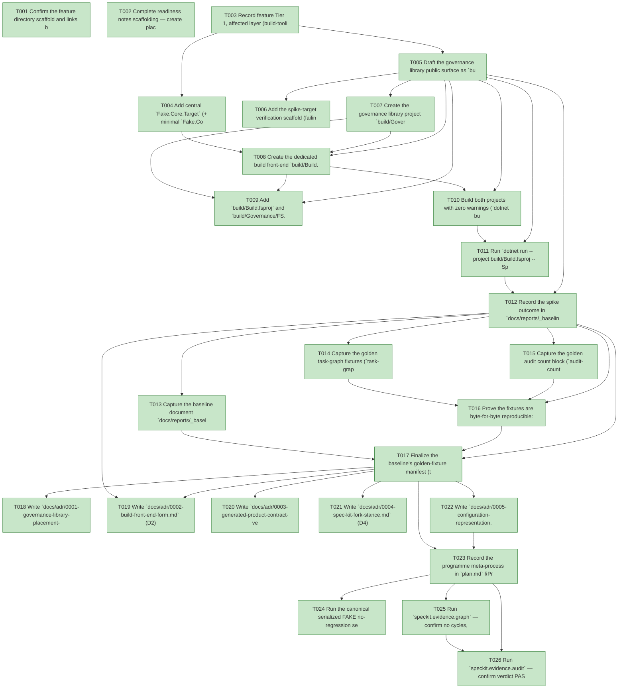

# Task Graph — 039-foundations-baseline-spike

## ✓ Graph is acyclic and consistent

## Skill Match Assessments

| Task | Candidate | Confidence | Signals | Reviewer disposition | Diagnostic |
|------|-----------|------------|---------|----------------------|------------|
| T001 | (none) | none |  | accepted-empty | T001: no high-confidence capability signal detected |
| T002 | (none) | none |  | accepted-empty | T002: no high-confidence capability signal detected |
| T003 | (none) | none |  | accepted-empty | T003: no high-confidence capability signal detected |
| T004 | (none) | none |  | accepted-empty | T004: no high-confidence capability signal detected |
| T005 | (none) | none |  | accepted-empty | T005: no high-confidence capability signal detected |
| T006 | (none) | none |  | accepted-empty | T006: no high-confidence capability signal detected |
| T007 | (none) | none |  | accepted-empty | T007: no high-confidence capability signal detected |
| T008 | (none) | none |  | accepted-empty | T008: no high-confidence capability signal detected |
| T009 | (none) | none |  | accepted-empty | T009: no high-confidence capability signal detected |
| T010 | (none) | none |  | accepted-empty | T010: no high-confidence capability signal detected |
| T011 | (none) | none |  | accepted-empty | T011: no high-confidence capability signal detected |
| T012 | (none) | none |  | accepted-empty | T012: no high-confidence capability signal detected |
| T013 | (none) | none |  | accepted-empty | T013: no high-confidence capability signal detected |
| T014 | speckit-evidence-graph | high | EvidenceGraph | accepted | T014: task text matches speckit-evidence-graph; trigger_group=graph validation; matched_trigger=EvidenceGraph |
| T015 | speckit-evidence-audit | high | EvidenceAudit | accepted | T015: task text matches speckit-evidence-audit; trigger_group=evidence audit; matched_trigger=EvidenceAudit |
| T016 | (none) | none |  | declared | T016: no high-confidence capability signal detected |
| T017 | (none) | none |  | accepted-empty | T017: no high-confidence capability signal detected |
| T018 | (none) | none |  | accepted-empty | T018: no high-confidence capability signal detected |
| T019 | (none) | none |  | accepted-empty | T019: no high-confidence capability signal detected |
| T020 | (none) | none |  | accepted-empty | T020: no high-confidence capability signal detected |
| T021 | (none) | none |  | accepted-empty | T021: no high-confidence capability signal detected |
| T022 | (none) | none |  | accepted-empty | T022: no high-confidence capability signal detected |
| T023 | (none) | none |  | accepted-empty | T023: no high-confidence capability signal detected |
| T024 | (none) | none |  | accepted-empty | T024: no high-confidence capability signal detected |
| T025 | (none) | none |  | declared | T025: no high-confidence capability signal detected |
| T026 | speckit-evidence-audit | high | diff-scan | accepted | T026: task text matches speckit-evidence-audit; trigger_group=evidence audit; matched_trigger=diff-scan |

## Status counts (effective)

| Status | Count |
|--------|-------|
| [X] done | 26 |
| [S] synthetic | 0 |
| [S*] auto-synthetic | 0 |
| accepted [SEH] synthetic | 0 |
| unaccepted synthetic | 0 |

## Graph



## ASCII view

```
T001 [X] Confirm the feature directory scaffold and links between `spec.md`, `plan.md`, `data-model.md`, `research.md`, `quickstart.md`, and `contracts/` are present and consistent
T002 [X] Complete readiness notes scaffolding — create placeholder readiness files discoverable before implementation (`readiness/logs/`, `readiness/governance-risk-levels.md`, `readiness/aggregate-hang-diagnostics.md`, `readiness/runtime-limitations.md`, `readiness/evidence-graph.md`, `readiness/evidence-audit.md`), each naming its authoritative command, artifact path, failure class, and next action
T003 [X] Record feature Tier 1, affected layer (build-tooling projects only — **no** runtime under `src/**`), public-API impact (no tracked runtime surface diff; one new build-tooling `.fsi`), and evidence obligations; state explicitly that **Principle IV (MVU/effect boundary) is not applicable** (no stateful/I-O runtime workflow) and that **no synthetic evidence** is anticipated
T004 [X] Add central `Fake.Core.Target` (+ minimal `Fake.Core.*` companion) `PackageVersion` entries to `Directory.Packages.props` and the matching build-tooling rows to `docs/dependencies.md` (need / version-pinning / owner); declare **no** `FSharp.Compiler.Service` and no `PackageVersion` outside central package management (FR-012)
T005 [X] Draft the governance library public surface as `build/Governance/Spike.fsi` — the single curated signature `val run : unit -> string` (Principle II) — and record that this is a new build-tooling surface, **not** a tracked runtime surface baseline, so `PackageSurfaceCheck`/`FsiTranscripts` must show no diff
T006 [X] Add the spike-target verification scaffold (failing-first): assert that invoking `SpikeHello` via `dotnet run --project build/Build.fsproj` must print the exact value returned by `Spike.run` (proving the body ran from the library, not inlined) and that `dotnet list build/Build.fsproj package --include-transitive` shows no `FSharp.Compiler.*` (contract `spike-target.contract.md`)
T007 [X] Create the governance library project `build/Governance/FS.Skia.UI.Build.fsproj` (`net10.0`, inherits `Directory.Build.props`) with `Spike.fsi` + `Spike.fs` implementing `run` as a trivial, identifiable success-message body (FR-005)
T008 [X] Create the dedicated build front-end `build/Build.fsproj` (Exe) + `Program.fs` that references the library and registers one `SpikeHello` target whose body is **only** a call into `Spike.run` (no inlined logic), dispatched via `Fake.Core.Target.runOrDefault` (FR-006)
T009 [X] Add `build/Build.fsproj` and `build/Governance/FS.Skia.UI.Build.fsproj` to `FS-Skia-UI.sln` additively — confirming the additions change no existing target's output (FR-010, invariant 6)
T010 [X] Build both projects with zero warnings (`dotnet build … -warnaserror`) under `net10.0` / `TreatWarningsAsErrors`; confirm every package version lives in `Directory.Packages.props` and `dotnet list … package --include-transitive` shows **no** `FSharp.Compiler.*` (FR-012, SC-003)
T011 [X] Run `dotnet run --project build/Build.fsproj -- SpikeHello` separately from any FAKE target (not FAKE-backed, no `.fake` state) and capture the output proving the success line is the value returned from `Spike.run` (SC-004)
T012 [X] Record the spike outcome in `docs/reports/_baselines/2026-05-31-spike-d2-outcome.md` as exactly `"D2 confirmed"` or `"fallback triggered"` — including the `dotnet run` command, its output, the FCS-absence result, and (if fallback) the named reproducible blocker plus the thin-`build.fsx` `#r`-the-DLL shim documented as the Stage 5 path (FR-007, SC-004)
T013 [X] Capture the baseline document `docs/reports/_baselines/2026-05-31-foundations.md`, SHA-pinned to the recorded commit: `build.fsx` line count with orchestration-vs-validation breakdown, governance Markdown counts (`.claude`↔`.agents` skill mirror, the governing-principles document under `.specify/memory/`, `templates/`, and `specs/**`), the F#/Bash/Python LOC mix, and the per-feature ceremony-time estimate — record the literal measurement command for every line-count/LOC metric so a reviewer can reproduce it; the per-feature ceremony-time figure is an explicit estimate (record its derivation inputs) and is exempt from the measurement-command rule (FR-001, SC-001)
T014 [X] Capture the golden task-graph fixtures (`task-graph.json` + `task-graph.md`) for features `038-authoring-guidance-consistency`, `037-authoring-audit-robustness`, and `017-synthetic-error-evidence` via the **existing** `EvidenceGraph` path (unchanged), archived under `tests/Governance.Tests/fixtures/evidence-golden/<feature>/` (FR-002)
T015 [X] Capture the golden audit count block (`audit-counts.txt`: `accepted-seh-tasks`, `unaccepted-synthetic-tasks`, `auto-synthetic-tasks`, `late-seh-tasks`) for the same three features via the **existing** `EvidenceAudit` path (unchanged), archived alongside their graph fixtures (FR-002)
T016 [X] Prove the fixtures are byte-for-byte reproducible: re-run the existing evidence commands per feature and `diff` against the committed fixtures (empty diffs for all three files across all three features). If any re-run differs, remove the non-determinism (deterministic re-capture) or substitute a merged feature and record the substitution — never commit an unstable fixture (FR-003, SC-002)
T017 [X] Finalize the baseline's golden-fixture manifest (the three captured features, their fixture paths, and any recorded substitution), set each fixture's `source_commit` equal to the baseline SHA, link to `plan.md` §Programme Meta-Process, and designate the fixture set the **Stage 4 parity oracle** (FR-002, SC-001)
T018 [X] Write `docs/adr/0001-governance-library-placement-and-distribution.md` (D1) stating decision, alternatives, rationale, and the stages it shapes (FR-004, SC-005)
T019 [X] Write `docs/adr/0002-build-front-end-form.md` (D2) stating decision, alternatives, rationale, and shaped stages, citing the recorded spike outcome (FR-004, SC-005)
T020 [X] Write `docs/adr/0003-generated-product-contract-versioning.md` (contract-versioning policy) stating decision, alternatives, rationale, and shaped stages (FR-004, SC-005)
T021 [X] Write `docs/adr/0004-spec-kit-fork-stance.md` (D4) stating decision, alternatives, rationale, and shaped stages (FR-004, SC-005)
T022 [X] Write `docs/adr/0005-configuration-representation.md` (D6) stating decision, alternatives, rationale, and shaped stages (FR-004, SC-005)
T023 [X] Record the programme meta-process in `plan.md` §Programme Meta-Process as the single discoverable place — default lightweight framework-author loop (governance/consumer-contract-touching features escalate) and the named dogfood feature set (Stage 1, Stage 4) — and cross-link it from the finalized baseline document (FR-008, SC-007)
T024 [X] Run the canonical serialized FAKE no-regression sequence (`Dev` -> `GeneratedGuidanceCheck` -> `TemplateCheck` -> `GeneratedProductCheck` -> `DependencyReport` -> `TemplateDrift`) plus `PackageSurfaceCheck` / `FsiTranscripts`, and the runtime-untouched `git diff --name-only` check over `src/**`; confirm the sequence is green with **no** surface baseline diff and that the new build-tooling `PackageVersion` entries are reflected without error in `DependencyReport`, then record the non-authoritative aggregate results in `readiness/logs/` (FR-009, FR-010, FR-012, SC-006). Results in `readiness/logs/no-regression.md`: `Dev`/`GeneratedGuidanceCheck`/`GeneratedProductCheck`/`DependencyReport`/`TemplateDrift`/`PackageSurfaceCheck` PASS; the two readiness gates (T025/T026) PASS; `src/**` untouched (0 changes); no surface diff. Two gates RED for pre-existing, feature-independent reasons (proven via a stash control): `FsiTranscripts` (`controls-prelude.fsx` exits 1 on this toolchain) and `TemplateCheck` (its `Test` target hits the known `SkiaViewer.Tests` headless flake); out of scope per FR-009/FR-011.
T025 [X] Run `speckit.evidence.graph` — confirm no cycles, no dangling refs, no `[S*]` surprises, and that the resolved feature id and real task count are echoed
T026 [X] Run `speckit.evidence.audit` — confirm verdict PASS (no synthetic propagation, no diff-scan hits) or document every `--accept-synthetic` override
```

