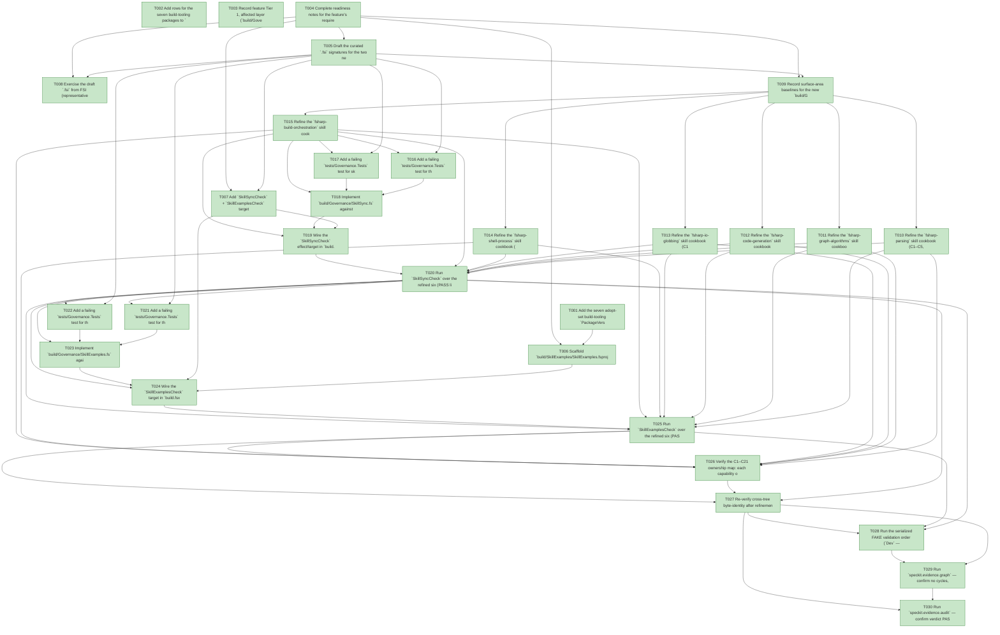

# Task Graph — 040-foundations-capability-skills

## ✓ Graph is acyclic and consistent

## Skill Match Assessments

| Task | Candidate | Confidence | Signals | Reviewer disposition | Diagnostic |
|------|-----------|------------|---------|----------------------|------------|
| T001 | (none) | none |  | accepted-empty | T001: no high-confidence capability signal detected |
| T002 | (none) | none |  | accepted-empty | T002: no high-confidence capability signal detected |
| T003 | (none) | none |  | accepted-empty | T003: no high-confidence capability signal detected |
| T004 | (none) | none |  | accepted-empty | T004: no high-confidence capability signal detected |
| T005 | (none) | none |  | accepted-empty | T005: no high-confidence capability signal detected |
| T006 | (none) | none |  | accepted-empty | T006: no high-confidence capability signal detected |
| T007 | (none) | none |  | accepted-empty | T007: no high-confidence capability signal detected |
| T008 | (none) | none |  | accepted-empty | T008: no high-confidence capability signal detected |
| T009 | (none) | none |  | accepted-empty | T009: no high-confidence capability signal detected |
| T010 | (none) | none |  | accepted-empty | T010: no high-confidence capability signal detected |
| T011 | (none) | none |  | accepted-empty | T011: no high-confidence capability signal detected |
| T012 | (none) | none |  | accepted-empty | T012: no high-confidence capability signal detected |
| T013 | (none) | none |  | accepted-empty | T013: no high-confidence capability signal detected |
| T014 | (none) | none |  | accepted-empty | T014: no high-confidence capability signal detected |
| T015 | (none) | none |  | accepted-empty | T015: no high-confidence capability signal detected |
| T016 | (none) | none |  | accepted-empty | T016: no high-confidence capability signal detected |
| T017 | (none) | none |  | accepted-empty | T017: no high-confidence capability signal detected |
| T018 | (none) | none |  | accepted-empty | T018: no high-confidence capability signal detected |
| T019 | (none) | none |  | accepted-empty | T019: no high-confidence capability signal detected |
| T020 | (none) | none |  | accepted-empty | T020: no high-confidence capability signal detected |
| T021 | (none) | none |  | accepted-empty | T021: no high-confidence capability signal detected |
| T022 | (none) | none |  | accepted-empty | T022: no high-confidence capability signal detected |
| T023 | (none) | none |  | accepted-empty | T023: no high-confidence capability signal detected |
| T024 | (none) | none |  | accepted-empty | T024: no high-confidence capability signal detected |
| T025 | (none) | none |  | accepted-empty | T025: no high-confidence capability signal detected |
| T026 | (none) | none |  | accepted-empty | T026: no high-confidence capability signal detected |
| T027 | (none) | none |  | accepted-empty | T027: no high-confidence capability signal detected |
| T028 | (none) | none |  | accepted-empty | T028: no high-confidence capability signal detected |
| T029 | speckit-evidence-graph | high | evidence graph | accepted | T029: task text matches speckit-evidence-graph; trigger_group=graph validation; matched_trigger=evidence graph |
| T030 | (none) | none |  | declared | T030: no high-confidence capability signal detected |

## Status counts (effective)

| Status | Count |
|--------|-------|
| [X] done | 30 |
| [S] synthetic | 0 |
| [S*] auto-synthetic | 0 |
| accepted [SEH] synthetic | 0 |
| unaccepted synthetic | 0 |

## Graph



## ASCII view

```
T001 [X] Add the seven adopt-set build-tooling `PackageVersion` entries (`FSharp.SystemTextJson`, `XParsec` 1.0.0, `Microsoft.Extensions.FileSystemGlobbing`, `Fake.IO.FileSystem`, `Fake.Tools.Git`, `DiffPlex`, `FsCheck`) to `Directory.Packages.props` in a build-tooling `ItemGroup`, each pinned per Central Package Management; resolve exact net10-compatible versions against NuGet
T002 [X] Add rows for the seven build-tooling packages to `docs/reports/dependencies.md` (need, version, maintenance owner = build-tooling/governance) so `DependencyReport` reads them as build-tooling scope, never product/runtime
T003 [X] Record feature Tier 1, affected layer (`build/Governance` build-tooling only), public-API impact (no product `.fsi`; new build-tooling `.fsi` required), Elmish/MVU applicability (plugs into the existing `build.fsx` `update`/effect boundary — no new `Model`/`Msg` algebra), and the evidence obligations (refined skills + `SkillSyncCheck` PASS + `SkillExamplesCheck` PASS)
T004 [X] Complete readiness notes for the feature's required readiness placeholder files under `specs/040-foundations-capability-skills/readiness/` (governance-risk-levels, aggregate-hang-diagnostics, runtime-limitations, generated-validation-authority, evidence-graph, evidence-audit), each naming its authoritative command, artifact path, failure class, and next action
T005 [X] Draft the curated `.fsi` signatures for the two new `build/Governance` public modules — `SkillSync.fsi` (`SkillPair` model, skill-pair discovery, SHA-256 byte-identity comparison; pure core + IO edge) and `SkillExamples.fsi` (`CodeBlock` model, ` ```fsharp ` extraction, generated-module/tangle rendering) — Principle II curated companions, no access modifiers in `.fs`
T006 [X] Scaffold `build/SkillExamples/SkillExamples.fsproj` referencing exactly the adopt set (FCS-free), with `IsPackable=false`, a local `TreatWarningsAsErrors=false` override (errors still fail), and an empty regenerated `Generated/` directory
T007 [X] Add `SkillSyncCheck` + `SkillExamplesCheck` target stubs to `build.fsx` (new `StartTarget` dispatch arms / effect DU cases) and register them in `requiredTargets`, `targetDependencyRows`, and the `Dev` dependency list so `Verify`/`Ci` inherit them — no existing target changes meaning
T008 [X] Exercise the draft `.fsi` from FSI (representative pair-hash and block-extraction calls), capturing the session transcript to `readiness/fsi-session.txt`
T009 [X] Record surface-area baselines for the new `build/Governance` modules and the unsupported-scope handling + fail-fast failure diagnostics (missing file / empty extraction → explicit FAIL, no silent skip)
T010 [X] Refine the `fsharp-parsing` skill cookbook (C1–C5, C16, C21): verdicts (YamlDotNet / FSharp.SystemTextJson / XParsec / regex), the exact `tasks.md` task-line + box/annotation grammar and `audit-status` region semantics, the two-shape YAML caution, the Stage-0 golden-fixture byte-parity obligation, an API walkthrough + multiple runnable ` ```fsharp ` examples per owned capability, cautions, consuming stages, and Sources/links — written byte-identically to both `.claude/skills/fsharp-parsing/SKILL.md` and `.agents/skills/fsharp-parsing/SKILL.md`
T011 [X] Refine the `fsharp-graph-algorithms` skill cookbook (C6–C9): verdicts (hand-roll + FsCheck), the exact cycle-detection / Kahn topo-sort / propagation parity rules, the Stage-0 golden-fixture byte-parity obligation, API walkthrough + multiple runnable examples per capability, cautions, consuming stages, Sources/links — byte-identical in both trees
T012 [X] Refine the `fsharp-code-generation` skill cookbook (C10–C12): verdicts (StringBuilder / `Utf8JsonWriter` schema-1.0 emit; **reject** code-quotations/FCS; Fabulous.AST/Myriad deferred-consider prose), API walkthrough + multiple runnable examples per capability using only adopt-set + BCL APIs, cautions (no FCS, build-tooling-only), consuming stages, Sources/links — byte-identical in both trees
T013 [X] Refine the `fsharp-io-globbing` skill cookbook (C13–C14): verdicts (`Microsoft.Extensions.FileSystemGlobbing`), the .NET-glob vs Python-`fnmatch` semantic-drift caution with the golden-test-before-cutover mitigation, API walkthrough + multiple runnable examples per capability, consuming stages, Sources/links — byte-identical in both trees
T014 [X] Refine the `fsharp-shell-process` skill cookbook (C15, C17): verdicts (in-process-first; `Fake.Tools.Git` / `Fake.Core.Process` for residual shelling), API walkthrough + multiple runnable examples per capability, cautions, consuming stages, Sources/links — byte-identical in both trees
T015 [X] Refine the `fsharp-build-orchestration` skill cookbook (C18–C20): verdicts (Fake target orchestration; DiffPlex golden-diff; Expecto + FsCheck testing), API walkthrough + multiple runnable examples per capability, cautions, consuming stages, Sources/links — byte-identical in both trees
T016 [X] Add a failing `tests/Governance.Tests` test for the SHA-256 pair comparator: equal bytes → in-sync; differing bytes → out-of-sync with the offending slug and both hex digests named (fails before `SkillSync.fs` exists)
T017 [X] Add a failing `tests/Governance.Tests` test for skill-pair discovery: finds exactly the six expected pairs across both trees; a missing file on either side is a failure, never a skip (fails before discovery exists)
T018 [X] Implement `build/Governance/SkillSync.fs` against its `.fsi`: discover the six pairs, `File.ReadAllBytes` + `System.Security.Cryptography.SHA256` per file (no newline normalization), compare digests, name drift — pure comparison core with IO only at the edge
T019 [X] Wire the `SkillSyncCheck` effect/target in `build.fsx`: in-process hash, write `readiness/skill-sync-check.md` (PASS: six slugs + shared hash) and `readiness/logs/skill-sync-check.txt`, emit `FailWith` naming every drifted slug + both hashes on drift
T020 [X] Run `SkillSyncCheck` over the refined six (PASS lists six matching hashes); self-test: flip one byte in one `SKILL.md` → FAIL names that slug; restore → PASS; capture the PASS/FAIL/PASS evidence
T021 [X] Add a failing `tests/Governance.Tests` test for the ` ```fsharp ` block extractor: returns blocks with stable `{skillSlug; blockIndex (1-based, per skill); startLine}` identity in document order (fails before `SkillExamples.fs` exists)
T022 [X] Add a failing `tests/Governance.Tests` test for the tangler: wraps each block as `module Skill.<slug_underscored>.Block<NN>` preceded by a `// source: <skillPath>:<startLine>` comment, deterministic across runs (fails before the tangler exists)
T023 [X] Implement `build/Governance/SkillExamples.fs` against its `.fsi`: extract every ` ```fsharp ` block from the six `SKILL.md`, render `build/SkillExamples/Generated/<slug>.fs` deterministically (regenerated each run, never hand-edited)
T024 [X] Wire the `SkillExamplesCheck` target in `build.fsx`: regenerate `Generated/*.fs`, `dotnet build build/SkillExamples/SkillExamples.fsproj` capturing to `readiness/logs/skill-examples-check.txt`, map any compiler diagnostic back to the owning skill + block via the `// source:` comment, write `readiness/skill-examples-check.md` (per-skill block count); missing artifact or empty extraction → explicit FAIL
T025 [X] Run `SkillExamplesCheck` over the refined six (PASS lists per-skill block counts); self-test: break one block's API call → FAIL names the skill/block; fix → PASS; capture the PASS/FAIL/PASS evidence
T026 [X] Verify the C1–C21 ownership map: each capability owned by exactly one skill (parsing C1–C5/C16/C21; graph C6–C9; code-gen C10–C12; globbing C13–C14; shell C15/C17; orchestration C18–C20), union = {C1..C21}, intersection = ∅, and every skill's frontmatter cites the capability report as `metadata.source`; record the ownership table
T027 [X] Re-verify cross-tree byte-identity after refinement (`SkillSyncCheck` PASS over the refined six) and confirm none of the six capability skills appears in any task `skillist`
T028 [X] Run the serialized FAKE validation order (`Dev` — now including `SkillSyncCheck` + `SkillExamplesCheck` — then `GeneratedGuidanceCheck`, `TemplateCheck`, `GeneratedProductCheck`), recording aggregate FAKE results as non-authoritative and rerunning any race-like gate failure in focused isolation
T029 [X] Run `speckit.evidence.graph` — confirm no cycles, no dangling refs, no `[S*]` surprises, and that none of the six capability skills appears in any `skillist` (SC-005: the evidence graph is unchanged by this feature)
T030 [X] Run `speckit.evidence.audit` — confirm verdict PASS with no synthetic evidence to accept (this feature ships none)
```

