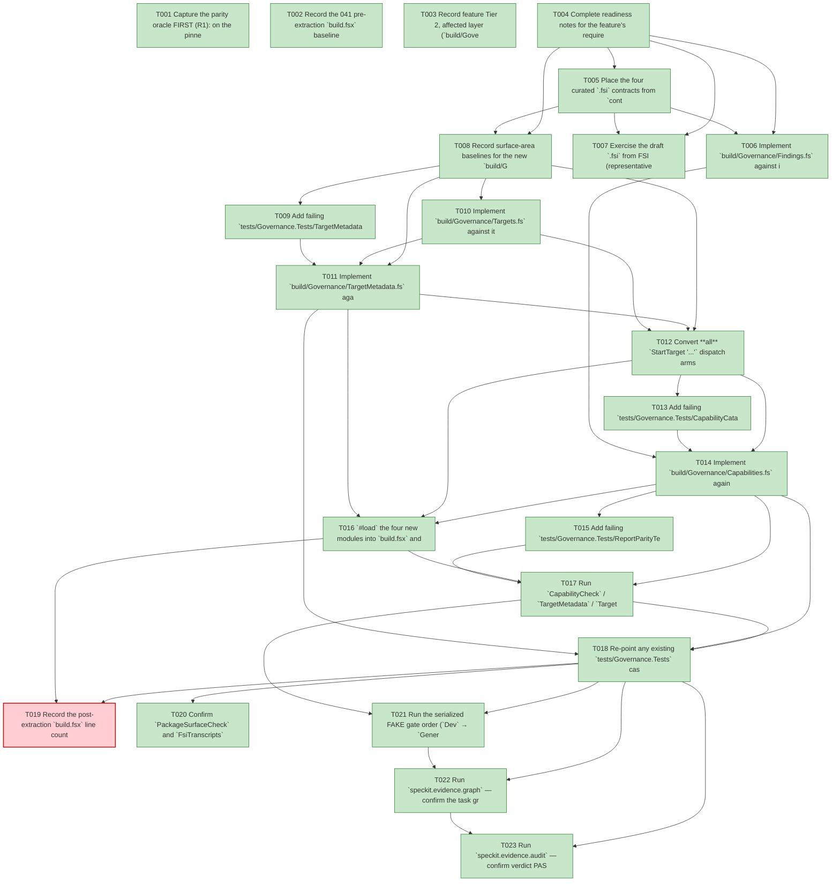

# Task Graph — 041-foundations-library-validators

## ✓ Graph is acyclic and consistent

## Skill Match Assessments

| Task | Candidate | Confidence | Signals | Reviewer disposition | Diagnostic |
|------|-----------|------------|---------|----------------------|------------|
| T001 | (none) | none |  | declared | T001: no high-confidence capability signal detected |
| T002 | (none) | none |  | accepted-empty | T002: no high-confidence capability signal detected |
| T003 | (none) | none |  | accepted-empty | T003: no high-confidence capability signal detected |
| T004 | (none) | none |  | accepted-empty | T004: no high-confidence capability signal detected |
| T005 | (none) | none |  | accepted-empty | T005: no high-confidence capability signal detected |
| T006 | (none) | none |  | declared | T006: no high-confidence capability signal detected |
| T007 | (none) | none |  | accepted-empty | T007: no high-confidence capability signal detected |
| T008 | (none) | none |  | accepted-empty | T008: no high-confidence capability signal detected |
| T009 | (none) | none |  | declared | T009: no high-confidence capability signal detected |
| T010 | (none) | none |  | accepted-empty | T010: no high-confidence capability signal detected |
| T011 | (none) | none |  | declared | T011: no high-confidence capability signal detected |
| T012 | (none) | none |  | declared | T012: no high-confidence capability signal detected |
| T013 | (none) | none |  | declared | T013: no high-confidence capability signal detected |
| T014 | (none) | none |  | declared | T014: no high-confidence capability signal detected |
| T015 | (none) | none |  | declared | T015: no high-confidence capability signal detected |
| T016 | (none) | none |  | declared | T016: no high-confidence capability signal detected |
| T017 | (none) | none |  | declared | T017: no high-confidence capability signal detected |
| T018 | (none) | none |  | declared | T018: no high-confidence capability signal detected |
| T019 | (none) | none |  | accepted-empty | T019: no high-confidence capability signal detected |
| T020 | (none) | none |  | accepted-empty | T020: no high-confidence capability signal detected |
| T021 | (none) | none |  | accepted-empty | T021: no high-confidence capability signal detected |
| T022 | speckit-evidence-graph | high | task graph | accepted | T022: task text matches speckit-evidence-graph; trigger_group=graph validation; matched_trigger=task graph |
| T023 | (none) | none |  | declared | T023: no high-confidence capability signal detected |

## Status counts (effective)

| Status | Count |
|--------|-------|
| [X] done | 22 |
| [S] synthetic | 0 |
| [S*] auto-synthetic | 0 |
| [F] failed | 1 |
| accepted [SEH] synthetic | 0 |
| unaccepted synthetic | 0 |

## Graph



## ASCII view

```
T001 [X] Capture the parity oracle FIRST (R1): on the pinned pre-extraction baseline run `CapabilityCheck`, `TargetMetadata`, and `TargetMetadataDrift`, then commit their outputs as `tests/Governance.Tests/fixtures/reports-golden/capability-catalog.md`, `target-metadata.json`, and `target-metadata-drift.md`; note the captured `generated_at_utc` value for the R2 normalization
T002 [X] Record the 041 pre-extraction `build.fsx` baseline line count (`wc -l build.fsx`, expected 4,839 at post-040 HEAD) into `readiness/build-fsx-line-delta.md` as the SC-001 before-count (the 039 Stage-0 count was 4,688; 040 grew the file)
T003 [X] Record feature Tier 2, affected layer (`build/Governance` + `build.fsx` build-tooling only), public-API impact (no product `.fsi`; new build-tooling `.fsi` required by Principle II), Elmish/MVU applicability (plugs into the existing `build.fsx` `update`/effect boundary — no new `Model`/`Msg`/`Effect`), and the real-evidence obligations (golden-diff = 0, ≥6 typed findings, ≥800-line shrink, `src/**` untouched)
T004 [X] Complete readiness notes for the feature's required readiness placeholder files under `specs/041-foundations-library-validators/readiness/` (governance-risk-levels, aggregate-hang-diagnostics, runtime-limitations, generated-validation-authority, evidence-graph, evidence-audit), each naming its authoritative command, artifact path, failure class, and next action
T005 [X] Place the four curated `.fsi` contracts from `contracts/` (`Findings.fsi`, `Targets.fsi`, `TargetMetadata.fsi`, `Capabilities.fsi`) into `build/Governance/` and add the `.fsi`/`.fs` pairs to `FS.Skia.UI.Build.fsproj` `<Compile>` in order (after Spike/SkillSync/SkillExamples) — Principle I/II, no access modifiers in `.fs` (FR-007)
T006 [X] Implement `build/Governance/Findings.fs` against its `.fsi`: the uniform `ValidationFinding` record (moved verbatim), the `finding` constructor, and the detail-line render helper reproducing `writeFindingsOrPass`'s `` - `{Path}` [{Rule}]: {Message} `` format byte-for-byte (FR-004) — `Findings` is a pure data/render type with no failing-first test of its own; it is covered transitively by the validator suites (T009/T013) and the parity assertion (T015), which fail if its record shape or render format regress (Principle VI: transitive coverage)
T007 [X] Exercise the draft `.fsi` from FSI (representative finding-render, `spec`-projection, and catalog-read calls), capturing the session transcript to `readiness/fsi-session.txt`
T008 [X] Record surface-area baselines for the new `build/Governance` modules and the unsupported-scope handling: a missing library DLL reference at extraction time is surfaced explicitly as the Stage-5 trigger (edge case 3), never a silent inline fallback
T009 [X] Add failing `tests/Governance.Tests/TargetMetadataTests.fs` asserting ≥3 `TargetMetadataDrift` typed cases (e.g. `MissingMetadata`, `MissingExpectedOutput`/`MissingFailureOwner`/`DependencyDivergence`, `MissingRunnableTarget`) over crafted typed inputs — not string matching (fails before `TargetMetadata.fs` exists; SC-004)
T010 [X] Implement `build/Governance/Targets.fs` against its `.fsi`: the typed `Target` discriminated union (one case per runnable target, preserving order), `allTargets`, the **total** `spec : Target -> TargetSpec`, and the derived `requiredTargetNames` / `targetDependencyRows` views computed from `spec` (FR-001) — plain DU + records, no cleverness (Principle III)
T011 [X] Implement `build/Governance/TargetMetadata.fs` against its `.fsi`: `TargetMetadata` computed from `TargetSpec`, the `TargetMetadataDrift` DU, the pure `validateMetadataDrift` / `validateAgainstRepo` (preserving contract-drift and docs-drift diagnostics), `driftDiagnostic`, `metadataJson` with `generatedAtUtc` as an explicit parameter (R2), and `driftMarkdown` — every existing diagnostic category and message string preserved (FR-002)
T012 [X] Convert **all** `StartTarget "..."` dispatch arms in `build.fsx` to dispatch on `Targets.Target`, and derive `requiredTargets` / `targetDependencyRows` / metadata from `Targets.spec` rather than maintaining them alongside it; demonstrate on a scratch branch that a renamed/mistyped target now fails to compile (FR-001, SC-003) — the persistent SC-003 evidence is the committed T009 typed-finding test; the scratch-branch compile error is the transient structural half. The MVU engine and build front-end form remain Stage 5 (FR-001a)
T013 [X] Add failing `tests/Governance.Tests/CapabilityCatalogTests.fs` asserting ≥3 catalog error-class `ValidationFinding` rule ids (e.g. `displayName`, `dependency`, default-app-set / missing-surface-baseline) over crafted typed rows — not string matching (fails before `Capabilities.fs` exists; SC-004)
T014 [X] Implement `build/Governance/Capabilities.fs` against its `.fsi`: the `CapabilityRow` model (15 fields), `readCatalog` reading `template/capabilities.yml` via `YamlDotNet` behind the typed model (no new dependency, YAML file retained — FR-003/FR-012), `validateRows` as a pure function with the `File.Exists` surface-baseline check **injected** (testable without disk), and `renderReport` reproducing the `# Capability Catalog` PASS table; preserve every existing typed rule id and message
T015 [X] Add failing `tests/Governance.Tests/ReportParityTests.fs` asserting byte-equality of the three rendered reports vs `fixtures/reports-golden/` — `capability-catalog.md` and `target-metadata-drift.md` fully, `target-metadata.json` for every line except the `generated_at_utc` value (asserted present + well-formed, R2) — under the existing `Dev`/test gate, no new FAKE target (FR-008a)
T016 [X] `#load` the four new modules into `build.fsx` and rewrite the `CapabilityCheck` / `TargetMetadata` / `TargetMetadataDrift` interpret cases to call `FS.Skia.UI.Build.*` in-process, passing edge-read inputs (contract/docs references, surface-baseline existence, `DateTimeOffset.UtcNow`); delete the bespoke `readCapabilityCatalog` line-by-line parser and the moved inline validators (FR-005, SC-005) — targets keep their names, deps, outputs, and graph positions (FR-013)
T017 [X] Run `CapabilityCheck` / `TargetMetadata` / `TargetMetadataDrift` on the pinned baseline and confirm golden-diff parity = 0 bytes for all three; grep confirms the bespoke parser no longer exists in `build.fsx`; record the empty-diff parity reports under `readiness/` (SC-002, SC-005, FR-006)
T018 [X] Re-point any existing `tests/Governance.Tests` cases that previously asserted strings/behaviours of the moved logic at the real library functions, and confirm ≥6 typed-finding cases pass in total (≥3 catalog error classes + ≥3 target-metadata drift classes), all green (FR-008, SC-004)
T019 [F] Record the post-extraction `build.fsx` line count into `readiness/build-fsx-line-delta.md`; confirm the shrink is ≥800 lines vs the 041 pre-extraction baseline (4,839, SC-001), `git diff` over `src/**` is empty (runtime untouched, SC-007), and no new `PackageVersion` exists outside `Directory.Packages.props` (FR-010/FR-012) — **PARTIAL/FAIL on SC-001 only**: line count recorded (4839 → 4454 = **385-line shrink**), `git diff src/**` empty (SC-007 ✔), no new `PackageVersion` (FR-010/FR-012 ✔), but the **≥800-line target is not met**. Per research R3 the `focusedGateContract`/`BuildModel` path machinery (the bulk of the target-metadata code) deliberately stays at the build.fsx interpreter edge (Principle IV); moving it is the out-of-scope Stage-5 MEL relocation (FR-001a). The ≥800 figure over-counted Stage-3's extractable surface. Diagnostics left in place: `readiness/build-fsx-line-delta.md` (SC-001 variance section). Not retried/padded.
T020 [X] Confirm `PackageSurfaceCheck` and `FsiTranscripts` show no baseline diff — no product public surface changes (FR-011, SC-006)
T021 [X] Run the serialized FAKE gate order (`Dev` → `GeneratedGuidanceCheck` → `TemplateCheck` → `GeneratedProductCheck`) for the small→medium governance risk level, recording aggregate FAKE results as non-authoritative and rerunning any race-like or environment-flaky gate failure (documented 039 `FsiTranscripts`/`SkiaViewer.Tests` flakes) in focused isolation as the authoritative result (SC-006)
T022 [X] Run `speckit.evidence.graph` — confirm the task graph is acyclic, no dangling refs, no `[S*]` surprises, and that the `skillist` metadata and visible mirrors are valid
T023 [X] Run `speckit.evidence.audit` — confirm verdict PASS with no synthetic evidence to accept (this feature ships none)
```

