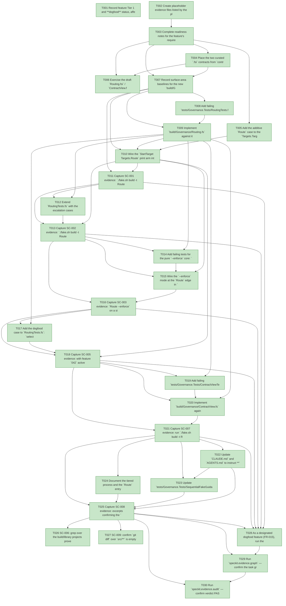

# Task Graph — 042-foundations-two-tier-process

## ✓ Graph is acyclic and consistent

## Skill Match Assessments

| Task | Candidate | Confidence | Signals | Reviewer disposition | Diagnostic |
|------|-----------|------------|---------|----------------------|------------|
| T001 | (none) | none |  | accepted-empty | T001: no high-confidence capability signal detected |
| T002 | (none) | none |  | accepted-empty | T002: no high-confidence capability signal detected |
| T003 | (none) | none |  | accepted-empty | T003: no high-confidence capability signal detected |
| T004 | (none) | none |  | accepted-empty | T004: no high-confidence capability signal detected |
| T005 | (none) | none |  | accepted-empty | T005: no high-confidence capability signal detected |
| T006 | (none) | none |  | accepted-empty | T006: no high-confidence capability signal detected |
| T007 | (none) | none |  | accepted-empty | T007: no high-confidence capability signal detected |
| T008 | (none) | none |  | declared | T008: no high-confidence capability signal detected |
| T009 | (none) | none |  | declared | T009: no high-confidence capability signal detected |
| T010 | (none) | none |  | declared | T010: no high-confidence capability signal detected |
| T011 | (none) | none |  | accepted-empty | T011: no high-confidence capability signal detected |
| T012 | (none) | none |  | declared | T012: no high-confidence capability signal detected |
| T013 | (none) | none |  | accepted-empty | T013: no high-confidence capability signal detected |
| T014 | (none) | none |  | declared | T014: no high-confidence capability signal detected |
| T015 | (none) | none |  | declared | T015: no high-confidence capability signal detected |
| T016 | (none) | none |  | accepted-empty | T016: no high-confidence capability signal detected |
| T017 | (none) | none |  | declared | T017: no high-confidence capability signal detected |
| T018 | (none) | none |  | accepted-empty | T018: no high-confidence capability signal detected |
| T019 | (none) | none |  | declared | T019: no high-confidence capability signal detected |
| T020 | (none) | none |  | declared | T020: no high-confidence capability signal detected |
| T021 | (none) | none |  | accepted-empty | T021: no high-confidence capability signal detected |
| T022 | (none) | none |  | accepted-empty | T022: no high-confidence capability signal detected |
| T023 | (none) | none |  | declared | T023: no high-confidence capability signal detected |
| T024 | (none) | none |  | accepted-empty | T024: no high-confidence capability signal detected |
| T025 | (none) | none |  | accepted-empty | T025: no high-confidence capability signal detected |
| T026 | (none) | none |  | accepted-empty | T026: no high-confidence capability signal detected |
| T027 | (none) | none |  | accepted-empty | T027: no high-confidence capability signal detected |
| T028 | (none) | none |  | accepted-empty | T028: no high-confidence capability signal detected |
| T029 | speckit-evidence-graph | high | task graph | accepted | T029: task text matches speckit-evidence-graph; trigger_group=graph validation; matched_trigger=task graph |
| T030 | (none) | none |  | declared | T030: no high-confidence capability signal detected |

## Status counts (effective)

| Status | Count |
|--------|-------|
| [X] done | 30 |
| [S] synthetic | 0 |
| [S*] auto-synthetic | 0 |
| accepted [SEH] synthetic | 0 |
| unaccepted synthetic | 0 |

## Graph



## ASCII view

```
T001 [X] Record feature Tier 1 and **dogfood** status, affected layer (`build/Governance` + `build.fsx` build-tooling only), public-API impact (no product `.fsi`; new build-tooling `.fsi` required by Principle II), Elmish/MVU applicability (the selector is **pure** and plugs into the existing `build.fsx` `update`/effect interpreter boundary — no new `Model`/`Msg`/`Effect`), and the real-evidence obligations (≥6 typed selector cases, the five `Route` transcripts, the `--enforce` and currency-check demonstrations, `src/**` untouched, full serialized FAKE logs)
T002 [X] Create placeholder evidence files listed by the plan under `specs/042-foundations-two-tier-process/readiness/` (and `readiness/logs/`) so the audit-enforced readiness files are discoverable at setup time: the `Route` transcripts (`route-inner-loop.txt`, `route-escalation.txt`, `route-enforce.txt`, `route-dogfood.txt`), `contract-currency.md`, `governance-tests.md`, `src-untouched.md`, `no-fsx-fsi-fcs.md`, and the governance scaffolds named in T003
T003 [X] Complete readiness notes for the feature's required readiness placeholder files (`governance-risk-levels.md`, `aggregate-hang-diagnostics.md`, `runtime-limitations.md`, `generated-validation-authority.md`, `evidence-graph.md`, `evidence-audit.md`), each naming its authoritative command, artifact path, failure class, and next action
T004 [X] Place the two curated `.fsi` contracts from `contracts/` (`Routing.fsi`, `ContractView.fsi`) into `build/Governance/`, create their `.fs` companions (skeletons against the signatures), and add the `Routing.fsi`/`Routing.fs`/`ContractView.fsi`/`ContractView.fs` `<Compile>` entries to `FS.Skia.UI.Build.fsproj` **after** `TargetMetadata` and before `Capabilities` (Routing depends on `Targets`) — Principle I/II, no access modifiers in `.fs` (FR-011)
T005 [X] Add the additive `Route` case to the `Targets.Target` union in `Targets.fsi` **and** `Targets.fs` (same position), extend `name`, `directPrerequisites` (`Route -> []`), and `allTargets` so metadata derives automatically; `timeoutClass`/`cost`/`failureOwner` fall through to the `focused`/`low`/`governance` defaults — no existing target's name, deps, outputs, or graph position changes (FR-004/FR-016)
T006 [X] Exercise the draft `Routing.fsi` / `ContractView.fsi` from FSI (representative `select`, `selectForFeature`, `unmetArtifacts`, and `render` calls over literal `Diff` values), capturing the session transcript to `readiness/fsi-session.txt`
T007 [X] Record surface-area baselines for the new `build/Governance` modules and the unsupported-scope handling: an empty/garbage git range or absent merge-base is surfaced explicitly at the `Route` edge (logged diagnostic, never a silent empty diff), and the Stage-5 MVU-engine relocation / build front-end retirement remain out of scope
T008 [X] Add failing `tests/Governance.Tests/RoutingTests.fs` with the inner-loop case: `select FrameworkAuthor { ChangedPaths = ["src/Scene/Foo.fs"] }` yields `Tier = InnerLoop` and `Gates = [Dev]` (no `PackageSurfaceCheck`), **and** the empty-diff default `select FrameworkAuthor { ChangedPaths = [] }` → `Tier = InnerLoop` / `Gates = [Dev]` (deterministic, never failing), asserting the **typed** `Selection` values — not string/IO scraping; register the file in `Governance.Tests.fsproj` `<Compile>` before `Program.fs` (fails before `Routing.fs` is implemented; SC-004 / FR-010)
T009 [X] Implement `build/Governance/Routing.fs` against its `.fsi`: the typed rule table (data-model R5; `template/**` and `.specify/**` broadened, F2) with glob `Matches` predicates over `BuildPaths`, `tierRank`, `innerLoopGates` (`[Dev]`; a `src/**/*.fsi` change escalates via the `package-surface` rule, F1), `fullPipelineGates`, `dogfoodFeatureIds` (incl. `"042"`), `isDogfood`, the pure `select` (default-deny unmatched → `Verify`, `maxBy tierRank` escalation incl. the `ConsumerAgent` floor to `FocusedAuthority`, registry-order gate de-dup), `selectForFeature` (dogfood override), `unmetArtifacts`, `enforceDiagnostic`, and `renderSelection` — plain DUs + records + pure functions, no access modifiers (Principle II/III); no `select-tier.fsx`, no `dotnet fsi`, no FCS (SC-006)
T010 [X] Wire the `StartTarget Targets.Route` print arm into the `build.fsx` `update`/interpret boundary: compute the union `Diff` (R2) at the edge via the existing `BuildProcess` git wrapper (`merge-base HEAD master`…`HEAD` ∪ `status --porcelain --untracked-files=all`), parse the optional `--developer-class consumer-agent` token, resolve the active feature id via the existing `activeFeatureId` helper, call `selectForFeature`, and print `renderSelection`; the empty/no-diff case prints a deterministic inner-loop result rather than failing (Principle IV: I/O stays at the edge, selector stays pure)
T011 [X] Capture SC-001 evidence: `./fake.sh build -t Route` on a working tree containing only a `src/Scene/*.fs` change prints `framework-author` → `inner-loop` → `Dev` (and not the full six-target set), recorded to `readiness/route-inner-loop.txt`
T012 [X] Extend `RoutingTests.fs` with the escalation cases over literal `Diff` values: `src/Lib/Foo.fsi` escalates with `PackageSurfaceCheck` in the gates; `template/base/x` escalates with `TemplateCheck` + `GeneratedProductCheck`; `.specify/templates/x` escalates (generated-guidance); a mixed `src/Scene/Foo.fs` + `template/base/x` diff resolves to the **highest** tier (never `InnerLoop`); an unknown `weird/path.txt` default-denies to `Verify` (never empty); a `ConsumerAgent` floor case — `select ConsumerAgent { ChangedPaths = ["docs/x.md"] }` → `FocusedAuthority` while the same diff under `FrameworkAuthor` → `InnerLoop`; and a broadened-coverage case — `template/capabilities.yml` and `.specify/extensions.yml` now escalate (F2) — all assert typed `Selection` values (SC-002, SC-004 / FR-010)
T013 [X] Capture SC-002 evidence: `./fake.sh build -t Route` on a `template/base/**` tree (escalated gate set incl. `TemplateCheck` + `GeneratedProductCheck`), on an `src/**/*.fsi` tree (adds `PackageSurfaceCheck`), and on an unknown path (broad fallback, never empty), recorded to `readiness/route-escalation.txt` — escalation is already implemented in `select` (T009) and printed by the edge (T010); this story adds the representative test cases and the captured transcripts
T014 [X] Add failing tests for the pure `--enforce` core: `unmetArtifacts present (select FrameworkAuthor {fsi-diff})` returns `package-surface-expectations.md` when absent from `present` and `[]` when present; `enforceDiagnostic` names each missing artifact and the requiring tier — typed assertions, no shelling (SC-003)
T015 [X] Wire the `--enforce` mode at the `Route` edge in `build.fsx`: build `present` from `File.Exists` over the selected tier's expected artifacts (edge I/O), call the pure `unmetArtifacts`, and on a non-empty result exit non-zero printing `enforceDiagnostic`; in non-enforce mode print the gate list and never fail (FR-005)
T016 [X] Capture SC-003 evidence: `Route --enforce` on a simulated `src/**/*.fsi` change lacking `readiness/package-surface-expectations.md` exits non-zero naming that artifact; once the artifact is present it exits zero; both transcripts recorded to `readiness/route-enforce.txt`
T017 [X] Add the dogfood case to `RoutingTests.fs`: `selectForFeature FrameworkAuthor "042" { ChangedPaths = ["src/Scene/Foo.fs"] }` resolves to `fullPipelineGates` / `MaintainerVerify` with `DogfoodForced = true`, even though the same diff routes `InnerLoop` through `select`; assert typed values (SC-005, SC-004 / FR-010)
T018 [X] Capture SC-005 evidence: with feature `042` active (it is in `dogfoodFeatureIds`), `./fake.sh build -t Route` on a would-be inner-loop `src/Scene/*.fs` tree resolves to the full gate set, recorded to `readiness/route-dogfood.txt` — the dogfood override is already resolved at the edge via `selectForFeature` + `activeFeatureId` (T010); this story adds the test case and the captured transcript
T019 [X] Add failing `tests/Governance.Tests/ContractViewTests.fs`: `currencyDrift (render rules dogfoodFeatureIds) rules dogfoodFeatureIds = None`, and `currencyDrift <hand-mutated text> rules dogfoodFeatureIds = Some _`; register in `Governance.Tests.fsproj` before `Program.fs` (fails before `ContractView.fs` is implemented; SC-007)
T020 [X] Implement `build/Governance/ContractView.fs` against its `.fsi`: the deterministic `render` (schema header, defaults, tiers, `routing_rules` from `Routing.rules`, dogfood ids — stable ordering so byte-equality is the contract) and the pure `currencyDrift`; fold `currencyDrift` **detection** into the existing `TargetMetadataDrift` body and `render` **regeneration** into the existing `RefreshSurfaceBaselines` body at the `build.fsx` edge (research R1) — no new FAKE target beyond `Route`
T021 [X] Capture SC-007 evidence: run `./fake.sh build -t RefreshSurfaceBaselines` to (re)emit `validation.contract.yml` from `Routing.fs`; demonstrate that a scratch hand-edit is rejected by `TargetMetadataDrift` with the regenerate diagnostic and accepted once regenerated, recorded to `readiness/contract-currency.md`
T022 [X] Update `CLAUDE.md` and `AGENTS.md` to instruct **"run `Route` first; run only the gates it prints,"** and reframe the blanket serialized six-target order as the `maintainer-verify`/escalated path reserved for consumer-contract and dogfood work — no longer the unconditional default (FR-008)
T023 [X] Update `tests/Governance.Tests/SequentialFakeGuidanceTests.fs` to assert both guidance files contain the `Route`-first instruction and no longer present the six-target order as the unconditional default (FR-008, SC-008)
T024 [X] Document the tiered process and the `Route` entry point — the tiers, the framework-author/consumer-agent axis, how `Route` selects, and `--enforce` — in `docs/reports/build.md` and `docs/reports/speckit.md` (FR-009)
T025 [X] Capture SC-008 evidence: excerpts confirming the `Route`-first instruction and reframed six-target order in `CLAUDE.md` + `AGENTS.md`, the passing guidance test, and the new `docs/reports/build.md` + `docs/reports/speckit.md` sections, recorded to `readiness/guidance.md`
T026 [X] SC-006: grep over the build/library projects proves no `select-tier.fsx`, no `dotnet fsi` selector, and no `FSharp.Compiler.*` dependency is introduced — the routing logic is compiled F# in `FS.Skia.UI.Build`; recorded to `readiness/no-fsx-fsi-fcs.md`
T027 [X] SC-009: confirm `git diff` over `src/**` is empty (runtime untouched), `PackageSurfaceCheck` and `FsiTranscripts` show no product baseline diff (FR-013), and no new `PackageVersion` exists outside `Directory.Packages.props` (FR-012/FR-014); recorded to `readiness/src-untouched.md`
T028 [X] As a designated dogfood feature (FR-015), run the full serialized FAKE gate sequence in deterministic order, never concurrently — `Dev` → `GeneratedGuidanceCheck` → `TemplateCheck` → `GeneratedProductCheck`, then the final graph and audit gates (T029/T030) — recording aggregate FAKE results as **non-authoritative** and rerunning any race-like or environment-flaky gate failure (documented 039 `FsiTranscripts`/`SkiaViewer.Tests` flakes) in focused isolation as the authoritative result; logs under `readiness/logs/`
T029 [X] Run `speckit.evidence.graph` — confirm the task graph is acyclic, no dangling refs, no `[S*]` surprises, and that the `skillist` metadata and visible mirrors are valid
T030 [X] Run `speckit.evidence.audit` — confirm verdict PASS with no synthetic evidence to accept (this feature ships none)
```

