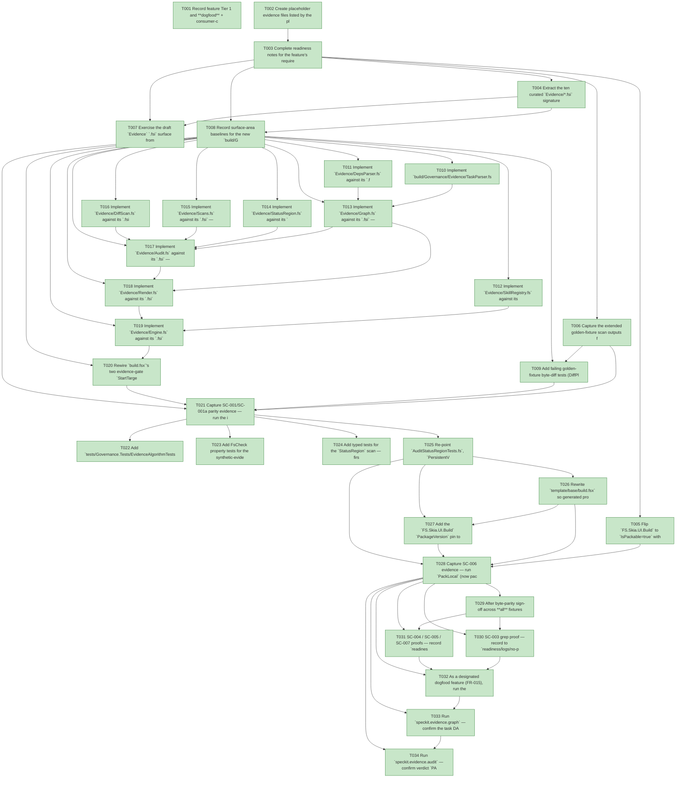

# Task Graph — 043-foundations-evidence-engine

## ✓ Graph is acyclic and consistent

## Skill Match Assessments

| Task | Candidate | Confidence | Signals | Reviewer disposition | Diagnostic |
|------|-----------|------------|---------|----------------------|------------|
| T001 | (none) | none |  | accepted-empty | T001: no high-confidence capability signal detected |
| T002 | (none) | none |  | accepted-empty | T002: no high-confidence capability signal detected |
| T003 | (none) | none |  | accepted-empty | T003: no high-confidence capability signal detected |
| T004 | (none) | none |  | accepted-empty | T004: no high-confidence capability signal detected |
| T005 | (none) | none |  | declared | T005: no high-confidence capability signal detected |
| T006 | (none) | none |  | accepted-empty | T006: no high-confidence capability signal detected |
| T007 | (none) | none |  | accepted-empty | T007: no high-confidence capability signal detected |
| T008 | (none) | none |  | accepted-empty | T008: no high-confidence capability signal detected |
| T009 | (none) | none |  | declared | T009: no high-confidence capability signal detected |
| T010 | (none) | none |  | declared | T010: no high-confidence capability signal detected |
| T011 | (none) | none |  | declared | T011: no high-confidence capability signal detected |
| T012 | (none) | none |  | declared | T012: no high-confidence capability signal detected |
| T013 | (none) | none |  | declared | T013: no high-confidence capability signal detected |
| T014 | (none) | none |  | declared | T014: no high-confidence capability signal detected |
| T015 | (none) | none |  | declared | T015: no high-confidence capability signal detected |
| T016 | (none) | none |  | declared | T016: no high-confidence capability signal detected |
| T017 | (none) | none |  | accepted-empty | T017: no high-confidence capability signal detected |
| T018 | (none) | none |  | declared | T018: no high-confidence capability signal detected |
| T019 | (none) | none |  | accepted-empty | T019: no high-confidence capability signal detected |
| T020 | (none) | none |  | declared | T020: no high-confidence capability signal detected |
| T021 | (none) | none |  | declared | T021: no high-confidence capability signal detected |
| T022 | (none) | none |  | declared | T022: no high-confidence capability signal detected |
| T023 | (none) | none |  | declared | T023: no high-confidence capability signal detected |
| T024 | (none) | none |  | declared | T024: no high-confidence capability signal detected |
| T025 | (none) | none |  | declared | T025: no high-confidence capability signal detected |
| T026 | (none) | none |  | declared | T026: no high-confidence capability signal detected |
| T027 | (none) | none |  | declared | T027: no high-confidence capability signal detected |
| T028 | (none) | none |  | declared | T028: no high-confidence capability signal detected |
| T029 | (none) | none |  | accepted-empty | T029: no high-confidence capability signal detected |
| T030 | (none) | none |  | accepted-empty | T030: no high-confidence capability signal detected |
| T031 | (none) | none |  | accepted-empty | T031: no high-confidence capability signal detected |
| T032 | (none) | none |  | declared | T032: no high-confidence capability signal detected |
| T033 | (none) | none |  | declared | T033: no high-confidence capability signal detected |
| T034 | speckit-evidence-audit | high | diff-scan | accepted | T034: task text matches speckit-evidence-audit; trigger_group=evidence audit; matched_trigger=diff-scan |

## Status counts (effective)

| Status | Count |
|--------|-------|
| [X] done | 34 |
| [S] synthetic | 0 |
| [S*] auto-synthetic | 0 |
| accepted [SEH] synthetic | 0 |
| unaccepted synthetic | 0 |

## Graph



## ASCII view

```
T001 [X] Record feature Tier 1 and **dogfood** + consumer-contract status, the affected layer (`build/Governance/Evidence/**` + `build.fsx` + `template/base/**` build-tooling only), public-API impact (no product `.fsi`; new curated build-tooling `.fsi` per Principle II), Elmish/MVU applicability (the engine core is **pure** and plugs into the existing `build.fsx` `update`/effect-interpreter boundary — two new pure effect cases, no product `Model`/`Msg`/`Effect`), and the real-evidence obligations (036/037/038 byte-parity for the original three outputs plus the five captured scan outputs; typed cycle/topo/propagation/status-region tests; no-`python3`/no-`FSharp.Compiler.*` greps; the packed-engine consumer pass; the serialized FAKE logs)
T002 [X] Create placeholder evidence files listed by the plan under `specs/043-foundations-evidence-engine/readiness/` so the audit-enforced readiness files are discoverable at setup time: the parity proof trees (`parity/036/`, `parity/037/`, `parity/038/`, and `parity/scans/036|037|038/`), `logs/serialized-gates.md`, `logs/no-python-grep.txt`, `logs/no-fcs-grep.txt`, `logs/language-reduction.md`, `package/`, `unit-property-tests.md`, `fsi-session.txt`, and the governance scaffolds named in T003
T003 [X] Complete readiness notes for the feature's required readiness placeholder files (`governance-risk-levels.md`, `aggregate-hang-diagnostics.md`, `runtime-limitations.md`, `generated-validation-authority.md`, `evidence-graph.md`, `evidence-audit.md`, `skill-loading-evidence.md`), each naming its authoritative command, artifact path, failure class, and next action
T004 [X] Extract the ten curated `Evidence/*.fsi` signatures from the aggregated `contracts/evidence-engine.fsi.md` contract into standalone `.fsi` files under `build/Governance/Evidence/`, create skeleton `.fs` companions against the signatures, and add their `<Compile>` entries to `FS.Skia.UI.Build.fsproj` **after** `Capabilities` in dependency order (parsers → registry → `Graph` → scans/status/diff → `Audit` → `Render` → `Engine`); no access modifiers in the `.fs` bodies (Principle I/II, FR-016)
T005 [X] Flip `FS.Skia.UI.Build` to `IsPackable=true` with `PackageId`/version metadata, add it to `Directory.Packages.props`, the `PackLocal` pack flow, and `docs/reports/dependencies.md` as the published governance-library package (ADR D1 / research R8); `DependencyReport`/`PackageSurfaceCheck` coverage extended to the new identity with no product/runtime package affected
T006 [X] Capture the extended golden-fixture scan outputs from the **current** Python engine for 036/037/038 — `readiness-contract-hits.json`, `persistent-launch-hits.json`, `persistent-gui-runtime-hits.json`, `window-visibility-hits.json`, `diff-scan-hits.json` — and commit them under `tests/Governance.Tests/fixtures/evidence-golden/<F>/scans/` (FR-017, real captured evidence, before any Python deletion)
T007 [X] Exercise the draft `Evidence` `.fsi` surface from FSI (representative `TaskParser.parse`, `Graph.propagate`, `StatusRegion.scan`, and `Engine.runGraph` calls over small literal inputs), capturing the session transcript to `readiness/fsi-session.txt`
T008 [X] Record surface-area baselines for the new `build/Governance/Evidence` modules and the unsupported-scope / failure handling: a `Graph` that fails to compute returns `verdict=Error`, preserving the Python non-zero-exit semantics (spec Edge Cases); the Stage 2.2–2.5 / 5 / 6 / 7 deferrals and the heavy Spec Kit Bash remain out of scope
T009 [X] Add failing golden-fixture byte-diff tests (DiffPlex) in `tests/Governance.Tests` asserting the F# renderer's `task-graph.json`, `task-graph.md`, and audit count block match the committed 036/037/038 fixtures (SC-001), plus the five captured scan outputs `readiness-contract-hits.json` / `persistent-launch-hits.json` / `persistent-gui-runtime-hits.json` / `window-visibility-hits.json` / `diff-scan-hits.json` (SC-001a); register the file in `Governance.Tests.fsproj` before `Program.fs` — red before `Render.fs`/`Engine.fs` exist
T010 [X] Implement `build/Governance/Evidence/TaskParser.fs` against its `.fsi` — the `tasks.md` line grammar (ids, status boxes `[ ]`/`[X]`/`[S]`/`[F]`/`[-]`/`[*]`, `[P]`/`[US]`/tier/`[SEH]` annotations, phase-checkpoint edge derivation) and the Synthetic-Evidence Inventory table, producing typed `TaskRecord` values; an unrecognised box char is a parse error, no silent default (FR-001)
T011 [X] Implement `Evidence/DepsParser.fs` against its `.fsi` — read `tasks.deps.yml` (both the legacy bare-list form and the object `{deps, skillist}` form) via `YamlDotNet` behind a typed `DepsModel`; the empty/unparseable file is a blocking error; no bespoke hand-rolled parser (FR-002)
T012 [X] Implement `Evidence/SkillRegistry.fs` against its `.fsi` — discover the skill registry across `.agents/skills`, `src/*/skill`, and `template/fragments/*/skill`, resolving each declared id to exactly one `SKILL.md` (ambiguous/missing = error), roots supplied as data (FR-003)
T013 [X] Implement `Evidence/Graph.fs` against its `.fsi` — 3-colour DFS cycle detection, Kahn topological order with deterministic id-sorted tie-break, and the pure synthetic-evidence propagation rule (`declared=synthetic → synthetic`; `declared=done ∧ any dependency synthetic/auto ∧ not accepted-seh → auto-synthetic`; else `declared`), returning typed `Cycle`/`TopoOrder`/`ResolvedTask` results — not `"ok"`/`"failed"` strings (FR-004/FR-005)
T014 [X] Implement `Evidence/StatusRegion.fs` against its `.fsi` — the `audit-status` fenced-region scan (first-region-wins, case-insensitive keys, duplicate-key-within-a-region = parse error, prose never interpreted, the four blocking conditions) faithfully porting `audit-status-scan.py` (FR-006)
T015 [X] Implement `Evidence/Scans.fs` against its `.fsi` — the readiness-contract, persistent-launch, persistent-gui-runtime, and window-visibility readiness scans, preserving each scan's blocking severity, hit vocabulary, and output JSON shape (`readiness-contract-hits.json`, `persistent-launch-hits.json`, `persistent-gui-runtime-hits.json`, `window-visibility-hits.json`); text scans over supplied `readiness/` file contents only (FR-006a)
T016 [X] Implement `Evidence/DiffScan.fs` against its `.fsi` — pattern-match the `audit-patterns.yml` regexes (read via `YamlDotNet`) over a supplied unified `git diff`, applying whitelist suppression (`file_glob` + `line_regex`) and `block`/`advisory` severity, emitting the `diff-scan-hits.json` shape (`{base_ref, blocking[], advisory[]}`); no process I/O in the function (FR-010)
T017 [X] Implement `Evidence/Audit.fs` against its `.fsi` — cross-file consistency (every id in `tasks.md` ↔ `tasks.deps.yml`), skill-id resolution and skill-ordering checks (`evidence-audit` not before `evidence-graph`), `[SEH]` design-phase-only timing, the `[SEH]` count summary (`accepted-seh`/`unaccepted-synthetic`/`auto-synthetic`/`late-seh`), and the merge-gate verdict aggregation (`Pass`/`Fail`/`Blocked`, `totalBlockers`) — `--accept-synthetic` logs but never changes the verdict (FR-006/FR-008, Principle V)
T018 [X] Implement `Evidence/Render.fs` against its `.fsi` — byte-parity serializers for `task-graph.json` (schema_version 1.0, id-sorted, fixed field order/separators), `task-graph.md` (verdict block, skill-assessment table, status counts, SEH classification table, Mermaid, ASCII tree, propagation report), the Mermaid `classDef` CSS, the ASCII tree glyphs, and the audit count block — deterministic ordering, exact indentation, trailing newline exactly as the Python writes it (FR-007)
T019 [X] Implement `Evidence/Engine.fs` against its `.fsi` — the `runGraph` / `runAudit` entry points orchestrating parse → validate-and-merge → cycle-detect → topo-sort → propagate → scans → render over inputs supplied as data, returning typed results plus the artifact texts to write; the `Engine` performs no filesystem / `git` / process I/O (all reads/writes stay at the edge, Principle IV)
T020 [X] Rewire `build.fsx`'s two evidence-gate `StartTarget` arms in-process — add `EvidenceGraphCheck` / `EvidenceAuditCheck` `BuildEffect` cases, have `update` emit them as pure effect values (no `processEffect` to `run-audit.sh`), and have `interpret` read `tasks.md` / `tasks.deps.yml` / `readiness/` / the unified `git diff` (`git` via the existing `BuildProcess` wrapper) → `Engine.runGraph`/`runAudit` → write the artifacts; keep the Python path runnable behind a `--legacy-evidence` selector until parity sign-off (FR-009/FR-012)
T021 [X] Capture SC-001/SC-001a parity evidence — run the in-process graph and audit gates for 036/037/038 and byte-diff the regenerated `task-graph.json`, `task-graph.md`, audit count block, and the five scan outputs (`readiness-contract-hits.json`, `persistent-launch-hits.json`, `persistent-gui-runtime-hits.json`, `window-visibility-hits.json`, `diff-scan-hits.json`, per T009) against the committed golden fixtures (**0 bytes** on every artifact), recording the diffs under `readiness/parity/036|037|038/` and `readiness/parity/scans/036|037|038/`; while iterating, the Python path stays available behind `--legacy-evidence`
T022 [X] Add `tests/Governance.Tests/EvidenceAlgorithmTests.fs` — typed Expecto unit tests for cycle detection (a hand-built cyclic DAG is flagged, an acyclic one accepted) and Kahn topological order (a valid linearization, deterministic id-sorted tie-break), asserting typed `Graph` results not string scraping (SC-002, FR-014)
T023 [X] Add FsCheck property tests for the synthetic-evidence propagation rule — monotonicity, and "no synthetic roots ⇒ no auto-synthetic nodes" — including at least one multi-synthetic-root case and one empty-graph case (SC-002)
T024 [X] Add typed tests for the `StatusRegion` scan — first-region-wins, duplicate-key parse error, prose-never-interpreted, and the four blocking conditions (`taskbar-only=true`; `taskbar-entry=true ∧ window-visible=false`; `exact-package-match ∉ {true,yes}`; `package-resolution=nu1603`) (SC-002)
T025 [X] Re-point `AuditStatusRegionTests.fs`, `PersistentViewerEvidenceTests.fs`, and `SyntheticErrorEvidenceTests.fs` from shelling `python3` / `bash run-audit.sh` to typed `Evidence.StatusRegion` / `Scans` / `Engine` calls, keeping their committed fixture inputs and asserting typed results — removing the last `python3`/`bash` invocations from the test path (FR-014, research R7)
T026 [X] Rewrite `template/base/build.fsx` so generated projects call the packaged `FS.Skia.UI.Build` engine in-process (paket `nuget` header + `Evidence.*` calls), and stop `.template.config/template.json` from copying `.specify/extensions/evidence/scripts/**` into generated projects (FR-013)
T027 [X] Add the `FS.Skia.UI.Build` `PackageVersion` pin to `template/base/Directory.Packages.props` (bumped alongside the other `FS.Skia.UI.*` pins) and confirm the generated project package-references the published engine rather than carrying source (FR-013)
T028 [X] Capture SC-006 evidence — run `PackLocal` (now packing the published `FS.Skia.UI.Build`) then `TemplateCheck` and `GeneratedProductCheck`, confirming the generated project's graph and audit gates produce a valid verdict via the package reference with **no** copied `run-audit.sh` / `*.py`; record to `readiness/package/`
T029 [X] After byte-parity sign-off across **all** fixtures (FR-012), delete `.specify/extensions/evidence/scripts/python/compute-task-graph.py` and `audit-status-scan.py`, delete `.specify/extensions/evidence/scripts/bash/run-audit.sh` with all 9 embedded heredocs, and remove the `--legacy-evidence` path; retain `audit-patterns.yml` as read-only data (FR-011)
T030 [X] SC-003 grep proof — record to `readiness/logs/no-python-grep.txt` that zero `python3`/`python` invocations and zero references to `compute-task-graph.py` / `audit-status-scan.py` / `run-audit.sh` remain in the steady-state evidence path
T031 [X] SC-004 / SC-005 / SC-007 proofs — record `readiness/logs/no-fcs-grep.txt` (no `FSharp.Compiler.*` reference added anywhere), `readiness/logs/language-reduction.md` (the evidence-path languages drop from `{F#, Bash, Python}` to `{F#}` plus thin OS-glue `git`, vs the Stage-0 baseline), and `readiness/logs/runtime-untouched.md` capturing `git diff --stat` over product `src/**` = **0** (the runtime-untouched Invariant 2 proof, SC-007)
T032 [X] As a designated dogfood feature (FR-015), run the serialized six-target FAKE gate set sequentially in deterministic order (`Dev` → `GeneratedGuidanceCheck` → `TemplateCheck` → `GeneratedProductCheck` → the final graph and audit gates `T033`/`T034`), never concurrently; record aggregate FAKE results as **non-authoritative** and rerun any race-like or environment-flaky failure (the `SkiaViewer.Tests` headless crash, the `FsiTranscripts` toolchain issue) in focused isolation under a stash control as the authoritative result; logs under `readiness/logs/serialized-gates.md`
T033 [X] Run `speckit.evidence.graph` — confirm the task DAG is acyclic, no dangling refs, no `[S*]` surprises, and that the `skillist` metadata and visible mirrors are valid
T034 [X] Run `speckit.evidence.audit` — confirm verdict `PASS` (0 unaccepted-synthetic, 0 auto-synthetic, 0 late-seh, 0 diff-scan blocking, 0 readiness-contract blocking) with zero synthetic evidence to accept (SC-008)
```

